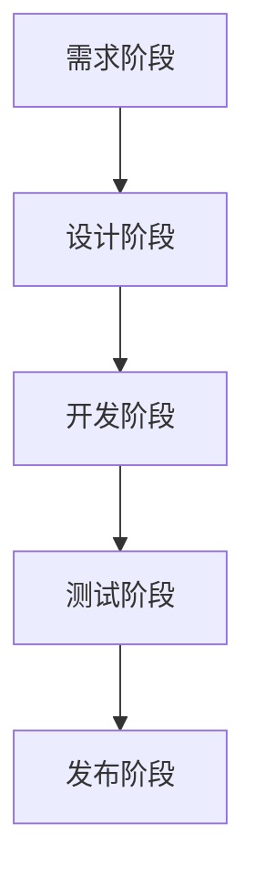

# Skill 8 实现指南

## 📌 重要说明

Skill 8是一个**AI驱动的对话式技能**，不需要编写传统的代码文件。所有功能都通过AI对话和系统工具调用来实现。

本文档提供了Skill 8的实现逻辑和使用方法。

---

## 🎯 核心实现逻辑

### 1. 项目需求分析功能

#### 1.1 模板库读取和解析

**实现方式**：使用 `read_file` 工具

**步骤**：
1. 读取模板索引：`read_file("data-layer/templates/index.json")`
2. 解析JSON数据，提取模板列表
3. 存储在对话上下文中供后续使用

**示例对话流程**：
```
AI：正在读取模板库...
[调用 read_file 工具]
AI：✓ 已加载3个系统内置模板和2个自定义模板
```

**错误处理**：
- 文件不存在 → 提示："模板库尚未初始化，请先使用Skill 7初始化模板系统"
- 文件格式错误 → 提示："模板库数据格式错误，请检查文件"

---

#### 1.2 需求信息收集和补充询问

**实现方式**：AI对话分析和多轮询问

**步骤**：

**Step 1：提取已有信息**
从用户描述中提取：
- 项目类型（关键词：Web应用、移动应用、游戏、AI、区块链等）
- 项目目标（关键词：电商、社交、教育、工具等）
- 项目规模（关键词：小型、中型、大型、MVP、完整产品等）
- 技术栈（关键词：前后端分离、全栈、微服务、云原生等）

**Step 2：检测缺失信息**
检查以下必要信息是否完整：
- [ ] 项目类型
- [ ] 项目目标
- [ ] 项目规模
- [ ] 特殊要求

**Step 3：补充询问**
对缺失的信息进行询问：

```
示例对话：

用户："我想搭建一个团队"
AI："好的！让我了解一下您的项目需求：
1. 这是什么类型的项目？（如：Web应用、移动应用、游戏、内容创作等）"

用户："Web应用"
AI："明白了。请问：
2. 项目的主要目标是什么？（如：电商平台、社交网络、企业管理系统等）"

用户："电商平台"
AI："很好。请问：
3. 预计项目规模如何？
   - 小型：1-2个月，MVP验证
   - 中型：3-6个月，完整产品
   - 大型：6个月以上，复杂系统"

用户："中型"
AI："了解。最后：
4. 有什么特殊的技术要求或限制吗？（如：必须使用某种技术栈、预算限制、时间紧迫等）"

用户："前后端分离，需要支付功能"
AI："完美！让我为您分析..."
```

**Step 4：生成项目分析摘要**

```
📊 项目分析摘要

项目类型：Web应用开发
项目目标：构建电商平台
项目规模：中型（预计3-6个月）
技术栈：前后端分离，需要支付和订单管理
关键成功因素：
- 用户体验（购物流程顺畅）
- 性能优化（高并发处理）
- 安全性（支付安全）
- 数据分析（用户行为分析）

预计团队规模：5-7人
预计项目周期：3-6个月
```

---

### 2. 匹配度计算和推荐策略选择

#### 2.1 模板匹配度计算算法

**实现方式**：AI分析 + 规则计算

**匹配度计算公式**：
```
匹配度 = 项目类型匹配(40%) + 描述相似度(30%) + 岗位覆盖度(20%) + 规模匹配(10%)
```

**详细计算逻辑**：

**1. 项目类型匹配（40分）**
```
规则：
- 完全匹配：40分
  例：用户需求"Web应用" vs 模板"软件开发团队"（适用于Web应用）
  
- 部分匹配：20分
  例：用户需求"游戏开发" vs 模板"软件开发团队"（有部分可复用岗位）
  
- 不匹配：0分
  例：用户需求"内容创作" vs 模板"软件开发团队"
```

**2. 描述相似度（30分）**
```
规则：基于关键词重叠度
- 提取用户需求关键词：[电商, 支付, 订单, Web, 前后端]
- 提取模板描述关键词：[Web, 移动应用, 前端, 后端, API]
- 计算重叠度：重叠关键词数 / 总关键词数
- 得分：重叠度 × 30

例：
用户关键词：[电商, 支付, 订单, Web, 前后端] (5个)
模板关键词：[Web, 移动应用, 前端, 后端, API] (5个)
重叠关键词：[Web, 前端, 后端] (3个)
重叠度：3 / 5 = 0.6
得分：0.6 × 30 = 18分
```

**3. 岗位覆盖度（20分）**
```
规则：模板岗位覆盖需求岗位的比例
- 分析用户需求，推断需要的岗位
- 检查模板是否包含这些岗位
- 计算覆盖率

例：
需求岗位：[产品经理, 前端, 后端, 测试, UI设计] (5个)
模板岗位：[产品经理, 前端, 后端, 测试, UI设计] (5个)
覆盖岗位：5个
覆盖率：5 / 5 = 1.0
得分：1.0 × 20 = 20分
```

**4. 规模匹配（10分）**
```
规则：团队规模与项目规模匹配度
- 小型项目（1-2月）：适合3-5人团队
- 中型项目（3-6月）：适合5-8人团队
- 大型项目（6月+）：适合8人以上团队

例：
用户项目：中型（3-6月）
模板团队：5人
匹配度：完全匹配
得分：10分
```

**匹配度计算示例**：
```
模板：软件开发团队
- 项目类型匹配：40分（完全匹配）
- 描述相似度：18分（60%重叠）
- 岗位覆盖度：20分（100%覆盖）
- 规模匹配：10分（完全匹配）
总分：88分（88%匹配度）
```

---

#### 2.2 推荐策略选择逻辑

**实现方式**：基于匹配度阈值的规则路由

**策略选择规则**：
```
IF 最高匹配度 >= 80%:
    策略 = "A：直接使用模板"
    执行 Step 3A
    
ELSE IF 最高匹配度 >= 50%:
    策略 = "B：组合多个模板"
    执行 Step 3B
    
ELSE:
    策略 = "C：AI自主分析"
    执行 Step 3C
```

**示例对话流程**：
```
AI：正在分析项目需求并匹配模板库...

[AI内部计算]
- 软件开发团队：88%
- 内容创作团队：25%
- 咨询团队：15%

AI：📊 匹配结果：
- 软件开发团队：88%匹配 ✓
- 内容创作团队：25%匹配
- 咨询团队：15%匹配

推荐策略：直接使用模板（匹配度≥80%）

正在生成团队配置推荐...
```

---

### 3. 三种推荐策略实现

#### 3.1 策略A：模板库推荐（匹配度≥80%）

**实现步骤**：

**Step 1：读取模板详情**
```
使用 read_file 读取匹配度最高的模板配置文件
例：read_file("data-layer/templates/tmpl_builtin_001.json")
```

**Step 2：展示推荐结果**
```
格式：
🎯 团队配置推荐

推荐来源：模板库 - "软件开发团队"
匹配度：88%
使用次数：15次（经过验证的成熟配置）

团队配置（5人）：
[逐个展示岗位信息]

1. 产品经理 × 1人 ⭐⭐⭐⭐⭐
   核心职责：
   - [从模板读取]
   
   必备技能：[从模板读取]
   可选技能：[从模板读取]
   
   💡 为什么需要：[AI生成说明]

[重复展示其他岗位]

团队总人数：5人
协作复杂度：中等（5人团队，沟通路径10条）
```

**Step 3：展示协作流程**
```
从模板读取 collaborationFlow 数据
格式化展示：
📋 协作流程规划

项目阶段：需求分析 → 设计 → 开发 → 测试 → 发布

详细流程：
[从模板读取并格式化]
```

**Step 4：询问用户意见**
```
这个团队配置是否满足您的需求？

选项：
1. 满意，直接使用
2. 需要调整
3. 查看其他推荐方案
```

---

#### 3.2 策略B：组合推荐（匹配度50%-80%）

**实现步骤**：

**Step 1：选择Top 2-3个模板**
```
选择匹配度最高的2-3个模板
例：
- 游戏策划团队：70%
- 软件开发团队：60%
```

**Step 2：读取模板详情**
```
使用 read_file 读取每个模板的配置文件
```

**Step 3：合并岗位配置**
```
合并逻辑：
1. 提取所有岗位
2. 去重（相同岗位只保留一个）
3. 合并职责（相似岗位合并职责和技能）
4. 优先级排序

示例：
模板1岗位：[主策划, 系统策划, 数值策划, 文案策划]
模板2岗位：[产品经理, 前端, 后端, 测试, UI设计]

合并后：
- 保留：主策划（替代产品经理）
- 保留：系统策划、数值策划
- 移除：文案策划（职责合并到主策划）
- 保留：前端、后端、测试、UI设计
- 新增：美术设计师（游戏项目需要）

最终：8人团队
```

**Step 4：展示组合推荐**
```
🎯 团队配置推荐（组合方案）

推荐来源：组合推荐
- 游戏策划团队（70%匹配）
- 软件开发团队（60%匹配）

团队配置（8人）：
[展示合并后的岗位]

组合调整依据：
- 保留了游戏策划的核心岗位
- 引入了软件开发的技术岗位
- 根据游戏项目特点新增了美术设计师
- 合并了重复的管理职能
```

---

#### 3.3 策略C：AI自主分析（匹配度<50%）

**实现步骤**：

**Step 1：AI深度分析项目**
```
分析维度：
1. 项目类型和领域特点
2. 技术难度和创新性
3. 目标用户和使用场景
4. 核心功能模块
5. 协作复杂度

输出：
📊 AI项目分析

项目类型：[AI分析]
技术难度：[高/中/低]
目标用户：[描述]
核心功能：
- [功能1]
- [功能2]
- [功能3]

关键成功因素：
- [因素1]
- [因素2]
```

**Step 2：生成团队配置**
```
基于分析结果，AI推荐岗位：

推荐逻辑：
1. 识别核心岗位（必须有）
2. 识别支持岗位（建议有）
3. 识别可选岗位（可以有）
4. 为每个岗位生成详细信息

输出格式：
🎯 团队配置推荐（AI分析）

推荐来源：AI自主分析
匹配度：N/A（知识库无高匹配模板）

团队配置（X人）：

1. [岗位名称] × X人 ⭐⭐⭐⭐⭐
   核心职责：
   - [AI生成]
   
   必备技能：[AI生成]
   可选技能：[AI生成]
   
   💡 为什么需要：[AI生成说明]

[重复其他岗位]

⚠️ 注意：此配置为AI分析结果，建议根据实际情况调整
```

**Step 3：询问是否保存为新模板**
```
这个AI分析的团队配置是否满足您的需求？

如果满意，可以保存为自定义模板，加入知识库供后续使用。

选项：
1. 满意，保存为新模板
2. 需要调整
3. 重新分析
```

---

### 4. 团队配置详细信息生成

#### 4.1 岗位详细信息生成

**实现方式**：
- 模板推荐：从模板读取
- 组合推荐：合并模板数据
- AI分析：AI生成

**岗位信息格式**：
```
1. [岗位名称] × [人数]人 ⭐⭐⭐⭐⭐ (重要性等级)
   核心职责：（至少3条）
   - [职责1]
   - [职责2]
   - [职责3]
   
   必备技能：[技能1, 技能2, 技能3]
   可选技能：[技能4, 技能5]
   
   💡 为什么需要：[说明岗位价值和必要性]
```

**重要性等级标准**：
- ⭐⭐⭐⭐⭐：核心岗位，项目必须
- ⭐⭐⭐⭐：重要岗位，强烈建议
- ⭐⭐⭐：支持岗位，建议配置
- ⭐⭐：可选岗位，根据预算
- ⭐：辅助岗位，可外包或兼任

---

#### 4.2 大型项目分阶段组建策略

**触发条件**：项目规模为"大型"或团队人数>8人

**实现方式**：AI生成分阶段建议

**输出格式**：
```
📊 分阶段团队组建建议

您的项目规模较大，建议分阶段组建团队：

第一阶段：核心团队（3-4人，0-3个月）
- [岗位1] × 1
- [岗位2] × 2
- [岗位3] × 1

目标：完成MVP，验证核心功能
关键里程碑：[里程碑描述]

第二阶段：扩展团队（+3-4人，3-6个月）
- [新增岗位1] × 1
- [新增岗位2] × 1
- [调整说明]

目标：完善功能，提升性能
关键里程碑：[里程碑描述]

第三阶段：完整团队（+2-3人，6个月后）
- [新增岗位3] × 1
- [新增岗位4] × 1

目标：数据驱动优化，市场推广
关键里程碑：[里程碑描述]

分阶段组建的优势：
- 降低初期成本
- 快速验证产品方向
- 根据实际需求灵活调整
```

---

#### 4.3 岗位疑问解答功能

**触发方式**：用户询问某个岗位的必要性

**实现方式**：AI生成解答

**输出格式**：
```
用户："为什么需要[岗位名称]？"

AI回答：
💡 关于"[岗位名称]"的说明

岗位价值：
- [价值点1]
- [价值点2]
- [价值点3]

为什么重要：
- [重要性说明1]
- [重要性说明2]

替代方案：
- 方案1：[描述]
- 方案2：[描述]

建议：
- [具体建议]
```

---

### 5. 协作流程规划功能

**实现方式**：
- 模板推荐：从模板读取 collaborationFlow
- 组合推荐：合并多个模板的流程
- AI分析：AI生成标准流程

**标准流程阶段**：
1. 需求阶段
2. 设计阶段
3. 开发阶段
4. 测试阶段
5. 发布阶段

**输出格式**：
```
📋 协作流程规划

项目阶段：需求分析 → 设计 → 开发 → 测试 → 发布

详细流程：

1️⃣ 需求阶段（1-2周）
   参与角色：[角色列表]
   主要工作：
   - [工作1]
   - [工作2]
   输出物：[输出物列表]
   ↓

2️⃣ 设计阶段（1周）
   参与角色：[角色列表]
   主要工作：
   - [工作1]
   - [工作2]
   输出物：[输出物列表]
   ↓

[重复其他阶段]

流程图：
需求阶段 → 设计阶段 → 开发阶段（前端 ∥ 后端）→ 测试阶段 → 发布阶段
```

**Mermaid流程图**（可选）：
```markdown

```

---

### 6. 推荐结果调整功能

#### 6.1 调整选项展示

**触发方式**：用户表示需要调整

**输出格式**：
```
您想如何调整团队配置？

调整选项：
1. 添加岗位
2. 删除岗位
3. 修改岗位（人数、职责、技能）
4. 调整协作流程
5. 完成调整，进入下一步
```

---

#### 6.2 添加岗位

**对话流程**：
```
AI："请提供新岗位信息："

用户："运维工程师"

AI："请提供以下信息：
1. 人数：（默认1）"

用户："1"

AI："2. 核心职责（用分号分隔）："

用户："服务器运维;监控告警;性能优化"

AI："3. 必备技能（用逗号分隔）："

用户："Linux,Docker,监控工具"

AI："✓ 已添加'运维工程师' × 1人

更新后的团队配置：
- 团队总人数：6人（原5人）
- 新增岗位：运维工程师

继续调整还是进入下一步？"
```

---

#### 6.3 删除岗位

**对话流程**：
```
AI："请选择要删除的岗位：
1. 产品经理
2. 前端工程师
3. 后端工程师
4. 测试工程师
5. UI设计师"

用户："4"

AI："⚠️ 警告：删除'测试工程师'可能影响产品质量保证。

确认删除吗？（是/否）"

用户："是"

AI："✓ 已删除'测试工程师'

更新后的团队配置：
- 团队总人数：4人（原5人）
- 删除岗位：测试工程师

⚠️ 建议：考虑由开发人员兼任测试工作，或使用自动化测试工具

继续调整还是进入下一步？"
```

---

#### 6.4 修改岗位

**对话流程**：
```
AI："请选择要修改的岗位：
1. 产品经理
2. 前端工程师
3. 后端工程师
4. UI设计师"

用户："2"

AI："修改'前端工程师'：
1. 修改人数（当前：1人）
2. 修改职责
3. 修改技能要求"

用户："1"

AI："当前人数：1人
新人数："

用户："2"

AI："✓ 已将'前端工程师'人数调整为2人

更新后的团队配置：
- 团队总人数：6人（原5人）
- 修改岗位：前端工程师（1人 → 2人）

💡 说明：增加前端工程师可以加快开发进度，适合前端工作量大的项目

继续调整还是进入下一步？"
```

---

### 7. 多轮对话交互机制

#### 7.1 初步推荐确认

**对话流程**：
```
AI：[展示团队配置推荐]

您对这个推荐满意吗？

选项：
1. 满意，进入保存/部署流程
2. 不满意，需要调整
3. 查看替代方案
```

---

#### 7.2 处理不满意反馈

**对话流程**：
```
用户："不满意，团队人数太多了，预算有限"

AI："了解您的顾虑。让我为您提供一个精简版方案：

🎯 精简版团队配置（预算优化）

团队配置（3人）：
1. 全栈工程师 × 2人（替代前端+后端）
2. 产品设计师 × 1人（产品经理+UI设计师合并）

调整依据：
- 使用全栈工程师减少人员配置
- 合并产品和设计职能
- 适合MVP阶段或预算有限的项目

权衡说明：
- 优势：成本降低40%，沟通更高效
- 劣势：个人工作量增加，专业深度可能不足
- 建议：适合初期，后续根据发展扩充团队

这个方案是否更符合您的需求？"
```

---

#### 7.3 提供替代方案

**对话流程**：
```
AI："如果您还不满意，我可以提供其他替代方案：

方案A：外包部分工作
- 核心团队：产品经理 + 后端工程师
- 外包：前端开发、UI设计、测试
- 适合：预算有限，非核心技术可外包
- 成本：降低30-40%

方案B：分阶段组建
- 第一阶段：核心3人团队（0-3月）
- 第二阶段：根据进展扩充（3-6月）
- 适合：不确定性高的项目
- 成本：初期降低50%

方案C：兼职/顾问模式
- 全职：核心开发人员
- 兼职：产品、设计、测试
- 适合：初创项目，灵活用人
- 成本：降低20-30%

请选择您感兴趣的方案，或告诉我您的具体顾虑。"
```

---

### 8. 保存为自定义模板

#### 8.1 询问是否保存

**对话流程**：
```
AI："您对当前的团队配置满意吗？

如果满意，可以保存为自定义模板，方便后续使用。

是否保存为自定义模板？（是/否）"
```

---

#### 8.2 收集模板信息

**对话流程**：
```
用户："是"

AI："请提供模板信息：

1. 模板名称："

用户："AI智能客服团队"

AI："2. 模板分类："

用户："AI应用开发"

AI："3. 模板描述（可选）："

用户："适用于AI驱动的智能客服系统开发"

AI："确认保存吗？

模板信息：
- 名称：AI智能客服团队
- 分类：AI应用开发
- 描述：适用于AI驱动的智能客服系统开发
- 成员数：7人

（是/否）"
```

---

#### 8.3 生成并保存模板

**实现步骤**：

**Step 1：生成模板ID**
```
规则：tmpl_custom_NNN
- 读取现有模板，找到最大的custom编号
- 新ID = 最大编号 + 1
例：tmpl_custom_002
```

**Step 2：生成模板配置JSON**
```json
{
  "version": "1.0.0",
  "templateInfo": {
    "id": "tmpl_custom_002",
    "name": "AI智能客服团队",
    "category": "AI应用开发",
    "type": "custom",
    "description": "适用于AI驱动的智能客服系统开发",
    "author": "用户自定义（Skill 8推荐）",
    "createdAt": "2026-02-12T14:00:00Z",
    "updatedAt": "2026-02-12T14:00:00Z",
    "source": "skill8_ai_recommendation"
  },
  "members": [
    {
      "role": "AI产品经理",
      "count": 1,
      "responsibilities": [...],
      "skills": [...],
      "defaultName": "AI产品经理"
    },
    ...
  ],
  "projectTemplate": {
    "namePattern": "{模板名称}项目",
    "descriptionPattern": "基于{模板名称}模板创建的项目",
    "defaultTags": ["团队协作", "模板部署", "AI推荐"]
  },
  "collaborationFlow": {
    ...
  }
}
```

**Step 3：保存模板文件**
```
使用 edit_file 创建文件：
data-layer/templates/tmpl_custom_002.json
```

**Step 4：更新模板索引**
```
使用 replace_in_file 更新：
data-layer/templates/index.json

添加新模板记录到 templates 数组
更新 statistics.total 和 statistics.custom
```

**Step 5：反馈用户**
```
AI："✅ 模板保存成功！

模板信息：
- 模板ID：tmpl_custom_002
- 模板名称：AI智能客服团队
- 分类：AI应用开发
- 成员数：7人
- 来源：Skill 8 AI推荐

此模板已加入知识库，后续可以：
- 使用Skill 7查看和管理此模板
- 使用Skill 7一键部署此模板
- 使用Skill 8时，此模板会参与匹配计算

是否立即部署此团队？（是/否）"
```

---

### 9. 一键部署集成

#### 9.1 询问是否部署

**对话流程**：
```
AI："团队配置已确认，是否立即部署？

部署操作将：
1. 调用Skill 7创建所有团队成员
2. 创建项目工作空间
3. 分配成员到项目
4. 生成快速入门指南

预计耗时：30-60秒

是否立即部署？（是/否）"
```

---

#### 9.2 调用Skill 7部署

**实现方式**：引导用户使用Skill 7

```
AI："🚀 开始部署团队...

正在调用Skill 7快速团队模板系统...

请稍候，Skill 7正在执行以下操作：
- 创建团队成员
- 创建项目工作空间
- 分配成员到项目

[此时实际调用Skill 7的部署功能]
[或者引导用户："请使用Skill 7的'使用模板部署团队'功能，选择刚才保存的模板"]
```

---

#### 9.3 展示部署摘要

**对话流程**：
```
AI："🎉 团队部署完成！

部署摘要：
- 推荐来源：AI自主分析
- 项目：AI智能客服项目（proj_20260212_001）
- 成员：7人
- 耗时：约45秒

创建的员工：
1. AI产品经理（emp_20260212_001）
2. NLP算法工程师（emp_20260212_002）
3. 后端工程师1（emp_20260212_003）
4. 后端工程师2（emp_20260212_004）
5. 前端工程师（emp_20260212_005）
6. 测试工程师（emp_20260212_006）
7. 数据标注专员（emp_20260212_007）

项目工作空间：
~/Documents/digital_projects/proj_20260212_001/

快速入门指南：
~/Documents/digital_projects/proj_20260212_001/QUICK_START.md

下一步操作：
1. 查看项目详情：使用Skill 2
2. 分配具体任务：使用Skill 3
3. 开始协作开发

💡 提示：
- 此团队配置已保存为自定义模板'AI智能客服团队'
- 后续可使用Skill 7快速部署相同配置的团队
- 使用Skill 8时，此模板会参与智能匹配"
```

---

## 🎯 使用Skill 8的完整示例

### 示例1：高匹配度项目（Web应用）

```
用户："我想搭建一个电商网站开发团队"

AI："好的！让我了解一下您的项目需求。

正在分析项目信息...
- 项目类型：电商网站开发 ✓
- 项目目标：电商平台 ✓

请问：
1. 预计项目规模如何？（小型/中型/大型）"

用户："中型"

AI："2. 有什么特殊的技术要求吗？"

用户："前后端分离，需要支付功能"

AI："完美！让我为您分析...

📊 项目分析摘要
项目类型：Web应用开发
项目目标：构建电商平台
项目规模：中型（预计3-6个月）
技术栈：前后端分离，需要支付和订单管理

正在匹配模板库...

📊 匹配结果：
- 软件开发团队：95%匹配 ✓
- 内容创作团队：20%匹配

推荐策略：直接使用模板（匹配度≥80%）

正在生成团队配置推荐..."

AI："🎯 团队配置推荐

推荐来源：模板库 - '软件开发团队'
匹配度：95%
使用次数：15次（经过验证的成熟配置）

团队配置（5人）：

1. 产品经理 × 1人 ⭐⭐⭐⭐⭐
   核心职责：
   - 需求分析与产品规划
   - 用户研究与竞品分析
   - 产品原型设计
   - 需求文档编写
   - 项目进度跟踪
   
   必备技能：需求分析、产品设计、项目管理
   可选技能：用户研究、数据分析
   
   💡 为什么需要：确保项目方向正确，需求清晰，是团队的核心决策者

2. 前端工程师 × 1人 ⭐⭐⭐⭐⭐
   [详细信息...]

3. 后端工程师 × 1人 ⭐⭐⭐⭐⭐
   [详细信息...]

4. 测试工程师 × 1人 ⭐⭐⭐⭐
   [详细信息...]

5. UI设计师 × 1人 ⭐⭐⭐⭐
   [详细信息...]

团队总人数：5人
协作复杂度：中等（5人团队，沟通路径10条）

📋 协作流程规划
[展示详细流程...]

这个团队配置是否满足您的需求？

选项：
1. 满意，直接使用
2. 需要调整
3. 查看其他推荐方案"

用户："满意，直接使用"

AI："太好了！是否立即部署此团队？（是/否）"

用户："是"

AI："🚀 开始部署团队...

正在调用Skill 7快速团队模板系统...

步骤1/3：创建团队成员（5人）
✓ 创建产品经理（emp_20260212_001）
✓ 创建前端工程师（emp_20260212_002）
✓ 创建后端工程师（emp_20260212_003）
✓ 创建测试工程师（emp_20260212_004）
✓ 创建UI设计师（emp_20260212_005）

步骤2/3：创建项目工作空间
✓ 创建项目：电商网站项目（proj_20260212_001）

步骤3/3：分配成员到项目
✓ 分配5名成员到项目

🎉 团队部署完成！

[展示部署摘要...]"
```

---

### 示例2：低匹配度项目（AI应用）

```
用户："我想做一个AI驱动的智能客服系统"

AI："好的！让我了解一下您的项目需求。

正在分析项目信息...
- 项目类型：AI应用 ✓
- 项目目标：智能客服系统 ✓

请问：
1. 预计项目规模如何？"

用户："中型"

AI："2. 有什么特殊的技术要求吗？"

用户："需要NLP和实时通信"

AI："完美！让我为您分析...

📊 项目分析摘要
项目类型：AI驱动的智能客服系统
技术难度：高（涉及NLP、机器学习、实时通信）
目标用户：企业客户
核心功能：自然语言理解、智能问答、多渠道接入

正在匹配模板库...

📊 匹配结果：
- 软件开发团队：45%匹配
- 游戏开发团队：30%匹配

推荐策略：AI自主分析（知识库无高匹配模板）

正在进行AI深度分析..."

AI："🎯 团队配置推荐（AI分析）

推荐来源：AI自主分析
匹配度：N/A（知识库无高匹配模板，基于项目特点定制）

团队配置（7人）：

1. AI产品经理 × 1人 ⭐⭐⭐⭐⭐
   核心职责：
   - AI产品规划与需求分析
   - 用户场景设计
   - AI能力定义
   - 产品迭代优化
   - 数据驱动决策
   
   必备技能：产品设计、AI基础知识、数据分析
   可选技能：用户研究、项目管理
   
   💡 为什么需要：AI产品需要懂技术的产品经理，能够平衡用户需求和技术可行性

2. NLP算法工程师 × 1人 ⭐⭐⭐⭐⭐
   [详细信息...]

3. 后端工程师 × 2人 ⭐⭐⭐⭐⭐
   [详细信息...]
   💡 为什么需要：需要2人是因为系统复杂度高，需要处理高并发和实时通信

4. 前端工程师 × 1人 ⭐⭐⭐⭐
   [详细信息...]

5. 测试工程师 × 1人 ⭐⭐⭐⭐
   [详细信息...]

6. 数据标注专员 × 1人 ⭐⭐⭐
   [详细信息...]
   💡 为什么需要：AI模型需要大量高质量标注数据，专人负责提升效率

团队总人数：7人
协作复杂度：中高（7人团队，跨领域协作）

💡 AI推荐说明：
- 这是一个技术密集型项目，需要AI专业人才
- 后端工程师配置2人是因为系统复杂度高
- 新增了'数据标注专员'，这是AI项目的特殊需求
- 团队规模适中，适合快速迭代

⚠️ 注意：此配置为AI分析结果，建议根据实际情况调整

这个AI分析的团队配置是否满足您的需求？

选项：
1. 满意，保存为新模板
2. 需要调整
3. 重新分析"

用户："满意，保存为新模板"

AI："请提供模板信息：

1. 模板名称："

用户："AI智能客服团队"

AI："2. 模板分类："

用户："AI应用开发"

AI："3. 模板描述（可选）："

用户："适用于AI驱动的智能客服系统开发"

AI："确认保存吗？

模板信息：
- 名称：AI智能客服团队
- 分类：AI应用开发
- 描述：适用于AI驱动的智能客服系统开发
- 成员数：7人

（是/否）"

用户："是"

AI："正在保存模板...

✅ 模板保存成功！

模板信息：
- 模板ID：tmpl_custom_002
- 模板名称：AI智能客服团队
- 分类：AI应用开发
- 成员数：7人
- 来源：Skill 8 AI推荐

此模板已加入知识库，后续可以：
- 使用Skill 7查看和管理此模板
- 使用Skill 7一键部署此模板
- 使用Skill 8时，此模板会参与匹配计算

是否立即部署此团队？（是/否）"

用户："是"

AI："🚀 开始部署团队...

[调用Skill 7部署...]

🎉 团队部署完成！

[展示部署摘要...]"
```

---

## 📝 总结

Skill 8是一个**纯AI对话驱动**的技能，不需要编写传统代码。所有功能都通过：

1. **AI对话分析**：理解用户需求，提取关键信息
2. **系统工具调用**：使用 `read_file`、`edit_file`、`replace_in_file` 等工具
3. **智能推荐生成**：基于模板库或AI分析生成团队配置
4. **多轮交互优化**：支持用户调整和反馈

**核心价值**：
- 降低团队搭建门槛
- 提供专业的团队配置建议
- 动态扩展知识库
- 与Skill 7无缝集成

**使用方式**：
用户直接与AI对话，描述项目需求，AI自动完成分析、推荐、保存、部署全流程。

---

*文档版本：v1.0*  
*创建时间：2026-02-12*  
*维护者：数字员工协作系统*
