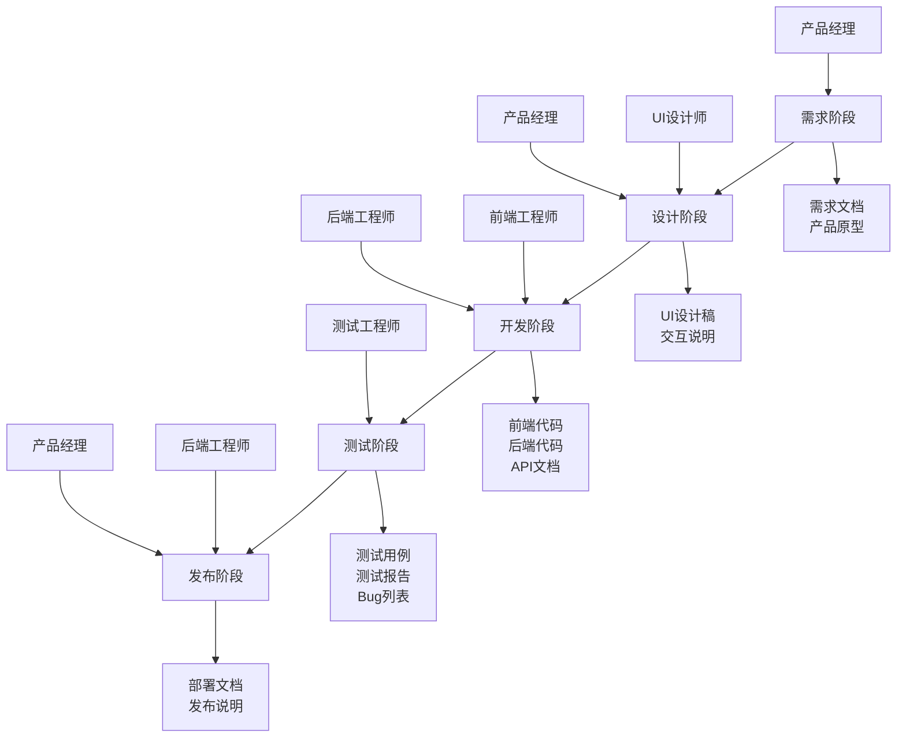

# Skill 8：智能团队搭建顾问

## 📋 技能概述

**技能名称**：智能团队搭建顾问  
**技能编号**：SKILL-008  
**版本**：v1.0.0  
**依赖**：Skill 7（快速团队模板系统）  
**数据域**：`data-layer/templates/`（只读）

**核心功能**：
1. 分析用户项目需求，智能推荐团队配置
2. 基于模板库匹配度提供三种推荐策略（模板推荐/组合推荐/AI分析）
3. 生成详细的岗位职责、技能要求和协作流程
4. 支持多轮对话交互和配置调整
5. 一键保存为自定义模板并部署团队

**设计原则**：
- ✅ **智能推荐**：根据项目需求自动匹配最佳团队配置
- ✅ **知识库驱动**：优先使用Skill 7的模板库，动态扩展知识
- ✅ **AI增强**：当知识库不足时，AI自主分析推荐
- ✅ **零依赖**：使用系统内置工具和AI能力
- ✅ **无缝集成**：与Skill 7深度集成，支持保存和部署

---

## 🎯 使用场景

### 场景1：高匹配度项目（匹配度≥80%）
```
用户："我想搭建一个Web应用开发团队"
→ 分析需求：Web应用开发
→ 匹配模板库：找到"软件开发团队"模板（匹配度95%）
→ 推荐策略：直接使用模板
→ 展示团队配置和协作流程
→ 用户确认后一键部署
```

### 场景2：中等匹配度项目（匹配度50%-80%）
```
用户："我想做一个游戏项目，需要策划、美术和程序"
→ 分析需求：游戏开发，需要多个领域
→ 匹配模板库：找到"游戏策划团队"（70%）和"软件开发团队"（60%）
→ 推荐策略：组合多个模板
→ 合并岗位配置，去重优化
→ 展示组合后的团队配置
→ 用户调整后保存为新模板
```

### 场景3：低匹配度项目（匹配度<50%）
```
用户："我想做一个AI驱动的智能客服系统"
→ 分析需求：AI应用，技术复杂度高
→ 匹配模板库：无高匹配模板（最高40%）
→ 推荐策略：AI自主分析
→ 基于项目特点推荐团队配置
→ 生成详细的岗位职责和技能要求
→ 用户满意后保存为新模板并加入知识库
```

---

## 🔧 核心功能实现

### Step 0：环境检测

在开始任何操作前，检查Skill 7的模板库是否存在：

1. **检查模板库**：使用 `read_file` 检查 `data-layer/templates/index.json` 是否存在
2. **模板库不存在** → 提示用户："模板库尚未初始化，请先使用Skill 7初始化模板系统"
3. **模板库存在** → 继续执行

---

### Step 1：意图识别与需求收集

#### 阶段一：识别用户意图

分析用户输入，识别是否为团队搭建需求：

**关键词匹配**：
- 搭建、创建、组建 + 团队
- 需要、想要 + 人员配置
- 项目 + 团队规划
- 示例："我想搭建一个XX团队"、"XX项目需要哪些人员"

#### 阶段二：收集项目信息

1. **提取已有信息**：
   - 从用户描述中提取：项目类型、目标、规模、技术栈等

2. **补充询问缺失信息**：
   - 项目类型："请问这是什么类型的项目？（如：Web应用、移动应用、游戏、内容创作等）"
   - 项目目标："项目的主要目标是什么？"
   - 项目规模："预计项目规模如何？（小型/中型/大型）"
   - 特殊要求："有什么特殊的技术要求或限制吗？"

3. **生成项目分析摘要**：
   ```
   📊 项目分析摘要
   
   项目类型：Web应用开发
   项目目标：构建电商平台
   项目规模：中型（预计3-6个月）
   技术栈：前后端分离，需要数据库和API
   关键成功因素：用户体验、性能优化、安全性
   ```

---

### Step 2：模板库匹配与策略选择

#### 阶段一：读取模板库

1. **读取模板索引**：使用 `read_file` 读取 `data-layer/templates/index.json`
2. **解析模板列表**：提取所有可用模板的基本信息

#### 阶段二：计算匹配度

对每个模板计算匹配度（0-100%）：

**匹配度计算逻辑**：
```
匹配度 = 项目类型匹配(40%) + 描述相似度(30%) + 岗位覆盖度(20%) + 规模匹配(10%)

1. 项目类型匹配：
   - 完全匹配：40分
   - 部分匹配：20分
   - 不匹配：0分

2. 描述相似度：
   - 基于关键词重叠度计算（0-30分）

3. 岗位覆盖度：
   - 模板岗位覆盖需求岗位的比例（0-20分）

4. 规模匹配：
   - 团队规模与项目规模匹配度（0-10分）
```

**示例**：
```
模板匹配结果：
1. 软件开发团队 - 95%（项目类型完全匹配，岗位覆盖度高）
2. 内容创作团队 - 25%（项目类型不匹配）
3. 游戏策划团队 - 40%（部分岗位可复用）
```

#### 阶段三：选择推荐策略

根据最高匹配度选择策略：

1. **匹配度 ≥ 80%** → 策略A：直接使用模板（Step 3A）
2. **匹配度 50%-80%** → 策略B：组合多个模板（Step 3B）
3. **匹配度 < 50%** → 策略C：AI自主分析（Step 3C）

---

### Step 3A：策略A - 模板库推荐（匹配度≥80%）

#### 阶段一：展示推荐结果

```
🎯 团队配置推荐

推荐来源：模板库 - "软件开发团队"
匹配度：95%
使用次数：15次（经过验证的成熟配置）

团队配置（5人）：

1. 产品经理 × 1人 ⭐⭐⭐⭐⭐
   核心职责：
   - 需求分析与产品规划
   - 用户研究与竞品分析
   - 产品原型设计
   - 需求文档编写
   - 项目进度跟踪
   
   必备技能：需求分析、产品设计、项目管理
   可选技能：用户研究、数据分析

2. 前端工程师 × 1人 ⭐⭐⭐⭐⭐
   核心职责：
   - 前端页面开发
   - 用户交互实现
   - 前端性能优化
   - 与后端API对接
   - 前端代码审查
   
   必备技能：HTML/CSS、JavaScript、React/Vue
   可选技能：前端工程化、性能优化

3. 后端工程师 × 1人 ⭐⭐⭐⭐⭐
   核心职责：
   - 后端API开发
   - 数据库设计与优化
   - 服务器部署与运维
   - 接口文档编写
   - 后端代码审查
   
   必备技能：Python/Java、数据库、API设计
   可选技能：服务器运维、微服务架构

4. 测试工程师 × 1人 ⭐⭐⭐⭐
   核心职责：
   - 测试用例设计
   - 功能测试与回归测试
   - 自动化测试脚本编写
   - Bug跟踪与管理
   - 测试报告编写
   
   必备技能：测试理论、自动化测试
   可选技能：性能测试、安全测试

5. UI设计师 × 1人 ⭐⭐⭐⭐
   核心职责：
   - 界面视觉设计
   - 交互设计
   - 设计规范制定
   - 设计资源输出
   - 设计评审
   
   必备技能：UI设计、交互设计、Figma/Sketch
   可选技能：动效设计、品牌设计

团队总人数：5人
协作复杂度：中等（5人团队，沟通路径10条）

💡 为什么推荐这些岗位？
- 产品经理：确保项目方向正确，需求清晰
- 前后端工程师：核心开发力量，缺一不可
- 测试工程师：保证产品质量，减少线上问题
- UI设计师：提升用户体验，增强产品竞争力
```

#### 阶段二：展示协作流程

```
📋 协作流程规划

项目阶段：需求分析 → 设计 → 开发 → 测试 → 发布

详细流程：

1️⃣ 需求阶段（1-2周）
   参与角色：产品经理
   主要工作：
   - 用户研究和需求收集
   - 竞品分析
   - 需求文档编写
   输出物：需求文档、产品原型
   ↓

2️⃣ 设计阶段（1周）
   参与角色：UI设计师、产品经理
   主要工作：
   - UI界面设计
   - 交互设计
   - 设计评审
   输出物：UI设计稿、交互说明
   ↓

3️⃣ 开发阶段（4-8周）[可并行]
   参与角色：前端工程师、后端工程师
   主要工作：
   - 前端页面开发
   - 后端API开发
   - 数据库设计
   - 接口联调
   输出物：前端代码、后端代码、API文档
   ↓

4️⃣ 测试阶段（1-2周）
   参与角色：测试工程师
   主要工作：
   - 测试用例设计
   - 功能测试
   - 回归测试
   - Bug修复验证
   输出物：测试用例、测试报告、Bug列表
   ↓

5️⃣ 发布阶段（3-5天）
   参与角色：后端工程师、产品经理
   主要工作：
   - 服务器部署
   - 发布验证
   - 发布说明编写
   输出物：部署文档、发布说明

流程图：
需求阶段 → 设计阶段 → 开发阶段（前端 ∥ 后端）→ 测试阶段 → 发布阶段
```

#### 阶段三：询问用户意见

```
这个团队配置是否满足您的需求？

选项：
1. 满意，直接使用（进入保存/部署流程）
2. 需要调整（进入调整流程）
3. 查看其他推荐方案
```

---

### Step 3B：策略B - 知识库组合推荐（匹配度50%-80%）

#### 阶段一：选择组合模板

1. **选择Top 2-3个模板**：
   - 选择匹配度最高的2-3个模板
   - 示例：游戏策划团队（70%）+ 软件开发团队（60%）

2. **读取模板详情**：
   - 使用 `read_file` 读取每个模板的配置文件

#### 阶段二：合并岗位配置

**合并逻辑**：
1. **提取所有岗位**：从多个模板中提取岗位列表
2. **去重**：相同岗位只保留一个
3. **合并职责**：相似岗位合并职责和技能
4. **优先级排序**：根据项目需求调整岗位优先级

**示例**：
```
组合来源：
- 游戏策划团队（70%匹配）：主策划、系统策划、数值策划、文案策划
- 软件开发团队（60%匹配）：产品经理、前端工程师、后端工程师、测试工程师、UI设计师

合并后的团队配置（8人）：

核心策划层（来自游戏策划团队）：
1. 主策划 × 1人
2. 系统策划 × 1人
3. 数值策划 × 1人

技术开发层（来自软件开发团队）：
4. 前端工程师 × 1人
5. 后端工程师 × 1人
6. 测试工程师 × 1人

设计层（来自软件开发团队）：
7. UI设计师 × 1人
8. 美术设计师 × 1人（新增，游戏项目需要）

调整说明：
- 移除了"产品经理"，由"主策划"承担产品规划职责
- 移除了"文案策划"，职责合并到"主策划"
- 新增了"美术设计师"，游戏项目需要更多视觉资源
```

#### 阶段三：展示组合推荐

```
🎯 团队配置推荐（组合方案）

推荐来源：组合推荐
- 游戏策划团队（70%匹配）
- 软件开发团队（60%匹配）

团队配置（8人）：
[详细岗位信息，格式同Step 3A]

组合调整依据：
- 保留了游戏策划的核心岗位
- 引入了软件开发的技术岗位
- 根据游戏项目特点新增了美术设计师
- 合并了重复的管理职能

这个组合配置是否满足您的需求？
```

---

### Step 3C：策略C - AI自主分析推荐（匹配度<50%）

#### 阶段一：AI分析项目需求

基于收集的项目信息，AI进行深度分析：

**分析维度**：
1. **项目类型**：识别项目所属领域和特点
2. **技术难度**：评估技术复杂度和创新性
3. **目标用户**：分析用户群体和使用场景
4. **核心功能**：识别关键功能模块
5. **协作复杂度**：评估团队协作需求

**示例分析**：
```
📊 AI项目分析

项目类型：AI驱动的智能客服系统
技术难度：高（涉及NLP、机器学习、实时通信）
目标用户：企业客户，需要7×24小时服务
核心功能：
- 自然语言理解
- 智能问答
- 多渠道接入
- 数据分析与优化

关键成功因素：
- AI模型准确率
- 响应速度
- 系统稳定性
- 持续学习能力
```

#### 阶段二：生成团队配置

基于分析结果，AI推荐团队配置：

```
🎯 团队配置推荐（AI分析）

推荐来源：AI自主分析
匹配度：N/A（知识库无高匹配模板，基于项目特点定制）

团队配置（7人）：

1. AI产品经理 × 1人 ⭐⭐⭐⭐⭐
   核心职责：
   - AI产品规划与需求分析
   - 用户场景设计
   - AI能力定义
   - 产品迭代优化
   - 数据驱动决策
   
   必备技能：产品设计、AI基础知识、数据分析
   可选技能：用户研究、项目管理
   
   💡 为什么需要：AI产品需要懂技术的产品经理，能够平衡用户需求和技术可行性

2. NLP算法工程师 × 1人 ⭐⭐⭐⭐⭐
   核心职责：
   - 自然语言理解模型开发
   - 意图识别与实体抽取
   - 对话管理算法设计
   - 模型训练与优化
   - 算法效果评估
   
   必备技能：NLP、机器学习、Python、深度学习框架
   可选技能：大模型应用、知识图谱
   
   💡 为什么需要：智能客服的核心是NLP能力，需要专业算法工程师

3. 后端工程师 × 2人 ⭐⭐⭐⭐⭐
   核心职责：
   - 后端服务架构设计
   - API开发与优化
   - 数据库设计
   - 实时通信实现
   - 系统性能优化
   
   必备技能：后端开发、数据库、API设计、实时通信
   可选技能：微服务、消息队列、缓存技术
   
   💡 为什么需要：需要2人是因为系统复杂度高，需要处理高并发和实时通信

4. 前端工程师 × 1人 ⭐⭐⭐⭐
   核心职责：
   - 客服管理后台开发
   - 聊天界面开发
   - 数据可视化
   - 前端性能优化
   
   必备技能：前端开发、React/Vue、WebSocket
   可选技能：数据可视化、移动端开发
   
   💡 为什么需要：需要开发管理后台和聊天界面

5. 测试工程师 × 1人 ⭐⭐⭐⭐
   核心职责：
   - AI模型测试
   - 功能测试与回归测试
   - 性能测试与压力测试
   - 自动化测试
   - 测试数据构建
   
   必备技能：测试理论、自动化测试、性能测试
   可选技能：AI测试、安全测试
   
   💡 为什么需要：AI系统需要特殊的测试方法，确保模型准确率和系统稳定性

6. 数据标注专员 × 1人 ⭐⭐⭐
   核心职责：
   - 训练数据标注
   - 数据质量检查
   - 标注规范制定
   - 数据集管理
   
   必备技能：数据标注、细心耐心、领域知识
   可选技能：数据分析、标注工具使用
   
   💡 为什么需要：AI模型需要大量高质量标注数据，专人负责提升效率

团队总人数：7人
协作复杂度：中高（7人团队，跨领域协作）

💡 AI推荐说明：
- 这是一个技术密集型项目，需要AI专业人才
- 后端工程师配置2人是因为系统复杂度高
- 新增了"数据标注专员"，这是AI项目的特殊需求
- 团队规模适中，适合快速迭代

⚠️ 注意：此配置为AI分析结果，建议根据实际情况调整
```

#### 阶段三：询问是否保存为新模板

```
这个AI分析的团队配置是否满足您的需求？

如果满意，可以保存为自定义模板，加入知识库供后续使用。

选项：
1. 满意，保存为新模板
2. 需要调整
3. 重新分析
```

---

### Step 4：团队配置详细信息生成

（此步骤在Step 3A/3B/3C中已包含，这里补充特殊场景）

#### 场景1：大型项目分阶段组建

当项目规模为"大型"时，建议分阶段组建团队：

```
📊 分阶段团队组建建议

您的项目规模较大，建议分阶段组建团队：

第一阶段：核心团队（3-4人，0-3个月）
- 产品经理 × 1
- 全栈工程师 × 2
- UI设计师 × 1

目标：完成MVP（最小可行产品），验证核心功能

第二阶段：扩展团队（+3-4人，3-6个月）
- 前端工程师 × 1（全栈转专职前端）
- 后端工程师 × 1（全栈转专职后端）
- 测试工程师 × 1
- 运维工程师 × 1

目标：完善功能，提升性能和稳定性

第三阶段：完整团队（+2-3人，6个月后）
- 数据分析师 × 1
- 市场运营 × 1
- 客服专员 × 1

目标：数据驱动优化，市场推广，用户支持

分阶段组建的优势：
- 降低初期成本
- 快速验证产品方向
- 根据实际需求灵活调整
```

#### 场景2：岗位疑问解答

当用户对某个岗位有疑问时：

```
用户："为什么需要数据标注专员？这个岗位重要吗？"

AI回答：
💡 关于"数据标注专员"的说明

岗位价值：
- AI模型的准确率高度依赖训练数据质量
- 高质量的标注数据是AI系统的核心资产
- 专人负责标注可以提升效率和一致性

为什么重要：
- 如果没有专人负责，工程师需要分心做标注，效率低
- 标注质量直接影响模型效果，进而影响用户体验
- 持续的数据标注是AI系统迭代优化的基础

替代方案：
- 如果预算有限，可以考虑外包标注服务
- 或者由产品经理兼任，但会影响产品规划工作
- 长期来看，专人负责是最优选择

建议：
- 初期可以兼任或外包
- 当数据量增大时，建议招聘专职人员
```

---

### Step 5：协作流程规划

（此步骤在Step 3A/3B/3C中已包含，这里补充流程图生成）

生成Markdown格式的流程图：

```markdown
## 协作流程图


```

---

### Step 6：推荐结果调整

#### 阶段一：展示调整选项

```
您想如何调整团队配置？

调整选项：
1. 添加岗位
2. 删除岗位
3. 修改岗位（人数、职责、技能）
4. 调整协作流程
5. 完成调整，进入下一步
```

#### 阶段二：执行调整

**添加岗位**：
```
请提供新岗位信息：
- 岗位名称：运维工程师
- 人数：1
- 核心职责（用分号分隔）：服务器运维;监控告警;性能优化
- 必备技能（用逗号分隔）：Linux,Docker,监控工具
```

**删除岗位**：
```
请选择要删除的岗位：
1. 产品经理
2. 前端工程师
3. 后端工程师
...

用户选择：4. 测试工程师

⚠️ 警告：删除"测试工程师"可能影响产品质量保证。
确认删除吗？（是/否）
```

**修改岗位**：
```
请选择要修改的岗位：
1. 产品经理
2. 前端工程师
...

用户选择：2. 前端工程师

修改选项：
1. 修改人数（当前：1人）
2. 修改职责
3. 修改技能要求

用户选择：1. 修改人数
新人数：2

✓ 已将"前端工程师"人数调整为2人
```

#### 阶段三：重新计算团队信息

```
✓ 调整完成

更新后的团队配置：
- 团队总人数：6人（原5人）
- 协作复杂度：中等（6人团队，沟通路径15条）

调整摘要：
- 添加了"运维工程师" × 1人
- 删除了"测试工程师" × 1人
- 修改了"前端工程师"人数：1 → 2人

继续调整还是进入下一步？
```

---

### Step 7：多轮对话交互

#### 阶段一：初步推荐确认

```
🎯 团队配置推荐已生成

[展示团队配置和协作流程]

您对这个推荐满意吗？

选项：
1. 满意，进入保存/部署流程
2. 不满意，需要调整
3. 查看替代方案
```

#### 阶段二：处理不满意反馈

```
用户："不满意，团队人数太多了，预算有限"

AI：了解您的顾虑。让我为您提供一个精简版方案：

🎯 精简版团队配置（预算优化）

团队配置（3人）：
1. 全栈工程师 × 2人（替代前端+后端）
2. 产品设计师 × 1人（产品经理+UI设计师合并）

调整依据：
- 使用全栈工程师减少人员配置
- 合并产品和设计职能
- 适合MVP阶段或预算有限的项目

权衡说明：
- 优势：成本降低40%，沟通更高效
- 劣势：个人工作量增加，专业深度可能不足
- 建议：适合初期，后续根据发展扩充团队

这个方案是否更符合您的需求？
```

#### 阶段三：提供替代方案

```
如果您还不满意，我可以提供其他替代方案：

方案A：外包部分工作
- 核心团队：产品经理 + 后端工程师
- 外包：前端开发、UI设计、测试
- 适合：预算有限，非核心技术可外包

方案B：分阶段组建
- 第一阶段：核心3人团队
- 第二阶段：根据进展扩充
- 适合：不确定性高的项目

方案C：兼职/顾问模式
- 全职：核心开发人员
- 兼职：产品、设计、测试
- 适合：初创项目，灵活用人

请选择您感兴趣的方案，或告诉我您的具体顾虑。
```

---

### Step 8：保存为自定义模板

#### 阶段一：询问是否保存

```
您对当前的团队配置满意吗？

如果满意，可以保存为自定义模板，方便后续使用。

是否保存为自定义模板？（是/否）
```

#### 阶段二：收集模板信息

```
请提供模板信息：

模板名称：AI智能客服团队
模板分类：AI应用开发
模板描述：适用于AI驱动的智能客服系统开发

确认保存吗？（是/否）
```

#### 阶段三：生成模板配置

生成符合Skill 7格式的模板配置（JSON格式）：

```json
{
  "version": "1.0.0",
  "templateInfo": {
    "id": "tmpl_custom_002",
    "name": "AI智能客服团队",
    "category": "AI应用开发",
    "type": "custom",
    "description": "适用于AI驱动的智能客服系统开发",
    "author": "用户自定义（Skill 8推荐）",
    "createdAt": "2026-02-12T14:00:00Z",
    "updatedAt": "2026-02-12T14:00:00Z",
    "source": "skill8_ai_recommendation"
  },
  "members": [
    {
      "role": "AI产品经理",
      "count": 1,
      "responsibilities": [
        "AI产品规划与需求分析",
        "用户场景设计",
        "AI能力定义",
        "产品迭代优化",
        "数据驱动决策"
      ],
      "skills": ["产品设计", "AI基础知识", "数据分析", "用户研究"],
      "defaultName": "AI产品经理"
    },
    ...
  ],
  "collaborationFlow": {
    ...
  }
}
```

#### 阶段四：保存模板文件

1. **创建模板配置文件**：
   - 使用 `edit_file` 创建 `data-layer/templates/tmpl_custom_002.json`

2. **更新模板索引**：
   - 使用 `replace_in_file` 在 `index.json` 中添加新模板记录

3. **反馈用户**：
   ```
   ✅ 模板保存成功！
   
   模板信息：
   - 模板ID：tmpl_custom_002
   - 模板名称：AI智能客服团队
   - 分类：AI应用开发
   - 成员数：7人
   - 来源：Skill 8 AI推荐
   
   此模板已加入知识库，后续可以：
   - 使用Skill 7查看和管理此模板
   - 使用Skill 7一键部署此模板
   - 使用Skill 8时，此模板会参与匹配计算
   ```

---

### Step 9：一键部署集成

#### 阶段一：询问是否部署

```
团队配置已确认，是否立即部署？

部署操作将：
1. 调用Skill 7创建所有团队成员
2. 创建项目工作空间
3. 分配成员到项目
4. 生成快速入门指南

预计耗时：30-60秒

是否立即部署？（是/否）
```

#### 阶段二：调用Skill 7部署

```
🚀 开始部署团队...

正在调用Skill 7快速团队模板系统...

步骤1/3：创建团队成员（7人）
✓ 创建AI产品经理（emp_20260212_001）
✓ 创建NLP算法工程师（emp_20260212_002）
✓ 创建后端工程师1（emp_20260212_003）
✓ 创建后端工程师2（emp_20260212_004）
✓ 创建前端工程师（emp_20260212_005）
✓ 创建测试工程师（emp_20260212_006）
✓ 创建数据标注专员（emp_20260212_007）

步骤2/3：创建项目工作空间
✓ 创建项目：AI智能客服项目（proj_20260212_001）

步骤3/3：分配成员到项目
✓ 分配7名成员到项目

🎉 团队部署完成！
```

#### 阶段三：展示部署摘要

```
🎉 团队部署完成！

部署摘要：
- 推荐来源：AI自主分析
- 项目：AI智能客服项目（proj_20260212_001）
- 成员：7人
- 耗时：约45秒

创建的员工：
1. AI产品经理（emp_20260212_001）
2. NLP算法工程师（emp_20260212_002）
3. 后端工程师1（emp_20260212_003）
4. 后端工程师2（emp_20260212_004）
5. 前端工程师（emp_20260212_005）
6. 测试工程师（emp_20260212_006）
7. 数据标注专员（emp_20260212_007）

项目工作空间：
~/Documents/digital_projects/proj_20260212_001/

快速入门指南：
~/Documents/digital_projects/proj_20260212_001/QUICK_START.md

下一步操作：
1. 查看项目详情：使用Skill 2
2. 分配具体任务：使用Skill 3
3. 开始协作开发

💡 提示：
- 此团队配置已保存为自定义模板"AI智能客服团队"
- 后续可使用Skill 7快速部署相同配置的团队
- 使用Skill 8时，此模板会参与智能匹配
```

---

## 🔌 与Skill 7的接口规范

### 接口1：读取模板库

**用途**：读取Skill 7的模板库作为知识库

**实现方式**：
```
1. 使用 read_file 读取 data-layer/templates/index.json
2. 解析模板列表
3. 对需要详情的模板，使用 read_file 读取 data-layer/templates/模板ID.json
```

**数据格式**：参考Skill 7的数据结构

---

### 接口2：保存模板

**用途**：将Skill 8推荐的团队配置保存为Skill 7的自定义模板

**实现方式**：
```
1. 生成符合Skill 7格式的模板配置（JSON）
2. 使用 edit_file 创建 data-layer/templates/模板ID.json
3. 使用 replace_in_file 更新 data-layer/templates/index.json
```

**模板ID生成规则**：
- 格式：`tmpl_custom_NNN`
- NNN为递增序号，从001开始
- 需要检查现有模板ID，避免冲突

**特殊标注**：
- 在模板配置中添加 `"source": "skill8_ai_recommendation"` 标注来源
- 在模板描述中注明"由Skill 8智能推荐生成"

---

### 接口3：部署团队

**用途**：调用Skill 7的部署功能，一键创建团队

**实现方式**：
```
方式1：直接调用Skill 7（推荐）
- 告知用户："正在调用Skill 7部署团队..."
- 引导用户："请使用Skill 7的'使用模板部署团队'功能，选择刚才保存的模板"

方式2：模拟Skill 7的部署流程
- 如果Skill 7不可用，Skill 8可以模拟部署流程
- 但需要确保与Skill 7的行为一致
```

**注意事项**：
- Skill 8不直接操作员工和项目数据
- 所有部署操作都通过Skill 7完成
- 确保数据一致性和接口兼容性

---

## 📋 工作准则

1. **数据访问规则**：
   - 只读 `data-layer/templates/` 目录（读取模板库）
   - 只写 `data-layer/templates/` 目录（保存新模板）
   - 不直接操作员工和项目数据

2. **推荐策略规则**：
   - 优先使用模板库推荐（匹配度≥80%）
   - 其次使用组合推荐（匹配度50%-80%）
   - 最后使用AI分析（匹配度<50%）
   - 所有推荐都要说明依据

3. **AI分析规则**：
   - AI推荐要基于项目特点，不能随意推荐
   - 每个岗位都要说明"为什么需要"
   - 提供替代方案和权衡说明
   - AI推荐要标注"建议根据实际情况调整"

4. **模板保存规则**：
   - AI推荐的配置要询问用户是否保存
   - 保存的模板要符合Skill 7的格式
   - 模板要标注来源（source: skill8_ai_recommendation）
   - 保存后要告知用户模板已加入知识库

5. **用户体验规则**：
   - 支持多轮对话，允许用户调整配置
   - 提供多个替代方案（预算限制、人员限制等）
   - 每个推荐都要说明依据和权衡
   - 部署过程要显示进度

---

## 🎯 成功标准

1. ✅ 能够准确读取Skill 7的模板库并计算匹配度
2. ✅ 能够根据匹配度智能选择推荐策略
3. ✅ 能够为每种项目类型推荐合理的团队配置
4. ✅ 推荐的岗位职责和技能要求符合行业标准或AI分析结果
5. ✅ 生成的模板能够被Skill 7正确识别和部署
6. ✅ 用户保存的自定义模板能够自动加入知识库
7. ✅ 支持多轮对话交互和配置调整
8. ✅ 所有功能都是零依赖实现
9. ✅ 与Skill 7的集成无缝衔接

---

## 📚 使用示例

### 示例1：高匹配度项目

```
用户："我想搭建一个电商网站开发团队"

AI：[Step 1：收集需求]
"让我了解一下您的项目需求：
- 项目类型：电商网站开发
- 项目规模：中型（预计3-6个月）
- 技术栈：前后端分离
- 特殊要求：需要支付和订单管理

正在分析并匹配模板库..."

AI：[Step 2：匹配模板库]
"📊 匹配结果：
- 软件开发团队：95%匹配
- 内容创作团队：20%匹配

推荐策略：直接使用模板"

AI：[Step 3A：展示推荐]
"🎯 团队配置推荐
推荐来源：模板库 - '软件开发团队'
匹配度：95%
[展示详细配置]"

用户："满意，直接部署"

AI：[Step 9：部署]
"🚀 开始部署团队...
[调用Skill 7部署]
🎉 团队部署完成！"
```

### 示例2：低匹配度项目（AI分析）

```
用户："我想做一个区块链NFT交易平台"

AI：[Step 1：收集需求]
"让我了解一下您的项目需求：
- 项目类型：区块链应用
- 核心功能：NFT铸造、交易、展示
- 技术难度：高（涉及区块链、智能合约）

正在分析并匹配模板库..."

AI：[Step 2：匹配模板库]
"📊 匹配结果：
- 软件开发团队：45%匹配
- 游戏开发团队：30%匹配

推荐策略：AI自主分析（知识库无高匹配模板）"

AI：[Step 3C：AI分析]
"🎯 团队配置推荐（AI分析）

基于区块链NFT项目特点，推荐以下团队配置：

1. 区块链产品经理 × 1人
   [详细职责和技能]
   💡 为什么需要：区块链项目需要懂技术和经济模型的产品经理

2. 智能合约工程师 × 1人
   [详细职责和技能]
   💡 为什么需要：NFT的核心是智能合约，需要专业工程师

3. 前端工程师 × 1人（Web3方向）
   [详细职责和技能]
   💡 为什么需要：需要对接区块链钱包和智能合约

4. 后端工程师 × 1人
   [详细职责和技能]
   💡 为什么需要：处理链下数据和业务逻辑

5. UI/UX设计师 × 1人
   [详细职责和技能]
   💡 为什么需要：NFT平台需要优秀的视觉设计

团队总人数：5人
⚠️ 注意：此配置为AI分析结果，建议根据实际情况调整"

用户："满意，保存为模板"

AI：[Step 8：保存模板]
"请提供模板信息：
- 模板名称：区块链NFT团队
- 模板分类：区块链应用
- 模板描述：适用于NFT交易平台开发

✅ 模板保存成功！
此模板已加入知识库，后续可使用Skill 7部署"

用户："立即部署"

AI：[Step 9：部署]
"🚀 开始部署团队...
[调用Skill 7部署]
🎉 团队部署完成！"
```

---

## 🔄 版本历史

- **v1.0.0** (2026-02-12)
  - 初始版本
  - 实现三种推荐策略（模板/组合/AI）
  - 支持多轮对话交互
  - 与Skill 7深度集成
  - 零依赖设计

---

*最后更新：2026-02-12*  
*维护者：数字员工协作系统*  
*依赖：Skill 7 v1.0+*
