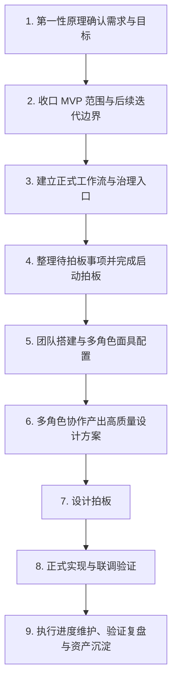

## 项目从需求确认到实际开发的标准 Workflow 规范

**文档类型**：通用工作流规范 / 背景方法论文档  
**适用范围**：适用于后续类似 AI-native 项目、模块型研发项目、带多角色协作与治理拍板机制的规划型开发工作  
**归档位置**：`background`  
**文档定位**：统一引用体系中的**上位母文档 / 完整规范版**  
**配套文档**：
- [STANDARD_PROJECT_WORKFLOW_CHECKLIST.md](f:\AIProjects\DesignAssistant\background\STANDARD_PROJECT_WORKFLOW_CHECKLIST.md)
- [STANDARD_PROJECT_WORKFLOW_TEMPLATE.md](f:\AIProjects\DesignAssistant\background\STANDARD_PROJECT_WORKFLOW_TEMPLATE.md)
**状态**：v1.1 Draft（已纳入统一引用体系）

---

## 一、文档关系与推荐使用顺序

这组三份文档分别承担不同职责：

- **完整规范版**：[STANDARD_PROJECT_WORKFLOW_SPEC.md](f:\AIProjects\DesignAssistant\background\STANDARD_PROJECT_WORKFLOW_SPEC.md)
  - 作用：说明完整 workflow 的方法论、阶段定义、门禁逻辑与推荐协作原则
  - 适用场景：第一次建立共识、需要解释为什么这样推进时

- **快速检查版**：[STANDARD_PROJECT_WORKFLOW_CHECKLIST.md](f:\AIProjects\DesignAssistant\background\STANDARD_PROJECT_WORKFLOW_CHECKLIST.md)
  - 作用：把规范压缩成启动门禁、一页式检查清单与快速自查表
  - 适用场景：项目启动、阶段切换、拍板前快速过门禁时

- **项目填写版**：[STANDARD_PROJECT_WORKFLOW_TEMPLATE.md](f:\AIProjects\DesignAssistant\background\STANDARD_PROJECT_WORKFLOW_TEMPLATE.md)
  - 作用：把通用 workflow 变成可直接复制、按项目逐阶段填写的正式母模板
  - 适用场景：为具体项目创建项目级 workflow 主文档时

推荐使用顺序：

1. **先阅读** [STANDARD_PROJECT_WORKFLOW_SPEC.md](f:\AIProjects\DesignAssistant\background\STANDARD_PROJECT_WORKFLOW_SPEC.md)，理解完整方法论
2. **再使用** [STANDARD_PROJECT_WORKFLOW_CHECKLIST.md](f:\AIProjects\DesignAssistant\background\STANDARD_PROJECT_WORKFLOW_CHECKLIST.md) 做启动或阶段门禁检查
3. **最后复制** [STANDARD_PROJECT_WORKFLOW_TEMPLATE.md](f:\AIProjects\DesignAssistant\background\STANDARD_PROJECT_WORKFLOW_TEMPLATE.md) 到具体项目目录，形成项目专属 workflow 文档

一句话理解就是：

> **`SPEC` 负责讲清楚，`CHECKLIST` 负责查清楚，`TEMPLATE` 负责填清楚。**

---

## 二、这份规范解决什么问题
这份文档的目标，不是描述某一个具体模块，而是把本项目在 `2.1 / 2.2 / 2.3 / 2.4 / 2.5` 中逐步稳定下来的通用研发节奏抽象出来，形成一条**从需求确认到正式开发落地**的标准路径。

它主要解决三个问题：

- 当一个新项目或新模块启动时，团队应该**先做什么、后做什么**；
- 哪些内容属于**设计前必须冻结的上位判断**，哪些内容应该后置到设计或实现阶段；
- 如何让项目既体现**第一性原理、AI-native 思维、协作治理能力**，又避免一开始就陷入“直接写代码”或“直接堆功能”的混乱状态 [[memory:rebp86gg]]。

一句话概括：

> **先确认“这个模块到底为什么存在、要解决什么问题、MVP 先做到哪里”，再建立正式治理流程、团队分工和拍板门禁，之后才进入设计与实现。**

---

## 二、标准主流程总览

一个推荐的标准主流程如下：

如果换成更口语化的表达，这条主路径就是：

1. **先想清楚本质与目标**  
2. **再想清楚当前只做什么、不做什么**  
3. **再把工作流、文档、拍板点和接手顺序固定下来**  
4. **再按职责建队、配角色面具**  
5. **再让团队基于正式口径做设计**  
6. **设计过会后才进入实现**  
7. **实现中持续验证、回写、沉淀复用资产**

---

## 三、阶段 1：第一性原理确认需求与目标

### 3.1 阶段目标

这一阶段要回答的不是“怎么实现”，而是：

- 这个项目 / 模块**为什么存在**；
- 它在更大工作流里承担什么职责；
- 它真正服务的对象是谁；
- 它和上下游模块的职责边界分别是什么；
- 它最本质的问题到底是“信息处理”“判断升级”“行动设计”“基础设施支撑”还是“现实校验 / 复盘”。

### 3.2 为什么必须先做这一步

如果不先做第一性原理澄清，项目很容易出现两种偏差：

- **功能堆叠偏差**：看起来什么都重要，于是一开始就把功能做得很满；
- **职责混淆偏差**：上游、当前模块、下游的边界不清，最后谁都在做同样的事情。

因此，这一步的本质是：

> **先从“模块是什么”入手，而不是从“我要写哪些功能”入手。**

### 3.3 典型交付物

推荐至少产出以下材料：

- `FIRST_PRINCIPLES_AND_ROLE_ESSENCE.md` 或同类文档
- 模块一句话定义
- 职责边界说明
- 上下游关系说明
- 非目标列表（明确哪些事当前模块不做）

### 3.4 进入下一阶段的条件

只有当下面这些问题已经有清晰答案时，才适合进入下一阶段：

- 该模块的本质是否说清楚；
- 它是否与上下游形成了清晰边界；
- 它当前最重要的主产物是否明确；
- 是否已经明确哪些内容属于非目标。

---

## 四、阶段 2：将目标具象化为 MVP 与后续迭代边界

### 4.1 阶段目标

在第一性原理确认之后，第二步不是立刻写设计方案，而是先回答：

- **当前 MVP 到底必须做什么**；
- **哪些内容虽然重要，但不应该进入第一轮范围**；
- **哪些增强项适合作为 P1 / P2 / 下一阶段迭代**。

### 4.2 这一阶段的核心判断方式

建议把内容明确分成三层：

- **现在必须进入 MVP 的硬范围**
- **可以进入当前阶段，但只能作为条件触发项的增强内容**
- **不建议作为当前 MVP 硬需求的内容**

这一步的作用，是避免两种常见错误：

- **MVP 范围膨胀**：把所有“未来值得做”的内容一起塞进去；
- **过度保守收缩**：把当前真正应该进入 MVP 的主骨架也一起后置掉。

### 4.3 典型交付物

推荐至少产出以下材料：

- `MVP_SCOPE_AND_ITERATION_ALIGNMENT.md` 或同类文档
- MVP 主产物与主闭环定义
- 当前硬范围 / 条件触发项 / 后续增强项列表
- 优先级排序（如 `P0 / P1 / P2 / P3`）
- 一句话对齐说法（方便快速同步给其他协作者）

### 4.4 进入下一阶段的条件

只有当下面内容已收口，才适合进入正式工作流治理：

- 当前 MVP 的中心对象或中心闭环已明确；
- 明确知道当前不做什么；
- 后续增强项已有大致承接位置；
- 团队对“先做最小闭环、后加复杂能力”达成一致 [[memory:rebp86gg]]。

---

## 五、阶段 3：建立正式工作流与治理入口

### 5.1 阶段目标

这一阶段开始把“理解”和“范围”转成可执行治理路径。核心不是继续写功能说明，而是建立一个**正式工作入口**，明确：

- 现在项目处于什么阶段；
- 后续工作应该按什么顺序推进；
- 哪些文档先补，哪些文档后补；
- 另一端 / 其他协作者应该从哪里接手；
- 什么条件下才允许进入设计，什么条件下才允许进入实现。

### 5.2 这一阶段的本质

这一步不是实现设计，而是：

> **先把“怎么推进这个项目”本身设计清楚。**

这是从“模块定义”进入“正式治理轨”的关键过渡层。

### 5.3 推荐的治理入口文档

建议建立一份类似下面命名的导航型文档：

- `工作流总览与协作导航.md`

它通常需要说明：

- 当前已完成的前置文档
- 推荐阅读顺序
- 当前阶段判断
- 当前最稳的推进顺序
- 这一端与另一端的分工
- 接下来要依次补齐哪些治理文档

### 5.4 进入下一阶段的条件

- 项目已经有明确的治理入口；
- 后续文档路径与顺序清楚；
- 当前阶段不是“边聊边做”的游离状态，而是已经有正式推进轨道。

---

## 六、阶段 4：整理待拍板事项并完成启动拍板

### 6.1 阶段目标

这一阶段要把所有**会影响方向、边界、契约、实现策略的关键问题**集中起来，让玩家 / 用户 / 项目 owner 进行正式拍板。

这一步必须发生在正式设计之前，而不是等实现过程中边写边问。

### 6.2 为什么拍板必须前置

因为以下这些问题，一旦不先定，后面一定会反复返工：

- 模块边界到底到哪；
- MVP 用什么实现策略起步；
- 当前对上下游是强耦合还是弱耦合；
- 当前主产物更偏结构化对象、文档视图还是接口能力；
- 当前哪些点必须冻结，哪些点可以带着开放项进入设计。

### 6.3 推荐文档

- `待拍板决策清单.md`
- `启动与拍板.md`

其中每个拍板项最好包含：

- 可选方案
- 推荐方案
- 推荐理由
- 为什么现在必须定
- 延后风险
- 拍板结果

### 6.4 这一阶段的纪律

- 执行团队**不得绕过拍板结果自行扩范围**；
- 对话中的临时想法，只有写回正式文档后才算生效；
- 拍板前可以讨论，拍板后必须以正式结论为准。

### 6.5 进入下一阶段的条件

- 必拍板项已经明确；
- 当前阶段不再带着关键方向分歧进入设计；
- 启动条件、边界、门禁已冻结。

---

## 七、阶段 5：团队搭建与多角色面具配置

### 7.1 阶段目标

在治理和拍板完成后，项目才进入团队搭建阶段。这里的重点不是“先招一堆角色”，而是：

- 根据已冻结的目标与范围，明确需要覆盖哪些职责视角；
- 把正式职责转成可执行的团队分工；
- 在单一 Agent 或统一协作体下，配置多角色面具 / 多职责视角；
- 让后续设计不是由单一视角拍脑袋完成，而是由不同专业视角共同收敛。

### 7.2 标准理解

在本项目实践里，更推荐的理解方式是：

- **先有职责，再有角色**；
- **先有角色依据，再有执行压缩方案**；
- **角色面具首先服务于设计质量提升，而不是默认等同于运行时多 Agent 工程架构**。

### 7.3 推荐文档

- `团队重组建议清单.md`
- `角色面具配置方案.md`
- `roles.md` 或 `phaseX_roles.md`

其中应至少说明：

- 需要哪些正式职责视角；
- 标准配置与压缩配置分别是什么；
- 各角色的职责边界、输入输出与非职责；
- 多角色如何共同产出设计方案；
- 哪些事项仍需玩家 / 用户拍板，不能由执行端自行决定。

### 7.4 进入下一阶段的条件

- 角色文件已正式落档；
- 团队协作方式明确；
- 各职责视角已经能支撑下一步高质量设计。

---

## 八、阶段 6：多角色协作产出高质量设计方案

### 8.1 阶段目标

这一步才进入真正意义上的“方案设计”。

它不是简单把需求改写成任务列表，而是要求团队基于前面已经冻结的：

- 第一性定位
- MVP 边界
- 启动拍板结论
- 角色协作依据

共同产出一份**正式设计方案**。

### 8.2 设计方案应该关注什么

一份高质量设计方案，通常要回答：

- 主流程如何工作；
- 输入 / 输出对象或接口如何定义；
- 哪些能力先做最小闭环；
- 哪些风险会影响设计取舍；
- 哪些开放问题可以带入实现，哪些必须在实现前关闭；
- 如何支持后续验证、联调与复盘。

### 8.3 推荐交付物

- `设计方案.md`
- 关键对象 / Schema 草案
- 主流程图
- 输入输出说明
- 验证思路与样例策略

### 8.4 这一阶段的注意事项

- 不要在设计阶段重新改写已拍板的模块本质；
- 不要因为实现方便就偷偷扩大范围；
- 设计要服务当前 MVP，而不是服务未来全部想象空间。

### 8.5 进入下一阶段的条件

- 设计方案已形成正式草案；
- 关键结构和主流程已足够清晰；
- 已具备进入“设计拍板”的基础。

---

## 九、阶段 7：设计拍板

### 9.1 阶段目标

设计拍板和前面的启动拍板不是一回事。

- **启动拍板**：拍的是模块边界、MVP 范围、当前策略和治理门禁；
- **设计拍板**：拍的是正式设计方案本身是否可以进入实现。

### 9.2 设计拍板至少应覆盖

- 主流程是否同意按当前方案推进；
- 关键对象骨架 / Schema 是否可冻结；
- 实现策略是否仍然停留在 MVP 边界内；
- 哪些问题允许带着进入实现；
- 哪些问题若不关闭会直接造成后续返工。

### 9.3 进入下一阶段的条件

只有设计拍板通过后，才建议进入正式实现。否则项目会出现一种常见假象：

- 文档很多；
- 讨论很多；
- 但实际没有一份被正式批准的设计基线。

---

## 十、阶段 8：正式实现与联调验证

### 10.1 阶段目标

这一阶段才是传统意义上的开发阶段，但它不是“从零开始想怎么做”，而是把前面已经冻结的设计转成：

- 代码实现
- Prompt / workflow 实现
- 数据结构与接口实现
- 样例联调
- Benchmark / case validation
- 上下游联调记录

### 10.2 实现阶段的核心原则

- 实现必须服务设计，不应反向推翻上位口径；
- 所有关键变化都应回写正式执行轨文档；
- 验证材料应与 MVP 的中心闭环强绑定，而不是只追求“能跑”。

### 10.3 推荐交付物

- `执行进度.md`
- implementation 目录下的契约说明、Schema 说明、验证记录
- 样例输出
- 联调记录
- 风险与阻塞项回写

### 10.4 进入下一阶段的条件

- 最小功能链路已跑通；
- 已经有正式进度记录和验证记录；
- 关键问题可以被追踪，而不是散落在对话里。

---

## 十一、阶段 9：执行进度维护、验证复盘与资产沉淀

### 11.1 阶段目标

真正可复用的项目，不会在“代码写完”就结束，而是要把过程中形成的高价值资产沉淀下来，便于后续项目直接复用。

这一阶段建议沉淀：

- 工作流规范
- 输入输出契约模板
- 角色职责模板
- 设计拍板模板
- 验证记录模板
- 案例复盘模板
- 可复用 Prompt / schema / process skeleton

### 11.2 为什么这一阶段很重要

如果没有资产沉淀，项目只完成了一次性开发；
如果有资产沉淀，项目才真正变成：

> **一个可复用的 AI-native 方法论与工程模板。**

这也更符合你希望项目实践强调**学会可讲述、可迁移、可复盘的工程判断能力**的方向 [[memory:rebp86gg]]。

---

## 十二、标准文档清单模板

对于一个要完整走通这条 workflow 的项目 / 模块，推荐至少准备下面这组文档：

### 12.1 上位定义层

- `目标说明.md`
- `FIRST_PRINCIPLES_AND_ROLE_ESSENCE.md`
- `MVP_SCOPE_AND_ITERATION_ALIGNMENT.md`

### 12.2 治理与导航层

- `工作流总览与协作导航.md`
- `待拍板决策清单.md`
- `启动与拍板.md`

### 12.3 团队与角色层

- `团队重组建议清单.md`
- `角色面具配置方案.md`
- `roles.md`

### 12.4 设计与执行层

- `设计方案.md`
- `执行进度.md`
- implementation 目录下的契约、Schema、验证与联调文档

### 12.5 复盘与复用层

- 验证记录
- 复盘摘要
- 后续迭代优先级清单
- 通用模板回收文档

---

## 十三、每个阶段的进入 / 退出门禁模板

为了提高复用性，建议以后新项目都用类似下面的门禁方式检查：

| 阶段 | 进入目标 | 必须产出 | 退出条件 |
|------|----------|----------|----------|
| 第一性原理确认 | 明确模块本质 | 本质定位文档 | 职责边界清晰 |
| MVP 收口 | 明确当前只做什么 | MVP 范围文档 | 现在做 / 后续做边界清晰 |
| 治理入口建立 | 固定推进顺序 | 工作流导航文档 | 有正式接手入口 |
| 启动拍板 | 冻结关键决策 | 拍板清单 + 启动文档 | 必拍板项已确认 |
| 团队搭建 | 明确职责与角色 | 团队建议 + 角色配置 + roles | 角色依据已落档 |
| 设计方案 | 形成正式设计基线 | 设计方案文档 | 具备设计拍板基础 |
| 设计拍板 | 批准方案进入实现 | 设计拍板结论 | 同意进入实现 |
| 正式实现 | 落地最小闭环 | 代码 / 验证 / 联调记录 | 最小链路可运行 |
| 复盘沉淀 | 形成复用资产 | 模板 / 复盘 / 资产回收 | 可迁移到下一个项目 |

---

## 十四、推荐的协作原则

### 14.1 先上位判断，后实现细节

任何会影响模块职责、主产物、MVP 边界和实现策略的问题，都应该先走上位文档和拍板流程，而不是在实现中临时决定。

### 14.2 先冻结治理，后进入设计

设计不是起点，治理和门禁才是设计的前置条件。

### 14.3 先正式落档，再视为生效

对话、讨论、灵感都不等于正式要求；只有回写到正式文档后，才算进入执行基线。

### 14.4 先做最小闭环，再做复杂增强

复杂能力不应作为第一轮成立前提，应当在最小闭环验证有效之后，再作为增强项逐步引入。

### 14.5 先保证可解释，再追求看起来完整

比起“大而全”，更重要的是：

- 为什么这样分阶段；
- 为什么当前只做这些；
- 为什么某些能力后置；
- 为什么这个设计更利于验证与复盘。

---

## 十五、适合直接复用的一段标准说法

如果后续其他项目需要快速对齐，可以直接使用下面这段话作为标准起手说明：

> 新项目不直接从功能实现开始，而是先按统一 workflow 推进：先通过第一性原理确认模块本质、目标与职责边界，再收口 MVP 范围与后续迭代边界；在此基础上建立正式工作流导航、待拍板清单与启动拍板文档，明确接手顺序、治理门禁与关键决策；随后完成团队重组建议、角色面具配置与 `roles` 文件落档，由多角色协作产出高质量设计方案；设计方案经正式拍板后，再进入实现、联调、验证与复盘，并将过程中形成的契约、模板、验证记录与方法论资产沉淀为后续项目可复用的标准材料。

---

## 十六、这份规范最重要的一句话

> **一个高质量、可复用、可讲述的 AI-native 项目流程，不是“先开发、再补文档”，而是“先确认本质与边界，再建立治理与拍板门禁，再组织团队做设计，设计通过后才进入实现”。**

---

## 十七、建议的后续使用方式

后续任何新项目 / 新模块启动时，建议按下面顺序直接复用本规范：

1. 先复制本文件作为该项目的上位 workflow 参考
2. 基于项目特点补出本项目版本的第一性原理文档
3. 补出本项目版本的 MVP 范围文档
4. 建立工作流导航与待拍板清单
5. 完成启动拍板后再建队
6. 角色文件落档后再做设计
7. 设计拍板通过后再实现
8. 在实现中持续回写验证、进度与复盘

这样可以最大程度保证：

- 项目一开始就有清晰方法论；
- 多角色协作不是装饰，而是真正服务高质量设计；
- 玩家 / 用户拍板点清晰，不会被执行过程吞没；
- 每一轮项目都能留下可复用的流程资产。

---

**文档状态**：✅ 已建立  
**版本**：v1.0 Draft  
**建议下次更新时机**：当后续项目在复用这套 workflow 时发现需要新增新的治理环节、角色层规则或设计 / 实现门禁时