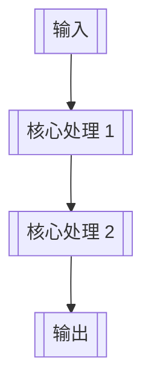

## 项目标准 Workflow 模板（可复制填写）

**项目名称**：`[填写项目名称]`  
**项目代号**：`[填写项目代号]`  
**文档类型**：项目级 Workflow 模板 / 启动与治理母文档  
**适用范围**：`[填写本项目适用范围]`  
**文档定位**：统一引用体系中的**项目填写版 / 项目级落地模板**  
**上位规范**：[STANDARD_PROJECT_WORKFLOW_SPEC.md](f:\AIProjects\DesignAssistant\background\STANDARD_PROJECT_WORKFLOW_SPEC.md)  
**配套清单**：[STANDARD_PROJECT_WORKFLOW_CHECKLIST.md](f:\AIProjects\DesignAssistant\background\STANDARD_PROJECT_WORKFLOW_CHECKLIST.md)  
**当前状态**：`Draft / In Progress / Approved`  
**最后更新时间**：`[YYYY-MM-DD]`

---

## 一、模板在统一引用体系中的位置

这份文档不是拿来单独阅读的孤立模板，而是三份标准文档中的**项目落地层**：

- **完整规范母文档**：[STANDARD_PROJECT_WORKFLOW_SPEC.md](f:\AIProjects\DesignAssistant\background\STANDARD_PROJECT_WORKFLOW_SPEC.md)
  - 用来解释完整 workflow 为什么这样设计。

- **一页式门禁清单**：[STANDARD_PROJECT_WORKFLOW_CHECKLIST.md](f:\AIProjects\DesignAssistant\background\STANDARD_PROJECT_WORKFLOW_CHECKLIST.md)
  - 用来快速检查当前项目是否具备进入下一阶段的条件。

- **当前模板文档**：[STANDARD_PROJECT_WORKFLOW_TEMPLATE.md](f:\AIProjects\DesignAssistant\background\STANDARD_PROJECT_WORKFLOW_TEMPLATE.md)
  - 用来把通用规范真正翻译成某个具体项目的正式工作流母文档。

推荐使用方式：

1. 先参考 `SPEC`，理解完整方法论与阶段定义
2. 再参考 `CHECKLIST`，确认当前项目的门禁与最低交付要求
3. 再复制当前 `TEMPLATE` 到目标项目目录，逐阶段填写项目内容

一句话理解就是：

> **先用 `SPEC` 建共识，再用 `CHECKLIST` 过门禁，最后用 `TEMPLATE` 落项目。**

---

## 二、项目一句话定义
> **[请用一句话说明：这个项目 / 模块为什么存在，它最本质要解决什么问题。]**

补充说明：

- **服务对象**：`[填写服务对象]`
- **核心职责**：`[填写核心职责]`
- **不负责内容 / 非目标**：
  - `[非目标 1]`
  - `[非目标 2]`
  - `[非目标 3]`

---

## 二、当前标准推进阶段

请勾选当前项目所处阶段：

- [ ] **阶段 1：第一性原理确认需求与目标**
- [ ] **阶段 2：收口 MVP 范围与后续迭代边界**
- [ ] **阶段 3：建立正式工作流与治理入口**
- [ ] **阶段 4：整理待拍板事项并完成启动拍板**
- [ ] **阶段 5：团队搭建与多角色面具配置**
- [ ] **阶段 6：多角色协作产出高质量设计方案**
- [ ] **阶段 7：设计拍板**
- [ ] **阶段 8：正式实现与联调验证**
- [ ] **阶段 9：执行进度维护、验证复盘与资产沉淀**

---

## 三、阶段 1：第一性原理确认需求与目标

### 3.1 当前阶段目标

- `[这个项目 / 模块为什么存在]`
- `[它在整体工作流中的职责是什么]`
- `[它和上下游的边界是什么]`
- `[它当前最重要的主产物是什么]`

### 3.2 本阶段核心结论

- **模块本质定义**：`[填写]`
- **上游输入**：`[填写]`
- **下游输出 / 去向**：`[填写]`
- **职责边界**：`[填写]`
- **非目标**：`[填写]`

### 3.3 本阶段交付物

- [ ] `目标说明.md`
- [ ] `FIRST_PRINCIPLES_AND_ROLE_ESSENCE.md`
- [ ] 其他：`[填写]`

### 3.4 进入下一阶段前确认

- [ ] 模块本质已说清
- [ ] 上下游边界已明确
- [ ] 当前主产物已明确
- [ ] 非目标已明确

---

## 四、阶段 2：MVP 范围与后续迭代边界

### 4.1 当前 MVP 定义

- **MVP 主对象 / 主闭环**：`[填写]`
- **当前必须做的内容**：
  - `[内容 1]`
  - `[内容 2]`
  - `[内容 3]`
- **当前明确不做的内容**：
  - `[内容 1]`
  - `[内容 2]`
- **后续增强项 / P1 / P2**：
  - `[增强项 1]`
  - `[增强项 2]`

### 4.2 优先级建议

- **P0**：`[填写]`
- **P1**：`[填写]`
- **P2**：`[填写]`
- **P3**：`[填写]`

### 4.3 本阶段交付物

- [ ] `MVP_SCOPE_AND_ITERATION_ALIGNMENT.md`
- [ ] 范围收口摘要
- [ ] 优先级列表

### 4.4 进入下一阶段前确认

- [ ] MVP 边界已收口
- [ ] 明确知道现在做什么 / 不做什么
- [ ] 后续增强项已有承接位置

---

## 五、阶段 3：工作流与治理入口

### 5.1 当前治理入口

- **治理入口文档**：`[填写文件名或路径]`
- **推荐阅读顺序**：
  1. `[文档 1]`
  2. `[文档 2]`
  3. `[文档 3]`
- **当前阶段判断**：`[填写]`
- **当前最稳推进顺序**：`[填写]`

### 5.2 协作导航

- **本端职责**：`[填写]`
- **另一端 / 其他协作者职责**：`[填写]`
- **后续待补文档**：
  - `[文档 1]`
  - `[文档 2]`
  - `[文档 3]`

### 5.3 本阶段交付物

- [ ] `工作流总览与协作导航.md`
- [ ] 协作顺序说明
- [ ] 接手说明

### 5.4 进入下一阶段前确认

- [ ] 已有正式治理入口
- [ ] 文档顺序清晰
- [ ] 协作接手顺序清晰

---

## 六、阶段 4：待拍板事项与启动拍板

### 6.1 待拍板问题清单

| 编号 | 问题 | 可选方案 | 推荐方案 | 推荐理由 | 延后风险 | 最终结论 |
|------|------|----------|----------|----------|----------|----------|
| 1 | `[填写]` | `[填写]` | `[填写]` | `[填写]` | `[填写]` | `[填写]` |
| 2 | `[填写]` | `[填写]` | `[填写]` | `[填写]` | `[填写]` | `[填写]` |
| 3 | `[填写]` | `[填写]` | `[填写]` | `[填写]` | `[填写]` | `[填写]` |

### 6.2 当前已冻结的关键结论

- `[结论 1]`
- `[结论 2]`
- `[结论 3]`

### 6.3 本阶段交付物

- [ ] `待拍板决策清单.md`
- [ ] `启动与拍板.md`
- [ ] 拍板纪要

### 6.4 进入下一阶段前确认

- [ ] 必拍板事项已明确
- [ ] 关键边界 / 策略 / 契约已冻结
- [ ] 不再带重大方向分歧进入设计

---

## 七、阶段 5：团队搭建与多角色面具配置

### 7.1 需要覆盖的职责视角

- `[职责视角 1]`
- `[职责视角 2]`
- `[职责视角 3]`
- `[职责视角 4]`

### 7.2 角色配置

| 角色 | 核心职责 | 输入 | 输出 | 非职责 |
|------|----------|------|------|--------|
| `[角色 1]` | `[填写]` | `[填写]` | `[填写]` | `[填写]` |
| `[角色 2]` | `[填写]` | `[填写]` | `[填写]` | `[填写]` |
| `[角色 3]` | `[填写]` | `[填写]` | `[填写]` | `[填写]` |

### 7.3 配置策略

- **标准配置**：`[填写]`
- **压缩配置**：`[填写]`
- **仍需玩家 / 用户拍板事项**：
  - `[事项 1]`
  - `[事项 2]`

### 7.4 本阶段交付物

- [ ] `团队重组建议清单.md`
- [ ] `角色面具配置方案.md`
- [ ] `roles.md`

### 7.5 进入下一阶段前确认

- [ ] 角色依据已落档
- [ ] 协作方式明确
- [ ] 已具备进入高质量设计的职责覆盖

---

## 八、阶段 6：设计方案

### 8.1 设计目标

- `[设计要回答的核心问题 1]`
- `[设计要回答的核心问题 2]`
- `[设计要回答的核心问题 3]`

### 8.2 设计主流程

### 8.3 关键对象 / 输入输出

- **核心输入对象**：`[填写]`
- **核心输出对象**：`[填写]`
- **Schema / 契约说明**：`[填写]`
- **开放问题**：
  - `[问题 1]`
  - `[问题 2]`

### 8.4 设计约束

- `[当前设计必须服务 MVP]`
- `[不能越过的边界]`
- `[必须在实现前关闭的问题]`

### 8.5 本阶段交付物

- [ ] `设计方案.md`
- [ ] 主流程图
- [ ] Schema / 契约草案
- [ ] 验证思路

### 8.6 进入下一阶段前确认

- [ ] 设计草案已形成
- [ ] 主流程已清晰
- [ ] 输入输出与关键结构已清晰

---

## 九、阶段 7：设计拍板

### 9.1 本轮设计拍板重点

- `[拍板点 1]`
- `[拍板点 2]`
- `[拍板点 3]`

### 9.2 拍板结论

- **主流程是否通过**：`[通过 / 退回修改]`
- **关键对象骨架是否冻结**：`[是 / 否]`
- **是否同意进入实现**：`[是 / 否]`
- **遗留开放问题**：
  - `[问题 1]`
  - `[问题 2]`

### 9.3 本阶段交付物

- [ ] 设计拍板记录
- [ ] 设计基线冻结说明

---

## 十、阶段 8：正式实现与联调验证

### 10.1 当前实现目标

- `[最小可运行闭环]`
- `[首轮联调范围]`
- `[验证重点]`

### 10.2 当前实现清单

- [ ] 核心能力 1：`[填写]`
- [ ] 核心能力 2：`[填写]`
- [ ] 核心能力 3：`[填写]`
- [ ] 运行记录
- [ ] 验证记录
- [ ] 联调记录

### 10.3 当前风险与阻塞

- `[风险 / 阻塞 1]`
- `[风险 / 阻塞 2]`

### 10.4 本阶段交付物

- [ ] `执行进度.md`
- [ ] 契约 / Schema / 验证文档
- [ ] 样例输出
- [ ] 联调记录

### 10.5 进入下一阶段前确认

- [ ] MVP 最小链路已跑通
- [ ] 已有正式进度记录
- [ ] 已有验证与联调材料

---

## 十一、阶段 9：验证复盘与资产沉淀

### 11.1 当前复盘结论

- **哪些设计成立**：
  - `[填写]`
- **哪些问题需要优先修正**：
  - `[填写]`
- **后续迭代优先级**：
  - `[填写]`

### 11.2 需要沉淀的资产

- [ ] 工作流规范增量
- [ ] 输入输出契约模板
- [ ] 角色职责模板
- [ ] 设计拍板模板
- [ ] 验证记录模板
- [ ] Prompt / Schema / Process skeleton
- [ ] 案例复盘材料

### 11.3 复用价值总结

> **[填写：这个项目给后续项目留下了哪些可迁移的方法论、模板或工程资产。]**

---

## 十二、标准文档清单

### 12.1 上位定义层

- [ ] `目标说明.md`
- [ ] `FIRST_PRINCIPLES_AND_ROLE_ESSENCE.md`
- [ ] `MVP_SCOPE_AND_ITERATION_ALIGNMENT.md`

### 12.2 治理与导航层

- [ ] `工作流总览与协作导航.md`
- [ ] `待拍板决策清单.md`
- [ ] `启动与拍板.md`

### 12.3 团队与角色层

- [ ] `团队重组建议清单.md`
- [ ] `角色面具配置方案.md`
- [ ] `roles.md`

### 12.4 设计与执行层

- [ ] `设计方案.md`
- [ ] `执行进度.md`
- [ ] 契约 / Schema / 验证 / 联调文档

### 12.5 复盘与复用层

- [ ] 验证记录
- [ ] 复盘摘要
- [ ] 后续迭代优先级清单
- [ ] 模板回收文档

---

## 十三、项目启动时的 10 个必答问题

1. **这个项目 / 模块为什么存在？**  
   `[填写]`

2. **它最本质的职责是什么？**  
   `[填写]`

3. **它和上下游的边界是什么？**  
   `[填写]`

4. **当前 MVP 只做什么？**  
   `[填写]`

5. **当前明确不做什么？**  
   `[填写]`

6. **哪些问题必须先拍板？**  
   `[填写]`

7. **设计前谁来拍板、拍什么？**  
   `[填写]`

8. **需要哪些正式职责视角参与设计？**  
   `[填写]`

9. **当前设计方案是否真的服务 MVP？为什么？**  
   `[填写]`

10. **最后准备沉淀哪些可复用资产？**  
   `[填写]`

---

## 十四、标准使用说明

推荐使用顺序：

1. 复制本模板到目标项目目录
2. 先填写阶段 1 与阶段 2
3. 补齐治理入口与待拍板事项
4. 完成拍板后再补团队配置
5. 角色落档后再做设计方案
6. 设计拍板通过后再进入实现
7. 实现过程中持续回写验证、进度与复盘

---

**文档状态**：✅ 已建立  
**版本**：v1.0 Draft  
**建议使用方式**：后续新项目启动时，直接复制本模板并逐阶段填写