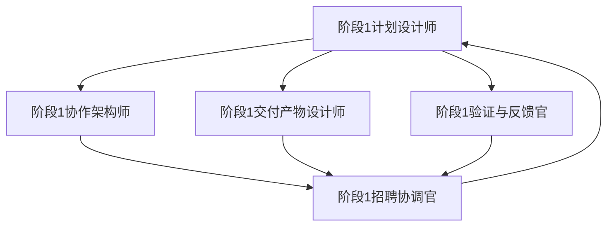

# 阶段1交付模板包（草案）

## 1. 目的
为阶段1计划输出提供可直接复用的交付物模板和验收检查表，确保各角色输出一致、可验证、可演示。

## 2. 模板清单
### 2.1 阶段1计划文档模板
- 文件名建议：`阶段1计划文档.md`
- 建议结构：
  1. 目的与背景
  2. 阶段1目标
  3. 阶段1里程碑（含验收检查列表）
  4. 关键任务与责任分工
  5. 交付物与输出模板链接
  6. 验收标准
  7. 阶段2目标说明（目标 / 主要工作 / 风险与依赖）

### 2.2 协作流程图模板（Mermaid）
- 文件名建议：`阶段1协作流程图.md`
- 主要包含：角色间交付线、审查节点、迭代路径。
- 模板示例：

### 2.3 交付物验收检查表模板
- 文件名建议：`阶段1交付验收检查表.md`
- 内容示例：
  - [ ] 阶段1计划文档包含阶段1目标、里程碑、任务、输出、验收标准。
  - [ ] 协作流程图清晰标注了角色、责任、审查节点。
  - [ ] 交付模板包包含至少 2 个核心文件模板（计划文档/检查表）。
  - [ ] 阶段2目标说明具体明确，可直接作为下一阶段启动输入。

## 3. 交付模板获取位置（建议）
- 可在阶段1成果包中统一存放：`data-layer/employees/EMP-018/产出物/阶段1成果包/`。

---

*（本模板包由阶段1交付产物设计师生成，用于统一阶段1输出结构与质量）*