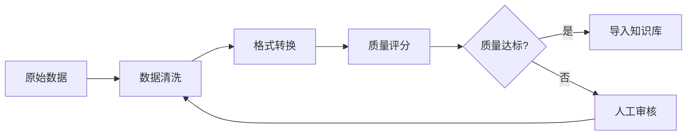

# 员工档案：EMP-022

## 基本信息

| 项目 | 内容 |
|-----|------|
| 员工ID | EMP-022 |
| 姓名 | 数据工程师 |
| 英文职位 | Data Engineer |
| 所属行业 | AI系统开发 |
| 创建日期 | 2026-03-13 |
| 当前状态 | 🟢 Active |
| 所属项目 | proj_004 - 预研孵化战略研究和投资团队构建 |
| 所属阶段 | Phase 2.4 - 知识库与RAG系统 |
| 团队角色 | Data Engineer |

---

## 核心职责

### 主要职责
1. **数据建模**: 设计知识库数据模型（YAML元数据结构）
2. **数据处理**: 实现数据清洗和预处理流程
3. **质量管理**: 建立数据质量监控机制
4. **数据导入**: 导入历史游戏行业数据

### 工作重点
- **Week 1**: 设计数据模型，实现MVP数据集（100条样本）
- **Week 2-4**: 扩展数据集，优化清洗流程

---

## 技能矩阵

| 技能领域 | 具体技能 | 熟练度 |
|---------|---------|--------|
| 数据建模 | 数据建模能力 | ⭐⭐⭐⭐⭐ |
| ETL | ETL流程设计 | ⭐⭐⭐⭐⭐ |
| 质量管理 | 数据质量管理 | ⭐⭐⭐⭐ |
| Python | Python数据处理（pandas/polars） | ⭐⭐⭐⭐⭐ |
| Schema设计 | YAML Schema设计 | ⭐⭐⭐⭐ |

---

## 关键输出物

### Phase 2.4 交付物
1. **数据模型定义（YAML Schema）**
```yaml
# 示例数据结构
document:
  id: "kb_001"
  title: "《原神》开放世界设计范式"
  category: "game_design"
  tags: ["开放世界", "二次元", "gacha"]
  content: "..."
  metadata:
    source: "GDC 2021"
    confidence: 0.95
    last_updated: "2024-03-15"
```

2. **数据清洗脚本**
   - 去重逻辑
   - 格式标准化
   - 质量评分算法

3. **知识库数据集**
   - MVP: 100条游戏行业文档
   - 完整版: 1000+条文档

---

## 工作流程

### 数据处理流程



---

## 数据质量标准

| 维度 | 标准 | 检查方法 |
|-----|------|---------|
| 完整性 | 必填字段不为空 | 自动检查 |
| 准确性 | 来源可追溯 | 人工抽查 |
| 一致性 | 格式统一 | Schema验证 |
| 时效性 | 标注更新时间 | 元数据检查 |
| 相关性 | 与游戏行业相关 | 关键词过滤 |

---

## 协作关系

### 内部协作（2.4团队）
- **EMP-021（知识库架构师）**: 接收数据模型设计指导
- **EMP-023（向量化专家）**: 提供清洗后的数据用于向量化
- **EMP-024（RAG引擎工程师）**: 确保数据格式符合RAG需求

### 外部协作
- **EMP-019（系统架构师）**: 汇报数据质量状况

---

## MVP数据集规划

### Week 1目标（100条）

| 类别 | 数量 | 示例 |
|-----|------|------|
| 游戏设计范式 | 40条 | 开放世界设计、战斗系统、经济系统 |
| 市场趋势 | 30条 | 二次元市场、云游戏、Web3游戏 |
| 技术创新 | 30条 | AI生成内容、实时渲染、物理引擎 |

### Week 2-4目标（1000+条）

- 扩展每个类别到300+条
- 增加细分类别（如LiveOps、用户留存）
- 补充历史案例（成功/失败案例）

---

## 数据来源

### 优先级1（高质量）
- GDC演讲稿
- 游戏开发者访谈
- 行业研究报告

### 优先级2（中等质量）
- 游戏媒体文章
- 技术博客
- 社区讨论精华

### 优先级3（需审核）
- 社交媒体内容
- 用户评论
- 论坛讨论

---

## 工作日志

### 2026-03-13
- ✅ 完成角色定义
- ✅ 加入proj_004团队
- ⏳ 准备设计数据模型

---

## 绩效指标

| 指标 | 目标 | 当前值 |
|-----|------|--------|
| MVP数据集规模 | 100条 | 0 |
| 数据质量评分 | >0.9 | - |
| 清洗脚本完成度 | 100% | 0% |
| 完整版数据集规模 | 1000+条 | 0 |

---

## 备注

- 数据质量直接影响RAG检索准确率，需严格把控
- MVP阶段优先保证数据质量，而非数量
- 建立可复用的数据处理流程，方便后续扩展

---

**档案状态**: ✅ 已激活
**最后更新**: 2026-03-13
