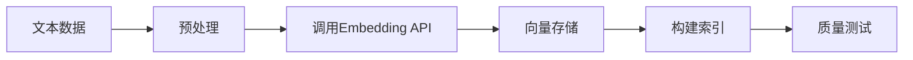

# 员工档案：EMP-023

## 基本信息

| 项目 | 内容 |
|-----|------|
| 员工ID | EMP-023 |
| 姓名 | 向量化专家 |
| 英文职位 | Embedding Specialist |
| 所属行业 | AI系统开发 |
| 创建日期 | 2026-03-13 |
| 当前状态 | 🟢 Active |
| 所属项目 | proj_004 - 预研孵化战略研究和投资团队构建 |
| 所属阶段 | Phase 2.4 - 知识库与RAG系统 |
| 团队角色 | Embedding Specialist |

---

## 核心职责

### 主要职责
1. **模型选择**: 选择和配置Embedding模型（text-embedding-3-large）
2. **向量化流程**: 实现文本向量化流程
3. **质量优化**: 优化向量维度和精度
4. **索引构建**: 建立向量索引

### 工作重点
- **Week 1**: 配置Embedding模型，向量化MVP数据集
- **Week 2-4**: 优化向量质量，批量处理完整数据集

---

## 技能矩阵

| 技能领域 | 具体技能 | 熟练度 |
|---------|---------|--------|
| Embedding | Embedding模型使用经验 | ⭐⭐⭐⭐⭐ |
| 算法理解 | 向量相似度算法（cosine/dot product） | ⭐⭐⭐⭐⭐ |
| 性能优化 | 性能优化能力 | ⭐⭐⭐⭐ |
| API使用 | OpenAI API使用经验 | ⭐⭐⭐⭐⭐ |
| 索引构建 | 向量索引构建 | ⭐⭐⭐⭐ |

---

## 关键输出物

### Phase 2.4 交付物
1. **向量化配置文档**
   - Embedding模型参数
   - 批处理策略
   - 错误处理机制

2. **向量索引**
   - 100条文档的向量表示（MVP）
   - 1000+条文档的向量表示（完整版）
   - 存储在向量数据库（FAISS/Qdrant）

3. **向量质量评估报告**
   - 相似度测试结果
   - 检索准确率评估
   - 优化建议

---

## 技术方案

### Embedding模型配置

```python
# 使用OpenAI text-embedding-3-large
model = "text-embedding-3-large"
dimensions = 1536  # 默认维度

# 批处理配置
batch_size = 100
max_retries = 3
timeout = 30
```

### 向量化流程



---

## 性能优化策略

### MVP阶段（Week 1）
- 单线程处理100条数据
- 基础错误重试机制
- 简单的向量索引

### 完善阶段（Week 2-4）
- 并行批处理（提升10x速度）
- 智能重试 + 降级策略
- 优化索引结构（HNSW算法）

---

## 向量质量评估

### 测试方法

| 测试类型 | 方法 | 目标 |
|---------|------|------|
| 语义相似度 | 人工标注相似文档对 | 相似度>0.8 |
| 检索准确率 | Top-5准确率测试 | >80% |
| 跨类别区分 | 不同类别文档相似度 | <0.5 |

### 质量指标

```yaml
质量标准:
  - 同类文档相似度: >0.7
  - 跨类文档相似度: <0.5
  - 检索Top-5准确率: >80%
  - 向量化延迟: <100ms/doc
```

---

## 协作关系

### 内部协作（2.4团队）
- **EMP-022（数据工程师）**: 接收清洗后的文本数据
- **EMP-024（RAG引擎工程师）**: 提供向量索引供检索使用
- **EMP-025（检索优化专家）**: 协作优化检索性能

### 外部协作
- **OpenAI API**: 调用Embedding服务

---

## 成本管理

### API成本估算

| 阶段 | 数据量 | Token数 | 成本 |
|-----|--------|---------|------|
| MVP | 100条 | ~50K tokens | ~$0.01 |
| 完整版 | 1000条 | ~500K tokens | ~$0.10 |
| 增量更新 | 100条/月 | ~50K tokens/月 | ~$0.01/月 |

**总预算**: $0.20（远低于项目总预算$1000-1500）

---

## 风险与应对

### 风险1: API限流
- **概率**: 30%
- **应对**: 实施指数退避重试，降低并发度

### 风险2: 向量质量不达标
- **概率**: 40%
- **应对**: 调整文本预处理策略，尝试不同模型

---

## 工作日志

### 2026-03-13
- ✅ 完成角色定义
- ✅ 加入proj_004团队
- ⏳ 准备配置Embedding环境

---

## 绩效指标

| 指标 | 目标 | 当前值 |
|-----|------|--------|
| MVP向量化完成 | 100条 | 0 |
| 向量质量评分 | >0.8 | - |
| 检索准确率 | >80% | - |
| 完整版向量化 | 1000+条 | 0 |

---

## 备注

- 向量质量是RAG系统的基础，需要充分测试
- MVP阶段重点验证技术可行性，完善阶段优化性能
- 需要与EMP-024紧密合作，确保向量索引符合检索需求

---

**档案状态**: ✅ 已激活
**最后更新**: 2026-03-13
