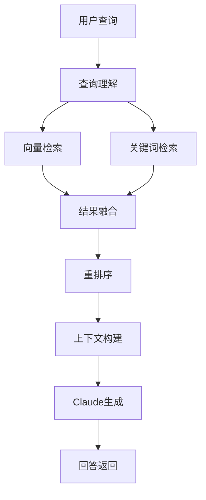

# 员工档案：EMP-024

## 基本信息

| 项目 | 内容 |
|-----|------|
| 员工ID | EMP-024 |
| 姓名 | RAG引擎工程师 |
| 英文职位 | RAG Engine Engineer |
| 所属行业 | AI系统开发 |
| 创建日期 | 2026-03-13 |
| 当前状态 | 🟢 Active |
| 所属项目 | proj_004 - 预研孵化战略研究和投资团队构建 |
| 所属阶段 | Phase 2.4 - 知识库与RAG系统 |
| 团队角色 | Core Engineer（核心工程师）|

---

## 核心职责

### 主要职责
1. **RAG引擎开发**: 实现RAG核心引擎（检索+生成）
2. **框架集成**: 集成LangChain/LangGraph框架
3. **混合检索**: 实现混合检索（向量+关键词）
4. **API开发**: 定义检索API接口

### 工作重点
- **Week 1**: 实现MVP版RAG（纯向量检索+简单生成）
- **Week 2-4**: 增加混合检索、重排序、上下文优化

---

## 技能矩阵

| 技能领域 | 具体技能 | 熟练度 |
|---------|---------|--------|
| LangChain | LangChain深度使用经验 | ⭐⭐⭐⭐⭐ |
| RAG架构 | RAG架构设计能力 | ⭐⭐⭐⭐⭐ |
| API设计 | API设计能力 | ⭐⭐⭐⭐ |
| Claude API | Claude API集成经验 | ⭐⭐⭐⭐⭐ |
| 混合检索 | 混合检索实现 | ⭐⭐⭐⭐ |

---

## 关键输出物

### Phase 2.4 交付物
1. **RAG引擎代码（Python）**
   - 检索模块
   - 生成模块
   - 混合检索模块
   - 重排序模块

2. **检索API服务**
   - `/api/v1/retrieve` - 检索相关文档
   - `/api/v1/generate` - 基于上下文生成回答

3. **RAG性能测试报告**
   - 延迟测试
   - 准确率测试
   - 并发测试

---

## 核心接口定义

### MVP版本（Week 1）

```python
def retrieve(query: str, top_k: int = 5) -> List[Document]:
    """
    检索相关文档（纯向量检索）

    Args:
        query: 查询文本
        top_k: 返回文档数量

    Returns:
        相关文档列表，按相似度排序
    """
    # 1. 向量化查询
    query_embedding = embed_text(query)

    # 2. 向量检索
    results = vector_db.search(query_embedding, top_k=top_k)

    # 3. 返回文档
    return results


def generate_with_context(query: str, context: List[Document]) -> str:
    """
    基于检索上下文生成回答

    Args:
        query: 用户问题
        context: 检索到的文档

    Returns:
        生成的回答
    """
    # 1. 构建Prompt
    prompt = build_rag_prompt(query, context)

    # 2. 调用Claude API
    response = claude_client.generate(prompt)

    # 3. 返回回答
    return response
```

### 完整版本（Week 2-4）

```python
def hybrid_retrieve(
    query: str,
    top_k: int = 5,
    vector_weight: float = 0.7,
    keyword_weight: float = 0.3
) -> List[Document]:
    """
    混合检索（向量+关键词）
    """
    # 1. 向量检索
    vector_results = vector_search(query, top_k=top_k*2)

    # 2. 关键词检索
    keyword_results = keyword_search(query, top_k=top_k*2)

    # 3. 融合排序
    merged_results = merge_and_rerank(
        vector_results, keyword_results,
        vector_weight, keyword_weight
    )

    return merged_results[:top_k]
```

---

## 技术架构

### RAG流程图



### LangChain集成

```python
from langchain.chains import RetrievalQA
from langchain.vectorstores import FAISS
from langchain.llms import Claude

# 构建RAG Chain
qa_chain = RetrievalQA.from_chain_type(
    llm=Claude(model="claude-opus-4-6"),
    chain_type="stuff",
    retriever=vector_store.as_retriever(search_kwargs={"k": 5})
)
```

---

## 性能目标

### MVP阶段（Week 1）

| 指标 | 目标 | 测试方法 |
|-----|------|---------|
| 检索延迟 | <1s | 100次查询平均 |
| 生成延迟 | <3s | 100次生成平均 |
| 检索准确率 | >60% | 人工评估 |
| API可用性 | 99% | 监控统计 |

### 完整版（Week 2-4）

| 指标 | 目标 | 测试方法 |
|-----|------|---------|
| 检索延迟 | <500ms | P95延迟 |
| 生成延迟 | <2s | P95延迟 |
| 检索准确率 | >80% | 人工评估 |
| API可用性 | 99.9% | 监控统计 |

---

## 协作关系

### 内部协作（2.4团队）
- **EMP-021（知识库架构师）**: 接收架构设计指导
- **EMP-023（向量化专家）**: 使用向量索引
- **EMP-025（检索优化专家）**: 协作优化性能
- **EMP-026（接口设计师）**: 共同定义API接口

### 外部协作
- **2.1/2.2/2.3团队**: 提供RAG服务，收集使用反馈

---

## 开发计划

### Week 1: MVP开发

**Day 1-2**: 基础框架搭建
- 初始化LangChain项目
- 集成向量数据库
- 实现基础检索

**Day 3-4**: RAG核心功能
- 实现retrieve函数
- 实现generate_with_context函数
- 集成Claude API

**Day 5**: 测试与优化
- 功能测试
- 性能基准测试
- Bug修复

### Week 2-4: 功能完善

- Week 2: 混合检索 + 重排序
- Week 3: 缓存系统 + 性能优化
- Week 4: 高级功能 + 文档完善

---

## 风险与应对

### 风险1: Claude API延迟高
- **概率**: 40%
- **应对**: 实施流式输出，优化Prompt长度

### 风险2: 检索准确率不达标
- **概率**: 50%
- **应对**: 调整top_k参数，实施重排序算法

### 风险3: 并发性能问题
- **概率**: 30%
- **应对**: 实施连接池，增加缓存

---

## 工作日志

### 2026-03-13
- ✅ 完成角色定义
- ✅ 加入proj_004团队
- ⏳ 准备搭建开发环境

---

## 绩效指标

| 指标 | 目标 | 当前值 |
|-----|------|--------|
| MVP功能完成度 | 100% | 0% |
| 检索延迟 | <1s | - |
| 检索准确率 | >60% | - |
| 代码测试覆盖率 | >80% | 0% |

---

## 备注

- 作为核心工程师，RAG引擎质量直接决定整个系统的效果
- MVP阶段重点保证功能可用，完善阶段优化性能和准确率
- 需要与EMP-026紧密合作，确保API接口设计合理

---

**档案状态**: ✅ 已激活
**最后更新**: 2026-03-13
