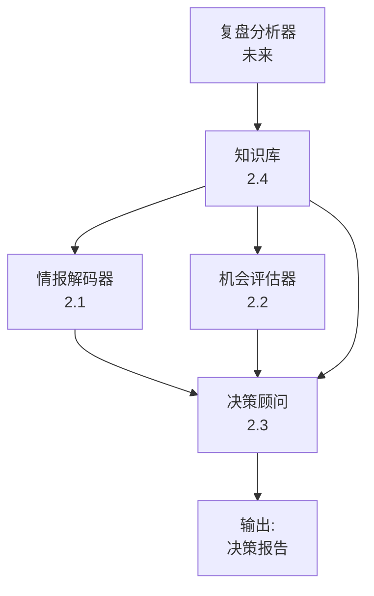

# 项目背景信息文档

**文档用途**: 项目交接、多窗口协作、AI切换时的上下文恢复
**最后更新**: 2026-03-13
**当前阶段**: Phase 2.4 开发中（MVP骨架已落地）
**项目状态**: 🟢 进行中

---

## 🧭 背景信息总入口（新AI接手必读）

`PROJECT_CONTEXT.md` 现在被定义为 `proj_004` 的**一站式交接入口**：它不仅记录当前阶段状态，还负责告诉新接手的 AI 去哪里看更完整的背景、历史和规范。

### 三类背景来源及优先级

新AI接手时，必须把项目资料分成三层理解，而不是只看单个文档：

#### 1. 当前执行状态（第一入口）
- 当前文件：`PROJECT_CONTEXT.md`
- 作用：快速理解**现在做到哪一步、当前处于哪个阶段、下一步准备做什么**
- 适合场景：窗口切换、短时间接手、判断近期优先级

#### 2. 工程背景与搭建规范（第二入口）
- 核心文档：[工程背景手册.md](f:/AIProjects/DesignAssistant/data-layer/projects/proj_004/工程背景手册.md)
- 作用：理解**为什么要做这个项目、项目如何分阶段搭建、有哪些工程规范与接手规则**
- 适合场景：需要系统性理解项目背景、规范、方法论和阶段衔接关系

#### 3. 原始历史资料（追溯入口）
- 原始会话记录：`background/*.jsonl`
- 提炼后的历史结论：`background/thoughts/*.txt`
- 团队方法论文档：`data-layer/knowledge/team/`
- 作用：用于追溯**原始需求、历史讨论过程、Claude 的前期推理痕迹、阶段性结论来源**
- 适合场景：当两份主文档仍无法解释“为什么这样设计”时，再回查原始资料

### `proj_004/context/` 本地入口层

为方便后续只围绕 `proj_004` 接手，而不需要一开始就在仓库根目录里寻找材料，现已在项目目录下增加本地入口层：

- [BACKGROUND_INDEX.md](f:/AIProjects/DesignAssistant/data-layer/projects/proj_004/context/BACKGROUND_INDEX.md)
- [SOURCE_MAP.md](f:/AIProjects/DesignAssistant/data-layer/projects/proj_004/context/SOURCE_MAP.md)

这一层的职责是：

- **不移动原始 `background/` 目录**
- **不复制整套背景资料**
- **只在 `proj_004` 下提供就近索引、阅读路径和问题到资料的映射**

因此，后续新AI接手时，可以先在 `proj_004/context/` 中快速判断“应该去哪里看什么”，再按需回查根目录下的原始材料。

### Claude 历史背景材料说明

之前工作的 Claude AI 已经在项目内留下两类重要材料：

- **整理后的正式背景总结**：即 [工程背景手册.md](f:/AIProjects/DesignAssistant/data-layer/projects/proj_004/工程背景手册.md)
- **更原始的历史会话与中间思考材料**：位于 `background/` 与 `background/thoughts/`

其中：

- `background/*.jsonl` 更接近**原始聊天记录导出**，包含 `role`、`sessionId`、模型信息、对话正文和上下文
- `background/thoughts/*.txt` 更接近**从聊天中提炼出的阶段结论、草稿和背景摘要**

因此，**要完整恢复背景，不能只读当前文件，也不能只读 thoughts，必须把状态文档、工程手册和历史材料结合起来看。**

### 新AI最小接手阅读顺序

建议任何新接手的 AI 严格按以下顺序读取：

1. `PROJECT_CONTEXT.md`
   - 先判断当前阶段、当前团队、当前里程碑和近期动作
2. [工程背景手册.md](f:/AIProjects/DesignAssistant/data-layer/projects/proj_004/工程背景手册.md)
   - 再理解项目定位、方法论、阶段衔接、工程规范和接手纪律
3. `proj_004/context/`
   - 先看 [BACKGROUND_INDEX.md](f:/AIProjects/DesignAssistant/data-layer/projects/proj_004/context/BACKGROUND_INDEX.md)，再按问题查 [SOURCE_MAP.md](f:/AIProjects/DesignAssistant/data-layer/projects/proj_004/context/SOURCE_MAP.md)
4. `data-layer/projects/proj_004/phase2_plan/` 下与当前子阶段对应的目标说明和角色文档
   - 如果当前在 2.4，就优先阅读 `phase2.4_目标说明.md` 与 `phase2_roles/phase2.4_roles.md`
5. `background/thoughts/`
   - 快速补足历史阶段结论
6. `background/*.jsonl`
   - 只在需要追溯原始上下文、需求原话、设计依据时再回查

### 资料冲突时的判断原则

如果不同文档之间出现表述差异，默认按以下优先级判断：

1. **最新的项目执行状态**：以 `PROJECT_CONTEXT.md` 为准
2. **项目背景、方法论、规范**：以 [工程背景手册.md](f:/AIProjects/DesignAssistant/data-layer/projects/proj_004/工程背景手册.md) 为准
3. **原始设计动机与历史讨论过程**：以 `background/` 与 `background/thoughts/` 为准

### 对新AI的明确要求

新接手的 AI 不应把本项目理解为“写几篇报告”，而应理解为：

- 一个用于**证明目标岗位能力**的工程化 AI Workflow 项目
- 一个采用**递归式数字团队构建**方法推进的多阶段系统
- 一个必须同时满足**可展示、可运行、可复用、可扩展**四个目标的作品
- 一个已经完成 Phase 1 和 Phase 2.0，并正在进入 Phase 2 执行阶段的真实工程

---

## 📋 项目概览

### 项目基本信息

| 项目属性 | 信息 |
|---------|------|
| 项目ID | proj_004 |
| 项目名称 | 游戏行业战略研究岗位数字员工团队 |
| 项目目标 | 构建AI驱动的游戏行业战略研究系统 |
| 项目类型 | 数字员工团队建设 + AI系统开发 |
| 开始日期 | 2026-03-13 |
| 预计工期 | 12周（Phase 1: 2周，Phase 2: 8周，Phase 3: 2周） |
| 当前进度 | Phase 1 ✅ 完成，Phase 2.0 ✅ 完成，Phase 2.4 🔄 开发中（MVP骨架已落地） |

### 核心业务场景

**问题**: 游戏行业战略研究需要：
- 持续追踪行业动态（新游戏、新技术、新趋势）
- 识别战略机会（投资、合作、技术引进）
- 提供决策建议（基于数据和范式分析）
- 复盘历史决策（学习和优化）

**解决方案**: 构建多Agent协作的AI系统
- 情报解码器：解析行业信息
- 机会评估器：识别战略机会
- 决策顾问：提供行动建议
- 知识库+RAG：提供历史经验支持

---

## 🏗️ 系统架构

### 核心模块



### 技术栈

| 层级 | 技术选型 | 说明 |
|-----|---------|------|
| AI模型 | Claude Opus 4.6 | 核心推理引擎 |
| Agent框架 | LangChain/LangGraph | 多Agent协作 |
| Embedding | text-embedding-3-large | 文本向量化 |
| 向量数据库 | Qdrant/Pinecone/FAISS | 知识检索 |
| 缓存 | Redis | 性能优化 |
| 语言 | Python 3.10+ | 主要开发语言 |
| 数据格式 | YAML + JSON | 知识库存储 |

---

## 👥 团队结构

### 已招募成员（20人）

#### Phase 1 核心团队（5人）
- **EMP-014**: 项目经理 - 整体协调
- **EMP-015**: 系统架构师 - 技术方案设计
- **EMP-016**: 需求分析师 - 业务需求梳理
- **EMP-017**: 质量保证专家 - 验收标准制定
- **EMP-018**: 团队规划师 - Phase 2团队设计

#### Phase 2.0 规划团队（1人）
- **EMP-019**: 系统架构师 - Phase 2总体规划
- **EMP-020**: 资源与风险管理专员 - 资源分配与风险管理

#### Phase 2.4 知识库与RAG团队（6人）
- **EMP-021**: 知识库架构师（Team Lead）
- **EMP-022**: 数据工程师
- **EMP-023**: 向量化专家
- **EMP-024**: RAG引擎工程师
- **EMP-025**: 检索优化专家
- **EMP-026**: 接口设计师

#### 待招募（Phase 2.1/2.2/2.3）
- Phase 2.1: 情报解码团队（6人）
- Phase 2.2: 机会评估团队（5人）
- Phase 2.3: 决策建议团队（5人）
- Phase 2.5: 集成测试团队（3人）

---

## 📂 项目文件结构

```
f:\AIProjects\DesignAssistant\
├── PROJECT_CONTEXT.md                    # 本文档
├── data-layer/
│   ├── employees/
│   │   ├── roster.json                   # 员工花名册
│   │   ├── EMP-014/ ~ EMP-026/          # 员工个人档案
│   │   └── ...
│   ├── projects/
│   │   ├── index.json                    # 项目索引
│   │   └── proj_004/                     # 本项目目录
│   │       ├── phase1_outputs/           # 阶段1交付物
│   │       │   ├── 阶段1工作计划.md
│   │       │   ├── 系统架构设计.md
│   │       │   ├── templates/            # 4个模板文件
│   │       │   └── acceptance_criteria/  # 验收标准
│   │       └── phase2_plan/              # 阶段2规划
│   │           ├── 阶段2团队构建方案.md
│   │           ├── phase2_roles/         # 各子阶段角色定义
│   │           │   ├── phase2.0_roles.md
│   │           │   └── phase2.4_roles.md
│   │           ├── phase2.0_目标说明.md
│   │           ├── phase2.5_目标说明.md
│   │           ├── 资源分配计划.md
│   │           ├── 时间表与里程碑.md
│   │           ├── 风险识别与应对方案.md
│   │           └── 子阶段依赖关系与并行策略.md
│   ├── knowledge/
│   │   └── team/
│   │       ├── 招聘团队工作流程.md       # 团队建设方法论
│   │       └── 岗位能力与流程规划.md     # 递归团队构建理论
│   └── templates/
│       └── tmpl_custom_002.json          # 自定义模板
```

---

## 🎯 阶段划分与进度

### Phase 0: 概念验证 ✅ 已完成
- 建立数字员工管理系统基础架构
- 验证递归团队构建理论

### Phase 1: 规划与设计 ✅ 已完成（2周）

**目标**: 完成系统设计和阶段2规划

**交付物**:
1. ✅ 阶段1工作计划
2. ✅ 系统架构设计（6大模块 + 4种协作模式）
3. ✅ 4个交付模板（评估报告、决策建议、工作日志、复盘报告）
4. ✅ 验收标准体系（质量评估矩阵 + 5维度评分）
5. ✅ 阶段2团队构建方案（递归分层设计）

**质量评分**: 全部 5.0/5.0

### Phase 2: 系统开发 🔄 进行中（8周）

#### Phase 2.0: 规划与协调 ✅ 已完成（1周）

**团队**: EMP-019（系统架构师）+ EMP-020（资源管理）

**交付物**:
1. ✅ 资源分配计划（人力、预算、时间）
2. ✅ 时间表与里程碑（8周详细计划）
3. ✅ 风险识别与应对方案（12个风险项）
4. ✅ 子阶段依赖关系与并行策略

**关键决策**:
- 采用MVP优先策略（先交付核心接口，再完善功能）
- 2.4先行（基础设施），2.1/2.2/2.3并行，2.5集成
- 支持多窗口并行开发（用户硬件: i7-13700H + 32GB RAM）

#### Phase 2.4: 知识库与RAG系统 🔄 开发中（4周）

**当前状态**: 团队已组建，MVP计划与初版代码骨架已完成，现已切换到“**执行轨推进**”阶段：一边继续补数据、联调与评测，一边通过正式的拍板文档冻结范围与契约。

**团队**: 6人（EMP-021~026，已完成招募并落库）
- EMP-021: 知识库架构师（Lead）
- EMP-022: 数据工程师
- EMP-023: 向量化专家
- EMP-024: RAG引擎工程师
- EMP-025: 检索优化专家
- EMP-026: 接口设计师

**当前已完成**:
- 2.4 目标说明、角色定义、MVP计划文档已完成
- `phase2.4_implementation/rag_system/` 初版代码骨架已创建
- 已实现纯向量检索、简单RAG生成、索引构建脚本
- 已提供 Flask API：`/api/v1/health`、`/api/v1/retrieve`、`/api/v1/generate`、`/api/v1/rag`、`/api/v1/documents`
- 已落入 3 份样本文档（`kb_001.yaml` ~ `kb_003.yaml`）用于结构验证
- 已补齐执行轨文档：`phase2.4_启动与拍板.md`、`phase2.4_进展与待拍板事项.md`
- 已建立本地背景入口层：`context/BACKGROUND_INDEX.md`、`context/SOURCE_MAP.md`

**MVP当前缺口**（Week 1 收尾重点）:
- 知识库规模从样本文档扩展到 MVP 目标规模（100条）
- 完成索引构建与接口联调，验证服务可运行闭环
- 输出稳定的接口契约文档，供 2.1/2.2/2.3 使用
- 建立基础评测样例与准确率/延迟基线
- 完成首轮用户拍板，冻结知识来源策略、最小字段与对外交付边界

**完整版方向**（Week 2-4）:
- 扩展到 1000+ 文档
- 升级为混合检索（向量+关键词）
- 增加缓存、过滤、重排与性能优化
- 面向下游分析模块完善结构化输出协议

**关键输出**:
- 检索与RAG API（供 2.1/2.2/2.3 使用）
- 接口规范文档
- 知识库数据集
- 初版可运行的 RAG 服务骨架
- `2.4` 执行轨文档（范围拍板 + 最新进展）

#### Phase 2.1: 情报解码模块 ⏳ 待启动（3周）
**依赖**: 2.4 MVP完成
**团队**: 6人（待招募）
**并行**: 可与2.2/2.3并行

#### Phase 2.2: 机会评估模块 ⏳ 待启动（3周）
**依赖**: 2.4 MVP完成
**团队**: 5人（待招募）
**并行**: 可与2.1/2.3并行

#### Phase 2.3: 决策建议模块 ⏳ 待启动（3周）
**依赖**: 2.4 MVP完成
**团队**: 5人（待招募）
**并行**: 可与2.1/2.2并行

#### Phase 2.5: 集成与验证 ⏳ 待启动（1周）
**依赖**: 2.1/2.2/2.3全部完成
**团队**: 3人（待招募）
**工作**: 系统集成、端到端测试、文档完善

### Phase 3: 试运行与优化 ⏳ 未开始（2周）
- 真实场景测试
- 性能调优
- 用户反馈收集

---

## 🔑 核心概念与方法论

### 递归团队构建模型（Team-in-Team）

**核心思想**:
- 复杂系统需要专业化分工
- 每个子系统由独立团队负责
- 团队可以递归分层（如2.1可再分2.1.1/2.1.2）

**三阶段流程**:
1. **Phase 0**: 定义岗位能力和流程
2. **Phase 1**: 规划设计和团队构建方案
3. **Phase 2**: 执行实施（可递归）

### 多Agent协作模式

| 模式 | 适用场景 | 示例 |
|-----|---------|------|
| 顺序协作 | 流水线处理 | 情报解码→机会评估→决策建议 |
| 并行协作 | 独立任务 | 多个情报源同时解析 |
| 辩论协作 | 需要多视角 | 乐观派vs保守派评估机会 |
| 投票协作 | 需要共识 | 多专家投票决定优先级 |

### MVP优先策略

**原则**:
- 先交付最小可用版本（核心功能+接口）
- 解除下游依赖（其他团队可开始工作）
- 并行完善功能（不阻塞整体进度）

**2.4 MVP示例**:
- Week 1: 交付基础检索API（100条数据，1s延迟）
- Week 2-4: 优化到1000+数据，500ms延迟（与2.1/2.2/2.3并行）

---

## 📊 关键指标与目标

### 系统性能指标

| 指标 | MVP目标 | 完整版目标 | 当前值 |
|-----|---------|-----------|--------|
| 知识库规模 | 100条 | 1000+条 | 3（样本文档已落地） |
| RAG检索延迟 | <1s | <500ms | 未正式测量 |
| 检索准确率 | >60% | >80% | 未正式测量 |
| API可用性 | 99% | 99.9% | 骨架已具备，未正式压测 |

### 项目管理指标

| 指标 | 目标 | 当前值 |
|-----|------|--------|
| 预算 | $1000-1500 | $0（尚未进入真实成本统计） |
| 工期 | 12周 | 3周已用 |
| 团队规模 | 峰值8人 | 当前13人（proj_004已招募） |
| 质量评分 | >4.5/5.0 | Phase 1: 5.0/5.0 |

---

## ⚠️ 关键风险

### 高危风险（需重点关注）

1. **R-T-001: RAG性能不达标**
   - 概率: 40%
   - 应对: 多级缓存 + 性能基准测试

2. **R-R-001: 关键人员时间冲突**
   - 概率: 70%
   - 应对: 提前规划时间分配 + 培养备份人员

3. **R-C-001: 子阶段接口不匹配**
   - 概率: 60%
   - 应对: 2.0阶段制定统一接口规范 + 每周对齐会议

详见: [风险识别与应对方案](data-layer/projects/proj_004/phase2_plan/风险识别与应对方案.md)

---

## 🔄 多窗口协作策略

### 硬件环境
- CPU: Intel i7-13700H（14核20线程）
- RAM: 32GB
- 显存: 8GB（不影响，使用云端API）
- **结论**: 完全支持4-5个Claude窗口并行

### 窗口分工建议

| 窗口 | 负责阶段 | 启动时间 | 状态 |
|-----|---------|---------|------|
| 窗口1（主控） | 2.4 知识库与RAG | Week 1 | 🔄 当前窗口 |
| 窗口2 | 2.1 情报解码 | Week 5（2.4 MVP后） | ⏳ 待启动 |
| 窗口3 | 2.2 机会评估 | Week 5 | ⏳ 待启动 |
| 窗口4 | 2.3 决策建议 | Week 5 | ⏳ 待启动 |
| 窗口5（主控） | 2.5 集成 | Week 8 | ⏳ 待启动 |

### 协作注意事项

**避免冲突**:
- 每个窗口负责独立子阶段
- 避免同时修改共享文件（roster.json, index.json）
- 定期同步：一个窗口完成后，其他窗口重新读取文件

**Git协作**:
- 每个窗口独立分支（如phase2.4-dev, phase2.1-dev）
- 完成后合并到master
- 提交前先pull最新代码

---

## 📚 重要文档索引

### 方法论文档
- [招聘团队工作流程](data-layer/knowledge/team/招聘团队工作流程.md) - 团队建设标准流程
- [岗位能力与流程规划](data-layer/knowledge/team/岗位能力与流程规划.md) - 递归团队理论

### Phase 1交付物
- [阶段1工作计划](data-layer/projects/proj_004/phase1_outputs/阶段1工作计划.md)
- [系统架构设计](data-layer/projects/proj_004/phase1_outputs/系统架构设计.md)
- [质量评估矩阵](data-layer/projects/proj_004/phase1_outputs/acceptance_criteria/质量评估矩阵.md)

### Phase 2规划文档
- [阶段2团队构建方案](data-layer/projects/proj_004/phase2_plan/阶段2团队构建方案.md) - 总体规划
- [资源分配计划](data-layer/projects/proj_004/phase2_plan/资源分配计划.md)
- [时间表与里程碑](data-layer/projects/proj_004/phase2_plan/时间表与里程碑.md)
- [风险识别与应对方案](data-layer/projects/proj_004/phase2_plan/风险识别与应对方案.md)
- [子阶段依赖关系与并行策略](data-layer/projects/proj_004/phase2_plan/子阶段依赖关系与并行策略.md)
- [双端协作与用户拍板规范](data-layer/projects/proj_004/phase2_plan/双端协作与用户拍板规范.md)
- [模块思维训练模板](data-layer/projects/proj_004/phase2_plan/模块思维训练模板.md)
- [模块启动拷问与拍板模板](data-layer/projects/proj_004/phase2_plan/模块启动拷问与拍板模板.md)
- [模块启动与拍板模板](data-layer/projects/proj_004/phase2_plan/模块启动与拍板模板.md)
- [Phase 2.4 启动与拍板](data-layer/projects/proj_004/phase2_plan/phase2.4_启动与拍板.md)
- [Phase 2.4 进展与待拍板事项](data-layer/projects/proj_004/phase2_plan/phase2.4_进展与待拍板事项.md)

### 角色定义文档
- [Phase 2.0角色](data-layer/projects/proj_004/phase2_plan/phase2_roles/phase2.0_roles.md)
- [Phase 2.4角色](data-layer/projects/proj_004/phase2_plan/phase2_roles/phase2.4_roles.md)

### 本地背景入口层
- [BACKGROUND_INDEX](data-layer/projects/proj_004/context/BACKGROUND_INDEX.md)
- [SOURCE_MAP](data-layer/projects/proj_004/context/SOURCE_MAP.md)

---

## 🎬 下一步行动

### 立即行动（本窗口）
1. ✅ 创建本背景文档
2. ⏳ 创建EMP-021~026员工档案
3. ⏳ 制定2.4 MVP详细计划
4. ⏳ 开始2.4 Week 1开发（知识库架构+基础RAG）

### 近期计划（1-2周）
- Week 1结束: 交付2.4 MVP（核心API接口）
- Week 2开始: 启动2.1/2.2/2.3（多窗口并行）

### 中期计划（3-8周）
- Week 2-4: 完善2.4功能
- Week 5-7: 并行开发2.1/2.2/2.3
- Week 8: 2.5系统集成

---

## 💡 AI切换/交接指南

### 如何快速上手

1. **阅读本文档**（5分钟）
   - 了解项目目标、架构、进度

2. **查看当前阶段文档**（10分钟）
   - 如果接手2.4: 阅读 [phase2.4_roles.md](data-layer/projects/proj_004/phase2_plan/phase2_roles/phase2.4_roles.md)
   - 如果接手其他阶段: 阅读对应角色文档

3. **检查文件结构**（5分钟）
   - 浏览 data-layer/projects/proj_004/ 目录
   - 确认已有哪些文件，缺少哪些文件

4. **查看待办事项**（2分钟）
   - 询问用户当前todo list
   - 确认优先级

### 常见问题

**Q: 如何知道当前进度？**
A: 查看本文档"阶段划分与进度"章节，标记为🔄的是当前阶段

**Q: 如何找到某个员工的信息？**
A: 查看 data-layer/employees/roster.json，然后进入对应EMP-XXX目录

**Q: 如何理解递归团队构建？**
A: 阅读 data-layer/knowledge/team/岗位能力与流程规划.md

**Q: 多窗口协作时如何避免冲突？**
A: 查看本文档"多窗口协作策略"章节

---

## 📝 更新日志

| 日期 | 更新内容 | 更新人 |
|-----|---------|--------|
| 2026-03-13 | 创建项目背景文档 | Claude (窗口1) |
| 2026-03-13 | 完成Phase 2.0规划 | Claude (窗口1) |
| 2026-03-13 | 启动Phase 2.4 | Claude (窗口1) |

---

**文档维护说明**:
- 每个重要里程碑后更新本文档
- 多窗口协作时，完成工作后更新"阶段划分与进度"
- 新增重要文档后，更新"重要文档索引"
- 遇到重大风险或变更，更新"关键风险"章节

---

**快速链接**:
- 📂 [项目根目录](.)
- 👥 [员工花名册](data-layer/employees/roster.json)
- 📋 [项目索引](data-layer/projects/index.json)
- 🎯 [Phase 1交付物](data-layer/projects/proj_004/phase1_outputs/)
- 🚀 [Phase 2规划](data-layer/projects/proj_004/phase2_plan/)

---

**文档状态**: ✅ 已完成
**版本**: v1.0
**下次更新**: 2.4 MVP完成后（预计2026-03-20）
