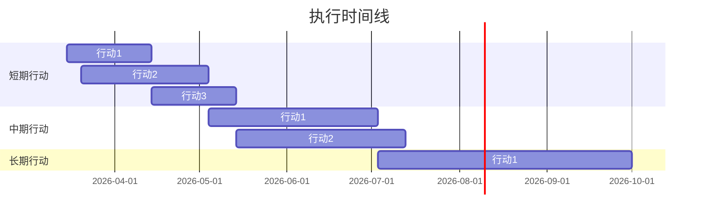
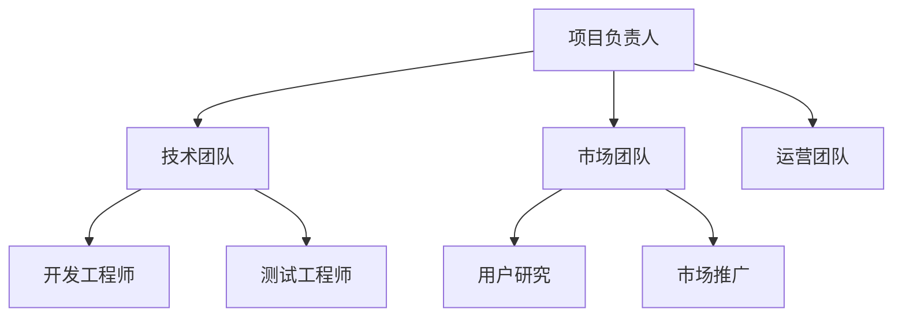

# 决策建议报告

> **模板版本**：v1.0
> **适用场景**：基于机会评估结果，提供可执行的决策建议
> **输出模块**：决策建议模块

---

## 基本信息

| 字段 | 内容 |
|------|------|
| **建议ID** | [自动生成，如 DEC-2026-001] |
| **关联评估** | [对应的评估报告ID，如 OPP-2026-001] |
| **建议日期** | [YYYY-MM-DD] |
| **建议人** | [负责人/团队] |
| **决策期限** | [建议在何时前做出决策] |

---

## 1. 执行摘要

### 1.1 核心建议

**一句话建议**：[用一句话说明建议采取什么行动]

**建议类型**：
- [ ] 立即投资/启动
- [ ] 深度调研后决策
- [ ] 小规模试点验证
- [ ] 持续观察，暂不行动
- [ ] 明确放弃

### 1.2 关键理由（Top 3）

1. **[理由1]**：[简要说明]
2. **[理由2]**：[简要说明]
3. **[理由3]**：[简要说明]

### 1.3 预期成果

**如果采纳本建议，预期在 [X个月] 内实现**：
- [成果1]
- [成果2]
- [成果3]

---

## 2. 执行路径

### 2.1 短期行动（1-3个月）

#### 行动1：[行动名称]
- **目标**：[要达成什么目标？]
- **具体步骤**：
  1. [步骤1]
  2. [步骤2]
  3. [步骤3]
- **负责人**：[谁来负责？]
- **交付物**：[产出什么？]
- **验收标准**：[如何判断完成？]
- **时间节点**：[Week X]

#### 行动2：[行动名称]
- **目标**：[...]
- **具体步骤**：[...]
- **负责人**：[...]
- **交付物**：[...]
- **验收标准**：[...]
- **时间节点**：[Week X]

#### 行动3：[行动名称]
- **目标**：[...]
- **具体步骤**：[...]
- **负责人**：[...]
- **交付物**：[...]
- **验收标准**：[...]
- **时间节点**：[Week X]

### 2.2 中期行动（3-6个月）

#### 行动1：[行动名称]
- **前置依赖**：[依赖短期哪些行动完成？]
- **目标**：[...]
- **具体步骤**：[...]
- **负责人**：[...]
- **交付物**：[...]
- **验收标准**：[...]
- **时间节点**：[Month X]

#### 行动2：[行动名称]
- **前置依赖**：[...]
- **目标**：[...]
- **具体步骤**：[...]
- **负责人**：[...]
- **交付物**：[...]
- **验收标准**：[...]
- **时间节点**：[Month X]

### 2.3 长期行动（6-12个月）

#### 行动1：[行动名称]
- **前置依赖**：[...]
- **目标**：[...]
- **具体步骤**：[...]
- **负责人**：[...]
- **交付物**：[...]
- **验收标准**：[...]
- **时间节点**：[Month X]

---

## 3. 资源配置

### 3.1 人力资源

| 角色 | 人数 | 技能要求 | 投入时间 | 招聘/内部 |
|------|------|---------|---------|----------|
| [角色1] | X人 | [技能要求] | [X%时间/全职] | [招聘/内部调配] |
| [角色2] | X人 | [技能要求] | [X%时间/全职] | [招聘/内部调配] |
| [角色3] | X人 | [技能要求] | [X%时间/全职] | [招聘/内部调配] |

**总人力需求**：[X人·月]

### 3.2 资金预算

| 项目 | 金额 | 说明 |
|------|------|------|
| 人力成本 | $XXX,XXX | [X人 × X个月 × $X/月] |
| 技术成本 | $XX,XXX | [服务器、API调用、工具订阅] |
| 市场调研 | $XX,XXX | [用户访谈、数据采购] |
| 试点运营 | $XX,XXX | [小规模测试成本] |
| 应急储备 | $XX,XXX | [10-20%预算作为缓冲] |
| **总预算** | **$XXX,XXX** | - |

### 3.3 时间投入

---

## 4. 关键里程碑

### 4.1 验证点（Validation Checkpoints）

#### 验证点1：[名称]
- **时间**：[Week/Month X]
- **验证内容**：[验证什么核心假设？]
- **验证方式**：[如何验证？数据/实验/用户反馈]
- **通过标准**：[什么情况算通过？]
- **失败应对**：[如果不通过怎么办？]

#### 验证点2：[名称]
- **时间**：[...]
- **验证内容**：[...]
- **验证方式**：[...]
- **通过标准**：[...]
- **失败应对**：[...]

### 4.2 决策点（Decision Points）

#### 决策点1：Go/No-Go 决策
- **时间**：[Month X]
- **决策问题**：[是否继续投入？]
- **决策依据**：
  - ✅ [条件1达成]
  - ✅ [条件2达成]
  - ✅ [条件3达成]
- **Go 路径**：[如果继续，下一步做什么？]
- **No-Go 路径**：[如果停止，如何退出？]

#### 决策点2：规模化决策
- **时间**：[Month X]
- **决策问题**：[是否扩大规模？]
- **决策依据**：[...]
- **Go 路径**：[...]
- **No-Go 路径**：[...]

### 4.3 交付点（Delivery Milestones）

| 里程碑 | 时间 | 交付物 | 验收标准 |
|--------|------|--------|---------|
| M1 | Week X | [交付物名称] | [验收标准] |
| M2 | Month X | [交付物名称] | [验收标准] |
| M3 | Month X | [交付物名称] | [验收标准] |

---

## 5. 风险预警与应对

### 5.1 关键风险监控

| 风险 | 监控指标 | 预警阈值 | 应对方案 | 负责人 |
|------|---------|---------|---------|--------|
| [风险1] | [如：成本超支] | [超预算20%] | [削减非核心功能] | [姓名] |
| [风险2] | [如：进度延迟] | [延迟超2周] | [增加人力/调整范围] | [姓名] |
| [风险3] | [如：用户不买单] | [转化率<5%] | [调整产品方向/暂停] | [姓名] |

### 5.2 应急预案

#### 场景1：[最坏情况描述]
- **触发条件**：[什么情况下触发？]
- **应对措施**：
  1. [措施1]
  2. [措施2]
  3. [措施3]
- **退出策略**：[如何止损？]

#### 场景2：[次坏情况描述]
- **触发条件**：[...]
- **应对措施**：[...]
- **退出策略**：[...]

---

## 6. 成功指标（KPIs）

### 6.1 短期指标（1-3个月）

| 指标 | 目标值 | 当前值 | 达成率 | 备注 |
|------|--------|--------|--------|------|
| [指标1] | [目标] | [当前] | [X%] | [说明] |
| [指标2] | [目标] | [当前] | [X%] | [说明] |
| [指标3] | [目标] | [当前] | [X%] | [说明] |

### 6.2 中期指标（3-6个月）

| 指标 | 目标值 | 备注 |
|------|--------|------|
| [指标1] | [目标] | [说明] |
| [指标2] | [目标] | [说明] |

### 6.3 长期指标（6-12个月）

| 指标 | 目标值 | 备注 |
|------|--------|------|
| [指标1] | [目标] | [说明] |
| [指标2] | [目标] | [说明] |

---

## 7. 协作与沟通

### 7.1 团队结构

### 7.2 沟通机制

| 会议类型 | 频率 | 参与人 | 议题 |
|---------|------|--------|------|
| 周例会 | 每周一 | 全员 | 进度同步、问题讨论 |
| 月度复盘 | 每月末 | 核心团队 | 目标达成、经验总结 |
| 决策会议 | 按需 | 决策层 | 重大决策讨论 |

### 7.3 汇报机制

- **日报**：[谁向谁汇报？汇报什么？]
- **周报**：[...]
- **月报**：[...]

---

## 8. 退出策略

### 8.1 退出触发条件

**满足以下任一条件时，建议考虑退出**：
- [ ] [条件1：如核心假设被证伪]
- [ ] [条件2：如成本超预算50%]
- [ ] [条件3：如市场窗口关闭]
- [ ] [条件4：如出现更优机会]

### 8.2 退出方式

**优雅退出**：
1. [步骤1：如完成当前里程碑]
2. [步骤2：如整理文档和资产]
3. [步骤3：如团队转岗安排]

**紧急退出**：
1. [步骤1：如立即停止投入]
2. [步骤2：如资产处置]
3. [步骤3：如复盘总结]

### 8.3 经验沉淀

**无论成功或失败，都要记录**：
- 什么做对了？
- 什么做错了？
- 下次如何改进？

---

## 9. 附录

### 9.1 相关文档
- [评估报告：OPP-2026-001]
- [技术方案：...]
- [市场调研：...]

### 9.2 决策依据
- [数据来源1]
- [数据来源2]
- [专家意见]

### 9.3 更新记录

| 日期 | 版本 | 更新内容 | 更新人 |
|------|------|---------|--------|
| YYYY-MM-DD | v1.0 | 初始版本 | [姓名] |
| YYYY-MM-DD | v1.1 | [更新内容] | [姓名] |

---

## 使用说明

### 填写指南
1. **执行摘要**：给决策者快速了解核心建议
2. **执行路径**：具体到可执行的步骤，避免空泛
3. **资源配置**：实事求是，不要低估成本
4. **关键里程碑**：设置验证点和决策点，避免盲目推进
5. **风险预警**：提前识别风险，准备应对方案
6. **退出策略**：明确退出条件，避免沉没成本陷阱

### 输出要求
- 报告长度：4-6页（A4）
- 语言风格：清晰、可执行、有时间节点
- 结论明确：给出明确的行动建议和资源需求

---

📌 **本模板由 EMP-016 设计，基于系统架构中的"决策建议模块"输出规范。**
