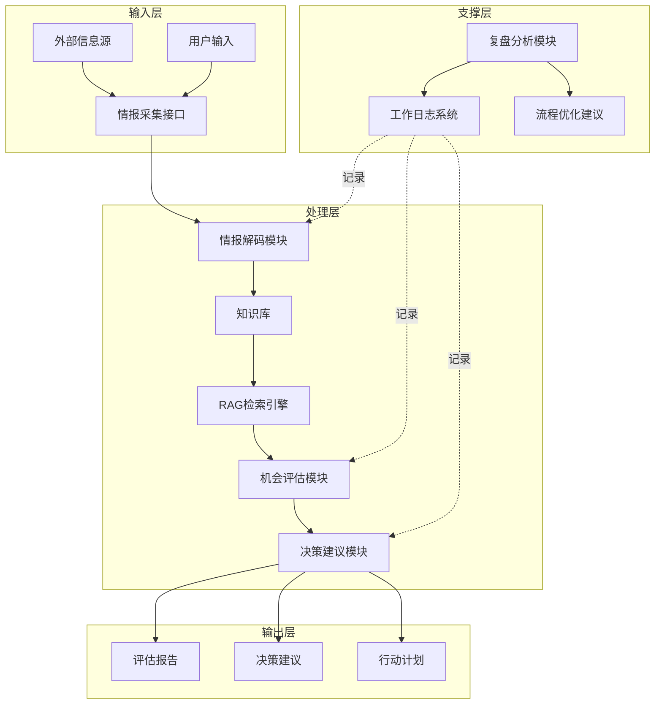
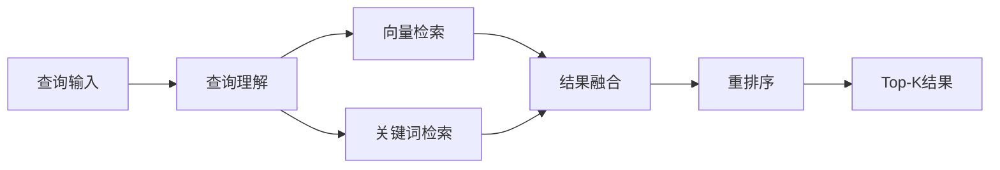
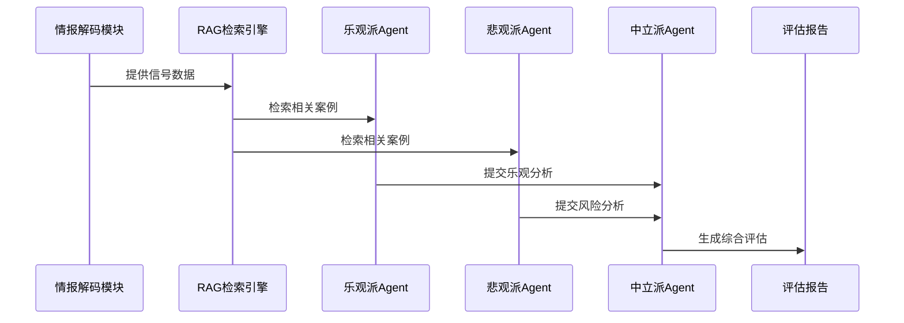
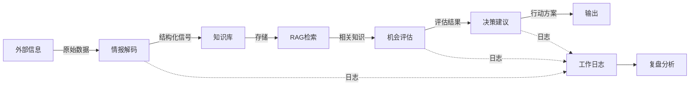

# AI 工作流系统架构设计

> **设计者**：EMP-015 阶段1协作架构师
> **设计时间**：2026-03-12
> **项目**：预研孵化战略研究和投资团队构建（proj_004）
> **版本**：v0.1（初稿）

---

## 1. 系统整体架构

### 1.1 架构概览

本系统采用**多 Agent 协作 + 知识库 + RAG + 决策流**的架构，实现"情报→判断→决策→执行→复盘"的完整闭环。



### 1.2 核心设计原则

1. **模块化**：每个模块职责单一，可独立测试和迭代
2. **可观测**：所有关键节点记录日志，支持复盘分析
3. **可复用**：模块设计通用化，可应用于不同场景
4. **可扩展**：支持新增模块和 Agent，不影响现有流程

---

## 2. 核心模块设计

### 2.1 情报解码模块（Intelligence Decoder）

#### 职责
将非结构化信息（新闻、报告、公告）转化为结构化的"范式信号"。

#### 输入
- 外部信息源：行业新闻、融资公告、产品发布、技术突破
- 用户输入：特定项目/团队/机会描述

#### 处理流程
1. **信息提取**：识别关键实体（公司、产品、技术、团队）
2. **信号分类**：
   - 技术信号（新技术应用、技术突破）
   - 市场信号（用户需求变化、市场规模）
   - 团队信号（核心成员、组织能力）
   - 资本信号（融资、估值、投资方）
3. **信号量化**：为每个信号打分（强度、可信度、时效性）

#### 输出
```json
{
  "source": "信息来源",
  "timestamp": "2026-03-12T10:00:00Z",
  "signals": [
    {
      "type": "技术信号",
      "category": "AI应用",
      "description": "某团队将LLM应用于游戏NPC对话",
      "strength": 8,
      "confidence": 7,
      "timeliness": 9
    }
  ],
  "entities": {
    "company": "公司名",
    "product": "产品名",
    "technology": ["技术1", "技术2"]
  }
}
```

#### Agent 设计
- **Agent 类型**：单一 Agent（专注信息结构化）
- **Prompt 策略**：Few-shot learning + 结构化输出模板
- **知识库依赖**：行业术语库、信号分类标准

---

### 2.2 知识库系统（Knowledge Base）

#### 职责
存储和管理项目所需的各类知识，支持 RAG 检索。

#### 知识库结构
```
knowledge_base/
├── industry_intelligence/      # 行业情报
│   ├── news/                   # 新闻动态
│   ├── reports/                # 研究报告
│   └── trends/                 # 趋势分析
├── case_library/               # 案例库
│   ├── success_cases/          # 成功案例
│   ├── failure_cases/          # 失败案例
│   └── paradigm_shifts/        # 范式转移案例
├── methodology/                # 方法论库
│   ├── evaluation_frameworks/  # 评估框架
│   ├── decision_models/        # 决策模型
│   └── risk_matrices/          # 风险矩阵
└── team_profiles/              # 团队画像
    ├── founders/               # 创始人背景
    ├── capabilities/           # 团队能力
    └── track_records/          # 历史记录
```

#### 数据格式
- **文档格式**：Markdown + YAML 元数据
- **向量化**：使用 embedding 模型（如 text-embedding-3-large）
- **索引策略**：向量索引 + 关键词索引 + 元数据过滤

#### 更新机制
- **增量更新**：新信息自动入库
- **版本管理**：保留历史版本，支持回溯
- **质量控制**：人工审核 + 自动去重

---

### 2.3 RAG 检索引擎（RAG Retrieval Engine）

#### 职责
根据查询需求，从知识库中检索相关信息，支持后续分析。

#### 检索策略
1. **向量检索**：基于语义相似度
   - 查询向量化
   - 余弦相似度计算
   - Top-K 召回

2. **关键词检索**：基于精确匹配
   - BM25 算法
   - 实体匹配
   - 时间范围过滤

3. **混合检索**：结合向量和关键词
   - 加权融合（向量 0.7 + 关键词 0.3）
   - 重排序（Reranker）

#### 检索流程


#### 输出
```json
{
  "query": "AI驱动的游戏NPC对话系统",
  "results": [
    {
      "doc_id": "case_001",
      "title": "某游戏公司的AI NPC实践",
      "content": "...",
      "score": 0.89,
      "source": "case_library/success_cases/",
      "metadata": {
        "date": "2025-11-20",
        "category": "AI应用"
      }
    }
  ]
}
```

---

### 2.4 机会评估模块（Opportunity Evaluator）

#### 职责
基于第一性原理，分析机会的本质、风险和潜力。

#### 评估框架
1. **范式转移判断**
   - 是否改变了游戏规则？
   - 是否创造了新的价值网络？
   - 是否具备不可逆性？

2. **风险假设构建**
   - 核心假设是什么？
   - 如何验证这些假设？
   - 假设失败的后果？

3. **机会评级**
   - 市场潜力（1-10分）
   - 技术可行性（1-10分）
   - 团队能力（1-10分）
   - 时间窗口（1-10分）

#### Agent 协作模式
采用**多 Agent 辩论模式**：
- **乐观派 Agent**：挖掘机会亮点
- **悲观派 Agent**：识别潜在风险
- **中立派 Agent**：综合双方观点，给出平衡评估

#### 处理流程


#### 输出
```json
{
  "opportunity_id": "opp_001",
  "title": "AI驱动的游戏NPC对话系统",
  "paradigm_shift_score": 8,
  "ratings": {
    "market_potential": 9,
    "technical_feasibility": 7,
    "team_capability": 8,
    "time_window": 6
  },
  "core_assumptions": [
    "玩家愿意为更真实的NPC对话付费",
    "LLM成本可控制在可接受范围"
  ],
  "risks": [
    "技术成熟度不足",
    "监管政策不确定"
  ],
  "recommendation": "建议深度调研，小规模试点"
}
```

---

### 2.5 决策建议模块（Decision Advisor）

#### 职责
将评估结果转化为可执行的行动方案。

#### 输出内容
1. **执行路径**
   - 短期行动（1-3个月）
   - 中期行动（3-6个月）
   - 长期行动（6-12个月）

2. **资源配置**
   - 人力需求
   - 资金预算
   - 时间投入

3. **关键里程碑**
   - 验证点（何时验证核心假设）
   - 决策点（何时做 Go/No-Go 决策）
   - 交付点（何时交付阶段性成果）

4. **风险预警**
   - 潜在问题
   - 应对方案
   - 退出策略

#### Agent 设计
- **Agent 类型**：单一 Agent（专注决策建议）
- **Prompt 策略**：Chain-of-Thought + 结构化输出
- **知识库依赖**：决策模型库、历史案例库

---

### 2.6 复盘分析模块（Retrospective Analyzer）

#### 职责
分析工作日志，评估流程有效性，提出优化建议。

#### 分析维度
1. **效率分析**
   - 各环节耗时
   - 瓶颈识别
   - 优化空间

2. **质量分析**
   - 输出准确性
   - 信息完整性
   - 决策合理性

3. **协作分析**
   - Agent 协作效果
   - 信息传递效率
   - 冲突解决机制

#### 输出
- 复盘报告（每周/每月）
- 流程优化建议
- 下一阶段改进计划

---

## 3. 数据流与接口设计

### 3.1 模块间数据流



### 3.2 接口规范

#### 标准输入格式
```json
{
  "request_id": "唯一请求ID",
  "timestamp": "时间戳",
  "module": "模块名称",
  "input_data": {
    // 模块特定输入
  },
  "context": {
    "user_id": "用户ID",
    "session_id": "会话ID"
  }
}
```

#### 标准输出格式
```json
{
  "request_id": "对应请求ID",
  "timestamp": "时间戳",
  "module": "模块名称",
  "status": "success/error",
  "output_data": {
    // 模块特定输出
  },
  "metadata": {
    "processing_time": "处理时长（ms）",
    "tokens_used": "Token消耗"
  }
}
```

---

## 4. Agent 协作模式

### 4.1 串行模式（Sequential）
适用于：信息处理流程（情报→评估→决策）

```
Agent A → Agent B → Agent C
```

### 4.2 并行模式（Parallel）
适用于：多维度分析（市场分析 + 技术分析 + 团队分析）

```
        ┌─ Agent A ─┐
Input ──┼─ Agent B ─┼── Aggregator → Output
        └─ Agent C ─┘
```

### 4.3 辩论模式（Debate）
适用于：机会评估（乐观派 vs 悲观派）

```
Agent A (乐观) ──┐
                 ├─→ Agent C (中立) → Output
Agent B (悲观) ──┘
```

### 4.4 投票模式（Voting）
适用于：决策验证（多个 Agent 投票）

```
Agent A ──┐
Agent B ──┼─→ Voting Mechanism → Output
Agent C ──┘
```

---

## 5. 技术栈建议

### 5.1 核心技术
- **LLM**：Claude Opus 4.6（主要推理）+ Sonnet 4.6（辅助任务）
- **Embedding**：text-embedding-3-large
- **向量数据库**：Qdrant / Pinecone / Weaviate
- **知识库**：Markdown + Git（版本管理）

### 5.2 开发框架
- **Agent 框架**：LangChain / LlamaIndex / AutoGen
- **工作流编排**：LangGraph / Prefect
- **日志系统**：Structured Logging（JSON格式）

### 5.3 部署方案
- **本地开发**：Docker Compose
- **生产环境**：Kubernetes（可选）
- **监控**：Prometheus + Grafana

---

## 6. 实现路线图

### Phase 1：核心流程（MVP）
- 情报解码模块（基础版）
- 简单知识库（文件系统）
- 机会评估模块（单 Agent）
- 决策建议模块（模板化）

### Phase 2：增强功能
- RAG 检索引擎
- 多 Agent 辩论模式
- 工作日志系统

### Phase 3：优化迭代
- 复盘分析模块
- 流程自动化
- 性能优化

---

## 7. 关键设计决策

### 7.1 为什么选择多 Agent 架构？
- **专业化**：每个 Agent 专注特定任务，提高输出质量
- **可观测**：每个 Agent 的输入输出可独立追踪
- **可迭代**：可单独优化某个 Agent 而不影响整体

### 7.2 为什么使用 RAG 而非纯 LLM？
- **知识时效性**：RAG 可实时更新知识库
- **可解释性**：可追溯信息来源
- **成本控制**：减少 LLM 幻觉，降低 Token 消耗

### 7.3 为什么需要工作日志系统？
- **复盘分析**：了解流程瓶颈
- **质量保证**：追踪决策依据
- **持续改进**：数据驱动优化

---

## 8. 下一步工作

### 8.1 待 EMP-016 完成
- 基于本架构设计交付物模板
- 确保模板与模块输出格式对齐

### 8.2 待 EMP-017 完成
- 制定各模块的验收标准
- 设计测试用例

### 8.3 待 EMP-018 完成
- 基于本架构定义阶段2团队角色
- 每个模块对应至少一个数字员工

---

📌 **本文档为系统架构初稿（v0.1），待团队审查后进入 v0.2 修订版。**
