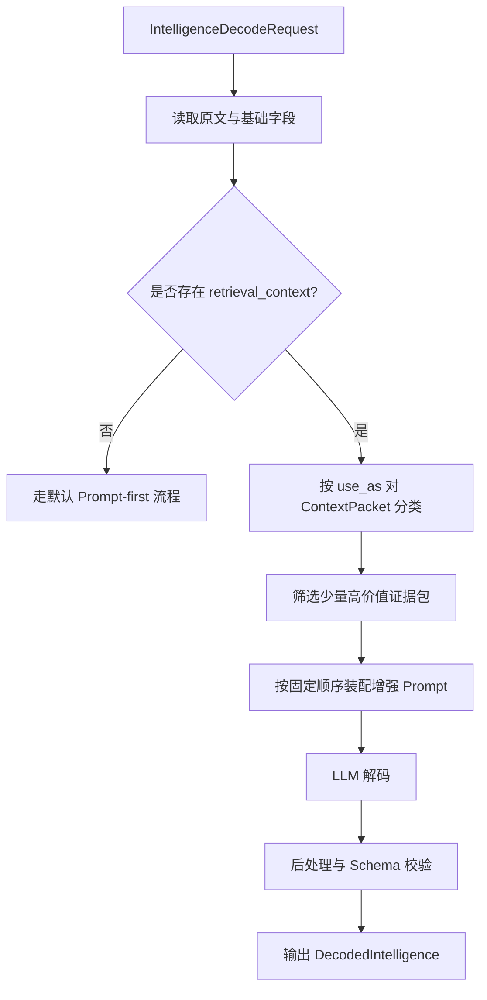

# Phase 2.1 消费 Phase 2.4 ContextPacket 的设计草案

**文档类型**: 联调设计草案 / 下游消费设计文档  
**适用模块**: `Phase 2.1` 情报解码模块  
**关联上游**: `Phase 2.4` 证据级上下文供应层  
**归档位置**: `proj_004 / phase2.1_implementation / docs`  
**归档时间**: 2026-03-14  
**状态**: Draft v0.1（用于后续协议收口与实现准备）

---

## 一、为什么 `2.1` 需要这份文档

当前 [schemas.py](f:\AIProjects\DesignAssistant\data-layer\projects\proj_004\phase2.1_implementation\schemas.py) 已经为请求对象预留了 `retrieval_context` 字段，当前定义为：

> `来自 2.4 的补充上下文`

这说明 `2.1` 在设计上已经预见到：

- 仅靠原文和固定 few-shot，并不一定足够
- 某些术语、边界、规则和历史样例，需要来自 `2.4` 的动态支持
- `2.1` 未来会是一个“本地解码能力 + 外部证据增强”的模块

但到目前为止，这个字段仍然更像一个“预留接口”，还没有收口成真正可消费的设计。

因此，这份文档的目的是回答：

> **当 `2.4` 开始以 `ContextPacket` 形式向 `2.1` 交付证据包时，`2.1` 到底该怎么接、怎么用、怎么避免被噪音反向污染？**

---

## 二、先说结论：`2.1` 不该把 `2.4` 当外挂问答器

这是最重要的前置原则。

`2.1` 使用 `2.4` 的方式，不应该是：

- 让 `2.4` 直接告诉 `2.1` 最终信号是什么
- 让 `2.4` 替 `2.1` 做分类结论
- 让 `2.4` 输出一大段自然语言解释，然后 `2.1` 自己再猜

更合理的关系应该是：

> **`2.4` 提供证据级上下文，`2.1` 仍然对最终结构化信号负责。**

也就是说：

- `2.4` 负责补术语、补规则、补样例、补边界
- `2.1` 负责读原文、结合证据、输出 `Signal`

这样才能保持模块边界清晰，错误也更容易诊断。

---

## 三、`2.1` 真正需要 `2.4` 补什么

结合 `2.1` 当前职责和岗位本质，`2.1` 对 `2.4` 的需求不是泛知识，而是下列几类“能降低误判率”的证据：

### 3.1 术语消歧

适用场景：

- 原文包含行业黑话、技术路线、发行术语、商业模式术语
- 模型容易把表述理解偏
- 某些短语在游戏行业语境下含义特殊

对 `2.1` 的帮助：

- 更稳定判断 `signal_type`
- 更稳定生成 `signal_label`
- 降低技术/市场/团队信号之间的误分

### 3.2 高质量 few-shot 样例

适用场景：

- 原文结构复杂，但和历史某类样例相似
- 需要帮助模型学习“哪些句子值得抽成信号”
- 需要帮助模型学习高质量标签命名方式

对 `2.1` 的帮助：

- 提升 `signal_label` 一致性
- 提升 `description` 的结构化程度
- 减少相同类型信号的命名漂移

### 3.3 分类与评分约束

适用场景：

- 原文模糊，信号边界不清晰
- 评分容易漂移
- 某些说法常常导致过度脑补

对 `2.1` 的帮助：

- 控制 `confidence_score`
- 帮助保持 `intensity_score` 和 `timeliness_score` 口径一致
- 抑制“营销稿也抽成 market 信号”之类的问题

### 3.4 边界反例

适用场景：

- 某类文本看起来像信号，但其实只是 PR 表述
- 传闻类文本容易被过度提纯成正式变化
- 模型对“弱信号 / 非信号”区分能力不足

对 `2.1` 的帮助：

- 提升 precision
- 降低误报
- 降低高置信度误判的风险

### 3.5 必要背景知识

适用场景：

- 原文默认读者已知项目背景
- 某个公告引用既有事件而未解释
- 缩写、省略表达过多

对 `2.1` 的帮助：

- 帮助理解原文上下文
- 但不应压过术语、约束和 few-shot 的优先级

---

## 四、`2.1` 的消费原则

### 4.1 原文永远是主证据，`ContextPacket` 是辅助证据

`2.1` 的正式证据来源仍然应该是原始输入文本。

因此：

- `evidence_text` 必须优先从原文中抽取
- `2.4` 提供的片段不能直接替代原文证据
- `2.4` 的上下文主要用于帮助理解、约束和消歧

这是为了避免出现“信号看起来合理，但证据其实不在原文里”的问题。

### 4.2 按用途消费，而不是把所有包无差别拼进 Prompt

`ContextPacket` 最核心的字段之一是 `use_as`。

`2.1` 必须显式按 `use_as` 来处理，而不是把所有证据包拼成一大段上下文。

否则会出现：

- few-shot 和约束互相污染
- 术语说明被模型当成结论
- 背景知识稀释真正重要的约束信息

### 4.3 少而精优于多而杂

对 `2.1` 来说，最危险的情况通常不是“没给上下文”，而是“给了太多上下文”。

因为：

- token 被稀释
- 重点模糊
- 模型更容易发生过拟合或错误迁移

因此 `2.1` 应优先接收少量高价值 `ContextPacket`，而不是追求高覆盖率堆料。

### 4.4 无增强上下文时必须可降级运行

`2.1` 不应把 `2.4` 当成启动硬依赖。

这与当前 [decoder.py](f:\AIProjects\DesignAssistant\data-layer\projects\proj_004\phase2.1_implementation\decoder.py) 的低耦合设计是一致的：

- 没有 `retrieval_context` 时，`2.1` 仍可依靠固定 prompt 跑通
- 有 `retrieval_context` 时，`2.1` 再进入增强模式

这能保证联调和演进更稳。

---

## 五、推荐的 `ContextPacket` 用途映射

结合上游协议草案，建议 `2.1` 主要消费以下 `use_as` 类型：

| `use_as` | 在 `2.1` 中的作用 | 推荐优先级 |
|----------|------------------|------------|
| `constraint` | 约束分类和评分边界 | 最高 |
| `glossary` | 帮助术语理解与分类消歧 | 高 |
| `few_shot` | 提供相似样例和标签命名参考 | 高 |
| `boundary_case` | 抑制误判与脑补 | 中高 |
| `background` | 提供必要背景补充 | 中 |

### 推荐排序逻辑

```text
constraint > glossary > few_shot > boundary_case > background
```

原因是：

- 先保证不越界、不误解
- 再帮助分类和命名
- 最后再补背景

这与 `2.1` 的职责边界是一致的。

---

## 六、推荐的 Prompt 装配方式

当前 [prompt_templates.py](f:\AIProjects\DesignAssistant\data-layer\projects\proj_004\phase2.1_implementation\prompt_templates.py) 的 `build_prompt()` 结构还是：

```text
系统角色设定
→ few-shot 样例
→ 用户输入文本
→ 输出要求
```

这适合 MVP，但如果接入 `ContextPacket`，更推荐升级成下面这种顺序：

```text
[1] 任务角色定义
[2] 输出 Schema 与评分口径
[3] 约束类 ContextPacket
[4] 术语类 ContextPacket
[5] 动态 few-shot ContextPacket
[6] 边界反例 ContextPacket
[7] 原始输入文本
[8] 输出要求
```

### 6.1 为什么这样排序

#### 约束优先

先告诉模型什么不能乱判、评分怎么收口。

#### 术语其次

再帮助模型理解专业词汇，避免一开始就误解原文。

#### few-shot 再后

few-shot 是帮助“照着做”，但它不应该压过规则和术语。

#### 原文放在后面不是降低权重，而是为了让模型带着约束去读

这样可以让模型在阅读原文时已经具备：

- 边界意识
- 术语映射
- 样例参照

---

## 七、推荐的消费流程

### 7.1 当前 MVP 可落地的消费流程



### 7.2 推荐的分类动作

`2.1` 在拿到 `retrieval_context` 后，建议先做一次本地分类与截断：

- 过滤无法识别 `use_as` 的包
- 按优先级分组
- 每类限制数量
- 去重同质化片段

例如可以先控制为：

- `constraint`: 最多 2 条
- `glossary`: 最多 2 条
- `few_shot`: 最多 2 条
- `boundary_case`: 最多 1 条
- `background`: 最多 1 条

这样总量可控，也更利于 prompt 稳定。

---

## 八、与当前代码结构的对应关系

结合当前实现，后续最自然的接入点如下：

### 8.1 [schemas.py](f:\AIProjects\DesignAssistant\data-layer\projects\proj_004\phase2.1_implementation\schemas.py)

当前：

- 已有 `retrieval_context: Optional[List[Dict[str, Any]]]`

后续建议：

- 将其从泛型 `Dict[str, Any]` 逐步收口到更稳定的 `ContextPacket` 结构
- 至少明确要求字段：`use_as`、`excerpt`、`reason_for_match`

### 8.2 [prompt_templates.py](f:\AIProjects\DesignAssistant\data-layer\projects\proj_004\phase2.1_implementation\prompt_templates.py)

当前：

- `build_prompt(content, source_id)` 只接收原文和 `source_id`

后续建议：

- 增加 `retrieval_context` 参数
- 新增辅助函数，把不同 `use_as` 的包格式化成不同 prompt 片段
- 保留固定 few-shot，同时允许动态 few-shot 覆盖部分场景

### 8.3 [decoder.py](f:\AIProjects\DesignAssistant\data-layer\projects\proj_004\phase2.1_implementation\decoder.py)

当前：

- `decode()` 中会直接 `build_prompt(cleaned_text, request.source_id)`

后续建议：

- 在 `_preprocess` 之后、`build_prompt` 之前增加一个上下文筛选/格式化步骤
- 保持默认模式与增强模式双轨并存
- 将“是否使用增强上下文”记录进 warning 或 metadata，便于 benchmark 比较

---

## 九、MVP 阶段最推荐的低风险接法

为了不让 `2.1` 过早与 `2.4` 深耦合，MVP 阶段建议这样接：

### 9.1 先只消费三类高价值包

首轮先只接：

- `constraint`
- `glossary`
- `few_shot`

原因是这三类对 `2.1` 的帮助最直接，也最容易观察正向收益。

### 9.2 先不让 `2.4` 参与最终打分

即：

- `2.4` 提供支持信息
- 最终 `Signal` 评分仍由 `2.1` 统一产生

原因是否则会让 `score`、`confidence` 等语义边界变混。

### 9.3 先做联调对照，不急着默认启用

建议 benchmark 至少对比三种设置：

- A：无 `retrieval_context`
- B：只接 `glossary + constraint`
- C：接 `glossary + constraint + few_shot`

这样可以更清楚看出：

- 哪类上下文真正有帮助
- 哪类上下文会引入噪音

---

## 十、需要特别警惕的风险

### 10.1 术语说明被模型误当成原文事实

这是最常见风险之一。

因此 prompt 中必须强调：

- 外部上下文只用于帮助理解
- 正式 `evidence_text` 必须来自原文

### 10.2 动态 few-shot 导致输出风格漂移

如果 few-shot 包质量不稳，会导致：

- 标签命名忽左忽右
- `description` 风格不一致
- 评分标准被样例暗中带偏

所以 few-shot 包的质量门槛必须高于普通背景知识。

### 10.3 背景知识淹没真正约束

如果 `background` 太多，模型可能更关注补充背景，而忽略真实分类任务。

所以 `background` 在 `2.1` 中优先级必须靠后。

### 10.4 上下文增强让系统“技术上更强、产品上更飘”

这和 `2.4` 的问题是相通的。

如果接入上下文后：

- 看起来更懂行业了
- 但 `signal_type` 反而更乱
- `confidence_score` 反而更虚高
- 误报反而更多

那说明系统层面不是进步。

---

## 十一、联合 benchmark 建议

如果后续要验证 `2.4 ContextPacket` 是否真的帮助 `2.1`，建议重点看这些问题：

### 11.1 字段层收益

- `signal_type` 是否更准
- `signal_label` 是否更一致
- `confidence_score` 是否更稳

### 11.2 产品层收益

- 是否减少无价值伪信号
- 是否减少 PR 文案误报
- 是否更能区分正式变化与传闻/背景

### 11.3 风险层观察

- 是否出现“外部上下文替代原文证据”
- 是否出现“被某类 few-shot 带偏”
- 是否出现“增强后解释更漂亮，但结构更不稳”

---

## 十二、对当前阶段的结论

如果用一句话总结这份设计草案的核心判断，可以写成：

> **`2.1` 使用 `2.4` 的正确方式，不是把 `2.4` 当答案生成器，而是把它当“术语、约束、样例和边界证据的供应层”。**

因此，`2.1` 后续接 `2.4` 时，最关键的不是“怎么多塞点上下文”，而是：

> **怎么让上下文以更低歧义、更低噪音、更高可评测性的方式，真正帮助 `2.1` 把信号抽得更准。**

---

## 十三、下一步建议

基于当前阶段，最建议优先推进的是：

1. **冻结 `retrieval_context` 的最小 `ContextPacket` 字段要求**
2. **在 `prompt_templates.py` 中设计增强模式的 Prompt 拼装骨架**
3. **构建一版小规模联调样本，对比增强前后差异**
4. **优先验证 `constraint / glossary / few_shot` 三类包的实际收益**

---

**文档状态**: ✅ 已完成  
**版本**: v0.1 Draft  
**建议下次更新时机**: 当 `2.4 -> 2.1` 协议冻结、`2.1` 增强模式开始实现或联合 benchmark 口径发生变化时
