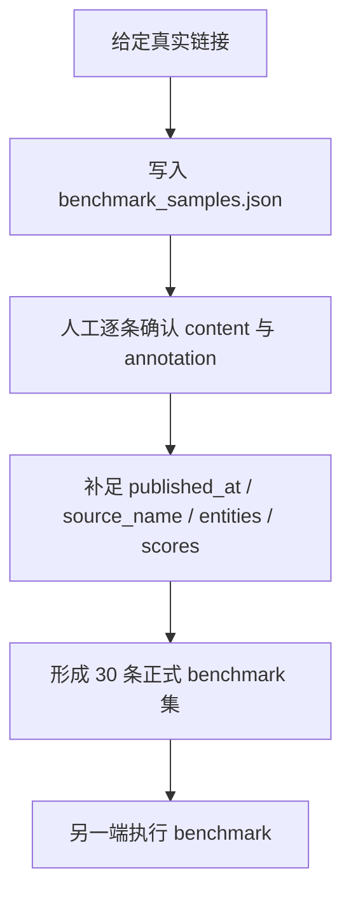

# Phase 2.1 Benchmark Sample File Notes

> **文档类型**：benchmark 样本文件说明
> **目标读者**：样本整理、标注、benchmark 执行协作者
> **最后更新**：2026-03-14

---

## 一、当前唯一正式样本文件

当前 `Phase 2.1` 的 benchmark 样本准备与人工标注，统一收敛到：

- `data/benchmark_samples.json`

这份文件是当前阶段的 **唯一真相源**，用途包括：

1. **承载正式 benchmark 输入结构**：直接符合 [sample_preparation_guide.md](f:\AIProjects\DesignAssistant\data-layer\projects\proj_004\phase2.1_implementation\docs\sample_preparation_guide.md) 约定的 JSON 结构。
2. **承载人工标注结果**：每条样本通过 `annotation.expected_signals` 记录正式人工真值。
3. **支持逐条迭代完善**：可以持续补充 `content`、`published_at`、`source_name`、评分、实体和边界样本判断。
4. **直接服务 benchmark 执行**：后续另一端执行 benchmark 时，应以这份 JSON 文件为正式输入，而不是依赖过渡层表格文件。

---

## 二、为什么不再保留 CSV 中间层

此前目录中存在 `sample_pool`、`few-shot` 候选表、`annotation sheet` 等 `CSV` 文件，用于过渡性整理与讨论。

但在当前阶段，这些文件会带来三个问题：

1. **口径分裂**：同一条样本在不同文件中容易出现多份状态。
2. **维护成本高**：每次调整都需要同步多个文件。
3. **与正式验收输入不一致**：`2.1` 正式 benchmark 验收实际依赖的是 JSON 结构，而不是 CSV 工作表。

因此当前策略已经调整为：

> **只保留一份正式 JSON 样本文件，在同一处完成样本收敛、人工标注和 benchmark 输入准备。**

---

## 三、正式字段结构

`data/benchmark_samples.json` 的基本结构如下：

```json
{
  "samples": [
    {
      "sample_id": "S001",
      "source_type": "news",
      "title": "标题",
      "content": "正文内容",
      "published_at": null,
      "source_name": "来源名称",
      "source_url": "https://example.com",
      "annotation": {
        "expected_signals": [
          {
            "signal_type": "technical",
            "signal_label": "信号标签",
            "description": "信号描述",
            "intensity_score": 8,
            "confidence_score": 10,
            "timeliness_score": 9,
            "entities": ["实体1", "实体2"]
          }
        ]
      }
    }
  ]
}
```

---

## 四、字段口径说明

### 4.1 样本级字段

| 字段名 | 含义 | 说明 |
|--------|------|------|
| `sample_id` | 样本唯一编号 | 当前建议使用稳定编号，如 `S001`、`B001`、`E001`、`N001` |
| `source_type` | 输入类型 | 必须是 `news / report / announcement` |
| `title` | 样本标题 | 建议使用便于人工识别的短标题 |
| `content` | benchmark 正文 | 应为清洗后的正文摘要或可直接用于测试的 excerpt |
| `published_at` | 发布时间 | 用于支持 `timeliness_score` 判断；缺失时可先置 `null` |
| `source_name` | 来源名 | 如 `AP News`、`Unity Blog`、`Capcom IR` |
| `source_url` | 原始链接 | 用于回看原文 |
| `annotation` | 人工标注 | 正式 benchmark 真值入口 |

### 4.2 标注级字段

`annotation.expected_signals` 是数组，一条样本可包含 0 个、1 个或多个信号。

| 字段名 | 含义 | 说明 |
|--------|------|------|
| `signal_type` | 信号类别 | 仅使用 `technical / market / team / capital` |
| `signal_label` | 信号标签 | 需简洁、稳定、可比较 |
| `description` | 信号描述 | 用自然语言概括为什么该样本构成该信号 |
| `intensity_score` | 强度评分 | 1-10 |
| `confidence_score` | 可信度评分 | 1-10 |
| `timeliness_score` | 时效性评分 | 1-10 |
| `entities` | 关键实体 | 允许空数组 `[]` |

---

## 五、如何表达 signal / background / boundary / noise

当前文件不再单独保存旧工作流中的 `decision` 字段，而是通过正式标注结果表达：

- **signal**：`annotation.expected_signals` 非空，且信号明确。
- **background**：`annotation.expected_signals` 为空数组 `[]`，并且 `content` 本身被保留为辅助背景材料。
- **noise**：`annotation.expected_signals` 为空数组 `[]`，并且内容与 `2.1` 范式信号目标弱相关。
- **boundary**：当前仍可先用低强度 / 低置信度信号表示边界性；后续逐条人工复核后，可决定保留为弱信号样本，还是改为空数组。

也就是说，`background / noise / boundary` 在当前阶段主要是 **人工工作语义**，而正式 benchmark 文件的核心仍然是：

- 样本文本
- 结构化人工真值

---

## 六、当前执行原则

### 6.1 先保证可运行，再逐条做强

当前首批文件已经把 20 条链接样本统一收敛进正式 JSON，但这并不意味着标注已经最终完成。

接下来的正确做法是：

1. **逐条复核样本内容与判断口径**
2. **逐条补足更准确的 `content` 摘录**
3. **逐条确认 `annotation.expected_signals`**
4. **补充 `published_at` 与更精确的评分**
5. **最后再按 `30` 条正式分布要求扩展到完整 benchmark 集**

### 6.2 当前文件是“正式结构下的工作态”

所以这份 JSON 文件既是：

- 当前阶段的正式 benchmark 输入结构
- 也是人工逐条完善的工作文件

这和过去“CSV 做中间态、JSON 做最终态”的分层不同；当前已经统一为 **单文件工作流**。

---

## 七、最推荐的协作方式

后续建议严格按照以下方式协作：



---

## 八、当前结论

当前最重要的结论只有一条：

> **`Phase 2.1` 样本准备、人工标注与 benchmark 执行，应统一以 `data/benchmark_samples.json` 为唯一正式样本文件。**

后续如果需要增加 few-shot 样例池、错误案例池或分析报表，应视为 **派生产物**，而不是新的主样本源。
