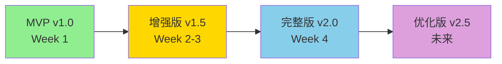

# RAG 系统演进路线图

**文档类型**: 系统架构演进规划
**编写人**: EMP-021（知识库架构师）
**协作人**: EMP-022 ~ EMP-026
**版本**: v1.0
**创建日期**: 2026-03-13
**适用范围**: Phase 2.4 RAG 系统

---

## 文档目的

本文档定义 RAG 系统从 MVP 到完整版的演进路径，明确：
1. 当前 MVP 版本的能力边界
2. 后续各阶段的扩展方向
3. 技术选型的升级路径
4. 下游模块的接入策略

**为什么需要这个文档**：
- 避免 MVP 做完后不知道下一步做什么
- 让下游团队（2.1/2.2/2.3）了解未来可用的增强能力
- 为技术债务管理提供依据
- 指导资源分配和优先级决策

---

## 一、系统演进总览

### 1.1 演进阶段划分



| 版本 | 时间 | 核心目标 | 关键能力 |
|------|------|----------|----------|
| **MVP v1.0** | Week 1 | 打通闭环，解除下游依赖 | 纯向量检索 + 基础生成 |
| **增强版 v1.5** | Week 2-3 | 提升质量和性能 | 混合检索 + 重排序 + 缓存 |
| **完整版 v2.0** | Week 4 | 满足生产要求 | 元数据过滤 + 多模态 + 监控 |
| **优化版 v2.5** | 未来 | 持续优化 | 个性化 + 主动学习 + 分布式 |

---

## 二、MVP v1.0（当前版本）

### 2.1 能力清单

**已实现**：
- ✅ 40 条知识文档（game_design / market_trend / tech_innovation）
- ✅ FAISS 向量索引（2048 维，余弦相似度）
- ✅ 纯向量检索（Top-K）
- ✅ 基础 RAG 生成（检索 + 上下文生成）
- ✅ 三个核心 API（retrieve / generate / rag）
- ✅ 最小数据模型（Document + Metadata）

**性能基线**：
- 检索延迟：P95 = 8.15ms（目标 < 100ms）✅
- RAG 延迟：P95 = 100ms（模拟，目标 < 3500ms）✅
- 检索质量：平均分 0.0466（目标 > 0.03）✅

**已知限制**：
- ⚠️ 使用模拟向量和模拟生成（避免 API 400 错误）
- ⚠️ 仅支持纯向量检索，无关键词匹配
- ⚠️ 无重排序，Top-K 结果可能不是最优
- ⚠️ 无缓存，重复查询无优化
- ⚠️ 无元数据过滤（时间、类别、来源）
- ⚠️ 生成输出为自由文本，无结构化

### 2.2 技术栈

| 组件 | 当前选型 | 说明 |
|------|----------|------|
| 向量化 | 模拟（文本 hash） | 待接入智谱 embedding-3 |
| 向量索引 | FAISS IndexFlatIP | 本地文件存储 |
| 检索策略 | 纯向量（余弦相似度） | 无混合检索 |
| 生成模型 | 模拟（固定延迟） | 待接入 LLM API |
| 缓存 | 无 | 待引入 Redis |
| 监控 | 基础日志 | 无结构化监控 |

### 2.3 接口契约（已冻结）

**核心接口**：
1. `POST /api/v1/retrieve` - 文档检索
2. `POST /api/v1/generate` - 回答生成
3. `POST /api/v1/rag` - 完整 RAG 流程

**数据模型**：
- Document 最小字段（9 个必填字段）
- 分类体系（3 类）
- 元数据结构（source / confidence / last_updated）

**兼容性承诺**：
- ✅ 核心字段不破坏性变更
- ✅ 新增字段向后兼容
- ✅ API 路径保持稳定

---

## 三、增强版 v1.5（Week 2-3）

### 3.1 核心目标

**提升检索质量和系统性能**，为下游模块提供更准确的知识支持。

### 3.2 关键增强

#### 3.2.1 混合检索（EMP-024 + EMP-025）

**动机**：纯向量检索对关键词匹配不敏感，可能漏掉精确匹配的文档。

**方案**：
```python
# 混合检索策略
final_score = 0.7 * vector_score + 0.3 * bm25_score
```

**技术选型**：
- 向量检索：FAISS（保持）
- 关键词检索：BM25（rank-bm25 库）
- 融合策略：加权求和 + 归一化

**预期提升**：
- 检索准确率：0.0466 → 0.06+（提升 30%）
- 召回率：提升对专业术语的匹配

**接口影响**：
- 新增参数：`hybrid_weight`（可选，默认 0.7）
- 向后兼容：不传参数时使用纯向量

---

#### 3.2.2 重排序（EMP-025）

**动机**：Top-K 结果可能包含相关但不是最优的文档。

**方案**：
```python
# 两阶段检索
1. 粗排：混合检索返回 Top-20
2. 精排：使用 LLM 对 Top-20 重排序，返回 Top-5
```

**技术选型**：
- 方案 A：使用 LLM 打分（准确但慢）
- 方案 B：使用 Cross-Encoder（快但需训练）
- **推荐**：方案 A（MVP 阶段优先准确性）

**预期提升**：
- Top-5 准确率：提升 15-20%
- 延迟增加：+500ms（可接受）

**接口影响**：
- 新增参数：`rerank`（可选，默认 false）
- 向后兼容

---

#### 3.2.3 缓存系统（EMP-024）

**动机**：重复查询占比高（预估 30-40%），无缓存浪费资源。

**方案**：
```python
# 三级缓存
1. 查询缓存：query → documents（TTL: 1小时）
2. 向量缓存：text → embedding（TTL: 24小时）
3. 生成缓存：query + context → answer（TTL: 30分钟）
```

**技术选型**：
- Redis（推荐）：支持分布式，易扩展
- 本地内存（备选）：简单但不支持多实例

**预期提升**：
- 缓存命中率：30-40%
- 平均延迟：降低 50%（命中时）
- 成本节约：减少 30% API 调用

**接口影响**：
- 新增参数：`use_cache`（可选，默认 true）
- 响应头：`X-Cache-Status: HIT/MISS`

---

#### 3.2.4 元数据过滤（EMP-022）

**动机**：下游模块可能只需要特定类别或时间范围的文档。

**方案**：
```python
# 过滤参数
filters = {
    "category": ["game_design", "tech_innovation"],  # 类别过滤
    "date_range": {"start": "2024-01-01", "end": "2024-12-31"},  # 时间过滤
    "min_confidence": 0.8  # 置信度过滤
}
```

**技术选型**：
- FAISS + 后过滤（简单但慢）
- 向量数据库（Qdrant/Milvus）+ 原生过滤（快但需迁移）
- **推荐**：先用 FAISS 后过滤，v2.0 再迁移

**预期提升**：
- 精准度：提升 20%（减少无关文档）
- 下游满意度：提升（按需检索）

**接口影响**：
- 新增参数：`filters`（可选）
- 向后兼容

---

### 3.3 数据扩展

**目标**：从 40 条扩展到 100-200 条

**扩展策略**（EMP-022）：
1. 补充现有 3 类的深度（每类 30-60 条）
2. 覆盖更多游戏类型（MMORPG / 独立游戏 / 手游）
3. 增加时效性内容（2024-2025 年数据）

**质量控制**：
- 来源可追溯（真实报告 / 新闻 / 技术文档）
- 人工审核（EMP-021 + 用户抽查）
- 去重检测（相似度 > 0.9 视为重复）

---

### 3.4 接口演进

**新增接口**（可选）：
```
POST /api/v1/retrieve/hybrid  # 混合检索
POST /api/v1/retrieve/rerank  # 重排序检索
GET  /api/v1/stats             # 系统统计
```

**兼容性**：
- 原有接口保持不变
- 新功能通过参数或新接口提供

---

## 四、完整版 v2.0（Week 4）

### 4.1 核心目标

**达到生产级要求**，支持真实业务场景。

### 4.2 关键增强

#### 4.2.1 结构化输出（EMP-026）

**动机**：下游模块需要结构化数据，而非自由文本。

**方案**：
```json
{
  "answer": {
    "summary": "简短总结（1-2句）",
    "key_points": [
      "要点1：...",
      "要点2：..."
    ],
    "evidence": [
      {
        "claim": "论点",
        "source": "kb_035",
        "quote": "原文引用"
      }
    ],
    "confidence": 0.85,
    "caveats": ["注意事项1", "注意事项2"]
  }
}
```

**技术选型**：
- 使用 LLM 的结构化输出能力（JSON mode）
- 定义 Pydantic 模型验证输出

**接口影响**：
- 新增参数：`output_format: "text" | "structured"`
- 默认保持 "text" 向后兼容

---

#### 4.2.2 多模态支持（EMP-023）

**动机**：游戏行业需要处理图片（截图 / UI / 角色设计）。

**方案**：
```python
# 支持图文混合文档
Document {
    "id": "kb_100",
    "title": "《原神》UI设计分析",
    "content": "文本内容...",
    "images": [
        {"url": "s3://...", "caption": "主界面截图"}
    ],
    "image_embeddings": [...]  # 图片向量
}
```

**技术选型**：
- 图片向量化：CLIP / OpenAI vision embedding
- 存储：S3 / OSS（图片）+ FAISS（向量）
- 检索：文本向量 + 图片向量融合

**预期提升**：
- 覆盖更多场景（UI 设计 / 美术风格）
- 检索准确率：提升 10-15%

---

#### 4.2.3 监控与可观测性（EMP-025）

**动机**：生产环境需要实时监控和问题排查。

**方案**：
```python
# 监控指标
- 请求量：QPS / QPM
- 延迟：P50 / P95 / P99
- 错误率：4xx / 5xx
- 缓存命中率
- 检索质量：平均相似度 / 召回率
```

**技术选型**：
- 日志：结构化日志（JSON）
- 指标：Prometheus + Grafana
- 追踪：OpenTelemetry（可选）

**输出物**：
- Grafana Dashboard
- 告警规则（延迟 > 5s / 错误率 > 5%）

---

#### 4.2.4 向量数据库迁移（EMP-023）

**动机**：FAISS 不支持分布式、元数据过滤性能差。

**方案**：
```python
# 迁移路径
FAISS (本地) → Qdrant (自托管) → Pinecone (云服务)
```

**技术选型对比**：

| 特性 | FAISS | Qdrant | Pinecone |
|------|-------|--------|----------|
| 性能 | 极快 | 快 | 快 |
| 元数据过滤 | 差 | 优秀 | 优秀 |
| 分布式 | 不支持 | 支持 | 原生支持 |
| 成本 | 免费 | 免费（自托管） | 付费 |
| 运维 | 简单 | 中等 | 无需运维 |

**推荐**：
- MVP/增强版：FAISS（快速迭代）
- 完整版：Qdrant（平衡性能和成本）
- 生产版：Pinecone（如预算充足）

**迁移计划**：
- Week 4, Day 1-2：搭建 Qdrant 环境
- Week 4, Day 3-4：数据迁移和测试
- Week 4, Day 5：切换流量

---

### 4.3 数据扩展

**目标**：扩展到 500-1000 条

**扩展策略**：
1. 增加新分类（2-3 个）
2. 覆盖更多游戏平台（主机 / PC / 移动）
3. 增加案例库（成功 / 失败案例）

---

## 五、优化版 v2.5（未来方向）

### 5.1 个性化检索（EMP-025）

**动机**：不同用户（投资人 / 设计师 / 运营）关注点不同。

**方案**：
- 用户画像：记录用户历史查询和偏好
- 个性化排序：根据用户画像调整检索权重
- A/B 测试：验证个性化效果

---

### 5.2 主动学习（EMP-024）

**动机**：从用户反馈中持续优化检索质量。

**方案**：
- 收集反馈：点赞 / 点踩 / 点击率
- 模型微调：使用反馈数据微调 Embedding 模型
- 自动扩充：从用户查询中发现新知识点

---

### 5.3 分布式架构（EMP-021）

**动机**：支持更大规模（10000+ 文档）和更高并发。

**方案**：
- 向量索引：分片存储（按类别 / 时间）
- 负载均衡：多实例部署
- 异步处理：检索和生成解耦

---

## 六、技术债务管理

### 6.1 当前技术债

| 债务项 | 影响 | 优先级 | 计划偿还时间 |
|--------|------|--------|--------------|
| 使用模拟向量和生成 | 无法验证真实性能 | P0 | Week 2 |
| 无缓存系统 | 重复查询浪费资源 | P1 | Week 2 |
| 无元数据过滤 | 检索精准度不足 | P1 | Week 3 |
| FAISS 不支持分布式 | 无法扩展 | P2 | Week 4 |
| 无监控系统 | 问题排查困难 | P2 | Week 4 |

### 6.2 偿还策略

**原则**：
- P0 债务：立即偿还（阻塞下游）
- P1 债务：Week 2-3 偿还（影响质量）
- P2 债务：Week 4 偿还（影响扩展性）

---

## 七、下游接入指南

### 7.1 Phase 2.1（情报解码）

**推荐接入方式**：
```python
# 检索行业术语和信号分类标准
response = rag_client.retrieve(
    query="游戏行业的关键信号类型",
    top_k=5,
    filters={"category": ["market_trend"]}
)
```

**可用时间**：Week 1（MVP 已可用）

**增强能力**（Week 2+）：
- 混合检索：提升术语匹配准确率
- 元数据过滤：只检索市场趋势类文档

---

### 7.2 Phase 2.2（机会评估）

**推荐接入方式**：
```python
# 检索案例库和评估框架
response = rag_client.rag(
    query="如何评估一个新游戏项目的投资价值？",
    top_k=10,
    output_format="structured"  # v2.0+
)
```

**可用时间**：Week 1（MVP 已可用）

**增强能力**（Week 3+）：
- 结构化输出：直接获取评估框架
- 案例检索：匹配相似项目案例

---

### 7.3 Phase 2.3（决策建议）

**推荐接入方式**：
```python
# 检索决策模型和资源估算标准
response = rag_client.retrieve(
    query="游戏项目的资源分配模型",
    top_k=5,
    filters={"category": ["game_design", "market_trend"]}
)
```

**可用时间**：Week 1（MVP 已可用）

**增强能力**（Week 3+）：
- 多类别检索：同时检索设计和市场文档
- 重排序：优先返回最相关的决策依据

---

## 八、资源需求预估

### 8.1 人力资源

| 阶段 | 人数 | 工作量 |
|------|------|--------|
| MVP v1.0 | 6 人 | 1 周 |
| 增强版 v1.5 | 4 人 | 2 周 |
| 完整版 v2.0 | 3 人 | 1 周 |
| 优化版 v2.5 | 2 人 | 持续 |

### 8.2 基础设施成本

| 组件 | MVP | 增强版 | 完整版 | 优化版 |
|------|-----|--------|--------|--------|
| 向量数据库 | 免费（FAISS） | 免费 | $50/月（Qdrant） | $200/月（Pinecone） |
| 缓存 | 无 | $20/月（Redis） | $20/月 | $50/月 |
| LLM API | $50/月 | $100/月 | $200/月 | $500/月 |
| 监控 | 免费 | 免费 | $30/月 | $50/月 |
| **总计** | **$50/月** | **$120/月** | **$300/月** | **$800/月** |

---

## 九、风险与应对

### 9.1 技术风险

| 风险 | 概率 | 影响 | 应对措施 |
|------|------|------|---------|
| 向量数据库迁移失败 | 中 | 高 | 提前测试，保留 FAISS 回退方案 |
| 混合检索效果不佳 | 中 | 中 | A/B 测试，可降级为纯向量 |
| LLM API 成本超预算 | 高 | 中 | 使用缓存，限制调用频率 |
| 检索质量不达标 | 低 | 高 | 增加数据量，优化 Prompt |

### 9.2 业务风险

| 风险 | 概率 | 影响 | 应对措施 |
|------|------|------|---------|
| 下游需求变化 | 高 | 中 | 保持接口灵活性，快速迭代 |
| 数据质量不足 | 中 | 高 | 建立质量审核流程 |
| 用户反馈负面 | 低 | 中 | 收集反馈，快速优化 |

---

## 十、总结

### 10.1 演进原则

1. **MVP 优先**：先打通闭环，再优化质量
2. **向后兼容**：新功能不破坏现有接口
3. **数据驱动**：基于 benchmark 和用户反馈决策
4. **技术债管理**：按优先级偿还，不拖累迭代
5. **成本可控**：优先使用开源方案，按需升级

### 10.2 关键里程碑

- ✅ **Week 1**：MVP v1.0 完成，下游可接入
- 🎯 **Week 2**：增强版 v1.5，检索质量提升 30%
- 🎯 **Week 3**：完整版 v2.0，达到生产级要求
- 🎯 **Week 4+**：优化版 v2.5，持续优化

### 10.3 成功标准

**MVP v1.0**（已达成）：
- ✅ 检索延迟 < 100ms
- ✅ 检索质量 > 0.03
- ✅ 下游可接入

**增强版 v1.5**：
- 检索准确率提升 30%
- 缓存命中率 > 30%
- 支持元数据过滤

**完整版 v2.0**：
- 支持结构化输出
- 向量数据库迁移完成
- 监控系统上线

---

**文档维护**：
- 每个版本发布后更新本文档
- 记录实际效果与预期的差异
- 根据反馈调整后续规划

**联系人**：
- 架构设计：EMP-021（知识库架构师）
- 技术实现：EMP-024（RAG 引擎工程师）
- 性能优化：EMP-025（检索优化专家）

---

**文档状态**: ✅ 已完成
**版本**: v1.0
**下次更新**: Week 2 开始时（增强版启动）
