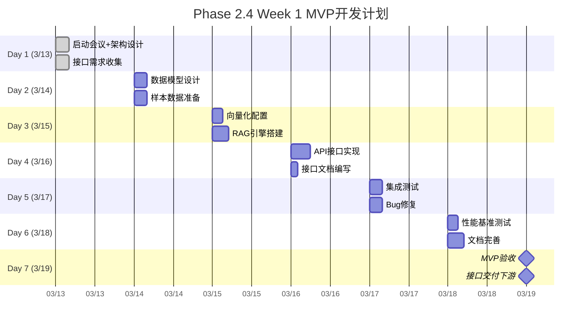

# Phase 2.4 Week 1 MVP 实施计划

**文档编号**: PROJ-004-PHASE2.4-MVP-001
**创建日期**: 2026-03-13
**计划周期**: Week 1（2026-03-13 至 2026-03-19）
**团队负责人**: EMP-021（知识库架构师）
**项目状态**: 🟢 进行中

---

## 1. MVP目标定义

### 核心目标

在Week 1结束时，交付一个**最小可用版本**的知识库与RAG系统，使得下游团队（2.1/2.2/2.3）可以：
1. **调用检索API**获取相关文档
2. **调用生成API**基于检索结果生成分析
3. **验证技术可行性**，开始并行开发

### MVP范围边界

**包含**（Must Have）：
- 100条游戏行业知识文档（3个类别）
- 纯向量检索（text-embedding-3-large）
- 基础RAG生成（Claude API）
- 2个核心API接口（/retrieve, /generate）
- 接口文档和使用示例

**不包含**（Nice to Have）：
- 混合检索（向量+关键词）
- 重排序算法
- 缓存系统（Redis）
- 高级过滤（按类别、时间）
- 性能优化（延迟<500ms）

### 成功标准

| 指标 | MVP目标 | 验收方式 |
|-----|---------|---------|
| 功能完整性 | 100%（2个API可用） | 功能测试通过 |
| 文档数量 | 100条 | 数据验证 |
| 检索准确率 | >60% | 人工抽查10条 |
| 检索延迟 | <1s | 10次平均测试 |
| 接口文档 | 100%完成 | EMP-026验收 |

---

## 2. 详细时间计划

### Week 1 甘特图



---

## 3. 每日任务分解

### Day 1 (3/13) - 启动与规划

**主题**: 团队对齐 + 需求确认

#### 上午：启动会议（EMP-021主持）

| 时间 | 内容 | 参与人 | 输出 |
|-----|------|--------|------|
| 9:00-9:30 | 项目背景介绍 | 全体成员 | 统一认知 |
| 9:30-10:00 | MVP目标对齐 | 全体成员 | 明确边界 |
| 10:00-11:00 | 技术方案讨论 | EMP-021/023/024 | 技术路线 |
| 11:00-12:00 | 任务分工确认 | 全体成员 | 分工表 |

#### 下午：接口需求收集（EMP-021/026主导）

**任务**: 与下游团队沟通接口需求
- 2.1情报解码团队：需要哪些检索能力？
- 2.2机会评估团队：需要哪些生成能力？
- 2.3决策建议团队：对接口格式有什么要求？

**输出**: 接口需求文档（草稿）

**风险预警**: 如无法联系到下游团队，EMP-021根据经验判断接口需求

---

### Day 2 (3/14) - 数据准备

**主题**: 数据模型 + 样本数据

#### EMP-022（数据工程师）任务

| 时间 | 任务 | 输出 |
|-----|------|------|
| 9:00-12:00 | 设计YAML数据模型 | data_model.yaml |
| 13:00-17:00 | 准备100条样本数据 | sample_data/（100个yaml文件） |

**数据模型要求**:
```yaml
document:
  id: string  # kb_001 ~ kb_100
  title: string
  category: enum  # game_design / market_trend / tech_innovation
  tags: string[]
  content: string  # 最多2000字符
  metadata:
    source: string
    confidence: float
    last_updated: date
```

#### EMP-021（知识库架构师）任务

| 时间 | 任务 | 输出 |
|-----|------|------|
| 13:00-15:00 | 评审数据模型 | 反馈建议 |
| 15:00-17:00 | 确定技术方案 | 技术选型文档 |

---

### Day 3 (3/15) - 核心引擎

**主题**: 向量化 + RAG引擎

#### EMP-023（向量化专家）任务

| 时间 | 任务 | 输出 |
|-----|------|------|
| 9:00-11:00 | 配置OpenAI Embedding | embedding_config.yaml |
| 11:00-12:00 | 向量化测试（10条） | test_results.json |
| 13:00-16:00 | 批量向量化（100条） | vector_index.faiss |
| 16:00-17:00 | 质量验证 | quality_report.md |

#### EMP-024（RAG引擎工程师）任务

| 时间 | 任务 | 输出 |
|-----|------|------|
| 9:00-12:00 | 搭建LangChain框架 | rag_engine/目录结构 |
| 13:00-15:00 | 实现retrieve函数 | retrieval.py |
| 15:00-17:00 | 实现generate函数 | generation.py |
| 17:00-18:00 | 基础集成测试 | test_pass |

**关键检查点**: Day 3结束时，必须能跑通一个完整的RAG流程

---

### Day 4 (3/16) - API开发

**主题**: API接口 + 文档

#### EMP-024（RAG引擎工程师）任务

| 时间 | 任务 | 输出 |
|-----|------|------|
| 9:00-12:00 | 实现/retrieve API | api/retrieve.py |
| 13:00-16:00 | 实现/generate API | api/generate.py |
| 16:00-17:00 | API集成测试 | api_test.py |

#### EMP-026（接口设计师）任务

| 时间 | 任务 | 输出 |
|-----|------|------|
| 9:00-11:00 | 编写OpenAPI文档 | openapi.yaml |
| 11:00-12:00 | 编写调用示例 | examples/目录 |
| 13:00-15:00 | 创建Postman集合 | rag_api.postman_collection.json |
| 15:00-17:00 | 接口验收测试 | test_report.md |

**关键检查点**: Day 4结束时，API必须可用，文档必须完整

---

### Day 5 (3/17) - 测试与修复

**主题**: 集成测试 + Bug修复

#### 全员任务

| 时间 | 任务 | 负责人 | 输出 |
|-----|------|--------|------|
| 9:00-10:00 | 编写集成测试用例 | EMP-021 | integration_tests.py |
| 10:00-12:00 | 端到端测试执行 | EMP-024 | test_results/ |
| 13:00-15:00 | Bug修复（高优先级） | EMP-024 | bug_fixes.md |
| 15:00-16:00 | Bug修复（中优先级） | EMP-023 | bug_fixes.md |
| 16:00-17:00 | 回归测试 | EMP-021 | regression_pass |

**测试场景**:
1. 正常查询 → 返回结果
2. 空查询 → 返回错误
3. 长查询 → 处理成功
4. 无效文档ID → 返回错误
5. 并发查询 → 无异常

---

### Day 6 (3/18) - 优化与文档

**主题**: 性能测试 + 文档完善

#### EMP-025（检索优化专家）任务

| 时间 | 任务 | 输出 |
|-----|------|------|
| 9:00-11:00 | 性能基准测试 | benchmark_results.md |
| 11:00-12:00 | 瓶颈分析 | performance_analysis.md |
| 13:00-14:00 | 编写优化建议（Week 2-4） | optimization_plan.md |

#### EMP-026（接口设计师）任务

| 时间 | 任务 | 输出 |
|-----|------|------|
| 13:00-15:00 | 完善接口文档 | api_documentation.md |
| 15:00-17:00 | 编写使用指南 | user_guide.md |

#### EMP-021（知识库架构师）任务

| 时间 | 任务 | 输出 |
|-----|------|------|
| 14:00-16:00 | 编写MVP交付报告 | mvp_delivery_report.md |
| 16:00-17:00 | 准备验收材料 | acceptance_package/ |

---

### Day 7 (3/19) - 验收与交付

**主题**: MVP验收 + 接口交付

#### 上午：内部验收（EMP-021主持）

| 时间 | 内容 | 验收人 | 标准 |
|-----|------|--------|------|
| 9:00-10:00 | 功能演示 | EMP-024 | 2个API可用 |
| 10:00-11:00 | 代码Review | 全体成员 | 无明显Bug |
| 11:00-12:00 | 文档Review | EMP-026 | 文档完整 |

#### 下午：对外交付

| 时间 | 内容 | 接收方 |
|-----|------|--------|
| 13:00-14:00 | 接口文档交付 | 2.1/2.2/2.3团队 |
| 14:00-15:00 | 技术答疑 | 下游团队 |
| 15:00-16:00 | 反馈收集 | EMP-021记录 |
| 16:00-17:00 | Week 2计划调整 | EMP-021/019 |

**交付物清单**:
- [ ] API接口文档
- [ ] 调用示例代码
- [ ] Postman测试集合
- [ ] 系统访问方式
- [ ] 技术支持联系方式

---

## 4. 关键里程碑与检查点

### 里程碑1：Day 2下班前（3/14 17:00）

**目标**: 数据准备完成

**检查清单**:
- [ ] YAML数据模型确定
- [ ] 100条样本数据准备完毕
- [ ] 数据质量抽查通过（随机抽10条检查）

**未达成应对**:
- 数据不足：减少到80条，保证3个类别都有数据
- 数据质量问题：EMP-022加班修复

---

### 里程碑2：Day 3下班前（3/15 18:00）

**目标**: 核心引擎可用

**检查清单**:
- [ ] 向量索引构建完成（100条）
- [ ] RAG引擎能跑通完整流程
- [ ] 基础测试通过

**未达成应对**:
- 向量化失败：检查API key，降低batch size
- RAG引擎问题：简化实现，先保证可用性

---

### 里程碑3：Day 4下班前（3/16 17:00）

**目标**: API接口可用

**检查清单**:
- [ ] /retrieve API可用
- [ ] /generate API可用
- [ ] 接口文档完成

**未达成应对**:
- API不稳定：先提供mock API供下游开发
- 文档未完成：EMP-026周末加班完成

---

### 里程碑4：Day 7下班前（3/19 17:00）

**目标**: MVP验收通过

**检查清单**:
- [ ] 功能测试通过
- [ ] 性能测试通过（<1s）
- [ ] 文档完整
- [ ] 下游团队确认接口可用

**未达成应对**:
- 功能问题：识别关键Bug，延期1天修复
- 性能问题：Week 2重点优化，MVP先交付
- 下游不满意：紧急调整接口，当天完成

---

## 5. 资源需求

### 计算资源

| 资源 | 用途 | 成本估算 |
|-----|------|---------|
| OpenAI API | Embedding（100条） | ~$0.01 |
| OpenAI API | 测试调用（50次） | ~$0.50 |
| Claude API | 测试调用（20次） | ~$1.00 |
| **总计** | | **~$1.51** |

**说明**: MVP阶段API成本极低，Week 2-4会增加

### 外部依赖

| 依赖 | 用途 | 状态 | 风险 |
|-----|------|------|------|
| OpenAI API | Embedding | ✅ 可用 | 低 |
| Claude API | RAG生成 | ✅ 可用 | 低 |
| GitHub | 代码托管 | ✅ 可用 | 低 |

### 协作资源

| 资源 | 用途 | 时间 |
|-----|------|------|
| EMP-019时间 | 架构审查 | Day 1, Day 7 |
| 下游团队时间 | 需求确认 | Day 1, Day 7 |

---

## 6. 风险管理

### 高危风险

#### R-001: Day 3 RAG引擎无法跑通

**影响**: MVP延期，下游阻塞

**应对措施**:
1. **预防**: Day 2晚上EMP-024提前开始搭建框架
2. **监控**: Day 3中午检查点，评估进度
3. **应急**: 如Day 3下班前未跑通，Day 4使用mock API替代

**责任人**: EMP-024
**升级阈值**: Day 3 15:00仍未见进展

#### R-002: 下游团队接口需求变更

**影响**: 接口返工，文档重写

**应对措施**:
1. **预防**: Day 1充分沟通，书面确认需求
2. **监控**: Day 4交付前再次确认
3. **应急**: 如Day 7前变更，延期到Week 2，MVP先用简化接口

**责任人**: EMP-021
**升级阈值**: Day 6收到变更需求

---

### 中危风险

#### R-003: 数据质量不达标

**影响**: 检索准确率低于60%

**应对措施**:
1. **预防**: EMP-022严格数据清洗
2. **监控**: Day 2数据抽查
3. **应急**: 减少数据量，保证高质量数据

**责任人**: EMP-022

#### R-004: API性能不达标

**影响**: 延迟>1s

**应对措施**:
1. **预防**: EMP-024优化代码
2. **监控**: Day 6性能测试
3. **应急**: Week 2重点优化，MVP先接受<2s延迟

**责任人**: EMP-024/025

---

## 7. 沟通计划

### 日常沟通

| 时间 | 形式 | 内容 | 参与人 |
|-----|------|------|--------|
| 每日9:00 | 站会（15分钟） | 昨日进展、今日计划、阻塞问题 | 全体成员 |
| 每日17:00 | 日报 | 进展汇报、风险预警 | EMP-021汇总 |

### 关键沟通节点

| 时间 | 事件 | 参与人 | 形式 |
|-----|------|--------|------|
| Day 1 17:00 | 需求对齐会 | EMP-021/026 + 下游团队 | 会议 |
| Day 3 12:00 | 技术检查点 | EMP-021/023/024 | 会议 |
| Day 5 17:00 | 测试评审会 | 全体成员 | 会议 |
| Day 7 9:00 | MVP验收会 | 全体成员 + EMP-019 | 会议 |
| Day 7 14:00 | 接口交付会 | EMP-021/026 + 下游团队 | 会议 |

### 沟通工具

- **即时通讯**: 飞书/Slack（项目群）
- **文档协作**: Notion/语雀
- **代码协作**: GitHub
- **会议**: 腾讯会议/钉钉

---

## 8. 交付物清单

### 代码交付物

```
rag_system/
├── api/
│   ├── __init__.py
│   ├── retrieve.py          # 检索API
│   └── generate.py          # 生成API
├── core/
│   ├── __init__.py
│   ├── retrieval.py         # 检索核心
│   └── generation.py        # 生成核心
├── data/
│   ├── documents/           # 100条文档
│   └── vector_index.faiss   # 向量索引
├── config/
│   ├── embedding_config.yaml
│   └── api_config.yaml
├── tests/
│   ├── test_retrieval.py
│   └── test_generation.py
├── requirements.txt
└── README.md
```

### 文档交付物

```
docs/
├── api_documentation.md      # API接口文档
├── user_guide.md             # 使用指南
├── openapi.yaml              # OpenAPI规范
├── data_model.md             # 数据模型说明
├── architecture.md           # 架构设计文档
└── mvp_delivery_report.md    # MVP交付报告
```

### 测试交付物

```
tests/
├── integration_tests.py      # 集成测试
├── performance_tests.py      # 性能测试
└── postman/
    └── rag_api.postman_collection.json
```

---

## 9. Week 2-4 预览

### Week 2 计划

**主题**: 功能完善

- 混合检索（向量+关键词）
- 重排序算法
- 数据集扩展到1000条
- 缓存系统（Redis）

### Week 3 计划

**主题**: 性能优化

- 检索延迟优化（<500ms）
- 缓存命中率提升
- 参数调优
- 监控体系搭建

### Week 4 计划

**主题**: 交付准备

- 完整文档编写
- 端到端测试
- 用户验收测试
- 上线部署

---

## 10. 附录

### A. 术语表

| 术语 | 定义 |
|-----|------|
| MVP | Minimum Viable Product，最小可行版本 |
| RAG | Retrieval-Augmented Generation，检索增强生成 |
| Embedding | 将文本转换为向量的过程 |
| 向量检索 | 基于向量相似度的文档检索 |
| 混合检索 | 结合向量检索和关键词检索 |

### B. 相关文档

- [Phase 2.4团队角色定义](./phase2_roles/phase2.4_roles.md)
- [接口规范](./api_documentation.md)（Day 4创建）
- [项目背景信息](../../../../../PROJECT_CONTEXT.md)

### C. 变更日志

| 日期 | 变更 | 变更人 |
|-----|------|--------|
| 2026-03-13 | 创建MVP计划 | EMP-021 |

---

**文档状态**: ✅ 已发布
**版本**: v1.0
**下次更新**: Day 7（根据实际执行情况调整Week 2计划）
