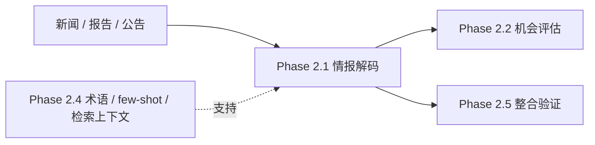

# Phase 2.1 启动与拍板

> **文档类型**：执行轨实例文档
> **适用模块**：`Phase 2.1` 情报解码模块
> **状态**：首轮拍板待用户确认
> **最后更新**：2026-03-13

---

## 一、模块基本信息

| 字段 | 内容 |
|------|------|
| **模块名称** | 阶段2.1 情报解码模块 |
| **模块编号** | `Phase 2.1` |
| **启动日期** | 2026-03-13 |
| **模块负责人** | 待通过 `2.1` 团队重组后确认，建议由“信息抽取负责人”牵头 |
| **协作团队** | 结构化契约负责人 / Prompt策略负责人 / 评测与验收负责人 / 实现落地工程师 / 上下游协调负责人 |
| **上游输入** | `phase2.1_目标说明.md`、`phase2.4_启动与拍板.md`、`phase2.4_进展与待拍板事项.md`、`阶段2团队构建方案.md`、`招聘团队工作流程.md`、`SKILL0_COORDINATOR.md` |
| **下游服务对象** | `Phase 2.2` 机会评估模块、`Phase 2.5` 整合验证与复盘 |
| **当前状态** | `允许启动（低耦合部分先行，深度依赖 2.4 真实能力的部分暂缓）` |

---

## 二、模块定位与目标

### 2.1 一句话定义

> `Phase 2.1` 的职责不是直接产出机会结论或行动建议，而是把新闻、报告、公告等**非结构化输入**转化为可追溯、可评分、可被下游稳定消费的**结构化范式信号**。

### 2.2 当前阶段目标

- **要解决的问题**：下游评估模块需要稳定、统一、可解释的信号输入；如果直接让下游面对原始文本，会导致标准不统一、证据不可追溯、质量难评估。
- **直接价值**：交付“原始信息 → 信号抽取 → 评分 → 结构化输出”的最小闭环，让 `2.2` 可以基于统一输入做机会评估。
- **复用价值**：后续可复用于其他赛道的信息抽取、情报清洗和结构化分析任务。
- **面试展示价值**：体现“把非结构化业务信息变成标准化机器可消费中间层”的 AI-native 系统设计能力。
- **工程沉淀价值**：沉淀信号分类标准、最小 Schema、评分口径、标注基线与跨模块契约。

### 2.3 本次启动范围

- **MVP 必做**
  - 冻结首版信号分类体系：`technical / market / team / capital`
  - 冻结首版 `Signal` 与 `DecodedIntelligence` 最小 JSON 契约
  - 打通 `news / report / announcement` 三类输入的统一抽取流程
  - 采用 `Prompt-first + 轻量校验/后处理` 的最小实现策略
  - 建立首版标注集与 benchmark（建议首轮 `30` 条样本）
  - 产出 `2.1 -> 2.2` 的输入样例、字段说明和调用约定
- **明确不做**
  - 不在 `2.1` 内直接生成 `2.2` 层的机会高低结论
  - 不把多 Agent 辩论、综合打分、行动建议提前塞进 `2.1`
  - 不在 `2.4` 真实能力未稳定前，过度绑定其最终输出格式
  - 不在首轮拍板前扩张过多信号类别、复杂规则引擎或多模型投票链路
- **完整版方向**
  - 规则 + LLM 混合抽取
  - `evidence_span` / `entity_refs` / `normalization_status` 等增强字段
  - 基于 `2.4` 的真实 few-shot、术语库和检索上下文增强抽取质量
  - 反馈学习机制与误报/漏报复盘闭环
- **当前最大风险**
  - `2.4` 当前仍有部分真实能力未完全稳定，若 `2.1` 过早深度耦合，会导致 Schema、Prompt 和评测口径反复返工。

---

## 三、上下游与依赖关系

### 3.1 上下游关系图



### 3.2 依赖说明

- **直接输入依赖**：`2.1` 直接处理原始信息源，包括新闻、行业报告、公告等非结构化文本。
- **知识依赖**：`2.4` 负责提供术语库、few-shot 样例和可选检索上下文，但这些能力当前属于“逐步可用”状态，不应成为 `2.1` 启动前置阻塞。
- **下游语义依赖**：`2.2` 需要 `2.1` 提供稳定的字段名、评分口径和可追溯证据，否则后续评估标准无法统一。
- **治理依赖**：`2.1` 必须先冻结“边界 / 契约 / 验收 / 待拍板事项”，否则即使代码先跑起来，也难以形成可复用模块。

### 3.3 启动条件判断

- **现在可以启动的内容**
  - `Signal` Schema 设计
  - 信号分类标准草案
  - Prompt 模板骨架
  - 首轮测试集与标注规则
  - 不依赖真实 RAG 的本地闭环验证
- **暂不建议深做的内容**
  - 强依赖 `2.4` 真实检索质量的高精度 Prompt 调优
  - 严重耦合 `2.4` 最终输出协议的接口细节
  - 需要大量真实上下文增强才能验证的高阶抽取策略

---

## 四、契约草案

### 4.1 输入契约

#### A. `IntelligenceDecodeRequest`

| 字段 | 类型 | 必填 | 含义 | 备注 |
|------|------|------|------|------|
| `source_id` | `string` | Y | 原始信息唯一ID | 用于追踪与去重 |
| `source_type` | `string` | Y | 信息源类型 | 当前限定 `news / report / announcement` |
| `title` | `string` | N | 原始标题 | 可为空，但建议保留 |
| `content` | `string` | Y | 原始正文 | MVP 核心输入 |
| `published_at` | `string` | N | 发布时间 | ISO 风格日期字符串 |
| `source_name` | `string` | N | 来源名称 | 如媒体、机构、公告主体 |
| `language` | `string` | N | 语言标记 | 默认 `zh-CN` |
| `retrieval_context` | `object[]` | N | 来自 `2.4` 的补充上下文 | 当前为可选增强项 |
| `mode` | `string` | N | 解码模式 | 默认 `prompt_first` |

### 4.2 输出契约

#### A. `Signal` 最小字段

| 字段 | 类型 | 必填 | 含义 | 备注 |
|------|------|------|------|------|
| `signal_id` | `string` | Y | 信号唯一ID | 如 `sig_001` |
| `signal_type` | `string` | Y | 信号分类 | 当前限定 `technical / market / team / capital` |
| `signal_label` | `string` | Y | 信号标签 | 如“跨平台发行”“核心团队扩张” |
| `description` | `string` | Y | 信号描述 | 简洁说明抽取结论 |
| `evidence_text` | `string` | Y | 证据原文片段 | 必须可回溯 |
| `entities` | `string[]` | Y | 关联实体 | 允许为空数组 |
| `intensity_score` | `integer` | Y | 强度评分 | 范围 `1-10` |
| `confidence_score` | `integer` | Y | 可信度评分 | 范围 `1-10` |
| `timeliness_score` | `integer` | Y | 时效性评分 | 范围 `1-10` |
| `source_ref` | `string` | Y | 对应原始来源ID | 与 `source_id` 对齐 |
| `extracted_at` | `string` | Y | 抽取时间 | ISO 风格日期字符串 |
| `metadata` | `object` | N | 扩展信息 | 预留兼容后续增强 |

#### B. `DecodedIntelligence` 最小字段

| 字段 | 类型 | 必填 | 含义 | 备注 |
|------|------|------|------|------|
| `source_id` | `string` | Y | 原始输入ID | |
| `source_type` | `string` | Y | 输入来源类型 | |
| `signals` | `Signal[]` | Y | 抽取后的信号列表 | 允许为空数组但必须返回 |
| `summary` | `string` | N | 人类可读摘要 | 作为辅助解释，不替代结构化字段 |
| `decoder_version` | `string` | Y | 解码版本号 | 便于基线对照 |
| `processing_time_ms` | `integer` | Y | 处理耗时 | 毫秒 |
| `warnings` | `string[]` | N | 风险或异常提示 | 如“原文过短”“证据不足” |

### 4.3 契约原则

- **核心目标是结构化，不是写漂亮总结**：`signals` 才是正式交付物，`summary` 仅作辅助说明。
- **证据必须可追溯**：每个信号必须能回到原文片段，避免“有结论、无证据”。
- **评分是信号级评分，不是机会级评分**：`intensity / confidence / timeliness` 仅用于描述信号，不等同于 `2.2` 的综合判断。
- **先冻结最小字段，再逐步增强**：MVP 阶段优先保证字段稳定与联调可用，不追求一步到位。
- **对 `2.4` 保持弱耦合兼容**：`retrieval_context` 和增强字段都作为可选输入，避免 `2.1` 被基础设施成熟度绑死。

### 4.4 契约检查表

| 问题 | 结论 | 备注 |
|------|------|------|
| **输入是否明确？** | 是 | 已定义三类最小输入源 |
| **输出是否明确？** | 是 | `Signal` 与 `DecodedIntelligence` 已给出最小字段 |
| **是否区分正式字段与辅助字段？** | 是 | `signals` 为主，`summary` 为辅 |
| **是否考虑未来扩展？** | 是 | 通过 `metadata` 与可选增强字段承接 |
| **是否避免越界到 `2.2`？** | 是 | 不产出机会结论 |
| **是否便于其他模块稳定消费？** | 有条件可以 | 仍需用户确认字段与评分口径 |

---

## 五、验收与评测

### 5.1 效果定义

- **功能层目标**：能够稳定处理 `news / report / announcement` 三类输入，并输出合法结构化结果。
- **质量层目标**：抽取结果应具备可解释性、可追溯性和可评分性，而不是只给模糊总结。
- **性能层目标**：单条处理耗时控制在可接受范围内，MVP 目标 `< 30s`。
- **协作层目标**：`2.2` 可以按冻结字段直接消费，不需要自行二次拆解文本。
- **展示层目标**：至少提供 `1-2` 个完整样例，演示“原文 → 信号 → 评分 → 输出”的最小闭环。

### 5.2 指标表

| 层级 | 指标 | 目标值 | 测量方式 |
|------|------|--------|----------|
| **功能层** | 输入源覆盖 | 至少 `3` 类 | 样例回归测试 |
| **质量层** | 信号提取准确率 | `>= 80%` | 首轮人工标注集对比 |
| **质量层** | 信号召回率 | `>= 75%` | 标注集对比 |
| **质量层** | Schema 合法率 | `100%` | JSON Schema 校验 |
| **性能层** | 单次处理耗时 | `< 30s` | 本地基准测试 |
| **协作层** | 下游可接入性 | `2.2` 可直接消费 | 接口走读 + 样例联调 |
| **展示层** | 可演示性 | 至少 `1` 条完整案例 | Demo记录 |

### 5.3 基线与实验

- **Benchmark 样本数量**：首轮建议 `30` 条
- **样本覆盖**：至少覆盖 `news / report / announcement` 三类输入，以及四类信号
- **标注重点**：信号是否被识别、分类是否正确、证据是否充分、评分是否合理
- **责任建议**：评测与验收负责人维护标注基线，用户负责最终方向性拍板
- **效果不达标时的排查顺序**：标注口径 → Prompt 设计 → 字段定义 → 后处理规则 → `2.4` 增强上下文质量

---

## 六、职责划分与协作边界

### 6.1 人与 AI 的职责划分

| 工作类型 | 负责人 | 原因 |
|----------|--------|------|
| **模块边界定义** | 人 | 涉及模块职责与跨阶段边界 |
| **关键设计拍板** | 人 | 涉及取舍与优先级 |
| **Schema / 文档初稿** | AI / 数字团队 | 适合结构化整理与快速产出 |
| **Prompt 草拟与样例构造** | AI / 数字团队 | 适合快速迭代 |
| **质量验收** | 人主导 + AI辅助 | 需要业务判断与客观指标结合 |
| **最终取舍决策** | 人 | 避免执行团队越权扩范围 |

### 6.2 协作机制

- **单一事实源**：
  - `2.1` 目标范围看 `phase2.1_目标说明.md`
  - `2.1` 正式边界、契约与拍板项看本文档
  - `2.4` 当前可用支撑能力看 `phase2.4_进展与待拍板事项.md`
  - 团队搭建和 Skill 流程依据看 `招聘团队工作流程.md` 与 `SKILL0_COORDINATOR.md`
- **文件所有权**：
  - `2.1` 团队负责人维护本文档
  - 结构化契约负责人维护 Schema 与字段说明
  - 评测与验收负责人维护 benchmark 与标注集
- **共享文件限制**：关键结论必须先写回本文档，再继续扩实现或扩数据
- **同步节奏**：每完成一轮拍板、一次字段冻结或一版 benchmark，先更新本文档，再继续推进实现

### 6.3 数字员工建队 / 启动清单

`2.1` 启动应遵循“**先冻结治理，再按缺口补位建队，再由多角色收敛设计，最后进入实现**”的顺序，而不是一上来直接写代码，或为了形式完整而机械重跑整套流程。

#### A. 建队与启动主路径

```text
Skill 0 协调本轮目标
→ Skill 8 分析 2.1 团队缺口与推荐配置
→ Skill 7 / Skill 1 完成角色部署、补位与数字员工落档
→ 方案设计负责人牵头组织多角色讨论
→ 产出 `phase2.1_设计方案.md` 与首轮待拍板事项
→ 用户完成关键拍板
→ 实现、评测、联调与资产沉淀
→ Skill 2~6 持续支撑协作、任务拆解、日志与知识同步
```

#### B. 启动检查清单

| 阶段 | 关键动作 | 主责角色 | 产出物 | 进入下一步条件 |
|------|----------|----------|--------|----------------|
| **1. 冻结治理入口** | 确认 `2.1` 边界、MVP 范围、依赖模式与待拍板项 | 总协调 / 用户 | 本文档首轮确认版 | `7.1` 关键拍板项已拉齐 |
| **2. 按缺口补位建队** | 明确保留角色、新增角色、兼任关系，并完成数字员工落档 | 总协调 / Skill 路径负责人 | `2.1` 核心小队名单、角色分工 | 方案设计负责人、结构化契约负责人、评测负责人已落位 |
| **3. 多角色收敛设计** | 组织抽取、Schema、Prompt、评测四视角讨论 | 方案设计负责人 | `phase2.1_设计方案.md` 草案 | 设计取舍、非目标与主流程已收敛 |
| **4. 完成首轮拍板** | 对关键边界、输出契约、实现策略和验收口径做用户确认 | 用户 | 拍板结论回写 | 必拍板项已确认，禁止带着开放分歧进入实现 |
| **5. 启动 MVP 闭环** | 落地 `Prompt-first` 实现、轻量校验、首轮 benchmark 与样例联调 | 实现落地工程师 / 评测与验收负责人 | 可运行闭环、样例结果、基线数据 | Schema 合法率、准确率、召回率达到当前阶段目标 |
| **6. 进入下游联调** | 核对 `2.1 -> 2.2` 消费方式，并复查 `2.4` 增强依赖是否可接 | 结构化契约负责人 / 上下游协调负责人 | 联调结果、依赖复查记录 | 下游可稳定消费，上游依赖不构成强阻塞 |

#### C. 执行纪律

- **先建队、先讨论、先拍板，再进入实现**：`phase2.1_设计方案.md` 不应凭空先写，而应作为数字员工落位后、多角色讨论的正式产物。
- **本文档是启动动作单一事实源**：与“怎么建队、如何启动、何时进入实现”相关的执行动作，以本文档为准；团队重组文档只保留组织建议与角色配置依据。
- **`2.1` 不得借启动之名扩大范围**：在用户未拍板前，不得把机会判断、行动建议、复杂多 Agent 推理链提前塞进 `2.1`。
- **Skill 流程按目标定制化使用**：沿用已有方法论，但只调用与本轮补位、协作、资产沉淀直接相关的部分，不为形式重演整套仪式。

---

## 七、待拍板事项

### 7.1 现在必须拍板

| 决策项 | 可选方案 | 推荐方案 | 为什么现在必须定 | 拍板结果 |
|--------|----------|----------|------------------|----------|
| **模块边界** | A. 只做结构化信号抽取；B. 顺带做机会判断；C. 直接输出建议 | **A** | 会直接决定 `2.1` 是否越界侵入 `2.2 / 2.3` | 待定 |
| **MVP实现策略** | A. `Prompt-first + 轻量校验`；B. 同步做复杂规则引擎；C. 多模型投票起步 | **A** | 决定首轮是先打通闭环还是过早追求完整版 | 待定 |
| **`2.1 -> 2.2` 输出形态** | A. 自由文本；B. 半结构化章节；C. 固定 JSON + 可选摘要 | **C** | 下游评估必须稳定消费结构化字段 | 待定 |
| **首版信号分类体系** | A. 维持 `technical / market / team / capital`；B. 立即扩到 `6-8` 类；C. 暂不分类 | **A** | 决定标注、Prompt 与验收口径是否稳定 | 待定 |
| **对 `2.4` 的依赖模式** | A. 低耦合先启动，增强项后接入；B. 等 `2.4` 完全稳定再开始；C. 强依赖当前接口立刻深耦合 | **A** | 决定本周是否能启动 `2.1` 而不被阻塞 | 待定 |

### 7.2 本周最好拍板

| 决策项 | 可选方案 | 推荐方案 | 延后风险 | 拍板结果 |
|--------|----------|----------|----------|----------|
| **首轮 benchmark 样本量** | A. `10` 条；B. `30` 条；C. `50+` 条 | **B** | 样本太少无代表性，太多会拖慢启动 | 待定 |
| **评分口径定义方式** | A. 仅 Prompt 描述；B. Prompt + 明文评分规则表；C. 先不定义 | **B** | 不提前定义，后面准确率与一致性难比较 | 待定 |
| **标注与验收负责人** | A. 测试角色单独负责；B. 用户人工主导；C. 评测负责人主导 + 用户终审 | **C** | 没有冻结责任人，benchmark 难形成正式结论 | 待定 |
| **是否首轮引入后处理规则** | A. 先无规则；B. 只加轻量规范化；C. 直接上复杂规则引擎 | **B** | 纯 Prompt 容易漂移，复杂规则又会过重 | 待定 |

### 7.3 可后置拍板

| 决策项 | 建议何时再定 | 触发条件 | 备注 |
|--------|--------------|----------|------|
| **是否引入规则 + LLM 混合链路** | Week 2 | 首轮准确率 / 召回率不达标 | 先不要作为启动门槛 |
| **是否扩充信号类别** | Week 2-3 | 四类无法覆盖主要样本 | 应基于误差分析而不是主观扩类 |
| **是否增加实体标准化与关系图谱** | Week 3 | `2.2` 明确提出强依赖 | 属于增强项 |
| **是否让 `2.4` 上下文成为强制输入** | 待 `2.4` 真实能力稳定后 | 检索质量与接口形式已冻结 | 当前不宜前置 |

### 7.4 拍板项纪律

- 每个拍板项都必须附带**可选方案 + 推荐方案 + 推荐理由 + 延后风险**。
- 执行团队不得绕过本文档直接扩大 `2.1` 范围。
- 训练或讨论得出的结论，只有写回本文档并经用户确认后，才算正式生效。

---

## 八、启动结论

### 8.1 启动结论页

- **是否允许启动**：允许，但以低耦合内容先行
- **启动范围**：Schema、分类标准、Prompt 骨架、标注集、benchmark、样例联调
- **明确不做**：在用户未拍板前，不扩复杂推理链、不越界做 `2.2` 结论、不深度绑定 `2.4` 未稳定能力
- **当前最大风险**：若不尽快完成首轮拍板，`2.1` 会在字段、评分和依赖策略上产生返工
- **下次复查时间**：用户完成首轮拍板后立即复查；`2.4` 真实能力稳定后复查依赖策略

### 8.2 启动前最后检查

| 检查项 | 状态 | 备注 |
|--------|------|------|
| **模块目标明确** | ✅ | 已明确为结构化信号中间层 |
| **上下游依赖明确** | ✅ | `2.4` 支持、`2.2` 消费关系已明确 |
| **契约草案明确** | ✅ | 已给出最小字段与原则 |
| **拍板事项已整理** | ✅ | 已按优先级分类 |
| **用户已拍板关键项** | ⚠️ | 待本轮确认 |
| **MVP边界明确** | ✅ | 已冻结本轮不做项 |
| **验收方式明确** | ✅ | 已给出指标与基线建议 |
| **团队重组原则明确** | ✅ | 需配合《phase2.1_团队重组建议清单》执行 |

### 8.3 一句话总结

> `Phase 2.1` 现在已经具备启动条件，但最正确的启动方式不是直接重压实现，而是先冻结边界、契约、评测和团队分工，再以低耦合模式推进首轮闭环。