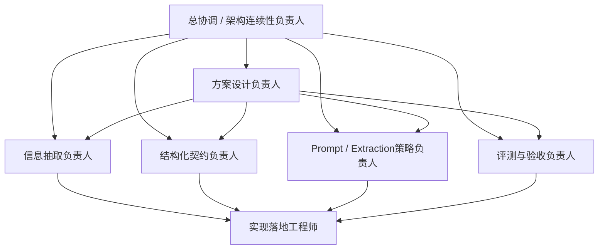

# Phase 2.1 团队重组建议清单

> **文档类型**：团队配置与组织建议文档
> **适用模块**：`Phase 2.1` 情报解码模块
> **状态**：建议版，待用户确认
> **最后更新**：2026-03-13

---

## 一、结论先行

> `2.1` 最合适的组织方式不是“整队推倒重来”，也不是“沿用 `2.4` 原班人马直接转段”，而是**围绕 `2.1` 目标做阶段性重组与补位**。

核心原因有三点：

1. **关注点变了**：`2.4` 关注知识底座、检索、接口与可用性；`2.1` 关注信号抽取、结构化建模、评测口径与输出契约。
2. **风险点变了**：`2.4` 的主要风险是“能力能否跑通”；`2.1` 的主要风险是“抽取得对不对、字段稳不稳、评测能不能闭环”。
3. **拍板内容变了**：`2.1` 更需要拍板“抽什么、怎么表示、如何验收、如何交给 `2.2`”，而不是继续围绕索引或检索能力打转。

---

## 二、重组原则

### 2.1 核心原则

- **保留连续性，不保留惯性**：保留少量跨阶段连续角色，避免上下文断裂；但不能让 `2.4` 的思维惯性主导 `2.1`。
- **让角色围绕目标，而不是围绕既有人员**：先看 `2.1` 需要哪些视角，再决定保留与补位。
- **优先补“判断维度缺口”**：`2.1` 最缺的不是“更多工程手”，而是“信息抽取、Schema、评测、上下游契约”这些关键判断角色。
- **遵循通用流程，但不机械重跑**：招聘与 Skill 流程已有文档，`2.1` 应按目标定制化应用，而不是为了形式完整重复整套仪式。

### 2.2 组织目标

本轮重组的目标不是把团队做大，而是形成一个**6-7 人的核心作战小队**，满足以下条件：

- 能冻结 `2.1` 的边界与 Schema
- 能先完成多角色视角下的设计方案收敛与首轮拍板
- 能快速打通首轮 Prompt-first MVP
- 能建立可比较的 benchmark
- 能稳定把结果交给 `2.2`
- 能与 `2.4` 保持必要协同但不过度耦合

---

## 三、现有团队基线与问题

### 3.1 当前基线

从现有规划文档看，`2.1` 的基础团队设想主要是：

- **情报解码工程师**
- **Prompt工程师**
- **测试工程师**

而 `2.4` 已存在的团队中心则更偏向：

- 知识库架构
- 数据工程
- 向量化与索引
- RAG 引擎
- 检索优化
- 接口设计

### 3.2 如果直接沿用 `2.4` 原班人马会出现的问题

| 问题 | 表现 | 风险 |
|------|------|------|
| **中心视角错位** | 更容易继续讨论知识、检索、接口，而不是信号定义与评测 | `2.1` 目标被稀释 |
| **结构化契约不足** | 会把重点放在“能跑”而非“字段稳定可消费” | 下游返工 |
| **评测角色不够强** | 容易缺少标注、准确率、召回率、一致性闭环 | 质量无法正式验收 |
| **抽取策略无人主责** | Prompt、后处理、规则边界缺少统一负责人 | 方案发散 |
| **跨阶段依赖容易过耦合** | 直接拿 `2.4` 当前接口硬绑定 | 随 `2.4` 变化而返工 |

---

## 四、建议保留 / 新增 / 替换的角色

### 4.1 建议保留的角色（少量连续性角色）

| 角色 | 来源 | 建议保留方式 | 保留原因 |
|------|------|--------------|----------|
| **总协调 / 架构连续性负责人** | 可由既有阶段负责人或 `2.4` 主责人兼任部分职责 | **保留** | 负责跨阶段边界、依赖节奏、文档回写，避免 `2.1` 与 `2.4` 脱节 |
| **上下游依赖把关角色** | 可沿用接口/协作意识较强的成员 | **保留或兼任** | 负责 `2.1 -> 2.2` 契约衔接，以及 `2.4 -> 2.1` 支撑边界 |

### 4.2 建议新增或强化的核心角色

| 角色 | 建议状态 | 核心职责 | 为什么必须有 |
|------|----------|----------|---------------|
| **方案设计负责人** | **新增核心角色** | 汇总抽取、Schema、Prompt、评测视角，收敛为 `2.1` 设计方案，并组织首轮设计拍板 | `2.1` 当前缺的不是更多执行手，而是把多视角输入收束成正式方案的主责角色 |
| **信息抽取负责人** | **新增核心角色** | 定义什么算“范式信号”、抽取主流程、误报漏报排查 | `2.1` 的主问题不是索引，而是抽取判断 |
| **结构化契约负责人** | **新增核心角色** | 冻结 `Signal` Schema、字段口径、枚举、兼容策略 | 没有人主责字段，就无法稳定交给 `2.2` |
| **Prompt / Extraction策略负责人** | **强化** | 设计 Prompt-first 策略、few-shot 组织方式、边界样本 | 影响首轮准确率和稳定性 |
| **评测与验收负责人** | **强化** | 设计 benchmark、维护标注规则、出具质量结论 | 没有评测闭环，`2.1` 很难真正验收 |
| **实现落地工程师** | **保留并聚焦** | 实现解码流程、格式校验、后处理、样例联调 | 负责把方案变成可运行模块 |

### 4.3 建议弱化为支撑而非中心的角色

| 角色方向 | 为什么不应继续作为 `2.1` 中心 |
|----------|------------------------------|
| **向量化 / 索引优化** | 这是 `2.4` 的核心，不是 `2.1` 的主战场 |
| **检索性能优化** | 对 `2.1` 当前 MVP 不是第一瓶颈 |
| **复杂 RAG 架构设计** | 当前 `2.1` 只需兼容接入，不应由此主导设计 |

---

## 五、推荐团队结构（建议版）

### 5.1 推荐编制

建议 `2.1` 采用以下 **7 角色核心小队**：

### 5.2 角色说明

#### 1. 总协调 / 架构连续性负责人

- **职责**：
  - 维护 `2.1` 启动与拍板文档
  - 把控 `2.1 / 2.4 / 2.2` 的边界与依赖
  - 组织关键拍板与文档回写
- **关键输出**：
  - 模块执行轨文档
  - 依赖状态判断
  - 拍板结果回写

#### 2. 方案设计负责人

- **职责**：
  - 汇总信息抽取、结构化契约、Prompt 策略、评测四个视角的输入
  - 组织多角色讨论，收敛 `2.1` 首版设计方案
  - 明确 MVP 路线、非目标与设计取舍
  - 组织首轮设计拍板，并把结论回写到正式文档
- **关键输出**：
  - `phase2.1_设计方案.md`
  - 方案备选路线与取舍说明
  - 首轮设计拍板结论

#### 3. 信息抽取负责人

- **职责**：
  - 定义“什么是要抽的信号”
  - 设计抽取步骤与错误分层
  - 决定何时需要引入规则辅助
- **关键输出**：
  - 信号定义说明
  - 抽取流程图
  - 误报/漏报分析记录

#### 4. 结构化契约负责人

- **职责**：
  - 定义 `Signal` 与 `DecodedIntelligence` 最小字段
  - 维护枚举、评分口径和兼容策略
  - 对接 `2.2` 的消费要求
- **关键输出**：
  - JSON Schema
  - 字段说明文档
  - 向下游交付样例

#### 5. Prompt / Extraction策略负责人

- **职责**：
  - 设计 Prompt-first MVP 方案
  - 组织 few-shot 与边界样例
  - 设计 Prompt 迭代记录方式
- **关键输出**：
  - Prompt 模板库
  - few-shot 样例集
  - Prompt 版本对比记录

#### 6. 评测与验收负责人

- **职责**：
  - 维护标注规则与 benchmark
  - 度量准确率、召回率、Schema 合法率
  - 形成“可验收 / 不可验收”的正式判断
- **关键输出**：
  - 标注规范
  - benchmark 集合
  - 验收报告

#### 7. 实现落地工程师

- **职责**：
  - 把 Schema、Prompt、后处理与校验落成可运行模块
  - 完成样例联调与错误处理
  - 保证模块可被 `2.2` 集成
- **关键输出**：
  - 解码代码
  - 校验逻辑
  - 示例输入输出

---

## 六、从现有角色到新结构的映射建议

### 6.1 旧设想到新结构的映射

| 现有角色设想 | 建议调整 | 原因 |
|--------------|----------|------|
| **情报解码工程师** | 拆成“方案设计负责人 + 信息抽取负责人 + 实现落地工程师” | `2.1` 不仅要实现解码，还要先形成正式设计方案 |
| **Prompt工程师** | 升级为“Prompt / Extraction策略负责人” | 不只是写 Prompt，而是负责整套抽取策略 |
| **测试工程师** | 升级为“评测与验收负责人” | `2.1` 的测试重点不是功能冒烟，而是质量基线 |
| **无专门 Schema 角色** | 新增“结构化契约负责人” | 这是 `2.1` 当前最关键的新补位 |
| **无连续性角色** | 新增“总协调 / 架构连续性负责人” | 防止与 `2.4 / 2.2` 脱节 |
| **无专门设计收敛角色** | 新增“方案设计负责人” | 防止多视角输入存在但始终无法收敛成拍板方案 |

### 6.2 与 `2.4` 团队的关系

建议把 `2.4` 成员视为**支撑方**而不是 `2.1` 主导方：

- `2.4` 继续负责：术语库、few-shot 资料、可选检索上下文、知识底座
- `2.1` 自己负责：信号定义、字段契约、Prompt 策略、评测闭环
- 协同原则：`2.4` 提供支撑，`2.1` 决定是否吸收，不应反过来让 `2.4` 的实现状态决定 `2.1` 的核心边界

---

## 七、建议采用的招聘 / Skill 路径

### 7.1 执行口径

本文件只回答**为什么要这样重组、应该保留/新增哪些角色、角色之间如何分工**；与“按什么顺序建队、如何启动、何时进入实现”相关的执行动作，统一以 [phase2.1_启动与拍板.md](f:\AIProjects\DesignAssistant\data-layer\projects\proj_004\phase2_plan\phase2.1_启动与拍板.md) 中的 `6.3 数字员工建队 / 启动清单` 为准。

### 7.2 为什么不是“从 Skill0 到 Skill8 全套重演”

因为当前缺的不是“有没有流程”，而是“有没有把 `2.1` 自己的执行治理和角色缺口补齐”。

所以本轮更合理的做法是：

- **沿用已有流程规范**
- **按 `2.1` 目标补齐关键角色，而不是为形式重演整套仪式**
- **由已落位的数字员工从不同角色视角讨论并收敛设计方案**
- **把关键设计项拉出来拍板**
- **拍板完成后再进入实现与验收**

也就是说，`phase2.1_设计方案.md` 仍应作为**团队落位后、多角色讨论的正式产物**，但具体启动动作不再在本文件重复展开。

### 7.3 本文件与启动文档的分工

- **本文件负责**：组织原则、角色配置、保留/新增/弱化建议、旧角色到新结构的映射。
- **启动文档负责**：建队顺序、启动检查清单、拍板前后执行纪律、进入实现条件。
- **使用方式**：先用本文件确定“怎么组队”，再按启动文档执行“如何启动”。

---

## 八、需要你拍板的组织决策

### 8.1 现在必须拍板

| 决策项 | 可选方案 | 推荐方案 | 原因 | 当前状态 |
|--------|----------|----------|------|----------|
| **是否重组** | A. 沿用原班人马；B. 按目标补位重组；C. 完全重建团队 | **B** | 兼顾连续性与新视角 | 待定 |
| **是否新增结构化契约负责人** | A. 新增专责；B. 由实现兼任；C. 不设 | **A** | `2.1` 的核心风险之一就是字段不稳 | 待定 |
| **是否保留跨阶段连续性角色** | A. 保留；B. 不保留 | **A** | 避免 `2.1` 与 `2.4 / 2.2` 脱节 | 待定 |
| **评测是否独立成角色** | A. 独立；B. 由开发顺带做；C. 用户单独做 | **A** | 没有独立评测，质量很难真正冻结 | 待定 |

### 8.2 本周最好拍板

| 决策项 | 可选方案 | 推荐方案 | 延后风险 | 当前状态 |
|--------|----------|----------|----------|----------|
| **团队规模** | A. `3` 人；B. `5-6` 人核心小队；C. `7+` 人 | **C（控制在 `7` 人左右）** | 过小缺视角，过大反而启动慢 | 待定 |
| **与 `2.4` 的协作方式** | A. `2.4` 主导；B. `2.1` 主导、`2.4` 支撑；C. 强耦合共队 | **B** | 不明确会反复争抢边界 | 待定 |
| **新增角色的编号/落位方式** | A. 新编号；B. 原角色改造；C. 混合方式 | **C** | 关系到后续员工档案与项目分配 | 待定 |
| **设计方案产出方式** | A. 由单人直接起草；B. 先建数字员工后多角色讨论产出；C. 直接边实现边补 | **B** | 若跳过多角色讨论，设计会再次退化为单视角实现方案 | 待定 |

---

## 九、建议的启动动作清单

本节不再重复展开启动步骤，统一引用 [phase2.1_启动与拍板.md](f:\AIProjects\DesignAssistant\data-layer\projects\proj_004\phase2_plan\phase2.1_启动与拍板.md) 中的以下内容：

- `6.3 数字员工建队 / 启动清单`
- `7.1 现在必须拍板`
- `8.2 启动前最后检查`

本文件仅补充一条组织使用口径：

- **先用本文件确认角色结构与补位原则，再按启动文档执行建队和启动。**
- **若两份文件对启动动作存在表述差异，以启动文档为准。**
- **若两份文件对角色设置存在表述差异，应先回到本文档完成组织拍板，再更新启动文档中的执行名单。**

---

## 十、一句话结论

> `2.1` 最值得做的不是“复制 `2.4` 的团队配置”，而是围绕“方案设计收敛、信息抽取、结构化契约、评测闭环、上下游边界”重新组织一个更贴合目标的核心小队；建议采用“保留少量连续性角色 + 补齐关键新角色 + 先建数字员工后多角色产出设计方案”的方式推进。