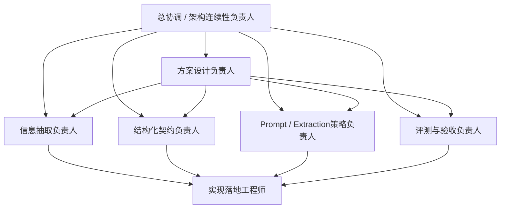

# Phase 2.1 角色面具配置方案与执行路径

> **文档类型**：角色面具配置与执行方案
> **适用模块**：`Phase 2.1` 情报解码模块
> **角色协作模式**：同一 Agent 下的角色面具协作小队
> **状态**：方案设计版，待用户拍板
> **最后更新**：2026-03-14

---

## 一、方案概述

### 1.1 核心目标

基于 `phase2.1_启动与拍板.md` 和 `phase2.1_团队重组建议清单.md` 的要求，本方案明确：

1. **Phase 2.1 需要哪些职责视角（角色面具）**
2. **应该按什么顺序定义和使用这些角色面具**
3. **如何通过角色面具协作产出设计方案**
4. **哪些关键决策需要用户拍板后才能进入执行**

### 1.2 设计原则

- **先治理后定义角色**：先冻结边界、契约、评测，再定义角色面具
- **按缺口补位**：不是复制 2.4 团队，而是围绕 2.1 目标补齐关键职责视角
- **多角色收敛设计**：由同一 Agent 切换不同角色面具讨论，产出 `phase2.1_设计方案.md`
- **低耦合启动**：不等 2.4 完全稳定，先启动低依赖部分
- **角色面具协作，不是多 Agent 自治**：7 个职责视角由同一个 Agent 完成，不是 7 个独立 Agent

---

## 二、Phase 2.1 所需职责视角清单

### 2.1 核心职责视角配置（7 个职责维度）

根据 `phase2.1_团队重组建议清单.md` 的推荐，Phase 2.1 需要以下 7 个职责视角：

| 序号 | 职责视角 | 角色类型 | 核心职责 | 为什么必须有 |
|------|----------|----------|----------|--------------|
| 1 | **总协调 / 架构连续性视角** | 保留角色 | 维护执行轨文档、把控跨阶段边界、组织拍板 | 防止 2.1 与 2.4/2.2 脱节 |
| 2 | **方案设计负责人视角** | 新增核心角色 | 汇总多视角输入、收敛设计方案、组织首轮拍板 | 2.1 缺的不是执行手，而是收束方案的主责角色 |
| 3 | **信息抽取负责人视角** | 新增核心角色 | 定义范式信号、设计抽取流程、排查误报漏报 | 2.1 的主问题是抽取判断，不是索引 |
| 4 | **结构化契约负责人视角** | 新增核心角色 | 冻结 Signal Schema、字段口径、枚举、兼容策略 | 没有人主责字段，就无法稳定交给 2.2 |
| 5 | **Prompt / Extraction 策略负责人视角** | 强化角色 | 设计 Prompt-first 策略、few-shot 组织、边界样本 | 影响首轮准确率和稳定性 |
| 6 | **评测与验收负责人视角** | 强化角色 | 设计 benchmark、维护标注规则、出具质量结论 | 没有评测闭环，2.1 很难真正验收 |
| 7 | **实现落地工程师视角** | 保留并聚焦 | 实现解码流程、格式校验、后处理、样例联调 | 把方案变成可运行模块 |

**重要说明**：
- 这 7 个是职责维度，不是 7 个独立 Agent
- 由同一个 Agent 切换角色面具完成
- 执行时可压缩为 5-6 个角色面具
- 详细角色定义见 [phase2.1_roles.md](phase2_roles/phase2.1_roles.md)

### 2.2 角色协作关系



### 2.3 与 Phase 2.4 团队的协作边界

| 职责 | 2.1 团队负责 | 2.4 团队负责 | 协作原则 |
|------|-------------|-------------|----------|
| **信号定义** | ✅ | ❌ | 2.1 主导 |
| **字段契约** | ✅ | ❌ | 2.1 主导 |
| **Prompt 策略** | ✅ | ❌ | 2.1 主导 |
| **评测闭环** | ✅ | ❌ | 2.1 主导 |
| **术语库** | ❌ | ✅ | 2.4 提供支撑 |
| **few-shot 资料** | ❌ | ✅ | 2.4 提供支撑 |
| **检索上下文** | ❌ | ✅ | 2.4 提供可选增强 |
| **知识底座** | ❌ | ✅ | 2.4 提供支撑 |

**协作原则**：2.4 提供支撑，2.1 决定是否吸收，不应反过来让 2.4 的实现状态决定 2.1 的核心边界。

---

## 三、Skill 调用路径与执行顺序

### 3.1 建队与启动主路径

根据 `phase2.1_启动与拍板.md` 第 6.3 节的要求，Phase 2.1 应遵循以下路径：

```text
Skill 0 协调本轮目标
  ↓
Skill 8 分析 2.1 团队缺口与推荐配置
  ↓
Skill 7 / Skill 1 完成角色部署、补位与角色面具落档
  ↓
方案设计负责人牵头组织多角色讨论
  ↓
产出 `phase2.1_设计方案.md` 与首轮待拍板事项
  ↓
用户完成关键拍板
  ↓
实现、评测、联调与资产沉淀
  ↓
Skill 2~6 持续支撑协作、任务拆解、日志与知识同步
```

### 3.2 详细执行步骤

#### 阶段 1：冻结治理入口（当前阶段）

**主责角色**：总协调 / 用户

**关键动作**：
- ✅ 确认 `phase2.1_启动与拍板.md` 已完成
- ✅ 确认 `phase2.1_团队重组建议清单.md` 已完成
- ⚠️ 待拍板：7.1 节的 5 个关键决策项

**产出物**：
- 本文档（角色面具配置方案）
- 待拍板清单

**进入下一步条件**：
- 用户完成 7.1 节关键拍板项

---

#### 阶段 2：按缺口补位建队

**主责角色**：总协调 / Skill 路径负责人

**Skill 调用顺序**：

**Step 1：使用 Skill 0 协调本轮目标**
```
目标：明确 Phase 2.1 的核心目标、边界、依赖关系
输入：phase2.1_启动与拍板.md、phase2.1_团队重组建议清单.md
输出：Phase 2.1 目标摘要、关键约束、待建队清单
```

**Step 2：使用 Skill 8 分析团队缺口与推荐配置**
```
目标：基于 2.1 目标，分析需要哪些角色、如何补位
输入：
  - Phase 2.1 目标摘要
  - phase2.1_团队重组建议清单.md 中的 7 角色配置
  - 现有 2.4 团队基线
输出：
  - 2.1 核心小队配置方案
  - 保留/新增/弱化角色清单
  - 与 2.4 的协作边界
```

**Step 3：使用 Skill 7 或 Skill 1 完成角色部署**

**方案 A：如果存在高匹配度模板（推荐）**
```
使用 Skill 7：快速团队模板系统
  - 检查是否有"情报解码团队"模板
  - 如果有，基于模板一键部署 7 个角色
  - 如果没有，创建新模板并保存
```

**方案 B：如果无模板或需要高度定制**
```
使用 Skill 1：角色面具招募与管理
  - 逐个创建 7 个角色面具
  - 定义每个员工的职责、技能、协作关系
  - 完成员工档案落档
```

**产出物**：
- 2.1 核心小队名单（7 个角色面具）
- 角色分工文档
- 角色面具档案（存储在 `data-layer/employees/`）

**进入下一步条件**：
- 方案设计负责人、结构化契约负责人、评测负责人已落位

---

#### 阶段 3：多角色收敛设计

**主责角色**：方案设计负责人

**关键动作**：
1. **组织多角色讨论**
   - 信息抽取负责人：提出"什么是要抽的信号"、抽取流程
   - 结构化契约负责人：提出 Signal Schema、字段口径
   - Prompt 策略负责人：提出 Prompt-first 实现策略
   - 评测负责人：提出 benchmark 设计、标注规则

2. **收敛设计方案**
   - 汇总四个视角的输入
   - 识别冲突与取舍点
   - 明确 MVP 路线与非目标
   - 形成统一的设计方案草案

3. **整理待拍板事项**
   - 从设计讨论中提取关键决策项
   - 按优先级分类（现在必须拍板 / 本周最好拍板 / 可后置拍板）
   - 为每个决策项提供可选方案、推荐方案、推荐理由

**产出物**：
- `phase2.1_设计方案.md` 草案
- 方案备选路线与取舍说明
- 首轮设计拍板清单

**进入下一步条件**：
- 设计取舍、非目标、主流程已收敛
- 待拍板事项已整理完毕

---

#### 阶段 4：完成首轮拍板

**主责角色**：用户

**关键动作**：
- 审阅 `phase2.1_设计方案.md` 草案
- 对关键边界、输出契约、实现策略、验收口径做确认
- 拍板必拍板项，明确可后置项

**产出物**：
- 拍板结论回写到 `phase2.1_启动与拍板.md`
- 更新 `phase2.1_设计方案.md` 为正式版

**进入下一步条件**：
- 必拍板项已确认
- 禁止带着开放分歧进入实现

---

#### 阶段 5：启动 MVP 闭环

**主责角色**：实现落地工程师 / 评测与验收负责人

**关键动作**：
1. **实现落地工程师**：
   - 落地 Prompt-first 实现
   - 实现轻量校验与后处理
   - 完成样例联调

2. **评测与验收负责人**：
   - 构建首轮 benchmark（30 条样本）
   - 维护标注规则
   - 运行基线测试
   - 出具验收报告

**Skill 支撑**：
- **Skill 2**：创建 Phase 2.1 项目，分配任务
- **Skill 3**：管理任务依赖与里程碑
- **Skill 4**：管理项目资产（Schema、Prompt 模板、benchmark）
- **Skill 5**：记录工作日志，生成复盘报告
- **Skill 6**：分享关键知识（标注规则、评分口径）

**产出物**：
- 可运行的解码模块
- 首轮 benchmark 与基线数据
- 样例输入输出
- 验收报告

**进入下一步条件**：
- Schema 合法率 100%
- 准确率 >= 80%
- 召回率 >= 75%
- 单次处理耗时 < 30s

---

#### 阶段 6：进入下游联调

**主责角色**：结构化契约负责人 / 上下游协调负责人

**关键动作**：
- 核对 `2.1 -> 2.2` 消费方式
- 提供样例输入输出
- 复查 `2.4` 增强依赖是否可接
- 确认下游可稳定消费

**产出物**：
- 联调结果记录
- 依赖复查报告
- 向 2.2 交付的接口文档与样例

**进入下一步条件**：
- 下游可稳定消费
- 上游依赖不构成强阻塞

---

### 3.3 Skill 使用时机总结

| Skill | 使用阶段 | 使用目的 | 是否必须 |
|-------|----------|----------|----------|
| **Skill 0** | 阶段 2 | 协调本轮目标，明确边界与依赖 | ✅ 必须 |
| **Skill 8** | 阶段 2 | 分析团队缺口，推荐配置 | ✅ 必须 |
| **Skill 7** | 阶段 2 | 一键部署团队（如果有模板） | 推荐 |
| **Skill 1** | 阶段 2 | 逐个创建角色面具（如果无模板） | 备选 |
| **Skill 2** | 阶段 5 | 创建项目，分配任务 | ✅ 必须 |
| **Skill 3** | 阶段 5 | 管理任务依赖与里程碑 | ✅ 必须 |
| **Skill 4** | 阶段 5 | 管理项目资产 | ✅ 必须 |
| **Skill 5** | 阶段 5 | 记录工作日志，生成复盘 | ✅ 必须 |
| **Skill 6** | 阶段 5 | 分享关键知识 | 推荐 |

---

## 四、待拍板事项清单

### 4.1 现在必须拍板（阻塞启动）

| 决策项 | 可选方案 | 推荐方案 | 为什么现在必须定 | 拍板结果 |
|--------|----------|----------|------------------|----------|
| **是否重组团队** | A. 沿用 2.4 原班人马；B. 按目标补位重组；C. 完全重建团队 | **B** | 决定是否启用 Skill 8 分析缺口 | 待定 |
| **是否新增结构化契约负责人** | A. 新增专责；B. 由实现兼任；C. 不设 | **A** | 2.1 的核心风险之一就是字段不稳 | 待定 |
| **是否保留跨阶段连续性角色** | A. 保留；B. 不保留 | **A** | 避免 2.1 与 2.4/2.2 脱节 | 待定 |
| **评测是否独立成角色** | A. 独立；B. 由开发顺带做；C. 用户单独做 | **A** | 没有独立评测，质量很难真正冻结 | 待定 |
| **是否使用 Skill 7 模板系统** | A. 使用模板一键部署；B. 使用 Skill 1 逐个创建；C. 手动创建 | **A** | 决定建队效率与标准化程度 | 待定 |

### 4.2 本周最好拍板（影响执行效率）

| 决策项 | 可选方案 | 推荐方案 | 延后风险 | 拍板结果 |
|--------|----------|----------|----------|----------|
| **团队规模** | A. 3 人；B. 5-6 人核心小队；C. 7+ 人 | **C（控制在 7 人左右）** | 过小缺视角，过大反而启动慢 | 待定 |
| **与 2.4 的协作方式** | A. 2.4 主导；B. 2.1 主导、2.4 支撑；C. 强耦合共队 | **B** | 不明确会反复争抢边界 | 待定 |
| **设计方案产出方式** | A. 由单人直接起草；B. 先建角色面具后多角色讨论产出；C. 直接边实现边补 | **B** | 若跳过多角色讨论，设计会再次退化为单视角实现方案 | 待定 |
| **角色面具档案存储位置** | A. 使用 data-layer/employees/；B. 使用 proj_004 专属目录；C. 不落档 | **A** | 影响后续复用与追溯 | 待定 |

### 4.3 可后置拍板（不阻塞启动）

| 决策项 | 建议何时再定 | 触发条件 | 备注 |
|--------|--------------|----------|------|
| **是否引入规则 + LLM 混合链路** | Week 2 | 首轮准确率 / 召回率不达标 | 先不要作为启动门槛 |
| **是否扩充信号类别** | Week 2-3 | 四类无法覆盖主要样本 | 应基于误差分析而不是主观扩类 |
| **是否增加实体标准化与关系图谱** | Week 3 | 2.2 明确提出强依赖 | 属于增强项 |
| **是否让 2.4 上下文成为强制输入** | 待 2.4 真实能力稳定后 | 检索质量与接口形式已冻结 | 当前不宜前置 |

---

## 五、执行纪律与风险控制

### 5.1 执行纪律

1. **先建队、先讨论、先拍板，再进入实现**
   - `phase2.1_设计方案.md` 不应凭空先写，而应作为角色面具落位后、多角色讨论的正式产物

2. **本文档是启动动作单一事实源**
   - 与"怎么建队、如何启动、何时进入实现"相关的执行动作，以本文档为准

3. **2.1 不得借启动之名扩大范围**
   - 在用户未拍板前，不得把机会判断、行动建议、复杂多 Agent 推理链提前塞进 2.1

4. **Skill 流程按目标定制化使用**
   - 沿用已有方法论，但只调用与本轮补位、协作、资产沉淀直接相关的部分，不为形式重演整套仪式

### 5.2 风险控制

| 风险 | 概率 | 影响 | 应对措施 |
|------|------|------|---------|
| **用户未完成关键拍板** | 中 | 高 | 明确标注"阻塞启动"的拍板项，不拍板不进入下一步 |
| **角色面具角色定义不清** | 中 | 中 | 使用 Skill 8 分析缺口，明确职责边界 |
| **多角色讨论无法收敛** | 中 | 高 | 方案设计负责人主导收敛，必要时用户介入拍板 |
| **与 2.4 边界模糊** | 高 | 中 | 明确协作原则：2.4 提供支撑，2.1 决定是否吸收 |
| **Schema 反复返工** | 中 | 高 | 结构化契约负责人专责，先冻结最小字段再扩展 |

---

## 六、下一步行动

### 6.1 立即行动（等待用户拍板）

**当前状态**：阶段 1 - 冻结治理入口

**待用户拍板**：
- ✅ 4.1 节的 5 个关键决策项（现在必须拍板）
- 推荐：4.2 节的 4 个决策项（本周最好拍板）

**拍板完成后**：
- 进入阶段 2：按缺口补位建队
- 启动 Skill 0 → Skill 8 → Skill 7/1 的调用路径

### 6.2 预期时间线

| 阶段 | 预计耗时 | 关键里程碑 |
|------|----------|-----------|
| 阶段 1：冻结治理入口 | 已完成 | 本文档产出 |
| 阶段 2：按缺口补位建队 | 1-2 天 | 7 个角色面具落位 |
| 阶段 3：多角色收敛设计 | 2-3 天 | `phase2.1_设计方案.md` 产出 |
| 阶段 4：完成首轮拍板 | 1 天 | 用户拍板完成 |
| 阶段 5：启动 MVP 闭环 | 1-2 周 | 首轮 benchmark 通过 |
| 阶段 6：进入下游联调 | 2-3 天 | 2.2 可稳定消费 |

---

## 七、一句话总结

> Phase 2.1 的正确启动方式是：**先用户拍板关键决策 → 再用 Skill 8 分析缺口 → 再用 Skill 7/1 建队 → 再由角色面具多角色讨论产出设计方案 → 再用户拍板设计取舍 → 最后进入实现与验收**，而不是直接跳到写代码或机械重跑整套 Skill 流程。
