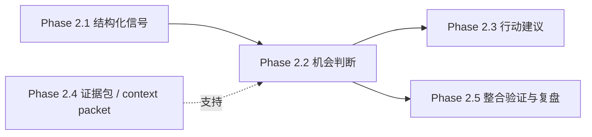

# Phase 2.2 启动与拍板

> **文档类型**：执行轨实例文档  
> **适用模块**：`Phase 2.2` 机会判断模块  
> **状态**：治理材料已补齐，首轮关键拍板已完成，待另一端建立正式角色定义并进入方案设计  
> **最后更新**：2026-03-16

---

## 一、模块基本信息

| 字段 | 内容 |
|------|------|
| **模块名称** | 阶段2.2 机会判断模块 |
| **模块编号** | `Phase 2.2` |
| **启动日期** | 2026-03-15 |
| **角色协作模式** | 同一 Agent 下的角色面具协作小队（建议 `6-7` 个正式职责视角，执行时可压缩为 `5-6` 个角色面具） |
| **模块负责人** | 方案设计负责人视角（当前由治理收口与启动设计牵头；用户已完成首轮关键拍板，下一步由另一端据此组织多角色讨论、正式落档 `phase2_roles/phase2.2_roles.md` 并推进方案设计） |
| **正式职责视角** | 总协调 / 架构连续性视角 / 方案设计负责人 / 机会判断负责人 / 结构化契约负责人 / 证据整合负责人 / 验证与验收负责人 / 实现落地工程师视角 |
| **角色定义文档** | `phase2_roles/phase2.2_roles.md`（由另一端在首轮拍板后，参考 [阶段2团队构建方案.md](f:\AIProjects\DesignAssistant\data-layer\projects\proj_004\phase2_plan\阶段2团队构建方案.md)、[phase2.2_工作流总览与协作导航.md](f:\AIProjects\DesignAssistant\data-layer\projects\proj_004\phase2_plan\phase2.2_工作流总览与协作导航.md)、本文档、[phase2.2_团队重组建议清单.md](f:\AIProjects\DesignAssistant\data-layer\projects\proj_004\phase2_plan\phase2.2_团队重组建议清单.md)、[phase2.2_角色面具配置方案.md](f:\AIProjects\DesignAssistant\data-layer\projects\proj_004\phase2_plan\phase2.2_角色面具配置方案.md)，并可参考 `phase2_roles/phase2.1_roles.md` 的落档方式正式建立） |
| **上游输入** | `phase2.2_目标说明.md`、[PHASE2_2_FIRST_PRINCIPLES_AND_ROLE_ESSENCE.md](../phase2.2_implementation/docs/PHASE2_2_FIRST_PRINCIPLES_AND_ROLE_ESSENCE.md)、[PHASE2_2_MVP_SCOPE_AND_ITERATION_ALIGNMENT.md](../phase2.2_implementation/docs/PHASE2_2_MVP_SCOPE_AND_ITERATION_ALIGNMENT.md)、`Phase 2.1` 信号输出、`Phase 2.4` 证据级上下文 |
| **下游服务对象** | `Phase 2.3` 行动建议模块、`Phase 2.5` 整合验证与复盘 |
| **当前状态** | `治理材料已补齐，首轮关键拍板已完成，待另一端建立正式角色定义并进入方案设计` |
| **实现目录** | [phase2.2_implementation/](../phase2.2_implementation/) |

---

## 二、模块定位与目标

### 2.1 一句话定义

> `Phase 2.2` 的职责不是把 `2.1` 信号改写成长报告，也不是为了形式完整而先做多 Agent 辩论系统，而是把离散信号与证据级上下文组织为**可解释、可比较、可质疑、可升级的结构化机会对象**，作为后续 `2.3` 决策与行动设计的判断基础。

### 2.2 当前阶段目标

- **要解决的问题**：`2.1` 虽然已经能输出结构化信号，但下游仍缺少一层把“信号”升级为“机会假设”的判断层；如果直接让 `2.3` 面对原始信号或原文，会导致判断口径分散、升级路径不稳定、后续决策链条难解释。
- **直接价值**：交付“信号组装 → 机会判断 → 可解释分级 → 升级建议”的最小闭环，让 `2.3` 可以在稳定机会对象之上工作，而不是自行拼接前置信息。
- **复用价值**：后续可复用于战略研究、赛道扫描、项目孵化与生态投资等场景中的机会判断与候选筛选。
- **面试展示价值**：体现“把结构化信号提升为结构化判断对象”的 AI-native 中间层设计能力，而不是只会做抽取或只会做报告生成。
- **工程沉淀价值**：沉淀 `2.1 -> 2.2 -> 2.3` 的对象契约、证据组织方式、分级口径与验证样例。

### 2.2.1 判断层级边界

为避免与 `2.1`、`2.3` 发生职责混淆，本文档中的“判断”采用以下层级定义：

- **`2.1 = 信号级准入判断`**：判断外部事实是否值得进入正式信号流
- **`2.2 = 机会级判断 / 机会升级判断`**：判断一组信号与证据是否构成值得跟踪、研究、深挖或升级的机会对象
- **`2.3 = 行动级判断`**：判断基于机会对象应采取什么行动、投入什么资源、进入什么决策路径

因此：

- `2.2` 不回卷重做 `2.1` 的信号识别与准入判断
- `2.2` 也不越级替代 `2.3` 的行动方案设计
- `2.2` 当前要冻结的是**机会对象契约与机会级判断闭环**

### 2.3 本次启动范围

- **MVP 必做**
  - 冻结 `2.2` 当前模块边界：机会判断层 / 机会升级层
  - 冻结 `2.2` 的最小输入契约（来自 `2.1` 的结构化信号、来自 `2.4` 的轻量证据包）
  - 冻结 `2.2` 的最小输出契约（结构化机会对象）
  - 打通“机会组装 → 机会判断 → 可解释分级 → 升级建议”的最小闭环
  - 选择少量真实样本做首轮轻量案例验证
  - 产出 `2.2 -> 2.3` 的字段说明、对象样例与消费约定
- **明确不做**
  - 不把 `2.2` 当前主产物定义成长篇评估报告
  - 不在 `MVP` 启动前把完整多 Agent 作为硬前提
  - 不让 `2.2` 回头重做 `2.1` 的信号识别职责
  - 不让 `2.2` 越级替代 `2.3` 的行动设计与资源路径规划
  - 不在首轮拍板前扩张为复杂评分权重系统或完整报告模板工程
- **完整版方向**
  - 复杂评分与权重体系
  - 更系统的不确定性建模与假设挑战机制
  - 报告派生层 / 摘要层增强
  - 多 Agent 反方审视、假设挑战、风险校验等增强机制
  - 与 `2.5` 的编排、审查与多阶段验证联动
- **当前最大风险**
  - 如果在对象契约与模块边界尚未冻结前，直接进入多 Agent、复杂评分或长报告设计，`2.2` 会迅速偏离“机会判断层”的本质，并导致后续返工。

---

## 三、上下游与依赖关系

### 3.1 上下游关系图



### 3.2 依赖说明

- **直接输入依赖**：`2.2` 直接消费 `2.1` 的结构化信号，不应回退为直接处理原始长文本。
- **证据依赖**：`2.4` 为 `2.2` 提供方法论框架、相似案例、反例提醒、术语边界或限制条件等轻量证据级上下文。
- **下游语义依赖**：`2.3` 需要 `2.2` 提供稳定的机会对象、优先级和后续验证问题，否则行动设计会被迫在模糊判断基础上展开。
- **治理依赖**：`2.2` 必须先冻结“模块边界 / 输入输出契约 / MVP 闭环 / 拍板事项”，否则即使先写实现，也难以形成稳定中间层。

### 3.3 启动条件判断

- **现在可以启动的内容**
  - `2.2` 的输入契约草案
  - 结构化机会对象 Schema 草案
  - 分级口径与升级建议骨架
  - 少量真实案例的样本走读与轻量验证设计
  - 不依赖完整多 Agent 的最小判断流程
- **暂不建议深做的内容**
  - 基于完整多 Agent 的辩论编排与路由
  - 复杂评分权重配置与版本管理
  - 以长报告模板为中心的完整产物形态设计
  - 强依赖 `2.4` 全量成熟能力的深耦合接口设计

---

## 四、契约草案

### 4.1 输入契约

#### A. `OpportunityJudgmentRequest`

| 字段 | 类型 | 必填 | 含义 | 备注 |
|------|------|------|------|------|
| `request_id` | `string` | Y | 本次判断请求唯一ID | 用于追踪与回放 |
| `source_scope` | `string` | N | 请求来源范围 | 如项目、赛道、主题 |
| `decoded_intelligence` | `object` | Y | 来自 `2.1` 的结构化信号包 | 当前核心输入 |
| `signals` | `object[]` | Y | `2.1` 输出的信号列表 | 至少包含最小字段 |
| `context_packet` | `object[]` | N | 来自 `2.4` 的证据级上下文 | 当前为可选增强项 |
| `evaluation_mode` | `string` | N | 判断模式 | 默认 `mvp_single_pass` |
| `constraints` | `object` | N | 判断限制与提醒 | 如优先级边界、排除条件等 |

### 4.2 输出契约

#### A. `OpportunityObject` 最小字段

| 字段 | 类型 | 必填 | 含义 | 备注 |
|------|------|------|------|------|
| `opportunity_id` | `string` | Y | 机会对象唯一ID | 如 `opp_001` |
| `opportunity_title` | `string` | Y | 机会标题 | 简明表达当前机会主题 |
| `opportunity_thesis` | `string` | Y | 核心机会论点 | 当前判断主句 |
| `related_signals` | `object[]` | Y | 支撑本机会的相关信号 | 可回溯到 `2.1` 输出 |
| `supporting_evidence` | `string[]` | Y | 支持机会成立的证据 | 可以混合来自 `2.1 / 2.4` |
| `counter_evidence` | `string[]` | Y | 不利证据或反向信息 | 允许为空数组但必须返回 |
| `why_now` | `string` | N | 当前时点为什么值得关注 | 解释时机性 |
| `key_assumptions` | `string[]` | Y | 当前判断依赖的关键假设 | 允许为空数组但必须返回 |
| `uncertainty_map` | `string[]` | Y | 当前仍未解决的不确定性 | 允许为空数组但必须返回 |
| `priority_level` | `string` | Y | 当前优先级 | 当前建议 `watch / research / deep_dive / escalate` |
| `next_validation_questions` | `string[]` | Y | 下一步应验证的问题 | 服务于 `2.3` 与后续研究 |
| `judgment_summary` | `string` | N | 简版可读摘要 | 作为辅助表达 |
| `judgment_version` | `string` | Y | 判断版本号 | 便于基线对照 |
| `processing_time_ms` | `integer` | Y | 处理耗时 | 毫秒 |
| `warnings` | `string[]` | N | 风险或异常提示 | 如“证据不足”“分级保守”等 |

#### B. `OpportunityJudgmentResult` 最小字段

| 字段 | 类型 | 必填 | 含义 | 备注 |
|------|------|------|------|------|
| `request_id` | `string` | Y | 请求ID | 与输入对齐 |
| `opportunities` | `OpportunityObject[]` | Y | 机会对象列表 | 允许为空数组但必须返回 |
| `global_summary` | `string` | N | 当前整体判断摘要 | 辅助阅读 |
| `judger_version` | `string` | Y | 版本号 | 用于基线与回放 |
| `processing_time_ms` | `integer` | Y | 总耗时 | 毫秒 |

### 4.3 契约原则

- **核心目标是“对象化判断”，不是“文本化扩写”**：`OpportunityObject` 才是正式交付物，摘要与说明只是辅助视图。
- **证据必须可追溯**：每个机会对象都必须能追溯到相关信号与支持 / 反对证据，而不是只有结论。
- **判断不等于行动方案**：`priority_level` 与 `next_validation_questions` 只是机会升级层输出，不替代 `2.3` 的正式行动设计。
- **先冻结最小字段，再逐步增强**：MVP 阶段优先保证对象稳定、可回放、可被下游消费，不追求一次到位。
- **对 `2.4` 保持弱耦合兼容**：`context_packet` 当前为可选增强输入，避免 `2.2` 被上游成熟度拖住。

### 4.4 契约检查表

| 问题 | 结论 | 备注 |
|------|------|------|
| **输入是否明确？** | 基本明确 | 仍需用户确认 `2.4` 在 MVP 中的强弱依赖 |
| **输出是否明确？** | 基本明确 | 结构化机会对象已给出最小字段 |
| **是否区分正式字段与辅助字段？** | 是 | `OpportunityObject` 为主，摘要为辅 |
| **是否避免越界到 `2.3`？** | 是 | 不直接生成完整行动方案 |
| **是否支持后续增强？** | 是 | 可通过评分、多 Agent 与报告层逐步增强 |
| **是否便于下游稳定消费？** | 有条件可以 | 仍需冻结字段与分级口径 |

---

## 五、验收与评测

### 5.1 效果定义

- **功能层目标**：能够稳定接收 `2.1` 输出与可选 `2.4` 证据包，返回合法的结构化机会对象。
- **质量层目标**：机会对象应具备可解释性、可追溯性和最小判断力，而不是只把信号改写成更长文本。
- **协作层目标**：`2.3` 可以基于 `2.2` 输出直接进入行动设计，而不需要重新拆解信号或回头读原文。
- **展示层目标**：至少提供 `1-2` 个完整案例，演示“信号 → 机会对象 → 分级 / 升级建议”的闭环。
- **工程层目标**：完成首轮对象契约、分级口径与验证方法的冻结，为下一阶段实现与增强打底。

### 5.2 指标表

| 层级 | 指标 | 目标值 | 测量方式 |
|------|------|--------|----------|
| **功能层** | 输出 Schema 合法率 | `100%` | JSON / 字段检查 |
| **质量层** | 机会论点可解释性 | `可读且可追溯` | 人工走读样例 |
| **质量层** | 支持 / 反对证据完整度 | `基本具备` | 样例检查 |
| **质量层** | 分级合理性 | `与人工判断大体一致` | 轻量案例评审 |
| **协作层** | `2.3` 可消费性 | `可直接接入` | 接口走读 + 样例联调 |
| **展示层** | 可演示性 | 至少 `1-2` 条完整案例 | Demo记录 |
| **工程层** | 契约冻结完成度 | `MVP 主字段冻结` | 文档检查 |

### 5.3 基线与实验

- **首轮验证样本数量**：建议 `3-8` 组真实案例组合
- **样本选择原则**：优先选择包含多信号组合、存在支持与反对证据、能体现升级判断的案例
- **验证重点**：
  - 是否能把离散信号组织为稳定的机会对象
  - 是否能输出清晰论点与相应证据
  - 是否能识别关键假设与不确定性
  - 是否能产出让 `2.3` 继续工作的下一步验证问题
- **责任建议**：验证与验收视角维护首轮案例基线，用户负责方向性拍板，另一端后续负责结合实现结果回写验证结论
- **效果不达标时的排查顺序**：对象定义 → 输入契约 → 分级口径 → 判断流程 → `2.4` 上下文增强质量 → 是否需要增强机制

---

## 六、职责划分与协作边界

### 6.1 人与 AI 的职责划分

| 工作类型 | 负责人 | 原因 |
|----------|--------|------|
| **模块边界定义** | 人 | 涉及跨模块职责与范围控制 |
| **关键设计拍板** | 人 | 涉及优先级与后续路径取舍 |
| **契约 / 文档初稿** | AI / 数字团队 | 适合快速结构化整理 |
| **机会对象骨架与样例草拟** | AI / 数字团队 | 适合快速搭建与对比 |
| **质量验收** | 人主导 + AI辅助 | 需要业务判断与样例走读结合 |
| **最终取舍决策** | 人 | 避免执行端自行扩范围 |

### 6.2 协作机制

- **单一事实源**：
  - `2.2` 模块本质与边界，看 [PHASE2_2_FIRST_PRINCIPLES_AND_ROLE_ESSENCE.md](../phase2.2_implementation/docs/PHASE2_2_FIRST_PRINCIPLES_AND_ROLE_ESSENCE.md)
  - `2.2` 当前范围与后续边界，看 [PHASE2_2_MVP_SCOPE_AND_ITERATION_ALIGNMENT.md](../phase2.2_implementation/docs/PHASE2_2_MVP_SCOPE_AND_ITERATION_ALIGNMENT.md)
  - `2.2` 当前工作流入口与阅读顺序，看 [phase2.2_工作流总览与协作导航.md](f:\AIProjects\DesignAssistant\data-layer\projects\proj_004\phase2_plan\phase2.2_工作流总览与协作导航.md)
  - `2.2` 正式启动动作、拍板结果与执行依据，以本文档为准
- **文件所有权**：
  - 当前治理与启动节奏由宏观规划端维护
  - 后续方案设计文档由另一端负责补齐
  - 拍板结果必须回写本文档，才能视为正式生效
- **共享文件限制**：关键结论必须先写回本文档，再继续进入方案设计与实现
- **同步节奏**：每完成一轮关键拍板、一次契约冻结或一轮验证结果更新，先更新本文档，再继续推进执行

### 6.3 角色面具建队 / 启动清单

`2.2` 启动应遵循“**先冻结治理，再定义角色面具，再由多角色收敛设计，最后进入实现**”的顺序，而不是一上来直接做多 Agent 或直接写实现。

**重要说明**：
- `Phase 2.2` 采用**同一 Agent 下的角色面具协作模式**
- 多角色讨论是为了帮助设计质量收敛，不等于产品运行时已经采用多 Agent
- 角色定义正式落档是指在 `phase2_roles` 目录下建立 `phase2.2_roles.md`，不是创建多个独立自治 Agent
- 正式职责来源以 [phase2.2_团队重组建议清单.md](f:\AIProjects\DesignAssistant\data-layer\projects\proj_004\phase2_plan\phase2.2_团队重组建议清单.md) 为准；执行压缩与协作方式以 [phase2.2_角色面具配置方案.md](f:\AIProjects\DesignAssistant\data-layer\projects\proj_004\phase2_plan\phase2.2_角色面具配置方案.md) 为准

#### A. 建队与启动主路径

```text
总协调视角确认本轮目标与前置文档
→ 另一端依据 阶段2团队构建方案 / 2.2 工作流总览 / 本文档 / 2.2 团队重组建议 / 2.2 角色面具配置方案 建立执行期同一 Agent 下的多角色面具协作小队
→ 在 phase2_roles/ 下正式落档 phase2.2_roles.md（可参考 phase2.1_roles.md 的落档方式，但必须保持 2.2 自身职责边界）
→ 方案设计负责人牵头组织多角色讨论
→ 产出 2.2 设计方案与首轮待拍板事项
→ 用户完成关键拍板
→ 进入 MVP 方案实现、轻量验证与资产沉淀
```

#### B. 启动检查清单

| 阶段 | 关键动作 | 主责角色视角 | 产出物 | 进入下一步条件 |
|------|----------|-------------|--------|----------------|
| **1. 冻结治理入口** | 确认 `2.2` 定位、`MVP` 范围、依赖模式与待拍板项 | 总协调视角 / 用户 | 本文档首轮确认版 | `7.1` 关键拍板项已拉齐 |
| **2. 定义角色面具** | 明确 `2.2` 的正式职责视角、执行压缩方案与协作流程，并由另一端正式建立 `phase2_roles/phase2.2_roles.md` | 总协调视角 / 另一端 | `phase2_roles/phase2.2_roles.md` | 正式角色定义已落档，职责边界与执行映射已明确，方可进入设计 |
| **3. 多角色收敛设计** | 基于 `phase2_roles/phase2.2_roles.md` 组织机会判断、契约、证据整合、验证四视角讨论 | 方案设计负责人 / 相关职责视角 | `2.2` 设计方案草案 | 主流程、字段骨架、验证路径已收敛 |
| **4. 完成首轮拍板** | 对关键边界、对象字段、实现策略和验收口径做用户确认 | 总协调视角 / 用户 | 拍板结论回写 | 必拍板项已确认，禁止带着开放分歧进入实现 |
| **5. 启动 MVP 闭环** | 落地最小判断流程、样例输出与轻量验证 | 实现落地工程师视角 / 验证与验收负责人 | 可运行闭环、样例结果、验证记录 | 输出稳定、对象可读、下游可消费 |
| **6. 进入下游联调** | 核对 `2.2 -> 2.3` 消费方式，并复查 `2.4` 依赖是否需增强 | 结构化契约负责人 / 总协调视角 | 联调结果、依赖复查记录 | 下游可稳定消费，上游增强不构成强阻塞 |

#### C. 执行纪律

- **先定义角色、先讨论、先拍板，再进入实现**：`2.2` 设计方案不应在边界未定的情况下直接展开。
- **本文档是启动动作单一事实源**：与“怎么启动、何时进入设计、哪些事项已拍板”相关的执行动作，以本文档为准。
- **`2.2` 不得借启动之名扩大范围**：在用户未拍板前，不得把完整多 Agent、复杂评分、完整报告模板提前塞进当前 `MVP`。
- **角色面具协作，不是多 Agent 自治**：当前角色面具用于设计期的高质量收敛，不代表产品运行时已经要采用多 Agent 编排。

---

## 七、待拍板事项

### 7.1 首轮关键拍板结果（已确认）

| 决策项 | 可选方案 | 推荐方案 | 为什么现在必须定 | 拍板结果 |
|--------|----------|----------|------------------|----------|
| **模块边界** | A. 只做机会判断层；B. 顺带做完整报告层；C. 越级覆盖行动建议层 | **A** | 会直接决定 `2.2` 是否侵入 `2.3` 或退化为展示层 | ✅ 已确认（A） |
| **主产物形态** | A. 长篇自然语言评估报告；B. 结构化机会对象 + 可选摘要；C. 评分表 + 简短结论 | **B** | 不冻结主对象，后续设计与实现目标会分裂 | ✅ 已确认（B） |
| **输入依赖模式** | A. 以 `2.1` 信号为主，`2.4` 证据包为可选增强；B. 强依赖 `2.4` 完整成熟后再启动；C. 绕开 `2.1` 直接重读原文 | **A** | 决定当前能否启动，也决定上下游职责是否清晰 | ✅ 已确认（A） |
| **`MVP` 最小闭环** | A. 机会组装 → 判断 → 分级 → 升级建议；B. 信号改写 → 评分 → 报告；C. 多 Agent 辩论 → 汇总结论 | **A** | 决定 `2.2` 是按职责建模块，还是按手段建模块 | ✅ 已确认（A） |
| **多 Agent 在 `2.2 MVP` 中的地位** | A. 不作为硬要求，仅作为 `P1 / P2` 增强项；B. 作为 `MVP` 必做；C. 当前完全排除 | **A** | 当前最容易导致范围膨胀，必须先定 | ✅ 已确认（A） |
| **与 `2.3` 的边界** | A. `2.2` 只输出机会判断基础对象，`2.3` 负责行动建议；B. `2.2` 直接给完整行动方案；C. 先不区分 | **A** | 不先定，后续 `2.2` 容易越级并压缩 `2.3` 空间 | ✅ 已确认（A） |

### 7.2 本周最好拍板

| 决策项 | 可选方案 | 推荐方案 | 延后风险 | 拍板结果 |
|--------|----------|----------|----------|----------|
| **输出字段骨架** | A. 先冻结主字段骨架；B. 设计时边做边定；C. 先只做自然语言不定字段 | **A** | 字段不冻结，另一端方案设计会反复改对象定义 | ☐ 待拍板 |
| **优先级分级口径** | A. `watch / research / deep_dive / escalate`；B. 高 / 中 / 低；C. 先不定分级 | **A** | 分级不定，后续“为什么这样排”无法解释 | ☐ 待拍板 |
| **轻量评分是否进入 `MVP`** | A. 保留少量辅助评分维度；B. 当前完全不做评分；C. 直接做复杂权重系统 | **A** | 不先定，后续会在“要不要评分”上反复摇摆 | ☐ 待拍板 |
| **首轮验证方式** | A. 少量真实案例轻量验证；B. 大规模 benchmark 起步；C. 暂不验证 | **A** | 验证强度不定，另一端可能要么过重要么跳过验证 | ☐ 待拍板 |
| **另一端首轮设计产物范围** | A. 输入契约 + 输出契约 + 处理流程 + 验证方案；B. 只写实现计划；C. 直接从 Prompt / Agent 方案开始 | **A** | 不先定，设计文档易直接滑向局部实现细节 | ☐ 待拍板 |

### 7.3 可后置拍板

| 决策项 | 建议何时再定 | 触发条件 | 备注 |
|--------|--------------|----------|------|
| **多 Agent 的具体形态** | `2.2 MVP` 闭环跑通后 | 当前对象 Schema、判断流程与基础验证已稳定 | 当前不应从 Agent 角色编排倒推设计 |
| **复杂评分与权重系统** | 首轮验证后 | 发现轻量判断不足以支撑排序、解释或跨案例比较 | 适合作为 `v1.1 / v1.2` 增强项 |
| **完整报告模板** | 结构化机会对象稳定后 | 确认确实需要更强的人类可读视图 | 应作为派生层，而不是当前主对象 |
| **与 `2.5` 的多 Agent 展示策略** | `2.2 / 2.3` 角色边界更稳定后 | 项目需要更完整的协作流、编排与审查展示 | 从工程表达角度值得后续重点考虑 |

### 7.4 拍板项纪律

- 每个拍板项都必须附带**可选方案 + 推荐方案 + 推荐理由 + 延后风险**。
- 执行团队不得绕过本文档直接扩大 `2.2` 当前范围。
- 对话中形成的判断，只有写回本文档并经用户确认后，才算正式生效。

---

## 八、启动结论

### 8.1 启动结论页

- **是否允许启动**：允许；首轮关键拍板已完成，下一步进入正式角色落档与方案设计准备
- **启动范围**：输入 / 输出契约、结构化机会对象骨架、最小判断闭环、轻量验证方案、角色与协作准备
- **明确不做**：在设计拍板前，不扩完整多 Agent、不扩复杂评分系统、不把长报告作为主产物、不越级做 `2.3` 行动方案
- **当前最大风险**：如果另一端在 `phase2.2_roles.md` 与 `phase2.2_设计方案.md` 阶段偏离已确认的 6 项关键结论，`2.2` 仍可能在对象定义与职责边界上返工
- **下次复查时间**：另一端完成 `phase2_roles/phase2.2_roles.md` 与首轮设计方案后立即复查是否进入实现

### 8.2 启动前最后检查

| 检查项 | 状态 | 备注 |
|--------|------|------|
| **模块目标明确** | ✅ | 已明确为机会判断层 / 机会升级层 |
| **上下游依赖明确** | ✅ | `2.1` 主输入、`2.4` 证据增强、`2.3` 下游消费关系已明确 |
| **契约草案明确** | ✅ | 已给出最小输入输出字段 |
| **拍板事项已整理** | ✅ | 已按优先级分类 |
| **用户已拍板关键项** | ✅ | 首轮关键拍板 6 项已确认 |
| **`MVP` 边界明确** | ✅ | 已冻结当前不做项 |
| **验收方式明确** | ✅ | 已给出轻量验证口径 |
| **团队重组原则明确** | ✅ | 已在 [phase2.2_团队重组建议清单.md](f:\AIProjects\DesignAssistant\data-layer\projects\proj_004\phase2_plan\phase2.2_团队重组建议清单.md) 中明确 |
| **角色面具方案明确** | ✅ | 已在 [phase2.2_角色面具配置方案.md](f:\AIProjects\DesignAssistant\data-layer\projects\proj_004\phase2_plan\phase2.2_角色面具配置方案.md) 中明确 |
| **另一端建立正式角色文件的依据明确** | ✅ | 已明确以团队重组文档 + 角色面具文档 + 本文档作为落档依据 |

### 8.3 一句话总结

> `Phase 2.2` 现在已经具备正式启动条件，但最正确的启动方式不是直接跳进多 Agent 或实现细节，而是先冻结边界、对象、分级、验证与协作机制，再以最小判断闭环推进首轮设计和实现。

---

## 九、下一步动作

基于当前顺序，本文档完成后的直接下一步应为：

1. 让另一端依据 [阶段2团队构建方案.md](f:\AIProjects\DesignAssistant\data-layer\projects\proj_004\phase2_plan\阶段2团队构建方案.md)、[phase2.2_工作流总览与协作导航.md](f:\AIProjects\DesignAssistant\data-layer\projects\proj_004\phase2_plan\phase2.2_工作流总览与协作导航.md)、本文档、[phase2.2_团队重组建议清单.md](f:\AIProjects\DesignAssistant\data-layer\projects\proj_004\phase2_plan\phase2.2_团队重组建议清单.md)、[phase2.2_角色面具配置方案.md](f:\AIProjects\DesignAssistant\data-layer\projects\proj_004\phase2_plan\phase2.2_角色面具配置方案.md) 在 `phase2_roles` 下建立 `phase2.2_roles.md`
2. 让另一端基于正式角色依据产出 `phase2.2_设计方案.md`
3. 完成设计层关键拍板
4. 再进入 `phase2.2_implementation/docs` 与实现目录的契约、验证、联调材料补齐

---

**文档状态**：✅ 已建立  
**版本**：v0.3 Confirmed  
**建议下次更新时机**：当 `phase2_roles/phase2.2_roles.md` 正式落档，或 `2.2` 进入方案设计阶段时