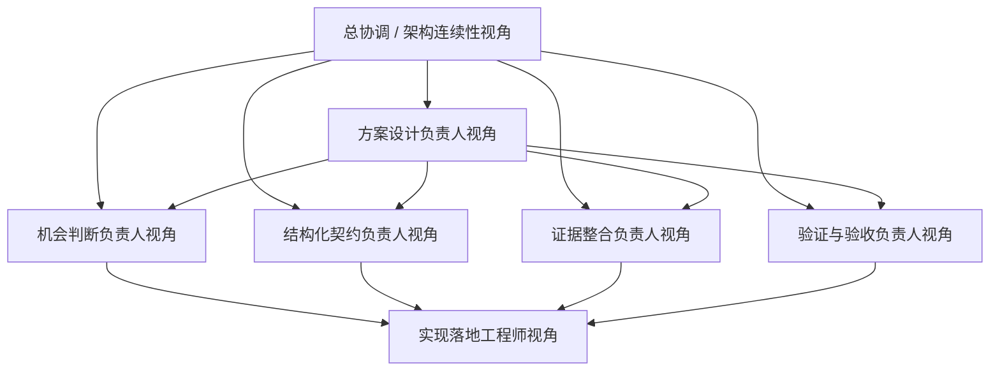

# Phase 2.2 团队重组建议清单

> **文档类型**：团队配置与组织建议文档
> **适用模块**：`Phase 2.2` 机会判断模块
> **状态**：建议版，待用户确认
> **最后更新**：2026-03-16

---

## 一、结论先行

> `2.2` 最合适的组织方式，不是直接沿用 `2.1` 的角色分布，也不是把“多 Agent 评估器”当成先验前提硬配一套复杂团队，而是**围绕 `2.2` 当前的核心目标——机会判断对象契约——做阶段性重组与补位**。

核心原因有三点：

1. **目标中心变了**：`2.1` 的中心是“信号抽取与结构化解码”，`2.2` 的中心则是“机会对象组装、判断、分级与升级建议”。
2. **风险结构变了**：`2.1` 的主要风险是“抽取得对不对、字段稳不稳”；`2.2` 的主要风险是“判断边界是否清晰、对象是否成立、能否稳定交给 `2.3`”。
3. **拍板重点变了**：`2.2` 更需要拍板“机会对象长什么样、最小判断闭环如何定义、与 `2.3 / 2.4` 的边界怎么守住”，而不是先围绕实现花样或完整多 Agent 编排做组织设计。

---

## 二、重组原则

### 2.0 判断层级边界前置说明

在本文件中，所有“判断”相关表述都应优先理解为**机会级判断**，而不是泛化意义上的“任何判断”。为了避免与 `2.1`、`2.3` 混淆，先明确三层边界：

- **`2.1 = 信号级准入判断`**：负责把外部事实筛成是否值得进入后续流程的正式信号，不负责把信号升级为机会对象。
- **`2.2 = 机会级判断 / 机会升级判断`**：负责把 `2.1` 的信号与 `2.4` 的证据组织成可比较、可升级的机会对象，不回卷重做信号识别。
- **`2.3 = 行动级判断`**：负责基于 `2.2` 的机会对象形成更具体的行动建议、资源路径与决策输出。

因此，本文件提到的“机会判断负责人”“判断闭环”“判断对象”等说法，都特指：

- **围绕机会对象成立与否的判断**
- **围绕机会升级与分流的判断**
- **而不是 `2.1` 的信号级识别与准入判断**

### 2.1 核心原则

- **围绕对象与判断组队，而不是围绕实现形式组队**：先看 `2.2` 需要哪些机会级判断与契约视角，再决定组织配置。
- **保留连续性，不复制惯性**：可以保留少量跨阶段连续角色，但不能把 `2.1` 的抽取思维或旧目标文档中的“多 Agent 评估器”思维原样带入 `2.2`。
- **优先补“判断层缺口”**：`2.2` 最缺的不是更多实现手，而是“机会判断、结构化契约、证据整合、验证验收、下游可消费性”这些关键视角。
- **遵循已有治理顺序，但不把流程写进本文件**：与“按什么顺序启动、什么时候拍板、什么时候进入实现”相关的内容，统一以工作流与启动文档为准；本文件只回答应该如何组队。

### 2.2 组织目标

本轮重组的目标不是把团队做大，而是形成一个**6-7 个职责视角的核心作战小队**，满足以下条件：

- 能守住 `2.2` 作为“机会判断层 / 机会升级层”的边界
- 能先完成机会对象、判断逻辑、输入 / 输出契约的方案收敛与首轮拍板
- 能打通 `2.2 MVP` 的最小判断闭环
- 能进行轻量案例验证，而不是只停留在概念层
- 能把结果稳定交给 `2.3`
- 能与 `2.1 / 2.4` 保持必要协同但不过度耦合

---

## 三、现有团队基线与问题

### 3.1 当前基线

基于现有文档，`2.2` 当前已经有了：

- 第一性原理与角色本质对齐
- `MVP Scope` 与迭代边界收口
- 工作流与启动拍板治理材料
- 角色面具配置方案

也就是说，`2.2` 当前不是“完全没有组织基础”，而是已经完成了上层治理收口，接下来要回答的是：

> **在这种前提下，正式进入设计与实现时，最适合采用什么样的团队配置。**

### 3.2 如果不做针对性重组，会出现的问题

| 问题 | 表现 | 风险 |
|------|------|------|
| **对象中心不稳** | 团队讨论容易滑向“报告怎么写”而不是“机会对象怎么成立” | `2.2` 变成报告生成器 |
| **判断层边界不清** | 容易向 `2.1` 回卷、向 `2.3` 越界、向 `2.4` 外包判断 | 模块职责漂移 |
| **契约角色不足** | 机会对象字段、分级口径、交接信息缺少主责角色 | 下游无法稳定消费 |
| **证据处理无人主责** | 支持证据、反对证据、假设与不确定性表达不稳 | 判断对象不可信 |
| **验证角色偏弱** | 容易只看结构完整，不看是否真可被 `2.3` 使用 | MVP 难以正式验收 |

---

## 四、建议保留 / 新增 / 强化的角色

### 4.1 建议保留的连续性角色

| 角色 | 来源 | 建议保留方式 | 保留原因 |
|------|------|--------------|----------|
| **总协调 / 架构连续性负责人** | 可由当前阶段治理主责视角兼任部分职责 | **保留** | 负责维持 `2.2` 与 `2.1 / 2.4 / 2.3` 的边界连续性，避免设计阶段脱轨 |
| **上下游依赖把关角色** | 可由熟悉跨模块接口与阶段协同的成员兼任 | **保留或兼任** | 负责检查 `2.1 -> 2.2` 与 `2.2 -> 2.3` 的契约衔接，以及 `2.4` 的接入边界 |

### 4.2 建议新增或强化的核心角色

| 角色 | 建议状态 | 核心职责 | 为什么必须有 |
|------|----------|----------|---------------|
| **方案设计负责人** | **新增核心角色** | 汇总机会判断、契约、证据、验证多个视角，收敛 `2.2` 首版设计方案，并组织设计拍板 | `2.2` 很容易发散成多种理解，没有收敛者就难以形成正式方案 |
| **机会判断负责人** | **新增核心角色** | 定义机会对象如何成立、如何分级、如何给出升级建议；负责机会级判断骨架，而不是回卷重做 `2.1` 的信号级准入判断 | `2.2` 的本体是机会级判断，不是信号级判断 |
| **结构化契约负责人** | **新增核心角色** | 冻结 `OpportunityObject` 最小字段、输入 / 输出 Schema、向 `2.3` 的交接信息 | 没有人主责对象契约，就无法稳定交给下游 |
| **证据整合负责人** | **新增核心角色** | 负责支持证据、反对证据、限制条件与假设表达 | `2.2` 的质量很大程度取决于证据组织是否可信 |
| **验证与验收负责人** | **强化** | 设计轻量案例验证、检查对象可读性与下游可消费性，形成正式验收判断 | 没有验证角色，`2.2` 很容易停留在“结构看起来合理” |
| **实现落地工程师** | **保留并聚焦** | 把对象契约、流程与轻量验证路线落成可运行模块 | 负责把判断层方案转化为可运行 MVP |

### 4.3 建议弱化为支撑而非中心的角色方向

| 角色方向 | 为什么不应继续作为 `2.2` 中心 |
|----------|------------------------------|
| **长报告生成导向** | 这会把 `2.2` 从对象层带偏到报告层 |
| **完整多 Agent 编排导向** | 当前属于增强项，不应反向决定 MVP 团队配置 |
| **复杂评分 / 权重系统导向** | 当前 `2.2` 的第一优先级不是复杂评分，而是对象与判断闭环 |

---

## 五、推荐团队结构（建议版）

### 5.0 角色协作模式说明

**重要**：Phase 2.2 当前采用**同一 Agent 下的角色面具协作模式**，而非多个独立 Agent 并行自治模式。

**同时需要再明确一层**：

- **本文件中的 7 个职责视角，是正式职责清单的来源**
- **[phase2.2_角色面具配置方案.md](f:\AIProjects\DesignAssistant\data-layer\projects\proj_004\phase2_plan\phase2.2_角色面具配置方案.md) 中的角色面具，是这些正式职责在同一 Agent 下的执行化表达**
- **另一端后续建立 `phase2_roles/phase2.2_roles.md` 时，应以本文件确定“必须覆盖哪些正式职责”，再结合角色面具方案确定“这些职责如何协作与压缩执行”**

**核心理念**：
- ✅ **单一 Agent**：所有职责视角由同一个 AI Agent 承担
- ✅ **多职责视角**：Agent 在不同阶段切换不同角色面具
- ✅ **职责完整覆盖**：保证机会判断层需要的关键视角都被覆盖
- ✅ **执行可压缩**：实际执行时可压缩为 `5-6` 个角色面具
- ✅ **协作而非自治**：角色之间是为了方案收敛与质量保障，不是运行时多 Agent 系统

**为什么不是多 Agent**：
- 多 Agent 更适合未来增强阶段的复杂分工或展示型编排
- `2.2 MVP` 当前需要的是“对象与判断收敛”，不是“Agent 之间互相辩论”
- 角色面具模式上下文天然共享，更适合当前设计期与验证期

**详细角色定义**：
- 完整的角色定义、职责边界与协作方式见 [phase2.2_角色面具配置方案.md](f:\AIProjects\DesignAssistant\data-layer\projects\proj_004\phase2_plan\phase2.2_角色面具配置方案.md)
- 另一端后续正式落档的执行角色文件应为 `phase2_roles/phase2.2_roles.md`

### 5.1 推荐编制

建议 `2.2` 采用以下 **7 个职责视角**（执行时可压缩为 `5-6` 个角色面具）：

### 5.2 角色视角说明

#### 1. 总协调 / 架构连续性视角

- **职责**：
  - 维护 `2.2` 启动与拍板文档的关键状态对齐
  - 把控 `2.1 / 2.4 / 2.2 / 2.3` 的边界与依赖
  - 组织关键拍板与文档回写
- **关键输出**：
  - 模块执行轨关键结论回写
  - 依赖状态判断
  - 拍板结果同步

#### 2. 方案设计负责人

- **职责**：
  - 汇总机会判断、契约、证据、验证多个视角的输入
  - 组织多角色讨论，收敛 `2.2` 首版设计方案
  - 明确 MVP 路线、非目标与设计取舍
  - 组织首轮设计拍板，并把结论回写到正式文档
- **关键输出**：
  - `phase2.2_设计方案.md`
  - 方案备选路线与取舍说明
  - 设计拍板结论

#### 3. 机会判断负责人

- **职责**：
  - 定义一组信号如何被组装为一个机会对象
  - 设计机会论点、分级与升级建议口径
  - 明确判断中的关键假设与不确定性表达
- **关键输出**：
  - 机会对象判断骨架
  - 分级建议草案
  - 假设与不确定性说明

#### 4. 结构化契约负责人

- **职责**：
  - 定义 `OpportunityObject` 最小字段集
  - 维护输入 / 输出 Schema、字段注释和兼容策略
  - 对接 `2.3` 的最小消费要求
- **关键输出**：
  - 输入 / 输出 Schema
  - 字段说明文档
  - 向下游交付样例

#### 5. 证据整合负责人

- **职责**：
  - 组织支持证据、反对证据、边界提醒与限制条件
  - 明确 `2.4` 输入如何参与判断，而不是替代判断
  - 检查当前对象是否存在证据不足或过度自信问题
- **关键输出**：
  - 证据组织说明
  - 反证与限制条件记录
  - 风险提示

#### 6. 验证与验收负责人

- **职责**：
  - 设计轻量案例验证与可消费性检查
  - 判断当前对象是否足够稳定、可读、可被下游理解
  - 给出“可推进 / 需返工”的正式建议
- **关键输出**：
  - 轻量验证方案
  - 验收检查表
  - 验证记录与结论

#### 7. 实现落地工程师

- **职责**：
  - 把对象契约、主流程、样例验证路线落成可运行模块
  - 完成样例运行、错误处理与回写
  - 保证模块可被 `2.3` 和后续联调稳定接入
- **关键输出**：
  - `2.2` 实现代码
  - 示例输入输出
  - 运行记录与问题回写

---

### 5.3 正式职责视角与执行面具的映射关系

下面这张表的作用，是帮助另一端在建立 `phase2_roles/phase2.2_roles.md` 时，不会把“正式职责视角”和“执行期角色面具”混成两套互相竞争的命名系统。

| 正式职责视角（本文件） | 对应执行面具（角色面具文档） | 使用说明 |
|------------------------|------------------------------|----------|
| **总协调 / 架构连续性视角** | **总协调面具** | 作为全局收口与跨阶段连续性的正式职责来源 |
| **方案设计负责人** | **方案设计 / 边界收口面具** | 在执行层负责方案收敛、边界检查与取舍整理 |
| **机会判断负责人** | **机会判断面具** | 对应 `2.2` 的机会级判断核心职责 |
| **结构化契约负责人** | **结构化契约面具** | 负责对象 Schema 与下游可消费性 |
| **证据整合负责人** | **证据整合面具** | 负责支持证据、反证、限制条件与风险提醒 |
| **验证与验收负责人** | **验证验收面具** | 负责轻量验证、验收检查与可推进判断 |
| **实现落地工程师视角** | **实现落地面具** | 负责从已拍板方案进入可运行实现 |

**落档优先级说明**：

1. `phase2_roles/phase2.2_roles.md` 的正式职责命名，优先以**本文件**为准。
2. 各职责在同一 Agent 下如何协作、何时调用、如何压缩执行，以**角色面具配置方案**为准。
3. 如果两份文档出现角色命名偏差，应先回到本文件确认正式职责，再同步修订角色面具方案与正式角色文件。

---

## 六、从当前基线到新结构的映射建议

### 6.1 从旧理解到新结构的映射

| 旧理解 / 易滑向的方向 | 建议调整 | 原因 |
|----------------------|----------|------|
| **机会评估报告生成器** | 调整为“方案设计负责人 + 机会判断负责人 + 结构化契约负责人”组合 | `2.2` 首先是对象层和判断层，而不是报告层 |
| **多 Agent 辩论器** | 调整为“角色面具协作模式 + 后续可选增强” | 当前多 Agent 不是 `MVP` 前提 |
| **泛化评分器** | 调整为“机会判断负责人 + 验证与验收负责人” | 当前更需要判断闭环，而不是复杂评分系统 |
| **无专门契约角色** | 新增“结构化契约负责人” | 这是 `2.2` 当前最关键的新补位之一 |
| **无专门证据角色** | 新增“证据整合负责人” | 没有人主责证据组织，就很难形成可信判断对象 |
| **无专门设计收敛角色** | 新增“方案设计负责人” | 防止多视角输入长期发散却收不成正式方案 |

### 6.2 与其他阶段团队的关系

建议把其他阶段团队视为**协同方**而不是 `2.2` 主导方：

- `2.1` 继续负责：结构化信号输出与其内部质量问题，以及**信号级准入判断**
- `2.4` 继续负责：证据级上下文支撑与增强输入
- `2.3` 后续负责：行动建议、资源路径与决策级输出
- `2.2` 自己负责：机会对象、**机会级判断**、契约、验证闭环

协同原则应是：

- `2.1` 提供信号，`2.2` 不回头重做抽取
- `2.4` 提供增强证据，`2.2` 不外包判断权
- `2.3` 消费对象与分流结果，`2.2` 不越级替代行动建议层

---

## 七、建议采用的启动口径

### 7.1 执行口径

本文件只回答**为什么要这样重组、应该保留 / 新增 / 强化哪些角色、角色之间如何分工**；与“按什么顺序启动、何时拍板、何时进入实现”相关的执行动作，统一以：

- [phase2.2_工作流总览与协作导航.md](f:\AIProjects\DesignAssistant\data-layer\projects\proj_004\phase2_plan\phase2.2_工作流总览与协作导航.md)
- [phase2.2_启动与拍板.md](f:\AIProjects\DesignAssistant\data-layer\projects\proj_004\phase2_plan\phase2.2_启动与拍板.md)

为准。

### 7.2 为什么不是把工作流再写一遍

因为当前缺的不是“流程有没有说过”，而是“`2.2` 正式进入设计与实现前，到底应该按什么组织方式建队与补位”。

所以本轮更合理的做法是：

- **沿用已有治理顺序**
- **按 `2.2` 目标补齐关键角色，而不是在本文件重复工作流**
- **由角色面具和后续正式角色定义文件支撑设计收敛与实现推进**
- **把关键设计项拉出来拍板，再进入实现与验证**

### 7.3 本文件与其他文档的分工

- **本文件负责**：组织原则、角色配置、保留 / 新增 / 强化建议、旧理解到新结构的映射，以及 `phase2_roles/phase2.2_roles.md` 的正式职责来源。
- **工作流文档负责**：另一端阅读顺序、后续产物链、接手步骤与导航入口。
- **启动文档负责**：正式执行轨、拍板项、进入实现条件与执行纪律。
- **角色面具文档负责**：同一 Agent 下的执行视角定义、角色调用顺序与协作方式。
- **`phase2_roles/phase2.2_roles.md` 负责**：把本文件中的正式职责清单，结合角色面具方案，正式落档为另一端后续设计与实现的执行角色依据。

---

## 八、需要你拍板的组织决策

### 8.1 现在必须拍板

| 决策项 | 可选方案 | 推荐方案 | 原因 | 当前状态 |
|--------|----------|----------|------|----------|
| **是否做针对性重组** | A. 沿用泛化旧理解；B. 围绕机会判断层补位重组；C. 先不重组 | **B** | `2.2` 的中心已经被重新定义，组织结构也应跟着调整 | 待定 |
| **是否新增结构化契约负责人** | A. 新增专责；B. 由实现兼任；C. 不设 | **A** | `2.2` 的对象稳定性高度依赖契约负责人 | 待定 |
| **是否新增证据整合负责人** | A. 新增专责；B. 由方案设计兼任；C. 不设 | **A** | 证据组织是 `2.2` 区别于普通报告器的重要部分 | 待定 |
| **验证是否独立成角色** | A. 独立；B. 由开发顺带做；C. 用户单独做 | **A** | 没有独立验证角色，很难正式判断 `2.2 MVP` 是否成立 | 待定 |

### 8.2 本周最好拍板

| 决策项 | 可选方案 | 推荐方案 | 延后风险 | 当前状态 |
|--------|----------|----------|----------|----------|
| **团队规模** | A. `3-4` 人；B. `5-6` 人核心小队；C. `7+` 人 | **B（必要时向 `7` 靠拢）** | 过小缺视角，过大反而启动慢 | 待定 |
| **机会判断与结构化契约是否分角色** | A. 合并；B. 分开；C. 先合并后拆分 | **B** | 不分开容易导致对象与判断纠缠不清 | 待定 |
| **证据整合是否独立于方案设计** | A. 独立；B. 合并；C. 视执行情况再定 | **A** | 合并后容易弱化反证、限制条件与边界提醒 | 待定 |
| **正式角色文件产出方式** | A. 直接进入设计；B. 先由另一端建立 `phase2_roles/phase2.2_roles.md` 再设计；C. 边设计边补 | **B** | 若跳过正式角色定义，后续设计与实现容易缺少统一执行依据 | 待定 |

---

## 九、建议的使用方式

本文件的使用顺序建议为：

1. 先用本文件确认 `2.2` 需要什么样的团队配置、正式职责覆盖与角色补位；
2. 再结合 [phase2.2_角色面具配置方案.md](f:\AIProjects\DesignAssistant\data-layer\projects\proj_004\phase2_plan\phase2.2_角色面具配置方案.md) 理解这些职责在同一 Agent 下如何执行；
3. 由另一端基于这两份文档建立 `phase2_roles/phase2.2_roles.md`，把正式职责与执行面具关系正式落档；
4. 再按 [phase2.2_工作流总览与协作导航.md](f:\AIProjects\DesignAssistant\data-layer\projects\proj_004\phase2_plan\phase2.2_工作流总览与协作导航.md) 和 [phase2.2_启动与拍板.md](f:\AIProjects\DesignAssistant\data-layer\projects\proj_004\phase2_plan\phase2.2_启动与拍板.md) 推进启动、拍板、设计与实现。

如果本文件与工作流文档在“后续步骤”上存在表述差异，以工作流与启动文档为准；如果本文件与角色面具文档在“角色设置”上存在表述差异，应先回到本文件完成组织拍板，再同步更新角色面具方案与正式角色文件。

---

## 十、一句话结论

> `2.2` 最值得做的不是把团队组织成一个“多 Agent 评估系统”或“报告生成流水线”，而是围绕“机会判断、结构化契约、证据整合、验证闭环、下游可消费性”重新组织一个更贴合目标的核心小队；建议采用“保留少量连续性角色 + 补齐关键新角色 + 先完成角色定义再进入设计方案”的方式推进。