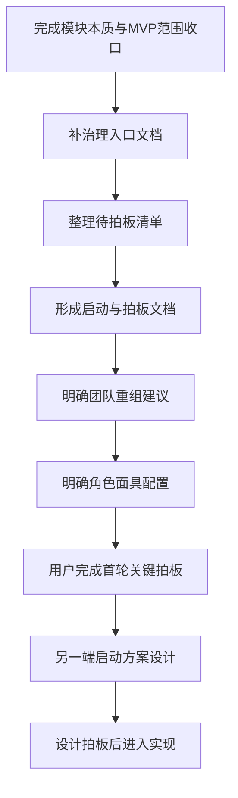

# Phase 2.2 工作流总览与协作导航

> **文档类型**：治理入口 / 协作导航文档  
> **适用模块**：`Phase 2.2` 机会判断模块  
> **归档位置**：`proj_004 / phase2_plan`  
> **状态**：治理文档已补齐，首轮关键拍板已完成，待另一端正式接手  
> **最后更新**：2026-03-16

---

## 一、为什么先补这份文档

在 `Phase 2.2` 当前阶段，我们已经完成了两类非常重要的前置工作：

- 模块本质层的重新定义；
- `MVP scope` 与后续迭代边界的初步收口。

也就是说，`2.2` 现在已经不是一个“要不要做机会评估”的开放问题，而是进入了一个更具体的阶段：

> **如何把已经明确的定位、范围与协作判断，组织成一套可执行、可交接、可让另一端直接接手推进的正式工作流。**

如果缺少这份总览文档，当前 `2.2` 会出现几个明显问题：

- 另一端只能零散阅读多个文档，难以快速理解现在的正式口径；
- 已经形成的关键背景信息、范围边界和后续顺序，容易只停留在对话中，而没有形成稳定入口；
- 后续补的 `待拍板清单 / 启动与拍板 / 团队重组 / 角色面具配置` 四份治理文档，缺少一个统一导航层；
- 双端协作时，容易再次出现“哪些是背景讨论，哪些是正式执行要求”混淆的问题。

因此，这份文档的目的不是替代后续四份治理文档，而是：

> **把 `2.2` 当前阶段的背景、正式结论、阅读顺序、双端分工、下一步动作与拍板节奏，先集中收口成一个统一入口。**

---

## 二、这份文档在整个 `2.2` 工作流中的定位

这份文档应被视为：

- `2.2` 当前阶段的**导航入口**；
- 双端协作时给另一端的**接手说明页**；
- 后续四份治理文档的**总目录与上位说明**；
- 当前阶段“哪些已经明确、哪些即将推进、哪些需要拍板”的**单点概览**。

它不是：

- `2.2` 的第一性原理替代文档；
- `2.2` 的 `MVP scope` 替代文档；
- 具体技术设计方案；
- 具体实现说明或代码任务清单。

换句话说，后续如果另一端要问：

- `2.2` 到底现在是怎么定义的？
- 现在应该先做什么？
- 哪些文档要先看？
- 这一端和另一端分别负责什么？
- 接下来是直接设计，还是先拍板？

那么默认都应该先回到这份文档。  
它应成为 `2.2` 当前阶段的**治理入口页**。

---

## 三、`Phase 2.2` 当前的正式定位

基于现有讨论与已完成文档，`2.2` 当前已经形成的正式定位可以概括为：

> **`Phase 2.2` 的本质，不是评估报告生成器，也不是为了展示形式完整而设计的多 Agent 辩论系统，而是面向战略研究、项目孵化与生态投资的“机会判断层 / 机会升级层”。**

它的职责是：

> **将 `2.1` 输出的结构化信号，与 `2.4` 提供的证据级上下文整合为可解释、可比较、可质疑、可升级的机会假设对象，为后续 `2.3` 的行动建议与下游分流提供判断基础。**

这一定义已经意味着几项重要边界：

- `2.2` 不重做 `2.1` 的信号识别；
- `2.2` 不把判断职责外包给 `2.4`；
- `2.2` 不越级替代 `2.3` 的行动决策；
- 多 Agent 不是 `2.2` 的本体定义，而是可选增强手段；
- `2.2` 当前最重要的不是“报告写得多完整”，而是“机会对象是否成立、是否可供下游稳定消费”。

这一定位是后续所有治理文档、设计文档与执行节奏的共同前提。

---

## 四、当前已经完成的前置文档

截至当前阶段，`2.2` 已经具备两份核心前置文档：

### 4.1 模块本质定位文档

- [PHASE2_2_FIRST_PRINCIPLES_AND_ROLE_ESSENCE.md](../phase2.2_implementation/docs/PHASE2_2_FIRST_PRINCIPLES_AND_ROLE_ESSENCE.md)

这份文档主要回答：

- `2.2` 为什么存在；
- `2.2` 在整个链路里到底负责哪一级判断；
- `2.2` 应该做什么，不应该做什么；
- 为什么它更接近“机会判断层”，而不是“报告生成器”或“多 Agent showcase”。

### 4.2 MVP 范围与后续迭代边界文档

- [PHASE2_2_MVP_SCOPE_AND_ITERATION_ALIGNMENT.md](../phase2.2_implementation/docs/PHASE2_2_MVP_SCOPE_AND_ITERATION_ALIGNMENT.md)

这份文档主要回答：

- 哪些内容应该进入当前 `2.2 MVP`；
- 哪些内容适合作为 `P1 / P2` 增强项；
- 为什么当前不应把完整多 Agent、复杂评分和长报告模板一次性并进 MVP；
- 当前最合理的推进顺序是什么。

### 4.3 原始阶段目标文档

- [phase2.2_目标说明.md](f:\AIProjects\DesignAssistant\data-layer\projects\proj_004\phase2_plan\phase2.2_目标说明.md)

这份文档保留了 `2.2` 最初的任务表达、工作拆分和实现导向计划，是重要背景材料，但当前阶段不能直接把它当作唯一正式口径。原因是：

- 其内容更偏“计划如何实现”；
- 对 `2.2` 本体的定义仍偏“评估模块 / 辩论模块 / 报告模块”；
- 需要以上两份新增文档来完成语义收口与范围纠偏。

因此，当前更准确的理解方式是：

- `phase2.2_目标说明.md`：原始计划背景；
- `PHASE2_2_FIRST_PRINCIPLES_AND_ROLE_ESSENCE.md`：模块本质校正；
- `PHASE2_2_MVP_SCOPE_AND_ITERATION_ALIGNMENT.md`：当前范围收口。

---

## 五、另一端接手时应如何阅读

为了避免另一端一上来就直接进入实现，或者只看旧目标文档就按“多 Agent 评估器”方向开工，建议使用下面这套固定阅读顺序。

### 5.1 推荐阅读顺序

#### 第一层：先理解模块现在到底是什么

1. [PHASE2_2_FIRST_PRINCIPLES_AND_ROLE_ESSENCE.md](../phase2.2_implementation/docs/PHASE2_2_FIRST_PRINCIPLES_AND_ROLE_ESSENCE.md)
2. [PHASE2_2_MVP_SCOPE_AND_ITERATION_ALIGNMENT.md](../phase2.2_implementation/docs/PHASE2_2_MVP_SCOPE_AND_ITERATION_ALIGNMENT.md)

目标是先理解：

- `2.2` 的本体定义；
- 当前 `MVP` 要做什么；
- 当前不做什么；
- 多 Agent 在 `2.2` 里的真实定位。

#### 第二层：再理解阶段背景与原始计划来源

3. [phase2.2_目标说明.md](f:\AIProjects\DesignAssistant\data-layer\projects\proj_004\phase2_plan\phase2.2_目标说明.md)

目标是理解：

- 原始规划为什么会写成“多 Agent + 评分 + 报告”的形态；
- 当前新增文档是如何对其进行校正与收口的。

#### 第三层：最后进入治理与执行文档

4. 本文档 `phase2.2_工作流总览与协作导航.md`
5. 当前已补齐的四份治理文档：
   - `phase2.2_待拍板决策清单.md`
   - `phase2.2_启动与拍板.md`
   - `phase2.2_团队重组建议清单.md`
   - `phase2.2_角色面具配置方案.md`

目标是正式进入：

- 当前工作流；
- 待拍板事项；
- 双端分工；
- 团队组织与角色面具配置；
- 从治理进入设计与实现的顺序。

### 5.2 不建议的接手方式

当前阶段不建议另一端：

- 只看 `phase2.2_目标说明.md` 就直接开始实现；
- 先做多 Agent 角色和辩论编排，再回头补对象契约；
- 先做长报告模板，再补结构化机会对象；
- 在用户未完成首轮拍板前，自行扩大 `2.2` 的当前范围。

---

## 六、`2.2` 当前的阶段判断

基于现有状态，`2.2` 当前更准确的阶段判断不是“进入全面实现阶段”，而是：

> **进入“治理收口 + 启动前拍板 + 设计前对齐”阶段。**

这句话很重要，因为它直接决定当前阶段的主要工作不是写代码，而是先完成下面几件事：

- 把 `2.2` 的正式启动路径写清楚；
- 把必须拍板的问题整理清楚；
- 把这一端和另一端的职责边界写清楚；
- 把角色面具协作方案与团队重组建议明确下来；
- 让下一步的方案设计能够在稳定边界上进行，而不是在模糊共识上推进。

因此，`2.2` 当前阶段的工作重点应被定义为：

- **先治理，后设计；**
- **先拍板，后实现；**
- **先收口对象和边界，后讨论增强项。**

---

## 七、为什么 `2.2` 需要沿用 `2.1 / 2.4` 的治理启动方式

从目前已有的协作经验来看，`2.1` 和 `2.4` 的相对成功之处，不在于一开始就把实现做得多完整，而在于：

- 边界先被说清楚；
- 模块本质先被说清楚；
- 协作角色和职责先被说清楚；
- 用户拍板点先被显式整理；
- 正式要求与探索性讨论被区分开。

这套方式对 `2.2` 尤其重要，原因是 `2.2` 比 `2.1` 更容易出现以下偏差：

- 名义上在做“机会评估”，实际上在做“长文改写”；
- 名义上在做“判断层”，实际上把判断下放给 `2.4`；
- 名义上在做“多 Agent”，实际上没有稳定主对象；
- 名义上已经开始实现，实际上关键边界尚未拍板。

因此，`2.2` 更应该沿用成熟的治理顺序：

也就是说，当前最稳的顺序不是“继续想功能”，也不是“直接写实现”，而是：

> **先把治理文档体系补齐，让另一端在接手时能直接通过文档理解背景、现状、分工、步骤与拍板点。**

---

## 八、这一端与另一端的当前分工

结合双端协作规范，`2.2` 当前阶段建议保持如下分工。

### 8.1 这一端负责什么

这一端更适合继续承担：

- `2.2` 的宏观定位收口；
- `MVP scope` 与后续迭代边界梳理；
- 工作流与治理文档搭建；
- 待拍板决策清单整理；
- 启动节奏、角色配置、团队重组建议；
- 方案设计前的上位判断与边界控制；
- 需要用户拍板的事项提炼与表达。

换句话说，这一端当前负责的是：

> **让 `2.2` 在正式进入设计和实现前，拥有稳定的上层框架、正式口径与协作轨道。**

### 8.2 另一端负责什么

另一端更适合在治理入口补齐后，承担：

- 基于拍板结论完成具体设计方案；
- 细化输入 / 输出契约；
- 细化对象 Schema、处理流程与验证思路；
- 选择技术方案并落地实现；
- 产出运行结果、验证报告和后续优化建议。

换句话说，另一端当前不应先负责重新定义 `2.2` 是什么，而应在已冻结的上层口径之上，承担：

> **把 `2.2` 的机会判断层设计做细、做实，并推进到可验证实现。**

### 8.3 当前阶段的协作边界

当前阶段要特别避免两种协作失衡：

- **这一端替另一端做过多实现细节设计**，导致职责混乱；
- **另一端绕过治理入口直接扩张范围**，导致后续拍板失效。

因此当前最推荐的协作关系是：

- 这一端先搭好治理与导航；
- 用户完成关键拍板；
- 另一端再基于正式口径进入设计与实现。

---

## 九、当前最稳的推进顺序

基于现有状态，`2.2` 当前阶段最稳的推进顺序如下：

### 9.1 第一步：治理入口文档已建立

当前已经完成：

- `phase2.2_工作流总览与协作导航.md`

它的作用是：

- 给另一端一个统一入口；
- 固定当前背景、结论、分工与步骤；
- 作为四份治理文档的上位导航页。

### 9.2 第二步：四份治理文档已补齐

当前已经完成：

1. `phase2.2_待拍板决策清单.md`
2. `phase2.2_启动与拍板.md`
3. `phase2.2_团队重组建议清单.md`
4. `phase2.2_角色面具配置方案.md`

这四份文档分别承担：

- **待拍板决策清单**：把需要用户明确取舍的问题结构化；
- **启动与拍板**：定义正式执行轨、启动门槛、当前结论与拍板结果回写位置；
- **团队重组建议清单**：从组织层定义 `2.2` 必须覆盖哪些正式职责视角，以及这些职责为什么必须存在；
- **角色面具配置方案**：从执行层定义同一 Agent 下如何把正式职责转成可切换、可压缩、可协作的执行面具。

### 9.3 第三步：用户已完成首轮关键拍板

当前阶段已完成：

- `2.2` 的输入 / 输出优先级拍板；
- `2.2` 当前是否引入多 Agent 的拍板；
- `2.2` 当前验收口径与最小闭环定义的拍板；
- 与 `2.1 / 2.4 / 2.3` 的当前协作边界拍板。

### 9.4 第四步：另一端建立执行期多角色面具协作小队，并正式落档 `phase2.2_roles.md`

完成首轮拍板后，另一端的第一步不应是直接写 `phase2.2_设计方案.md`，而应先基于以下文档建立 `2.2` 的执行期多角色面具协作小队：

- [阶段2团队构建方案.md](f:\AIProjects\DesignAssistant\data-layer\projects\proj_004\phase2_plan\阶段2团队构建方案.md)
- `phase2.2_工作流总览与协作导航.md`
- `phase2.2_启动与拍板.md`
- `phase2.2_团队重组建议清单.md`
- `phase2.2_角色面具配置方案.md`

这里的“建队”要明确理解为：

- 是**同一 Agent 下的多角色面具协作小队**；
- 不是多个独立 Agent 并行自治；
- 目标是为后续设计方案提供完整职责覆盖与讨论框架；
- 执行上可以压缩角色数量，但不能丢失关键职责视角。

在此基础上，另一端再在 `phase2_roles` 目录下正式落档：

- `phase2_roles/phase2.2_roles.md`

`phase2.2_roles.md` 至少应明确：

- `2.2` 采用的是同一 Agent 下的角色面具协作模式；
- **正式职责命名优先以 [phase2.2_团队重组建议清单.md](f:\AIProjects\DesignAssistant\data-layer\projects\proj_004\phase2_plan\phase2.2_团队重组建议清单.md) 为准；**
- **执行压缩方式、调用顺序与面具映射优先以 [phase2.2_角色面具配置方案.md](f:\AIProjects\DesignAssistant\data-layer\projects\proj_004\phase2_plan\phase2.2_角色面具配置方案.md) 为准；**
- 当前标准配置与压缩配置分别覆盖哪些职责视角；
- 每个角色 / 视角的职责边界、输入输出与非职责；
- 多角色如何共同产出 `phase2.2_设计方案.md`；
- 哪些事项必须先经过用户拍板，不能由执行端自行扩大范围。

这一步的作用，不只是“补一个角色文件”，而是把“建议性的治理配置”转成“执行期正式角色依据”，使另一端后续的方案设计、实现与验证都有统一参照。

### 9.5 第五步：另一端基于正式角色依据接手方案设计

在正式角色定义文件落档后，另一端再进入：

- `phase2.2_设计方案.md` 的正式编写；
- 输入 / 输出契约细化；
- 主流程设计；
- 机会对象 Schema 细化；
- 轻量验证方案与案例设计。

这一阶段的重点是把 `2.2` 做成稳定的“机会判断对象层”，而不是先去卷复杂多 Agent、长报告或重评分系统。

### 9.6 第六步：设计拍板后再进入实现

只有在设计层也完成关键取舍后，才建议正式进入：

- 代码实现；
- 样例验证；
- 联调与下一轮迭代。

---

## 十、当前阶段默认采用的核心判断

为了防止另一端接手后仍沿旧路径理解 `2.2`，建议在当前阶段默认采用以下判断口径。

### 10.1 关于 `2.2` MVP

当前 `2.2 MVP` 的中心应是：

> **结构化机会对象 + 最小判断闭环**

而不是：

- 长报告优先；
- 多 Agent 优先；
- 复杂评分优先。

### 10.2 关于多 Agent

当前阶段的默认口径应是：

- **多 Agent 不作为 `2.2 MVP` 的硬要求；**
- **多 Agent 可以作为 `2.2` 的 `P1 / P2` 增强项；**
- **如果要体现更完整的多 Agent 工程经历，`2.5` 很可能是更合适的主展示场景。**

也就是说：

- 当前不否定多 Agent；
- 但当前也不应为了做多 Agent，而牺牲 `2.2` 的边界清晰度与判断骨架稳定性。

### 10.3 关于设计优先级

当前默认优先级建议为：

- **P0**：输入契约与输出契约
- **P1**：机会组装 / 判断 / 分级 / 升级建议最小闭环
- **P2**：轻量案例验证
- **P3**：轻量评分补充 / 简版摘要
- **P4**：多 Agent 增强与更复杂编排

---

## 十一、当前需要固定下来的文档工作流

为了让另一端接手时能够直接顺着文档进入工作，而不需要重新靠对话理解背景，建议把 `2.2` 当前阶段的文档工作流固定为下面这组关系。

### 11.1 治理层文档

- `phase2.2_工作流总览与协作导航.md`
- `phase2.2_待拍板决策清单.md`
- `phase2.2_启动与拍板.md`
- `phase2.2_团队重组建议清单.md`
- `phase2.2_角色面具配置方案.md`

### 11.2 模块定位与范围文档

- [PHASE2_2_FIRST_PRINCIPLES_AND_ROLE_ESSENCE.md](../phase2.2_implementation/docs/PHASE2_2_FIRST_PRINCIPLES_AND_ROLE_ESSENCE.md)
- [PHASE2_2_MVP_SCOPE_AND_ITERATION_ALIGNMENT.md](../phase2.2_implementation/docs/PHASE2_2_MVP_SCOPE_AND_ITERATION_ALIGNMENT.md)
- [phase2.2_目标说明.md](f:\AIProjects\DesignAssistant\data-layer\projects\proj_004\phase2_plan\phase2.2_目标说明.md)

### 11.3 后续设计与实现文档

在当前治理阶段结束、首轮拍板完成后，另一端应按顺序继续补以下执行轨文档与产物：

#### A. 先补执行角色定义

- `phase2_roles/phase2.2_roles.md`

目标是把团队重组建议和角色面具配置，正式转化为 `2.2` 执行期可直接使用的角色定义文件。

另一端在建立这份文件时，至少应参考：

- [阶段2团队构建方案.md](f:\AIProjects\DesignAssistant\data-layer\projects\proj_004\phase2_plan\阶段2团队构建方案.md)
- `phase2.2_工作流总览与协作导航.md`
- `phase2.2_启动与拍板.md`
- `phase2.2_团队重组建议清单.md`
- `phase2.2_角色面具配置方案.md`
- `phase2_roles/phase2.1_roles.md`

并且在 `phase2.2_roles.md` 中显式写清：

- 这是**同一 Agent 下的角色面具协作小队**，不是多个独立 Agent；
- **正式职责命名与必须覆盖的职责维度，以 [phase2.2_团队重组建议清单.md](f:\AIProjects\DesignAssistant\data-layer\projects\proj_004\phase2_plan\phase2.2_团队重组建议清单.md) 为准；**
- **正式职责在执行期如何压缩、映射与调用，以 [phase2.2_角色面具配置方案.md](f:\AIProjects\DesignAssistant\data-layer\projects\proj_004\phase2_plan\phase2.2_角色面具配置方案.md) 为准；**
- 角色数量是职责视角覆盖，不等于必须配置同等数量的自治体；
- 哪些职责视角必须完整保留，哪些职责可以执行压缩；
- 后续 `phase2.2_设计方案.md` 必须作为多角色讨论后的收敛产物，而不是单一视角直接起草。

#### B. 再补设计主文档

- `phase2.2_设计方案.md`

目标是正式定义：

- `2.2` 主流程；
- 输入对象如何组装为机会对象；
- 最小判断闭环如何完成；
- 分级 / 升级建议如何表达；
- 首轮验证如何组织。

#### C. 再补实现配套文档

建议另一端在 [docs](f:\AIProjects\DesignAssistant\data-layer\projects\proj_004\phase2.2_implementation\docs) 中继续补：

- 输入 / 输出契约说明；
- Schema 说明；
- Prompt / reasoning 设计说明；
- 轻量案例验证方案；
- case validation / benchmark 结果；
- 联调记录与回写文档。

也就是说，另一端正式接手后的第一批核心产物，不应只是一份设计方案，而应至少形成：

- `phase2_roles/phase2.2_roles.md`
- `phase2.2_设计方案.md`
- `phase2.2_implementation/docs` 下的契约、验证与联调材料

### 11.4 文档使用规则

- 模块定义与边界问题，优先看本质定位文档与 `MVP scope` 文档；
- 当前该做什么、先看什么、由谁做什么，优先看本文档；
- 正式进入执行前，必须以 `启动与拍板` 文档中的正式结论为准；
- 对话中的临时想法，只有写回执行轨文档后，才视为正式要求。

---

## 十二、这一阶段需要另一端明确知道的事

如果这份文档是要给另一端直接阅读，那么当前最重要的是让另一端一开始就明确以下几点：

### 12.1 现在不是直接开写实现的时候

当前阶段已经进入 `2.2` 的正式推进准备期，但还没有到“可以不经拍板就自由设计与实现”的阶段。

### 12.2 现在最重要的是先建立稳定启动条件

当前首要目标不是把功能做满，而是让 `2.2`：

- 有稳定定义；
- 有稳定边界；
- 有稳定文档入口；
- 有稳定分工；
- 有明确拍板点。

### 12.3 这一端和另一端的协作方式已经固定

当前协作方式应默认为：

- 这一端负责上层治理和收口；
- 另一端负责后续的具体设计与实现；
- 用户负责关键拍板；
- 未经拍板的开放讨论，不直接视为正式要求。

### 12.4 当前后续顺序已经确定

即：

1. 治理入口文档与四份治理文档已经补齐；
2. 先做用户首轮关键拍板；
3. 再由另一端在 `phase2_roles` 下建立 `phase2.2_roles.md`；
4. 再由另一端补 `phase2.2_设计方案.md`；
5. 设计拍板后再进入实现与验证；
6. 最后进入联调、回写与后续增强项判断。

这条顺序当前应被视为 `2.2` 的正式推进主路径。

### 12.5 另一端接手后的最低执行清单

为了避免另一端只知道“要开始设计”，却不知道具体要先落哪些东西，当前应默认另一端接手后的最低执行清单为：

- 先依据 [阶段2团队构建方案.md](f:\AIProjects\DesignAssistant\data-layer\projects\proj_004\phase2_plan\阶段2团队构建方案.md)、`phase2.2_工作流总览与协作导航.md`、`phase2.2_启动与拍板.md`、`phase2.2_团队重组建议清单.md`、`phase2.2_角色面具配置方案.md` 建立 `2.2` 的执行期多角色面具协作小队；
- 在 `phase2_roles` 目录下建立 `phase2.2_roles.md`，把角色协作模式、职责边界、压缩方案与设计产出路径正式落档；
- 由多角色面具讨论并收敛，在 `phase2_plan` 中建立 `phase2.2_设计方案.md`；
- 在 `phase2.2_implementation/docs` 中补输入 / 输出契约说明与 Schema 说明；
- 继续补 Prompt / reasoning 设计、轻量验证方案、案例结果与联调记录；
- 在实现期回写关键验证结论，保证治理链路和执行链路持续对齐。

---

## 十三、当前阶段的进入下一步条件

在这份文档完成后，`2.2` 进入下一步的条件应定义为：

### 13.1 文档条件

- `phase2.2_工作流总览与协作导航.md` 已完成；
- 四份治理文档已补齐；
- 当前阶段的关键背景和结论已有固定入口。

### 13.2 治理条件

- `2.2` 的正式启动顺序已明确；
- 待拍板事项已整理完成；
- 这一端与另一端的职责边界已明确；
- 另一端建立 `phase2.2_roles.md` 的依据链已明确。

### 13.3 拍板条件

- 用户已完成首轮关键拍板；
- 关键分歧未带入设计阶段；
- 当前 `MVP` 的优先级与增强项边界已明确。

也就是说：**当前文档、治理与首轮拍板条件已具备，下一步应由另一端启动正式角色落档与方案设计。**

---

## 十四、当前阶段的一句话结论

如果要把这份文档压缩成一句最重要的话，可以写成：

> **`Phase 2.2` 当前不是直接实现阶段，而是“治理收口、拍板前置、设计待启动”的阶段；当前最稳的推进方式，是先把工作流入口与四份治理文档补齐，再让另一端基于正式口径进入设计与实现。**

---

## 十五、下一步动作

基于当前顺序，本文档完成后的直接下一步应为：

1. 让另一端依据 [阶段2团队构建方案.md](f:\AIProjects\DesignAssistant\data-layer\projects\proj_004\phase2_plan\阶段2团队构建方案.md)、本文档、[phase2.2_启动与拍板.md](f:\AIProjects\DesignAssistant\data-layer\projects\proj_004\phase2_plan\phase2.2_启动与拍板.md)、[phase2.2_团队重组建议清单.md](f:\AIProjects\DesignAssistant\data-layer\projects\proj_004\phase2_plan\phase2.2_团队重组建议清单.md)、[phase2.2_角色面具配置方案.md](f:\AIProjects\DesignAssistant\data-layer\projects\proj_004\phase2_plan\phase2.2_角色面具配置方案.md) 在 `phase2_roles` 下建立 `phase2.2_roles.md`
2. 让另一端基于正式角色依据产出 `phase2.2_设计方案.md`
3. 完成设计层关键拍板
4. 再进入 `phase2.2_implementation/docs` 与实现目录的契约、验证、联调材料补齐

---

**文档状态**：✅ 已建立  
**版本**：v0.3 Confirmed  
**建议下次更新时机**：当 `phase2_roles/phase2.2_roles.md` 正式落档，或进入方案设计阶段前