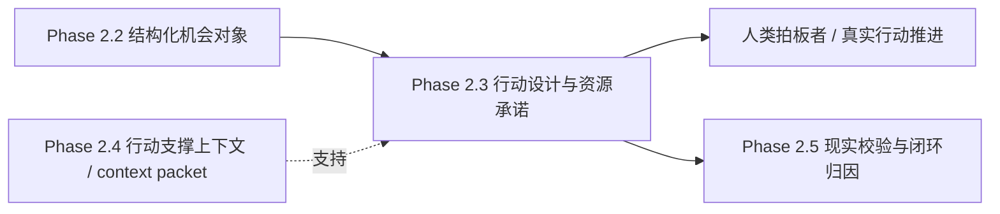

# Phase 2.3 启动与拍板

> **文档类型**：执行轨实例文档  
> **适用模块**：`Phase 2.3` 行动设计与资源承诺模块  
> **状态**：首轮关键拍板、第二轮统一拍板、设计拍板均已完成；`phase2_roles/phase2.3_roles.md` 与 `phase2.3_设计方案.md` 已建立；可进入正式实现阶段
> **最后更新**：2026-03-16

---

## 一、模块基本信息

| 字段 | 内容 |
|------|------|
| **模块名称** | 阶段2.3 行动设计与资源承诺模块 |
| **模块编号** | `Phase 2.3` |
| **启动日期** | 2026-03-16 |
| **角色协作模式** | 设计阶段采用同一 Agent 下的角色面具协作小队（建议 `6-8` 个正式职责视角，执行时可压缩为 `5-6` 个角色面具） |
| **模块负责人** | 方案设计负责人视角（当前由治理收口与两轮拍板牵头；现可由另一端据此组织多角色讨论、正式落档 `phase2_roles/phase2.3_roles.md` 并推进方案设计） |
| **正式职责视角** | 总协调 / 架构连续性视角 / 方案设计负责人 / 行动设计负责人 / 资源承诺负责人 / 风险与约束负责人 / 结构化契约负责人 / 验证与验收负责人 / 实现落地工程师视角 |
| **角色定义文档** | `phase2_roles/phase2.3_roles.md`（由另一端在首轮拍板后，参考 [阶段2团队构建方案.md](f:\AIProjects\DesignAssistant\data-layer\projects\proj_004\phase2_plan\阶段2团队构建方案.md)、[phase2.3_工作流总览与协作导航.md](f:\AIProjects\DesignAssistant\data-layer\projects\proj_004\phase2_plan\phase2.3_工作流总览与协作导航.md)、本文档、[phase2.3_团队重组建议清单.md](f:\AIProjects\DesignAssistant\data-layer\projects\proj_004\phase2_plan\phase2.3_团队重组建议清单.md)、[phase2.3_角色面具配置方案.md](f:\AIProjects\DesignAssistant\data-layer\projects\proj_004\phase2_plan\phase2.3_角色面具配置方案.md)，并可参考 `phase2_roles/phase2.2_roles.md` 的落档方式正式建立） |
| **上游输入** | `phase2.3_目标说明.md`、[PHASE2_3_FIRST_PRINCIPLES_AND_ROLE_ESSENCE.md](../phase2.3_implementation/docs/PHASE2_3_FIRST_PRINCIPLES_AND_ROLE_ESSENCE.md)、[PHASE2_3_MVP_SCOPE_AND_ITERATION_ALIGNMENT.md](../phase2.3_implementation/docs/PHASE2_3_MVP_SCOPE_AND_ITERATION_ALIGNMENT.md)、`Phase 2.2` 结构化机会对象、`Phase 2.4` 行动支撑上下文 / context packet、最小组织约束条件 |
| **下游服务对象** | 人类拍板者、真实行动推进、`Phase 2.5` 现实校验与闭环归因 |
| **当前状态** | `首轮关键拍板与第二轮统一拍板已完成，待另一端建立执行期多角色面具协作小队、正式落档 phase2.3_roles.md 并推进方案设计；设计拍板后进入正式实现` |
| **实现目录** | [phase2.3_implementation/](../phase2.3_implementation/) |

---

## 二、模块定位与目标

### 2.1 一句话定义

> `Phase 2.3` 的职责不是把 `2.2` 的机会判断改写成长篇建议书，也不是为了形式完整而先做大而全计划系统，而是把机会判断对象与行动支撑上下文转译为**可分阶段承诺、可控制风险、可动态调整、可必要时止损的结构化行动决策对象**。

### 2.2 当前阶段目标

- **要解决的问题**：`2.2` 可以把信号升级成结构化机会对象，但组织仍缺少一层把“机会判断”转化为“下一步应如何下注、以什么节奏承诺资源、在什么条件下升级或退出”的行动设计层；如果直接跳到实施或长篇计划书，会导致判断与承诺脱节，后续难以解释、难以拍板、也难以被 `2.5` 验证。
- **直接价值**：交付“行动姿态判断 → 分阶段承诺 → `Go/No-Go` 节点 → 退出条件”的最小闭环，让 `2.3` 真正成为从认知对象走向行动对象的关键中层。
- **复用价值**：后续可复用于战略研究、项目孵化、试点验证、生态合作与投资占位等场景中的行动设计与资源承诺问题。
- **面试展示价值**：体现“把结构化机会对象升级为结构化行动对象”的 AI-native 中间层设计能力，而不是只会做报告生成或一次性做满复杂系统 [[memory:rebp86gg]]。
- **工程沉淀价值**：沉淀 `2.2 -> 2.3 -> 2.5` 的对象契约、行动骨架、承诺逻辑、验证接口与回溯字段。

### 2.2.1 判断层级边界

为避免与 `2.2`、`2.4`、`2.5` 发生职责混淆，本文档中的“判断”采用以下层级定义：

- **`2.2 = 机会级判断`**：判断一组信号与证据是否构成值得跟踪、研究、验证、试点或升级的机会对象
- **`2.3 = 行动级判断 / 资源承诺判断`**：判断基于机会对象当前应采取何种行动姿态、释放何种阶段资源、设置何种推进门槛与退出条件
- **`2.5 = 现实校验与闭环归因`**：判断 `2.3` 所设计的行动对象在真实推进中是否成立、为何偏差、如何回写系统改进

因此：

- `2.3` 不回卷重做 `2.2` 的机会级判断
- `2.3` 不把 `2.4` 直接当作现成答案层
- `2.3` 也不越级替代 `2.5` 的现实验证与复盘归因
- `2.3` 当前要冻结的是**结构化行动决策对象契约与最小行动设计闭环**

### 2.3 本次启动范围

- **MVP 必做**
  - 冻结 `2.3` 当前模块边界：行动设计层 / 资源承诺层
  - 冻结 `2.3` 的最小输入契约（来自 `2.2` 的结构化机会对象、来自 `2.4` 的行动支撑上下文、最小组织约束）
  - 冻结 `2.3` 的最小输出契约（结构化行动决策对象）
  - 打通“行动姿态判断 → 分阶段承诺 → `Go/No-Go` 节点 → 退出条件”的最小闭环
  - 保留轻量资源承诺表达（角色 / 带宽 / 时间 / 粗粒度预算带）
  - 选择少量真实机会对象做首轮轻量案例验证
  - 产出 `2.2 -> 2.3` 的字段说明、对象样例与消费约定
- **明确不做**
  - 不把 `2.3` 当前主产物定义成长篇决策建议书
  - 不在 `MVP` 启动前把完整多 Agent 编排作为硬前提
  - 不让 `2.3` 回头重做 `2.2` 的机会判断职责
  - 不让 `2.3` 越级替代 `2.5` 的现实校验与复盘归因
  - 不在首轮拍板前扩张为完整预算系统、完整经营计划模板或复杂行业特化策略库
- **完整版方向**
  - 更细的人力 / 预算 / 时间线模型
  - 更完整的长篇建议视图与汇报派生层
  - 场景化路径模板库与策略树增强
  - 多角色反方审视、资源现实性校验与多 Agent 增强机制
  - 与 `2.5` 的整合验证、现实反馈和闭环展示联动
- **当前最大风险**
  - 如果在结构化行动对象与模块边界尚未冻结前，直接进入细预算、长文档或复杂编排设计，`2.3` 会迅速偏离“行动设计层”的本质，并导致后续返工。

---

## 三、上下游与依赖关系

### 3.1 上下游关系图



### 3.2 依赖说明

- **直接输入依赖**：`2.3` 直接消费 `2.2` 的结构化机会对象，不应回退为重新处理原始长文本或重做机会判断。
- **支撑依赖**：`2.4` 为 `2.3` 提供决策模型、资源模板、风险矩阵、类似案例与失败模式等行动支撑上下文。
- **组织约束依赖**：`2.3` 逐步消费资源上限、风险偏好、时间窗口和升级门槛等内部约束，否则只能输出“理论上合理”的建议。
- **下游语义依赖**：`2.5` 需要 `2.3` 提供稳定的行动对象、阶段门槛、资源承诺与退出条件，否则现实校验无法对齐原始设计意图。
- **治理依赖**：`2.3` 必须先冻结“模块边界 / 输入输出契约 / MVP 闭环 / 拍板事项”，否则即使先写实现，也难以形成稳定中间层。

### 3.3 启动条件判断

- **现在可以启动的内容**
  - `2.3` 的输入契约草案
  - 结构化行动决策对象 Schema 草案
  - 行动姿态与分阶段承诺骨架
  - 少量真实案例的样本走读与轻量验证设计
  - 不依赖完整多 Agent 的最小行动设计流程
- **暂不建议深做的内容**
  - 基于完整多 Agent 的行动设计编排与路由
  - 复杂预算 / 招聘 / 全周期人力模型
  - 以长篇计划书模板为中心的完整产物形态设计
  - 强依赖 `2.4` 全量成熟能力的深耦合接口设计

---

## 四、契约草案

### 4.1 输入契约

#### A. `ActionDesignRequest`

| 字段 | 类型 | 必填 | 含义 | 备注 |
|------|------|------|------|------|
| `request_id` | `string` | Y | 本次行动设计请求唯一ID | 用于追踪与回放 |
| `source_scope` | `string` | N | 请求来源范围 | 如项目、赛道、主题 |
| `opportunity_object` | `object` | Y | 来自 `2.2` 的结构化机会对象 | 当前核心输入 |
| `context_packet` | `object[]` | N | 来自 `2.4` 的行动支撑上下文 | 当前为可选增强项 |
| `org_constraints` | `object` | N | 当前组织约束 | 如预算带、带宽、风险偏好 |
| `decision_mode` | `string` | N | 决策模式 | 默认 `mvp_single_pass` |
| `constraints` | `object` | N | 额外限制与提醒 | 如排除条件、强约束等 |

### 4.2 输出契约

#### A. `ActionDecisionObject` 最小字段

| 字段 | 类型 | 必填 | 含义 | 备注 |
|------|------|------|------|------|
| `opportunity_title` | `string` | Y | 对应机会标题 | 与 `2.2` 对齐 |
| `decision_posture` | `string` | Y | 当前行动姿态 | 当前建议 `watch / validate / pilot / escalate / hold / stop` |
| `why_this_posture` | `string` | Y | 当前姿态解释 | 当前判断主句 |
| `phased_plan` | `object[]` | Y | 分阶段行动计划 | 至少返回 `1` 个阶段 |
| `top_risks` | `object[]` | Y | 关键风险列表 | 风险必须与行动约束相关联 |
| `resource_commitment_logic` | `string` | Y | 资源承诺逻辑说明 | 解释为什么按该节奏释放资源 |
| `fallback_path` | `string` | Y | 备选路径 / 降级路径 | 服务于保留期权与止损 |
| `open_questions` | `string[]` | Y | 当前仍未关闭的问题 | 允许为空数组但必须返回 |
| `decision_summary` | `string` | N | 简版可读摘要 | 作为辅助表达 |
| `decision_version` | `string` | Y | 决策版本号 | 便于基线对照 |
| `processing_time_ms` | `integer` | Y | 处理耗时 | 毫秒 |
| `warnings` | `string[]` | N | 风险或异常提示 | 如“约束不足”“证据偏弱”等 |

#### B. `PhasedPlanItem` 最小字段

| 字段 | 类型 | 必填 | 含义 | 备注 |
|------|------|------|------|------|
| `stage` | `string` | Y | 当前阶段名称 | 如 `validation / pilot / escalation_preparation` |
| `objective` | `string` | Y | 当前阶段目标 | 用一句话说明 |
| `key_assumptions_to_test` | `string[]` | Y | 当前阶段验证的关键假设 | 允许为空数组但必须返回 |
| `actions` | `string[]` | Y | 当前阶段关键动作 | 至少一项 |
| `resources` | `object` | Y | 当前阶段资源表达 | 当前使用轻量表达 |
| `milestones` | `string[]` | Y | 阶段里程碑 | 至少一项 |
| `go_no_go_criteria` | `string[]` | Y | 继续 / 暂停 / 升级门槛 | 允许为空数组但必须返回 |
| `exit_conditions` | `string[]` | Y | 退出条件 | 允许为空数组但必须返回 |

#### C. `ActionDesignResult` 最小字段

| 字段 | 类型 | 必填 | 含义 | 备注 |
|------|------|------|------|------|
| `request_id` | `string` | Y | 请求ID | 与输入对齐 |
| `action_decision` | `ActionDecisionObject` | Y | 行动决策对象 | 当前正式主产物 |
| `global_summary` | `string` | N | 当前整体判断摘要 | 辅助阅读 |
| `designer_version` | `string` | Y | 版本号 | 用于基线与回放 |
| `processing_time_ms` | `integer` | Y | 总耗时 | 毫秒 |

### 4.3 契约原则

- **核心目标是“对象化行动设计”，不是“文本化建议扩写”**：`ActionDecisionObject` 才是正式交付物，摘要与说明只是辅助视图。
- **资源承诺必须与假设验证绑定**：资源表达服务于行动设计与阶段门槛，而不是脱离验证逻辑独立存在。
- **风险必须进入行动结构**：风险不应只作为附录性章节，而要直接影响路径、节奏、资源释放与退出条件。
- **判断不等于现实执行结果**：`2.3` 只设计可拍板的行动对象，不替代 `2.5` 的现实验证。
- **先冻结最小字段，再逐步增强**：MVP 阶段优先保证对象稳定、可回放、可被下游消费，不追求一次到位。
- **对 `2.4` 保持弱耦合兼容**：`context_packet` 当前为可选增强输入，避免 `2.3` 被上游成熟度拖住。

### 4.4 契约检查表

| 问题 | 结论 | 备注 |
|------|------|------|
| **输入是否明确？** | 是 | 已明确 `2.2` 为主输入、`2.4` 为可选增强支撑 |
| **输出是否明确？** | 是 | 结构化行动决策对象已给出最小字段，且主字段骨架已冻结 |
| **是否区分正式字段与辅助字段？** | 是 | `ActionDecisionObject` 为主，摘要为辅 |
| **是否避免越界到 `2.5`？** | 是 | 不直接生成现实验证结论 |
| **是否支持后续增强？** | 是 | 可通过更细资源模型、模板、多 Agent 逐步增强 |
| **是否便于下游稳定消费？** | 是 | 当前主字段骨架与行动姿态口径已完成冻结，可作为后续联调基线 |

---

## 五、验收与评测

### 5.1 效果定义

- **功能层目标**：能够稳定接收 `2.2` 输出与可选 `2.4` 支撑包，返回合法的结构化行动决策对象。
- **质量层目标**：行动对象应具备可解释性、可拍板性和最小承诺逻辑，而不是只把机会判断改写成更长文本。
- **协作层目标**：人类拍板者可以基于 `2.3` 输出更容易判断“是否推进、先做什么、先投多少、何时止损”。
- **验证层目标**：`2.5` 可以基于 `2.3` 输出直接检查原始假设、门槛与退出条件，而不需要重新推测当时的设计意图。
- **工程层目标**：完成首轮对象契约、姿态口径、阶段计划字段与验证方法的冻结，为下一阶段实现与增强打底。

### 5.2 指标表

| 层级 | 指标 | 目标值 | 测量方式 |
|------|------|--------|----------|
| **功能层** | 输出 Schema 合法率 | `100%` | JSON / 字段检查 |
| **质量层** | 行动姿态可解释性 | `可读且可说明` | 人工走读样例 |
| **质量层** | 阶段承诺合理性 | `基本具备` | 样例检查 |
| **质量层** | 退出条件明确度 | `基本具备` | 人工评审 |
| **协作层** | 人类可拍板性 | `可直接用于讨论` | 接口走读 + 样例联评 |
| **验证层** | `2.5` 可复盘性 | `可直接引用` | 字段映射检查 |
| **展示层** | 可演示性 | 至少 `1-2` 条完整案例 | Demo记录 |
| **工程层** | 契约冻结完成度 | `MVP 主字段冻结` | 文档检查 |

### 5.3 基线与实验

- **首轮验证样本数量**：建议 `2-5` 组真实机会对象
- **样本选择原则**：优先选择存在机会价值但不确定性较高、需要分阶段承诺而不是一步到位的案例
- **验证重点**：
  - 是否能把机会对象组织成稳定的行动对象
  - 是否能输出清晰姿态、阶段目标、门槛与退出条件
  - 是否能把资源承诺与关键假设验证绑定
  - 是否能产出让 `2.5` 后续复盘的结构化字段
- **责任建议**：验证与验收视角维护首轮案例基线，用户负责方向性拍板，另一端后续负责结合实现结果回写验证结论
- **效果不达标时的排查顺序**：对象定义 → 输入契约 → 姿态口径 → 阶段计划骨架 → `2.4` 支撑质量 → 是否需要增强机制

---

## 六、职责划分与协作边界

### 6.1 人与 AI 的职责划分

| 工作类型 | 负责人 | 原因 |
|----------|--------|------|
| **模块边界定义** | 人 | 涉及跨模块职责与范围控制 |
| **关键设计拍板** | 人 | 涉及承诺节奏与后续路径取舍 |
| **契约 / 文档初稿** | AI / 数字团队 | 适合快速结构化整理 |
| **行动对象骨架与样例草拟** | AI / 数字团队 | 适合快速搭建与对比 |
| **质量验收** | 人主导 + AI辅助 | 需要业务判断与样例走读结合 |
| **最终取舍决策** | 人 | 避免执行端自行扩范围 |

### 6.2 协作机制

- **单一事实源**：
  - `2.3` 模块本质与边界，看 [PHASE2_3_FIRST_PRINCIPLES_AND_ROLE_ESSENCE.md](../phase2.3_implementation/docs/PHASE2_3_FIRST_PRINCIPLES_AND_ROLE_ESSENCE.md)
  - `2.3` 当前范围与后续边界，看 [PHASE2_3_MVP_SCOPE_AND_ITERATION_ALIGNMENT.md](../phase2.3_implementation/docs/PHASE2_3_MVP_SCOPE_AND_ITERATION_ALIGNMENT.md)
  - `2.3` 当前工作流入口与阅读顺序，看 [phase2.3_工作流总览与协作导航.md](f:\AIProjects\DesignAssistant\data-layer\projects\proj_004\phase2_plan\phase2.3_工作流总览与协作导航.md)
  - `2.3` 当前待拍板事项，看 [phase2.3_待拍板决策清单.md](f:\AIProjects\DesignAssistant\data-layer\projects\proj_004\phase2_plan\phase2.3_待拍板决策清单.md)
  - `2.3` 正式启动动作、拍板结果与执行依据，以本文档为准
- **文件所有权**：
  - 当前治理与启动节奏由宏观规划端维护
  - 后续方案设计文档由另一端负责补齐
  - 拍板结果必须回写本文档，才能视为正式生效
- **共享文件限制**：关键结论必须先写回本文档，再继续进入方案设计与实现
- **同步节奏**：每完成一轮关键拍板、一次契约冻结或一轮验证结果更新，先更新本文档，再继续推进执行

### 6.3 角色面具建队 / 启动清单

`2.3` 启动应遵循“**先冻结治理，再定义角色面具，再由多角色收敛设计，最后进入实现**”的顺序，而不是一上来直接做复杂编排或直接写实现。

**重要说明**：
- `Phase 2.3` 采用**同一 Agent 下的角色面具协作模式**
- 多角色讨论是为了帮助行动对象与承诺逻辑高质量收敛，不等于产品运行时已经采用多 Agent
- 角色定义正式落档是指在 `phase2_roles` 目录下建立 `phase2.3_roles.md`，不是创建多个独立自治 Agent
- 正式职责来源以 [phase2.3_团队重组建议清单.md](f:\AIProjects\DesignAssistant\data-layer\projects\proj_004\phase2_plan\phase2.3_团队重组建议清单.md) 为准；执行压缩与协作方式以 [phase2.3_角色面具配置方案.md](f:\AIProjects\DesignAssistant\data-layer\projects\proj_004\phase2_plan\phase2.3_角色面具配置方案.md) 为准

#### A. 建队与启动主路径

```text
总协调视角确认本轮目标与前置文档
→ 用户完成首轮关键拍板
→ 另一端依据 阶段2团队构建方案 / 2.3 工作流总览 / 本文档 / 2.3 团队重组建议 / 2.3 角色面具配置方案 建立执行期同一 Agent 下的多角色面具协作小队
→ 在 phase2_roles/ 下正式落档 phase2.3_roles.md（可参考 phase2.2_roles.md 的落档方式，但必须保持 2.3 自身职责边界）
→ 方案设计负责人牵头组织多角色讨论
→ 产出 2.3 设计方案
→ 用户完成设计拍板
→ 进入正式实现、轻量验证与资产沉淀
```

#### B. 启动检查清单

| 阶段 | 关键动作 | 主责角色视角 | 产出物 | 进入下一步条件 |
|------|----------|-------------|--------|----------------|
| **1. 冻结治理入口** | 确认 `2.3` 定位、`MVP` 范围、依赖模式与待拍板项 | 总协调视角 / 用户 | 本文档首轮确认版 | 四份治理文档已补齐，且首轮拍板问题已拉齐 |
| **2. 完成首轮关键拍板** | 对模块边界、主产物、`MVP` 最小闭环、多角色定位与上下游边界做用户确认 | 总协调视角 / 用户 | 首轮拍板结论回写 | 首轮关键分歧已关闭，方可进入建队与 `roles` 落档 |
| **3. 定义执行期角色面具** | 由另一端基于治理文档建立执行期协作小队，并正式建立 `phase2_roles/phase2.3_roles.md` | 总协调视角 / 另一端 | `phase2_roles/phase2.3_roles.md` | 正式角色定义已落档，职责边界与执行映射已明确，方可进入设计 |
| **4. 多角色收敛设计** | 基于 `phase2_roles/phase2.3_roles.md` 组织行动设计、资源承诺、风险约束、契约、验证五视角讨论 | 方案设计负责人 / 相关职责视角 | `2.3` 设计方案草案 | 主流程、字段骨架、验证路径已收敛 |
| **5. 完成设计拍板** | 对设计方案、字段骨架、实现策略和验收口径做用户确认 | 总协调视角 / 用户 | 设计拍板结论回写 | 设计拍板通过后，方可进入正式实现 |
| **6. 启动正式实现** | 落地最小行动设计流程、样例输出与轻量验证 | 实现落地工程师视角 / 验证与验收负责人 | 可运行闭环、样例结果、验证记录 | 输出稳定、对象可读、可拍板、可复盘 |
| **7. 进入下游联调** | 核对 `2.2 -> 2.3` 消费方式，并复查 `2.4` 依赖是否需增强，确认 `2.5` 是否可直接消费核心字段 | 结构化契约负责人 / 总协调视角 | 联调结果、依赖复查记录 | 下游可稳定消费，上游增强不构成强阻塞 |

#### C. 执行纪律

- **先治理、先首轮拍板，再建队、落 `roles`、做设计**：`2.3` 不应带着治理分歧进入执行期角色落档与方案设计。
- **设计完成后必须再做一次设计拍板**：未经设计拍板，不得直接进入正式实现。
- **本文档是启动动作单一事实源**：与“怎么启动、两次拍板何时发生、何时进入设计、何时进入实现”相关的执行动作，以本文档为准。
- **`2.3` 不得借启动之名扩大范围**：在用户未拍板前，不得把完整多 Agent、复杂预算、完整计划模板提前塞进当前 `MVP`。
- **角色面具协作，不是多 Agent 自治**：当前角色面具用于设计期的高质量收敛，不代表产品运行时已经要采用多 Agent 编排。

---

## 七、待拍板事项

### 7.1 首轮关键拍板结果（治理收口后、建队与设计前）

| 决策项 | 可选方案 | 推荐方案 | 为什么现在必须定 | 拍板结果 |
|--------|----------|----------|------------------|----------|
| **模块边界** | A. 聚焦行动设计层 / 资源承诺层；B. 顺带做完整计划书层；C. 越级覆盖现实验证与复盘 | **A** | 会直接决定 `2.3` 是否侵入 `2.5` 或退化为展示层 | ✅ 已拍板：采用 **A**，`2.3` 当前明确聚焦行动设计层 / 资源承诺层 |
| **主产物形态** | A. 长篇自然语言决策建议；B. 结构化行动决策对象 + 可选简版说明；C. 路径表 + 预算表 + 风险表组合输出 | **B** | 不冻结主对象，后续设计与实现目标会分裂 | ✅ 已拍板：采用 **B**，以结构化行动决策对象为正式主产物，简版说明仅作辅助视图 |
| **输入依赖模式** | A. 以 `2.2` 机会对象为主，`2.4` 支撑包为可选增强；B. 强依赖 `2.4` 完整成熟后再启动；C. 绕开 `2.2` 直接重读原文 | **A** | 决定当前能否启动，也决定上下游职责是否清晰 | ✅ 已拍板：采用 **A**，`2.2` 为主输入，`2.4` 为可选增强支撑 |
| **`MVP` 最小闭环** | A. 行动姿态判断 → 分阶段承诺 → `Go/No-Go` → 退出条件；B. 短中长期路径 → 资源估算 → 风险章节 → 模板成文；C. 多角色辩论 → 汇总行动建议 | **A** | 决定 `2.3` 是按职责建模块，还是按手段建模块 | ✅ 已拍板：采用 **A**，当前 `MVP` 以最小行动设计闭环为核心 |
| **多角色机制在 `2.3` 当前阶段的定位** | A. 作为设计阶段固定工作方法，先通过 `roles` 落档并驱动高质量方案设计；B. 直接作为 `MVP` 必做的多 Agent 运行时系统；C. 当前完全排除 | **A** | 当前最容易导致范围膨胀，必须先定 | ✅ 已拍板：采用 **A**，多角色机制当前用于设计阶段的高质量方案收敛与 `roles` 落档依据，不与当前 `MVP` 运行时工程形态绑定 |
| **与 `2.2` 的边界** | A. `2.2` 只输出机会对象，`2.3` 负责行动对象；B. `2.2` 直接给完整行动方案；C. 先不区分 | **A** | 不先定，`2.2` 容易越级并压缩 `2.3` 空间 | ✅ 已拍板：采用 **A**，`2.2` 负责机会对象，`2.3` 负责行动对象 |
| **与 `2.5` 的边界** | A. `2.3` 负责行动对象设计，`2.5` 负责现实校验与闭环归因；B. `2.3` 顺带做验证与复盘；C. 先不区分 | **A** | 不先定，`2.3` 很容易继续膨胀 | ✅ 已拍板：采用 **A**，`2.3` 不越级替代 `2.5` 的现实校验与闭环归因 |

### 7.2 设计拍板结果（设计方案形成后、正式实现前）

**拍板时间**：2026-03-16
**拍板方式**：多角色面具协作审查

| 决策项 | 可选方案 | 推荐方案 | 为什么现在必须定 | 拍板结果 |
|--------|----------|----------|------------------|----------|
| **设计方案主流程** | A. 按当前主流程进入实现；B. 局部调整后再进入实现；C. 退回重做设计 | **A / B 视草案质量而定** | 不先定，执行端会带着流程分歧直接开工 | ✅ 已拍板：采用 **A**，设计方案主流程（7步流程）通过审查，可按当前流程进入实现 |
| **行动对象字段骨架** | A. 冻结当前主字段；B. 再补少量字段后冻结；C. 继续开放 | **A / B** | 字段不冻结，正式实现会反复返工 | ✅ 已拍板：采用 **B**，在补充 `resource_commitment_logic` 字段说明后冻结主字段骨架 |
| **资源承诺与门槛口径** | A. 按当前轻量口径进入实现；B. 微调后进入实现；C. 退回重做 | **A / B** | 不先定，`Go / No-Go` 与退出条件会失焦 | ✅ 已拍板：采用 **A**，按当前轻量资源承诺表达与 Go/No-Go 机制进入实现 |
| **实现起步范围** | A. 只做 `MVP` 最小闭环；B. 顺带扩一层增强项；C. 直接做完整版 | **A** | 不先定，最容易在实现阶段膨胀 | ✅ 已拍板：采用 **A**，只做 MVP 最小闭环（姿态判断→分阶段承诺→Go/No-Go→退出条件） |
| **首轮验证与回写口径** | A. 轻量样例验证 + 执行进度回写；B. 先实现后补记录；C. 先不定 | **A** | 不先定，后续验证与治理链会脱节 | ✅ 已拍板：采用 **A**，采用轻量样例验证（2-3个真实案例）+ 执行进度回写 |

**设计拍板审查结果汇总**：

| 审查维度 | 审查结果 | 关键发现 |
|---------|---------|---------|
| 边界检查 | ✅ 通过 | 模块边界守住，主产物明确，MVP 范围收口 |
| 核心对象 | ✅ 通过 | decision_posture 和 phased_plan 设计合理 |
| 资源承诺 | ✅ 通过（已补充） | resource_commitment_logic 字段已补充说明 |
| 风险门槛 | ✅ 通过 | Go/No-Go 机制清晰，风险映射合理 |
| 可拍板性 | ✅ 通过 | 输出可拍板、可执行、可验证 |

**设计拍板结论**：✅ 设计方案通过拍板，可以进入实现阶段

### 7.3 本周最好拍板（已完成第二轮统一拍板）

| 决策项 | 可选方案 | 推荐方案 | 延后风险 | 拍板结果 |
|--------|----------|----------|----------|----------|
| **输出字段骨架** | A. 先冻结主字段骨架；B. 设计时边做边定；C. 先只做自然语言不定字段 | **A** | 字段不冻结，另一端方案设计会反复改对象定义 | ✅ 已拍板：采用 **A**，冻结最小主字段骨架作为 `2.3` 正式设计与后续联调基线 |
| **行动姿态枚举口径** | A. `watch / validate / pilot / escalate / hold / stop`；B. 仅 `go / no-go`；C. 先不定姿态枚举 | **A** | 姿态不定，后续承诺逻辑和资源释放口径会摇摆 | ✅ 已拍板：采用 **A**，首版固定为 `watch / validate / pilot / escalate / hold / stop` |
| **`phased_plan` 颗粒度** | A. 以阶段目标、关键假设、动作、门槛为主；B. 直接要求短 / 中 / 长期完整路线图；C. 先只给一句行动建议 | **A** | 颗粒度不定，方案可能要么过粗不可执行，要么过细直接膨胀 | ✅ 已拍板：采用 **A**，按“阶段目标 / 关键假设 / 动作 / 门槛”的中层颗粒度推进 |
| **轻量资源承诺表达是否进入 `MVP`** | A. 保留阶段级轻量资源承诺；B. 当前完全不做资源表达；C. 直接做细粒度预算系统 | **A** | 不先定，`2.3` 会在“是不是承诺层”上持续摇摆 | ✅ 已拍板：采用 **A**，`MVP` 纳入阶段级轻量资源承诺表达 |
| **首轮验证方式** | A. 少量真实机会对象轻量验证；B. 大规模 benchmark 起步；C. 暂不验证 | **A** | 验证强度不定，另一端可能要么过重要么跳过验证 | ✅ 已拍板：采用 **A**，以少量真实机会对象进行轻量验证 |
| **另一端首轮设计产物范围** | A. `phase2.3_roles.md` + `phase2.3_设计方案.md` + 最小验证思路；B. 只写实现计划；C. 直接从 Prompt / Agent 编排开始 | **A** | 不先定，设计文档易直接滑向局部实现细节 | ✅ 已拍板：采用 **A**，先形成角色依据、设计方案与最小验证思路的正式设计闭环 |
| **`contract / schema` 的推进时机** | A. 在工作流与角色依据明确后收口；B. 现在先把 Schema 全写死；C. 一直拖到实现后再补 | **A** | 过早写死会返工，过晚补齐会影响联调稳定性 | ✅ 已拍板：采用 **A**，在工作流与角色依据明确后收口，并于联调前形成稳定契约 |

### 7.4 可后置拍板

| 决策项 | 建议何时再定 | 触发条件 | 备注 |
|--------|--------------|----------|------|
| **更细的人力 / 预算 / 时间线模型** | `2.3 MVP` 闭环跑通后 | 发现轻量资源承诺不足以支持拍板或跨案例比较 | 适合作为 `v1.1 / v1.2` 增强项 |
| **完整长篇建议模板** | 结构化行动对象稳定后 | 确认确实需要更强的人类可读视图 | 应作为派生层，而不是当前主对象 |
| **复杂路径模板库与策略树** | 首轮验证后 | 发现通用路径无法覆盖主要机会类型 | 不适合作为第一轮 `MVP` 前置 |
| **多 Agent 行动设计编排** | 行动骨架稳定后 | 发现需要更强的对抗式审查、方案对比与稳健性提升 | 当前先把角色面具用于治理与设计更稳妥 |
| **与 `2.5` 的复杂协作展示策略** | `2.3` 首轮行动对象稳定后 | 项目需要展示端到端整合、验证、归因与改进 | 从系统闭环表达角度，这项更适合后置讨论 |

### 7.5 拍板项纪律

- 每个拍板项都必须附带**可选方案 + 推荐方案 + 推荐理由 + 延后风险**。
- 执行团队不得绕过本文档直接扩大 `2.3` 当前范围。
- 对话中形成的判断，只有写回本文档并经用户确认后，才算正式生效。

---

## 八、启动结论

### 8.1 启动结论页

- **是否允许启动**：允许进入“另一端建立执行期角色面具协作小队 → `phase2.3_roles.md` 落档 → `phase2.3_设计方案.md` 产出”的阶段；当前首轮关键拍板与第二轮统一拍板已完成，仍不允许绕过设计拍板直接进入正式实现
- **启动范围**：`phase2.3_roles.md` 落档、`phase2.3_设计方案.md` 产出、设计拍板准备
- **明确不做**：在设计拍板前不直接进正式实现；不扩完整多 Agent、不扩复杂预算系统、不把长篇计划模板作为主产物、不越级做 `2.5` 现实验证职责
- **当前最大风险**：如果另一端在 `roles` 与设计未正式落档前，直接跳进实现，`2.3` 仍会在对象定义、职责边界和实现范围上返工
- **下次复查时间**：`phase2.3_roles.md` 正式落档后，及 `phase2.3_设计方案.md` 形成正式草案待设计拍板时各复查一次

### 8.2 启动前最后检查

| 检查项 | 状态 | 备注 |
|--------|------|------|
| **模块目标明确** | ✅ | 已明确为行动设计层 / 资源承诺层 |
| **上下游依赖明确** | ✅ | `2.2` 主输入、`2.4` 支撑增强、`2.5` 下游消费关系已明确 |
| **契约草案明确** | ✅ | 已给出最小输入输出字段 |
| **拍板事项已整理** | ✅ | 已按优先级分类，并完成第二轮统一拍板回写 |
| **首轮关键拍板已完成** | ✅ | 已完成并回写到 `7.1` |
| **设计拍板已完成** | ✅ | 已于2026-03-16完成，设计方案通过审查 |
| **`MVP` 边界明确** | ✅ | 已冻结当前不做项 |
| **验收方式明确** | ✅ | 已给出轻量验证口径 |
| **团队重组原则明确** | ✅ | 已在 [phase2.3_团队重组建议清单.md](f:\AIProjects\DesignAssistant\data-layer\projects\proj_004\phase2_plan\phase2.3_团队重组建议清单.md) 落档 |
| **角色面具方案明确** | ✅ | 已在 [phase2.3_角色面具配置方案.md](f:\AIProjects\DesignAssistant\data-layer\projects\proj_004\phase2_plan\phase2.3_角色面具配置方案.md) 落档 |
| **另一端建立正式角色文件的依据明确** | ✅ | 已明确以团队重组文档 + 角色面具文档 + 本文档作为落档依据 |
| **第二轮统一拍板已完成** | ✅ | 已完成并回写到 `7.3`，可作为正式设计阶段冻结输入 |

### 8.3 一句话总结

> `Phase 2.3` 已完成首轮关键拍板与第二轮统一拍板，现阶段的正确启动方式是让另一端先建立执行期多角色面具协作小队、落 `phase2.3_roles.md`、完成 `phase2.3_设计方案.md`，随后进行设计拍板，最后才进入正式实现。

---

## 九、下一步动作

基于当前顺序，本文档完成设计拍板后的直接下一步应为：

1. ✅ 已完成：`phase2_roles/phase2.3_roles.md` 正式建立
2. ✅ 已完成：`phase2.3_设计方案.md` 产出
3. ✅ 已完成：设计拍板回写
4. **当前应进入**：正式实现阶段
   - 实现最小行动设计闭环（姿态判断→分阶段承诺→Go/No-Go→退出条件）
   - 选择2-3个真实`2.2`机会对象进行轻量验证
   - 回写实现进度与验证结果
5. **后续**：验证与联调材料补齐

---

**文档状态**：✅ 已建立
**版本**：v0.5 Design-Approved
**建议下次更新时机**：当正式实现启动、首轮案例验证完成，或需要回写实现进度与验证结果时  
**建议下次更新时机**：当 `phase2_roles/phase2.3_roles.md` 正式落档，或设计拍板完成准备进入正式实现时