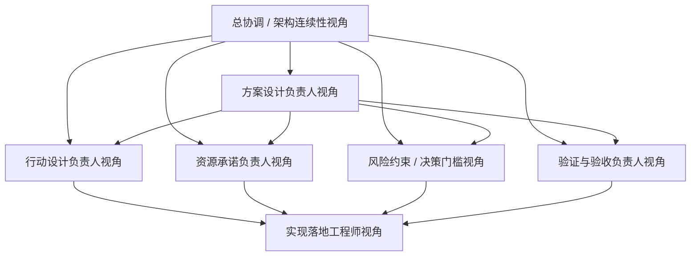

# Phase 2.3 团队重组建议清单

> **文档类型**：团队配置与组织建议文档
> **适用模块**：`Phase 2.3` 行动设计与资源承诺模块
> **状态**：建议版，待用户确认
> **最后更新**：2026-03-16

---

## 一、结论先行

> `2.3` 最合适的组织方式，不是直接沿用 `2.2` 的职责分布，也不是把“多 Agent 执行系统”当成先验前提去倒推团队结构，而是**围绕 `2.3` 当前的核心目标——把机会判断稳定转译为可拍板、可分阶段承诺、可被后续验证的行动决策对象——做阶段性重组与补位**。

核心原因有三点：

1. **目标中心变了**：`2.2` 的中心是“机会对象成立与否、如何分级与升级”；`2.3` 的中心则是“机会对象如何被翻译为行动路径、资源承诺与条件化决策结构”。
2. **风险结构变了**：`2.2` 的主要风险是“机会判断是否稳、对象能否成立”；`2.3` 的主要风险是“行动设计是否真的降低组织歧义、资源承诺是否过早或过满、后续是否可被验证”。
3. **拍板重点变了**：`2.3` 更需要拍板“行动姿态如何定义、阶段门槛如何设置、资源承诺如何递增、风险如何写进行动结构、与 `2.2 / 2.4 / 2.5` 的边界如何守住”，而不是先围绕复杂预算系统、多 Agent 工程实现或长篇建议书模板做组织设计。

---

## 二、重组原则

### 2.0 判断层级边界前置说明

在本文件中，所有“判断”“决策”“建议”相关表述都应优先理解为**行动级判断 / 资源承诺判断**，而不是泛化意义上的“任何判断”或“最终拍板”。为了避免与 `2.2`、`2.4`、`2.5` 混淆，先明确四层边界：

- **`2.2 = 机会级判断`**：负责把信号与证据组织成可比较、可升级的机会对象，不负责把机会变成行动方案。
- **`2.3 = 行动级判断 / 资源承诺设计`**：负责基于 `2.2` 的机会对象形成行动姿态、分阶段路径、资源承诺与条件化决策输出。
- **`2.4 = 行动支撑上下文`**：负责提供决策模型、资源估算参考、风险矩阵、案例与方法论，不替代 `2.3` 做行动设计。
- **`2.5 = 现实校验与闭环归因`**：负责检验 `2.3` 的行动设计是否与现实表现匹配，不替代 `2.3` 事先设计承诺结构。

因此，本文件提到的“行动设计负责人”“承诺闭环”“决策对象”等说法，都特指：

- **围绕行动姿态与资源承诺结构的设计**
- **围绕分阶段推进、Go / No-Go 门槛与退出条件的设计**
- **围绕行动对象是否可拍板、可被 `2.5` 后续验证的设计**
- **而不是 `2.2` 的机会成立判断，也不是 `2.5` 的现实校验与复盘**

### 2.1 核心原则

- **围绕行动对象与承诺机制组队，而不是围绕实现花样组队**：先看 `2.3` 需要哪些行动设计与资源承诺视角，再决定组织配置。
- **保留连续性，不复制上阶段惯性**：可以保留少量跨阶段连续角色，但不能把 `2.2` 的机会判断视角、或旧目标文档里的“决策建议生成器”理解原样带入 `2.3`。
- **优先补“行动设计层缺口”**：`2.3` 当前最缺的不是更多实现手，而是“行动姿态、阶段承诺、资源约束、风险门槛、可验证性、下游现实校验接口”这些关键视角。
- **遵循已有治理顺序，但不把流程写进本文件**：与“按什么顺序启动、何时拍板、何时进入设计与实现”相关内容，统一以工作流与启动文档为准；本文件只回答应该如何组队。

### 2.2 组织目标

本轮重组的目标不是把团队做大，而是形成一个**6-7 个职责视角的核心作战小队**，满足以下条件：

- 能守住 `2.3` 作为“行动设计层 / 资源承诺层”的边界
- 能先完成行动对象、决策姿态、阶段门槛与资源承诺骨架的方案收敛与首轮拍板
- 能打通 `2.3 MVP` 的最小行动闭环
- 能进行轻量案例验证，而不是只停留在概念层
- 能把结果稳定交给 `2.5` 做后续现实校验与闭环归因
- 能与 `2.2 / 2.4 / 2.5` 保持必要协同但不过度耦合

---

## 三、现有团队基线与问题

### 3.1 当前基线

基于现有文档，`2.3` 当前已经有了：

- 第一性原理与职责边界对齐
- `MVP Scope` 与迭代边界收口
- 工作流与启动拍板治理材料雏形
- 与 `2.2` 联调方向的口径澄清

也就是说，`2.3` 当前不是“完全没有组织基础”，而是已经完成了上层定位收口，接下来要回答的是：

> **在这种前提下，正式进入设计与实现时，最适合采用什么样的团队配置。**

### 3.2 如果不做针对性重组，会出现的问题

| 问题 | 表现 | 风险 |
|------|------|------|
| **行动对象中心不稳** | 团队讨论容易滑向“建议书怎么写”而不是“行动对象如何成立” | `2.3` 变成文案扩写器 |
| **资源承诺逻辑偏弱** | 容易直接报预算或直接排时间线，却没有分阶段承诺机制 | 组织过早、过满下注 |
| **风险没有写进行动** | 风险分析和路径设计被拆成并列章节 | 建议看起来完整，但不具备执行约束 |
| **阶段门槛无人主责** | Go / No-Go、升级、降级、退出条件缺少主责角色 | 行动设计不可拍板 |
| **可验证性不足** | 输出更像漂亮建议，而不是后续可核验的决策对象 | `2.5` 难以进行现实校验 |
| **多角色机制被误解** | 把设计期多角色面具误读成运行时多 Agent 系统 | 组织设计被工程实现预设绑架 |

---

## 四、建议保留 / 新增 / 强化的角色

### 4.1 建议保留的连续性角色

| 角色 | 来源 | 建议保留方式 | 保留原因 |
|------|------|--------------|----------|
| **总协调 / 架构连续性负责人** | 可由当前阶段治理主责视角兼任部分职责 | **保留** | 负责维持 `2.2 / 2.4 / 2.3 / 2.5` 的边界连续性，避免设计阶段脱轨 |
| **上下游依赖把关角色** | 可由熟悉跨模块接口与阶段协同的成员兼任 | **保留或兼任** | 负责检查 `2.2 -> 2.3` 的消费边界与 `2.3 -> 2.5` 的可验证性交接 |

### 4.2 建议新增或强化的核心角色

| 角色 | 建议状态 | 核心职责 | 为什么必须有 |
|------|----------|----------|---------------|
| **方案设计负责人** | **新增核心角色** | 汇总行动设计、资源承诺、风险门槛、验证多个视角，收敛 `2.3` 首版设计方案，并组织设计拍板 | `2.3` 很容易发散成“路径 / 预算 / 风险 / 模板”四条并列线，没有收敛者就难以形成正式方案 |
| **行动设计负责人** | **新增核心角色** | 定义行动姿态、推进路径、阶段目标、里程碑与动作顺序；负责行动级判断骨架，而不是回卷重做 `2.2` 的机会级判断 | `2.3` 的本体是行动设计，不是机会再判断 |
| **资源承诺负责人** | **新增核心角色** | 负责按阶段定义资源释放、能力角色、预算等级与投入节奏；强调承诺递增，而不是一次性估满 | `2.3` 区别于普通建议模块的关键之一，就是资源承诺必须与行动阶段绑定 |
| **风险约束 / 决策门槛负责人** | **新增核心角色** | 负责 Go / No-Go 门槛、升级 / 降级条件、退出条件与备选路径；把风险直接写进行动结构 | 没有人主责门槛与退出条件，`2.3` 就会退化成理想化计划书 |
| **验证与验收负责人** | **强化** | 设计轻量案例验证、检查行动对象可拍板性与后续可验证性，形成正式验收判断 | 没有验证角色，`2.3` 很容易停留在“结构看起来合理” |
| **实现落地工程师** | **保留并聚焦** | 把行动对象骨架、主流程与轻量验证路线落成可运行模块 | 负责把行动设计层方案转成可运行 MVP |

### 4.3 建议弱化为支撑而非中心的角色方向

| 角色方向 | 为什么不应继续作为 `2.3` 中心 |
|----------|------------------------------|
| **长篇建议书生成导向** | 这会把 `2.3` 从行动对象层带偏到文案呈现层 |
| **复杂预算系统导向** | 当前 `2.3` 的第一优先级不是预算做得多细，而是承诺节奏是否成立 |
| **完整多 Agent 编排导向** | 当前属于增强项，不应反向决定 `MVP` 团队配置 |
| **泛化战略咨询稿导向** | `2.3` 当前更需要可拍板、可验证、可止损的行动结构，而不是内容看起来很满 |

---

## 五、推荐团队结构（建议版）

### 5.0 角色协作模式说明

**重要**：Phase 2.3 当前采用**同一 Agent 下的角色面具协作模式**，而非多个独立 Agent 并行自治模式。

**同时需要再明确一层**：

- **本文件中的 7 个职责视角，是正式职责清单的来源**
- **后续 [phase2.3_角色面具配置方案.md](f:\AIProjects\DesignAssistant\data-layer\projects\proj_004\phase2_plan\phase2.3_角色面具配置方案.md) 中的角色面具，是这些正式职责在同一 Agent 下的执行化表达**
- **另一端后续建立 `phase2_roles/phase2.3_roles.md` 时，应以本文件确定“必须覆盖哪些正式职责”，再结合角色面具方案确定“这些职责如何协作与压缩执行”**

**核心理念**：
- ✅ **单一 Agent**：所有职责视角由同一个 AI Agent 承担
- ✅ **多职责视角**：Agent 在不同阶段切换不同角色面具
- ✅ **职责完整覆盖**：保证行动设计层需要的关键视角都被覆盖
- ✅ **执行可压缩**：实际执行时可压缩为 `5-6` 个角色面具
- ✅ **协作而非自治**：角色之间是为了方案收敛与质量保障，不是运行时多 Agent 系统

**为什么不是多 Agent**：
- 多 Agent 更适合未来增强阶段的复杂分工或展示型编排
- `2.3 MVP` 当前需要的是“行动设计与资源承诺收敛”，不是“Agent 之间互相辩论”
- 角色面具模式上下文天然共享，更适合当前设计期与验证期

**详细角色定义**：
- 完整的角色定义、职责边界与协作方式见后续 `phase2.3_角色面具配置方案.md`
- 另一端后续正式落档的执行角色文件应为 `phase2_roles/phase2.3_roles.md`

### 5.1 推荐编制

建议 `2.3` 采用以下 **7 个职责视角**（执行时可压缩为 `5-6` 个角色面具）：

### 5.2 角色视角说明

#### 1. 总协调 / 架构连续性视角

- **职责**：
  - 维护 `2.3` 启动与拍板文档的关键状态对齐
  - 把控 `2.2 / 2.4 / 2.3 / 2.5` 的边界与依赖
  - 组织关键拍板与文档回写
- **关键输出**：
  - 模块执行轨关键结论回写
  - 依赖状态判断
  - 拍板结果同步

#### 2. 方案设计负责人

- **职责**：
  - 汇总行动设计、资源承诺、风险门槛、验证多个视角的输入
  - 组织多角色讨论，收敛 `2.3` 首版设计方案
  - 明确 `MVP` 路线、非目标与设计取舍
  - 组织首轮设计拍板，并把结论回写到正式文档
- **关键输出**：
  - `phase2.3_设计方案.md`
  - 方案备选路线与取舍说明
  - 设计拍板结论

#### 3. 行动设计负责人

- **职责**：
  - 定义 `watch / validate / pilot / escalate / hold / stop` 等行动姿态如何成立
  - 设计阶段目标、关键动作、里程碑与动作顺序
  - 明确“先验证什么、再释放什么”的最小行动闭环
- **关键输出**：
  - 行动姿态骨架
  - 分阶段推进草案
  - 里程碑与关键动作说明

#### 4. 资源承诺负责人

- **职责**：
  - 定义阶段性资源释放逻辑，而不是一次性总预算逻辑
  - 拆解不同阶段需要的关键能力角色、预算等级、时间投入与依赖条件
  - 保证资源投入与关键假设验证天然绑定
- **关键输出**：
  - 分阶段资源承诺草案
  - 能力角色需求说明
  - 资源释放条件记录

#### 5. 风险约束 / 决策门槛负责人

- **职责**：
  - 设计 Go / No-Go 条件、升级 / 降级机制与退出条件
  - 将风险、限制条件与不确定性直接映射到路径选择与资源释放
  - 维护备选路径与止损策略
- **关键输出**：
  - 决策门槛草案
  - 风险约束与退出机制说明
  - 备选路径记录

#### 6. 验证与验收负责人

- **职责**：
  - 设计轻量案例验证与可拍板性检查
  - 判断当前行动对象是否足够清晰、可执行、可被后续现实校验
  - 给出“可推进 / 需返工”的正式建议
- **关键输出**：
  - 轻量验证方案
  - 验收检查表
  - 验证记录与结论

#### 7. 实现落地工程师

- **职责**：
  - 把行动对象骨架、主流程、样例验证路线落成可运行模块
  - 完成样例运行、错误处理与回写
  - 保证模块可被 `2.5` 和后续联调稳定接入
- **关键输出**：
  - `2.3` 实现代码
  - 示例输入输出
  - 运行记录与问题回写

---

### 5.3 正式职责视角与执行面具的映射关系

下面这张表的作用，是帮助另一端在建立 `phase2_roles/phase2.3_roles.md` 时，不会把“正式职责视角”和“执行期角色面具”混成两套互相竞争的命名系统。

| 正式职责视角（本文件） | 对应执行面具（角色面具文档） | 使用说明 |
|------------------------|------------------------------|----------|
| **总协调 / 架构连续性视角** | **总协调面具** | 作为全局收口与跨阶段连续性的正式职责来源 |
| **方案设计负责人** | **方案设计 / 边界收口面具** | 在执行层负责方案收敛、边界检查与取舍整理 |
| **行动设计负责人** | **行动设计面具** | 对应 `2.3` 的行动级判断核心职责 |
| **资源承诺负责人** | **资源承诺面具** | 负责资源释放节奏与承诺结构 |
| **风险约束 / 决策门槛负责人** | **风险门槛面具** | 负责门槛、止损、备选路径与风险约束 |
| **验证与验收负责人** | **验证验收面具** | 负责轻量验证、验收检查与可推进判断 |
| **实现落地工程师视角** | **实现落地面具** | 负责从已拍板方案进入可运行实现 |

**落档优先级说明**：

1. `phase2_roles/phase2.3_roles.md` 的正式职责命名，优先以**本文件**为准。
2. 各职责在同一 Agent 下如何协作、何时调用、如何压缩执行，以**角色面具配置方案**为准。
3. 如果两份文档出现角色命名偏差，应先回到本文件确认正式职责，再同步修订角色面具方案与正式角色文件。

---

## 六、从当前基线到新结构的映射建议

### 6.1 从旧理解到新结构的映射

| 旧理解 / 易滑向的方向 | 建议调整 | 原因 |
|----------------------|----------|------|
| **决策建议文档生成器** | 调整为“方案设计负责人 + 行动设计负责人 + 风险门槛负责人”组合 | `2.3` 首先是行动对象层和承诺层，而不是建议文案层 |
| **预算估算器** | 调整为“资源承诺负责人 + 风险门槛负责人” | `2.3` 当前最重要的不是算得多细，而是承诺是否递增、是否可止损 |
| **多 Agent 决策辩论器** | 调整为“角色面具协作模式 + 后续可选增强” | 当前多 Agent 不是 `MVP` 前提 |
| **泛化项目计划器** | 调整为“行动设计负责人 + 验证与验收负责人” | 当前更需要最小行动闭环，而不是大而全项目计划 |
| **无专门资源承诺角色** | 新增“资源承诺负责人” | 这是 `2.3` 当前最关键的新补位之一 |
| **无专门风险门槛角色** | 新增“风险约束 / 决策门槛负责人” | 没有人主责门槛与退出条件，就很难形成可拍板行动对象 |
| **无专门设计收敛角色** | 新增“方案设计负责人” | 防止多视角输入长期发散却收不成正式方案 |

### 6.2 与其他阶段团队的关系

建议把其他阶段团队视为**协同方**而不是 `2.3` 主导方：

- `2.2` 继续负责：机会对象、机会级判断、关键假设与不确定性表达
- `2.4` 继续负责：行动支撑上下文、方法论、估算参考与风险矩阵
- `2.5` 后续负责：现实校验、效果验证与闭环归因
- `2.3` 自己负责：行动对象、资源承诺、决策门槛、验证闭环

协同原则应是：

- `2.2` 提供机会对象，`2.3` 不回头重做机会成立判断
- `2.4` 提供支撑上下文，`2.3` 不外包行动设计权
- `2.5` 后续做现实校验，`2.3` 不越级假装行动已经发生

---

## 七、建议采用的启动口径

### 7.1 执行口径

本文件只回答**为什么要这样重组、应该保留 / 新增 / 强化哪些角色、角色之间如何分工**；与“按什么顺序启动、何时拍板、何时进入设计与实现”相关的执行动作，统一以：

- [phase2.3_工作流总览与协作导航.md](f:\AIProjects\DesignAssistant\data-layer\projects\proj_004\phase2_plan\phase2.3_工作流总览与协作导航.md)
- [phase2.3_启动与拍板.md](f:\AIProjects\DesignAssistant\data-layer\projects\proj_004\phase2_plan\phase2.3_启动与拍板.md)

为准。

### 7.2 为什么不是把工作流再写一遍

因为当前缺的不是“流程有没有说过”，而是“`2.3` 正式进入设计与实现前，到底应该按什么组织方式建队与补位”。

所以本轮更合理的做法是：

- **沿用已有治理顺序**
- **按 `2.3` 目标补齐关键角色，而不是在本文件重复工作流**
- **由角色面具和后续正式角色定义文件支撑设计收敛与实现推进**
- **把关键设计项拉出来拍板，再进入实现与验证**

### 7.3 本文件与其他文档的分工

- **本文件负责**：组织原则、角色配置、保留 / 新增 / 强化建议、旧理解到新结构的映射，以及 `phase2_roles/phase2.3_roles.md` 的正式职责来源。
- **工作流文档负责**：另一端阅读顺序、后续产物链、接手步骤与导航入口。
- **启动文档负责**：正式执行轨、拍板项、进入实现条件与执行纪律。
- **角色面具文档负责**：同一 Agent 下的执行视角定义、角色调用顺序与协作方式。
- **`phase2_roles/phase2.3_roles.md` 负责**：把本文件中的正式职责清单，结合角色面具方案，正式落档为另一端后续设计与实现的执行角色依据。

---

## 八、需要你拍板的组织决策

### 8.1 现在必须拍板

| 决策项 | 可选方案 | 推荐方案 | 原因 | 当前状态 |
|--------|----------|----------|------|----------|
| **是否做针对性重组** | A. 沿用泛化旧理解；B. 围绕行动设计层补位重组；C. 先不重组 | **B** | `2.3` 的中心已经被重新定义，组织结构也应跟着调整 | 待定 |
| **是否新增资源承诺负责人** | A. 新增专责；B. 由实现兼任；C. 不设 | **A** | `2.3` 的承诺结构稳定性高度依赖该角色 | 待定 |
| **是否新增风险门槛负责人** | A. 新增专责；B. 由方案设计兼任；C. 不设 | **A** | 门槛、止损、退出条件是 `2.3` 与普通建议模块的关键分界线 | 待定 |
| **验证是否独立成角色** | A. 独立；B. 由开发顺带做；C. 用户单独做 | **A** | 没有独立验证角色，很难正式判断 `2.3 MVP` 是否成立 | 待定 |

### 8.2 本周最好拍板

| 决策项 | 可选方案 | 推荐方案 | 延后风险 | 当前状态 |
|--------|----------|----------|----------|----------|
| **团队规模** | A. `3-4` 人；B. `5-6` 人核心小队；C. `7+` 人 | **B（必要时向 `7` 靠拢）** | 过小缺视角，过大反而启动慢 | 待定 |
| **行动设计与资源承诺是否分角色** | A. 合并；B. 分开；C. 先合并后拆分 | **B** | 不分开容易导致路径设计与资源释放逻辑互相挤压 | 待定 |
| **风险门槛是否独立于方案设计** | A. 独立；B. 合并；C. 视执行情况再定 | **A** | 合并后容易弱化退出条件、备选路径与止损机制 | 待定 |
| **正式角色文件产出方式** | A. 直接进入设计；B. 先由另一端建立 `phase2_roles/phase2.3_roles.md` 再设计；C. 边设计边补 | **B** | 若跳过正式角色定义，后续设计与实现容易缺少统一执行依据 | 待定 |

---

## 九、建议的使用方式

本文件的使用顺序建议为：

1. 先用本文件确认 `2.3` 需要什么样的团队配置、正式职责覆盖与角色补位；
2. 再结合后续 `phase2.3_角色面具配置方案.md` 理解这些职责在同一 Agent 下如何执行；
3. 由另一端基于这两份文档建立 `phase2_roles/phase2.3_roles.md`，把正式职责与执行面具关系正式落档；
4. 再按 [phase2.3_工作流总览与协作导航.md](f:\AIProjects\DesignAssistant\data-layer\projects\proj_004\phase2_plan\phase2.3_工作流总览与协作导航.md) 和 [phase2.3_启动与拍板.md](f:\AIProjects\DesignAssistant\data-layer\projects\proj_004\phase2_plan\phase2.3_启动与拍板.md) 推进启动、拍板、设计与实现。

如果本文件与工作流文档在“后续步骤”上存在表述差异，以工作流与启动文档为准；如果本文件与角色面具文档在“角色设置”上存在表述差异，应先回到本文件完成组织拍板，再同步更新角色面具方案与正式角色文件。

---

## 十、一句话结论

> `2.3` 最值得做的不是把团队组织成一个“多 Agent 决策系统”或“建议书生成流水线”，而是围绕“行动设计、资源承诺、风险门槛、验证闭环、后续可校验性”重新组织一个更贴合目标的核心小队；建议采用“保留少量连续性角色 + 补齐关键新角色 + 先完成角色定义再进入设计方案”的方式推进。
