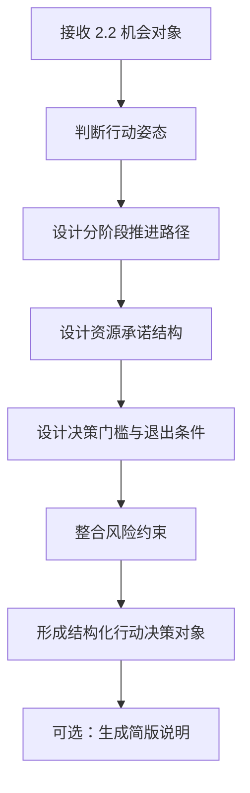

# Phase 2.3 设计方案

> **文档类型**：正式设计方案文档
> **适用模块**：Phase 2.3 行动设计与资源承诺模块
> **状态**：待设计拍板
> **最后更新**：2026-03-16

---

## 一、设计方案概述

### 1.1 目标

Phase 2.3 的设计目标是：

> **将 `2.2` 形成的结构化机会对象，与 `2.4` 提供的行动支撑上下文整合为可分阶段推进、可控制风险、可动态调整、可必要时止损的结构化行动决策对象。**

**核心价值**：
- 把机会判断转译为行动对象
- 降低组织行动歧义
- 建立分阶段资源承诺机制
- 提供可拍板、可验证的决策结构

### 1.2 非目标

Phase 2.3 **明确不做**以下内容：

- ❌ 不是长篇决策建议书生成器
- ❌ 不是大而全计划书系统
- ❌ 不是完整预算系统或财务建模工具
- ❌ 不回卷重做 `2.2` 的机会判断
- ❌ 不越级替代 `2.5` 的现实校验与闭环归因
- ❌ 不把 `2.4` 当成现成答案拼装器

### 1.3 设计原则

1. **对象化优先于文本化**：主产物是结构化行动决策对象，不是长篇建议文档
2. **承诺递增优先于一次性估满**：资源释放与假设验证天然绑定
3. **门槛显式优先于理想化路径**：Go/No-Go、退出条件必须进入结构化输出
4. **可拍板性优先于完整性**：输出应便于人类决策，而不是追求内容覆盖全面
5. **可验证性优先于表达华丽**：输出应便于 `2.5` 后续校验，而不是只追求文本美观

---

## 二、与其他模块的边界关系

### 2.1 与 Phase 2.2 的边界

**2.2 负责**：
- 机会对象的成立判断
- 关键假设与不确定性表达
- 机会优先级与升级建议

**2.3 负责**：
- 行动对象的设计
- 资源承诺结构
- 决策门槛与退出条件

**边界原则**：
- `2.3` 消费 `2.2` 的机会对象，不重做机会判断
- `2.3` 可以引用 `2.2` 的关键假设，但不修改机会成立性结论

### 2.2 与 Phase 2.4 的边界

**2.4 负责**：
- 提供决策模型、资源模板、风险矩阵
- 提供类似案例与失败模式参考
- 提供方法论与估算参考

**2.3 负责**：
- 基于 `2.4` 的支撑上下文做行动设计
- 自己负责行动对象的最终形成

**边界原则**：
- `2.4` 是可选增强输入，不是强依赖
- `2.3` 不把 `2.4` 当成答案拼装器
- `2.3` 保持行动设计的自主判断权

### 2.3 与 Phase 2.5 的边界

**2.3 负责**：
- 行动对象的设计
- 预埋可验证字段

**2.5 负责**：
- 现实校验与效果验证
- 闭环归因与系统改进

**边界原则**：
- `2.3` 设计行动，但不假装行动已经发生
- `2.3` 为 `2.5` 提供稳定的验证基线
- `2.3` 不越级做现实校验工作

---

## 三、主流程设计

### 3.1 核心流程



### 3.2 关键步骤说明

#### 步骤1：接收 2.2 机会对象

**输入**：
- `opportunity_title`
- `opportunity_thesis`
- `supporting_evidence`
- `counter_evidence`
- `key_assumptions`
- `uncertainty_map`
- `priority_level`

**处理**：
- 理解机会的核心论点
- 识别关键假设
- 评估不确定性水平

#### 步骤2：判断行动姿态

**核心判断**：基于机会对象的成熟度、不确定性、优先级，判断当前应采取何种行动姿态。

**姿态枚举**：
- `watch`：持续观察，暂不投入资源
- `validate`：轻量验证关键假设
- `pilot`：小规模试点
- `escalate`：准备升级投入
- `hold`：暂停推进
- `stop`：停止并退出

**判断依据**：
- 机会成熟度
- 关键假设的验证状态
- 组织资源约束
- 风险承受能力

#### 步骤3：设计分阶段推进路径

**核心设计**：把行动拆解为多个阶段，每个阶段有明确的目标、假设验证、动作和门槛。

**阶段颗粒度**：
- 以阶段目标、关键假设、动作、门槛为主
- 不要求完整的短/中/长期路线图
- 保持中层计划颗粒度

#### 步骤4：设计资源承诺结构

**核心设计**：定义每个阶段的资源释放逻辑，确保资源投入与假设验证绑定。

**表达方式**：
- 角色类型、带宽级别、时间带、粗粒度预算带
- 不做完整财务建模
- 强调承诺递增

#### 步骤5：设计决策门槛与退出条件

**核心设计**：为每个阶段定义 Go/No-Go 条件、升级/降级机制、退出条件。

**关键要素**：
- 继续推进的门槛
- 暂停推进的条件
- 降级观察的触发条件
- 止损退出的条件

#### 步骤6：整合风险约束

**核心设计**：把风险直接写进行动结构，而不是独立章节。

**整合方式**：
- 风险影响路径选择
- 风险影响资源释放
- 风险影响决策门槛
- 风险影响备选路径

#### 步骤7：形成结构化行动决策对象

**核心输出**：`ActionDecisionObject`

**必需字段**：
- `opportunity_title`
- `decision_posture`
- `why_this_posture`
- `phased_plan`
- `top_risks`
- `resource_commitment_logic`
- `fallback_path`
- `open_questions`

---

## 四、核心对象设计

### 4.1 ActionDesignRequest

**设计理解**：
- 这是 `2.3` 的输入契约
- 主要消费 `2.2` 的机会对象
- 可选消费 `2.4` 的支撑上下文
- 包含组织约束条件

**最小字段**：
```json
{
  "request_id": "唯一请求ID",
  "opportunity_object": {
    // 来自 2.2 的结构化机会对象
  },
  "context_packet": [
    // 来自 2.4 的行动支撑上下文（可选）
  ],
  "org_constraints": {
    // 组织约束条件（可选）
  }
}
```

### 4.2 ActionDecisionObject

**设计理解**：
- 这是 `2.3` 的核心输出
- 主产物是结构化对象，不是长篇文本
- 必须包含行动姿态、分阶段计划、门槛、退出条件

**最小字段**：
```json
{
  "opportunity_title": "机会标题",
  "decision_posture": "watch|validate|pilot|escalate|hold|stop",
  "why_this_posture": "当前姿态解释",
  "phased_plan": [
    {
      "stage": "阶段名称",
      "objective": "阶段目标",
      "key_assumptions_to_test": ["关键假设"],
      "actions": ["关键动作"],
      "resources": {
        "people": "角色需求",
        "budget": "预算级别",
        "time": "时间投入"
      },
      "milestones": ["里程碑"],
      "go_no_go_criteria": ["继续/暂停门槛"],
      "exit_conditions": ["退出条件"]
    }
  ],
  "top_risks": [
    {
      "risk": "风险描述",
      "impact_on_plan": "对行动的影响",
      "mitigation": "缓解措施"
    }
  ],
  "resource_commitment_logic": "资源承诺逻辑说明",
  "fallback_path": "备选路径/降级路径",
  "open_questions": ["当前未关闭的问题"]
}
```

### 4.3 ActionDesignResult

**设计理解**：
- 这是 `2.3` 的完整输出包装
- 包含行动决策对象和辅助信息

**最小字段**：
```json
{
  "request_id": "请求ID",
  "action_decision": {
    // ActionDecisionObject
  },
  "global_summary": "整体判断摘要（可选）",
  "designer_version": "版本号",
  "processing_time_ms": 1000
}
```

---

## 五、行动姿态判断设计

### 5.1 `decision_posture` 的使用语义

`decision_posture` 是 `2.3` 行动决策对象的核心字段，它不是简单的 `go / no-go` 二元判断，而是组织在面对机会时应采取的**行动姿态**。

**核心语义**：
- `decision_posture` 表达的是"当前应该以什么方式推进这个机会"
- 它直接影响资源承诺节奏、验证优先级、决策门槛
- 它是分阶段承诺结构的锚点

### 5.2 首版姿态枚举

基于已拍板决策，首版采用以下姿态枚举：

#### `watch`（持续观察）
- **含义**：机会尚未成熟到需要投入资源，但值得持续跟踪
- **典型场景**：关键假设尚未验证、外部条件尚未就绪、优先级较低
- **资源动作**：不投入执行资源，仅保留轻量观察带宽
- **下一步触发条件**：关键信号出现、假设得到初步验证、优先级提升

#### `validate`（轻量验证）
- **含义**：机会值得投入轻量资源验证关键假设
- **典型场景**：机会论点初步成立，但关键假设需要验证
- **资源动作**：投入小规模研究、访谈、桌面分析或最小原型
- **下一步触发条件**：关键假设验证通过、风险降低到可接受范围

#### `pilot`（小规模试点）
- **含义**：关键假设已初步验证，值得进入小规模试点
- **典型场景**：验证阶段通过，需要在受控环境下测试可行性
- **资源动作**：投入试点团队、试点预算、试点时间窗口
- **下一步触发条件**：试点成功、效果符合预期、可复制性得到验证

#### `escalate`（准备升级）
- **含义**：试点成功，准备升级投入或提交更高层决策
- **典型场景**：试点验证通过，需要更大资源承诺或战略级决策
- **资源动作**：准备升级资源、组建正式团队、申请正式预算
- **下一步触发条件**：获得升级批准、资源到位

#### `hold`（暂停推进）
- **含义**：当前不适合继续推进，但不完全退出
- **典型场景**：外部条件变化、内部资源约束、关键假设暂时无法验证
- **资源动作**：暂停新增投入，保留最小观察能力
- **下一步触发条件**：阻塞条件解除、外部环境改善

#### `stop`（停止退出）
- **含义**：机会不再成立或风险过高，应停止投入并退出
- **典型场景**：关键假设被证伪、风险超过阈值、机会窗口关闭
- **资源动作**：停止所有投入、整理退出、归档经验
- **下一步触发条件**：无（除非机会重新评估后重新进入）

### 5.3 姿态判断逻辑

`decision_posture` 的判断应基于以下因素：

#### 输入因素
- `2.2` 的机会成熟度评估
- 关键假设的验证状态
- 不确定性水平
- 优先级评分
- 组织资源约束
- 风险承受能力
- 时间窗口压力

#### 判断规则（示例）
- 如果关键假设未验证 + 优先级中等 → 倾向 `validate`
- 如果关键假设已初步验证 + 优先级高 + 风险可控 → 倾向 `pilot`
- 如果试点成功 + 战略价值高 → 倾向 `escalate`
- 如果关键假设被证伪 + 无备选路径 → 倾向 `stop`
- 如果外部条件未就绪 + 机会仍有价值 → 倾向 `hold`
- 如果机会尚早 + 值得跟踪 → 倾向 `watch`

### 5.4 姿态与后续设计的关系

`decision_posture` 一旦确定，会直接影响：
- `phased_plan` 的阶段数量和颗粒度
- `resources` 的投入级别
- `go_no_go_criteria` 的门槛设置
- `exit_conditions` 的触发条件
- `fallback_path` 的备选方案

---

## 六、分阶段承诺设计

### 6.1 `phased_plan` 的结构设计

`phased_plan` 是 `2.3` 行动决策对象的核心结构，它表达的是"按什么阶段、验证什么、投入什么、达到什么门槛"。

**设计原则**：
- 阶段划分以**假设验证**为主线，而不是以时间为主线
- 资源释放与阶段目标天然绑定
- 每个阶段都有明确的 Go/No-Go 门槛
- 每个阶段都有退出条件

### 6.2 阶段颗粒度

基于已拍板决策，`phased_plan` 的颗粒度定义为：

**中层计划颗粒度**：
- 不是完整的短/中/长期经营路线图
- 不是一句话行动建议
- 而是以**阶段目标、关键假设、动作、门槛**为主的中层计划

**典型阶段数量**：
- `validate` 姿态：通常 1-2 个阶段
- `pilot` 姿态：通常 2-3 个阶段
- `escalate` 姿态：通常 3-4 个阶段
- `watch` / `hold` / `stop` 姿态：通常 0-1 个阶段

### 6.3 单个阶段的必需字段

每个阶段至少包含以下字段：

#### `stage`（阶段名称）
- 简短描述阶段定位
- 例如："关键假设验证"、"小规模试点"、"准备升级"

#### `objective`（阶段目标）
- 该阶段要达成什么
- 例如："验证用户需求真实性"、"测试技术可行性"

#### `key_assumptions_to_test`（关键假设验证）
- 该阶段要验证哪些关键假设
- 直接引用 `2.2` 的 `key_assumptions`
- 例如：["用户愿意为该功能付费", "技术方案在3个月内可实现"]

#### `actions`（关键动作）
- 该阶段要执行的关键动作
- 例如：["完成20个目标用户访谈", "开发最小原型", "完成技术预研"]

#### `resources`（资源需求）
- 该阶段需要的资源
- 包含：`people`（人员角色）、`budget`（预算级别）、`time`（时间投入）
- 例如：{"people": "1名研究员 + 1名工程师", "budget": "10-20万", "time": "2-3个月"}

#### `milestones`（里程碑）
- 该阶段的关键里程碑
- 例如：["完成用户访谈报告", "完成技术原型", "完成可行性评估"]

#### `go_no_go_criteria`（继续/暂停门槛）
- 什么条件下继续推进
- 什么条件下暂停推进
- 例如：["至少70%用户表达付费意愿", "技术原型验证通过"]

#### `exit_conditions`（退出条件）
- 什么条件下应该退出
- 例如：["用户付费意愿低于30%", "技术方案无法在预期时间内实现"]

### 6.4 阶段之间的关系

**承诺递增**：
- 后一阶段的资源释放，必须建立在前一阶段验证通过的基础上
- 不允许一次性承诺所有阶段的资源

**门槛联动**：
- 前一阶段的 `go_no_go_criteria` 决定是否进入下一阶段
- 任一阶段的 `exit_conditions` 触发，整个行动可能降级或退出

**假设验证链**：
- 关键假设按优先级和依赖关系分配到不同阶段
- 高风险假设优先验证
- 依赖性假设按顺序验证

---

## 七、决策门槛与退出条件设计

### 7.1 Go/No-Go 机制的设计理解

Go/No-Go 机制是 `2.3` 区别于普通建议文档的关键，它表达的是：
- 什么条件下继续推进
- 什么条件下暂停推进
- 什么条件下降级观察
- 什么条件下止损退出

**设计原则**：
- 门槛必须可观察、可验证
- 门槛必须与关键假设绑定
- 门槛必须影响资源释放

### 7.2 Go/No-Go 条件的表达方式

#### 继续推进的门槛（Go）
- 关键假设验证通过
- 里程碑达成
- 风险降低到可接受范围
- 资源投入产出比符合预期

**示例**：
- "用户访谈中至少70%表达明确需求"
- "技术原型验证通过，性能达到预期"
- "试点阶段用户留存率超过50%"

#### 暂停推进的条件（No-Go）
- 关键假设验证失败
- 里程碑未达成且无补救方案
- 风险超过阈值
- 资源投入产出比不符合预期

**示例**：
- "用户访谈中付费意愿低于30%"
- "技术原型验证失败，无备选方案"
- "试点阶段用户留存率低于20%"

### 7.3 升级/降级/退出机制

#### 升级条件
- 当前阶段超预期完成
- 外部机会窗口压力增大
- 战略价值提升

**示例**：
- "试点阶段用户增长超过预期2倍"
- "竞争对手进入，需要加快推进"

#### 降级条件
- 当前阶段未达预期，但仍有价值
- 外部条件变化，需要降低投入
- 内部资源约束

**示例**：
- "试点效果一般，降级为持续观察"
- "外部环境变化，暂停大规模投入"

#### 退出条件
- 关键假设被证伪
- 风险超过组织承受能力
- 机会窗口关闭
- 更高优先级机会出现

**示例**：
- "核心技术方案被证明不可行"
- "市场需求消失"
- "监管政策变化导致机会不再成立"

### 7.4 备选路径设计

`fallback_path` 表达的是：
- 当主路径受阻时，是否有备选方案
- 备选方案的触发条件是什么
- 备选方案的资源需求是什么

**示例**：
- "如果技术方案A不可行，转向技术方案B"
- "如果C端市场验证失败，转向B端市场"
- "如果自研成本过高，转向合作或收购"

---

## 八、风险与开放问题处理

### 8.1 `top_risks` 的组织方式

`top_risks` 不是独立的风险分析章节，而是**直接影响行动结构**的风险约束。

**设计原则**：
- 风险必须映射到行动路径
- 风险必须影响资源释放
- 风险必须影响决策门槛
- 风险必须有缓解措施

### 8.2 单个风险的表达结构

每个风险至少包含：

#### `risk`（风险描述）
- 简短描述风险内容
- 例如："核心技术依赖第三方，存在供应链风险"

#### `impact_on_plan`（对行动的影响）
- 该风险如何影响行动路径
- 例如："如果第三方断供，当前技术方案无法继续"

#### `mitigation`（缓解措施）
- 如何降低风险或应对风险
- 例如："提前储备备选供应商，开发备用技术方案"

### 8.3 风险如何影响行动结构

**影响路径选择**：
- 高风险路径降低优先级
- 风险过高时选择备选路径

**影响资源释放**：
- 高风险阶段降低资源承诺
- 风险降低后再释放更多资源

**影响决策门槛**：
- 高风险机会提高 Go 门槛
- 风险触发时降低 No-Go 门槛

**影响备选方案**：
- 为高风险路径准备备选方案
- 风险触发时快速切换

### 8.4 `open_questions` 的处理

`open_questions` 表达的是：
- 当前仍未关闭的问题
- 这些问题如何影响行动推进
- 这些问题何时需要关闭

**示例**：
- "目标用户的付费意愿尚未验证"
- "技术方案的成本尚未明确"
- "监管政策的影响尚不清楚"

**处理方式**：
- 高优先级问题应在早期阶段验证
- 低优先级问题可以在后续阶段验证
- 阻塞性问题必须在推进前关闭

---

## 九、可选简版说明设计

### 9.1 `decision_summary` 的定位

`decision_summary` 是结构化行动决策对象的**可选派生视图**，而不是主产物。

**设计理解**：
- 主产物是结构化行动决策对象
- 简版说明是为了帮助人类快速理解
- 简版说明不应替代结构化对象

### 9.2 简版说明的内容

如果生成简版说明，建议包含：

#### 核心判断
- 当前建议采取什么行动姿态
- 为什么是这个姿态

#### 关键路径
- 分几个阶段推进
- 每个阶段的核心目标是什么

#### 资源承诺
- 当前阶段需要什么资源
- 后续阶段在什么条件下释放资源

#### 关键门槛
- 什么条件下继续
- 什么条件下退出

#### 主要风险
- 最需要关注的风险是什么
- 如何缓解

### 9.3 简版说明的约束

**长度约束**：
- 不超过 1-2 页
- 重点突出，不追求完整

**表达约束**：
- 不替代结构化对象
- 不包含结构化对象中没有的内容
- 不做过度包装

---

## 十、MVP 范围明确

### 10.1 当前 MVP 必做项

基于已拍板决策，`2.3 MVP` 必须包含：

#### A. 输入契约最小化定义
- 定义 `ActionDesignRequest` 的最小字段
- 明确消费 `2.2` 的哪些字段
- 明确消费 `2.4` 的哪些字段

#### B. 结构化行动决策对象输出契约
- 定义 `ActionDecisionObject` 的最小字段骨架
- 冻结 `decision_posture` 枚举
- 冻结 `phased_plan` 结构

#### C. 行动设计最小闭环
- 姿态判断能力
- 分阶段承诺结构设计能力
- Go/No-Go 节点设计能力
- 风险约束映射能力

#### D. 轻量资源承诺表达
- 阶段级资源需求表达
- 角色类型、带宽级别、时间带、粗粒度预算带

#### E. 轻量案例验证
- 选择少量真实 `2.2` 机会对象
- 验证输出是否可拍板、可执行、可验证

### 10.2 当前 MVP 明确不做项

#### 不做完整资源系统
- 不做细粒度预算拆解
- 不做完整人力模型
- 不做现金流建模

#### 不做完整长篇建议模板
- 不追求 9 章节完整模板
- 不追求语言包装华丽
- 不把模板完整度作为验收标准

#### 不做复杂策略库
- 不做行业特化路径树
- 不做大规模模板库
- 不做场景细分很深的决策树

#### 不做多 Agent 编排
- 不把多角色面具工程化为多 Agent 系统
- 不做复杂的 Agent 协作编排
- 不做 Agent 间的对抗式辩论

### 10.3 后续增强项

以下内容可以作为 `v1.1 / v1.2` 增强项：
- 更细的资源模型
- 更完整的建议文档模板
- 更多场景化路径模板
- 多 Agent 化的行动设计编排
- 更强的自然语言汇报能力

---

## 十一、最小验证思路

### 11.1 首轮案例选择

**选择标准**：
- 来自真实 `2.2` 机会对象
- 覆盖不同行动姿态（至少包含 `validate` 和 `pilot`）
- 覆盖不同不确定性水平
- 覆盖不同优先级

**推荐数量**：
- 2-3 个真实案例
- 不追求大规模 benchmark

### 11.2 验证重点

#### 验证 1：是否真的降低了行动歧义
- 输出是否让人更容易理解"现在该做什么"
- 输出是否让人更容易理解"先投入多少才合理"
- 输出是否让人更容易理解"什么时候该继续、什么时候该止损"

#### 验证 2：资源投入是否与假设验证绑定
- 资源承诺是否与关键假设验证天然绑定
- 是否避免了一次性过度承诺
- 是否体现了承诺递增逻辑

#### 验证 3：是否支持动态升级和退出
- 是否有明确的 Go/No-Go 门槛
- 是否有明确的退出条件
- 是否有备选路径

#### 验证 4：是否便于后续验证
- 输出是否足够结构化
- `2.5` 是否容易检查建议与现实表现是否一致
- 是否便于复盘和归因

### 11.3 验收标准

**最小验收标准**：
- 能从 `2.2` 机会对象生成结构化行动决策对象
- 行动决策对象包含必需字段
- 至少 2 个案例的输出被判断为"可拍板"
- 至少 1 个案例的输出被判断为"便于后续验证"

**不作为当前验收标准**：
- 建议文档是否符合完整模板
- 资源估算是否足够细
- 语言表达是否足够华丽
- 是否实现了多 Agent 编排

---

## 十二、当前仍待设计拍板的问题

### 12.1 字段细节层面

以下字段细节仍需在设计过程中进一步明确：
- `phased_plan` 中每个阶段的子字段是否需要进一步细化
- `resources` 的表达粒度是否需要调整
- `go_no_go_criteria` 和 `exit_conditions` 的表达格式是否需要标准化

### 12.2 判断逻辑层面

以下判断逻辑仍需在设计过程中进一步明确：
- `decision_posture` 的判断规则是否需要更明确的决策树
- 阶段数量的判断规则是否需要更明确的标准
- 资源级别的判断规则是否需要更明确的参考

### 12.3 验证方式层面

以下验证方式仍需在设计过程中进一步明确：
- 首轮案例的具体选择标准
- 验证记录的组织方式
- 验收判断的具体标准

### 12.4 实现策略层面

以下实现策略仍需在设计拍板后进一步明确：
- 是否需要引入轻量决策树或规则引擎
- 是否需要引入模板库
- 是否需要引入 Prompt 工程优化

---

## 十三、设计方案状态说明

### 13.1 当前设计方案的定位

本设计方案是 `Phase 2.3` 的**首版正式设计方案**，它基于：
- 已拍板的模块边界与职责定位
- 已拍板的 MVP 范围与后续迭代边界
- 已建立的角色面具协作机制

### 13.2 设计方案的使用方式

本设计方案应作为：
- 后续实现的设计依据
- 验证与验收的标准依据
- 与 `2.2 / 2.4 / 2.5` 协作的边界依据
- 设计拍板的讨论基础

### 13.3 设计方案的更新机制

本设计方案应在以下情况下更新：
- 设计拍板后，关键字段或流程发生变化
- 首轮案例验证后，发现设计需要调整
- 与 `2.2 / 2.4 / 2.5` 联调后，发现边界需要调整
- MVP 范围发生变化

---

**文档状态**：✅ 已完成  
**版本**：v1.0  
**建议下次更新时机**：当设计拍板完成、首轮案例验证完成，或与其他模块联调后发现需要调整时


### 4.4 `resource_commitment_logic` 字段补充说明

#### 字段定位

`resource_commitment_logic` 是 `ActionDecisionObject` 的顶层字段，用于表达**整体资源承诺策略**，而不是重复 `phased_plan` 中的资源细节。

#### 与 `phased_plan.resources` 的关系

- `phased_plan[].resources`：表达**每个阶段的具体资源需求**（人员角色、预算级别、时间投入）
- `resource_commitment_logic`：表达**为什么这样分配资源、资源释放的整体逻辑**

#### 典型表达内容

`resource_commitment_logic` 应回答：

1. **承诺递增逻辑**
   - 为什么第一阶段只投入这些资源
   - 后续阶段在什么条件下释放更多资源

2. **资源与假设验证的绑定关系**
   - 哪些资源用于验证关键假设
   - 哪些资源用于放大投入
   - 验证失败时哪些资源不应继续释放

3. **资源约束考虑**
   - 当前资源配置考虑了哪些组织约束
   - 为什么选择这个资源级别而不是更高或更低

#### 典型表达示例

**示例 1**（validate 姿态）：
```
"第一阶段仅投入1名研究员进行用户访谈验证，预算控制在10万以内。
只有当用户付费意愿验证通过（>70%）后，才释放工程资源进入原型开发。
这样可以避免在需求未验证前过早投入开发成本。"
```

**示例 2**（pilot 姿态）：
```
"第一阶段投入小型试点团队（2-3人），预算20-30万，验证技术可行性。
第二阶段在技术验证通过后，扩展到5-8人团队，预算提升到50-80万，进行小规模用户试点。
只有试点用户留存率达到50%以上，才考虑进入规模化阶段。
当前资源配置考虑了团队带宽约束，避免同时启动过多试点项目。"
```

**示例 3**（escalate 姿态）：
```
"试点阶段已验证商业模式可行，当前建议快速扩展团队到15-20人，预算提升到200-300万。
资源释放的前提是：(1)获得管理层升级批准；(2)确认市场窗口仍然开放。
如果竞争对手提前进入，建议进一步加速资源投入。"
```

#### 表达约束

- 长度：1-3 段文字
- 重点：解释"为什么"，而不是重复"是什么"
- 避免：与 `phased_plan.resources` 完全重复的内容

