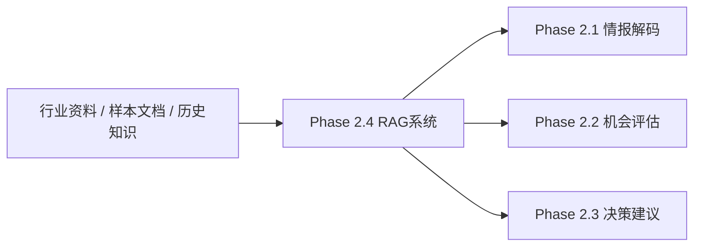

# Phase 2.4 启动与拍板

> **文档类型**：执行轨实例文档
> **适用模块**：`Phase 2.4` 知识库与 RAG 系统
> **状态**：首轮拍板待用户确认
> **最后更新**：2026-03-13

---

## 一、模块基本信息

| 字段 | 内容 |
|------|------|
| **模块名称** | 阶段2.4 知识库与 RAG 系统 |
| **模块编号** | `Phase 2.4` |
| **启动日期** | 2026-03-13 |
| **模块负责人** | `EMP-021`（知识库架构师） |
| **协作团队** | `EMP-022` / `EMP-023` / `EMP-024` / `EMP-025` / `EMP-026` |
| **上游输入** | `phase2.4_目标说明.md`、`phase2.4_roles.md`、`phase2.4_mvp_plan.md`、`工程背景手册.md` |
| **下游服务对象** | `Phase 2.1`、`Phase 2.2`、`Phase 2.3` |
| **当前状态** | `MVP开发中（骨架已落地，首轮正式拍板待完成）` |

---

## 二、模块定位与目标

### 2.1 一句话定义

> `Phase 2.4` 的职责不是直接替代情报解码、机会评估或决策建议模块做分析，而是作为**基础设施层**，为下游模块统一提供**可检索的知识证据、最小可用的 RAG 能力与稳定接口契约**。

### 2.2 当前阶段目标

- **要解决的问题**：下游模块目前缺少统一、可复用、可追溯的知识来源与检索能力；如果各模块各自接新闻、各自建上下文，会导致来源不一致、结果不可比、协作成本高。
- **直接价值**：交付 `retrieve / generate / rag` 三类核心能力，让 `2.1 / 2.2 / 2.3` 可以在统一知识底座上开发。
- **复用价值**：后续其他模块、其他项目可以复用相同的数据模型、接口契约和评测方式。
- **面试展示价值**：证明“先做基础设施解除依赖、以 MVP 方式打通全链路”的系统拆解与工程规划能力。
- **工程沉淀价值**：沉淀知识文档最小字段、最小 API 契约、RAG 评测基线与多团队协作边界。

### 2.3 本次启动范围

- **MVP 必做**
  - 扩展到首批 `100` 条知识文档
  - 完成向量索引构建与本地可运行闭环
  - 冻结首版对外契约：`/api/v1/retrieve`、`/api/v1/generate`、`/api/v1/rag`
  - 产出最小接口文档和调用样例
  - 建立首版 benchmark 与延迟 / 质量基线
- **明确不做**
  - Week 1 内不扩到 `1000+` 文档
  - 不在首轮拍板前引入混合检索、重排序、缓存、复杂过滤
  - 不让 `2.4` 直接承担下游分析结论生成职责
- **完整版方向**
  - 混合检索（向量 + 关键词）
  - 重排序与缓存
  - 更丰富的元数据过滤
  - 面向 `2.1 / 2.2 / 2.3` 的结构化输出协议
- **当前最大风险**
  - 已有代码骨架先行，但“知识来源策略、最小字段、下游输出形态”尚未通过用户拍板冻结，继续扩写容易导致返工。

---

## 三、上下游与依赖关系

### 3.1 上下游关系图

### 3.2 依赖说明

- **数据依赖**：下游需要 `2.4` 提供统一知识文档、检索结果、文档详情与基础生成能力。
- **语义依赖**：下游需要 `2.4` 统一文档字段、分类方式、`metadata` 最小结构、接口字段命名。
- **治理依赖**：如果不统一由 `2.4` 提供知识与检索接口，下游每个模块都会形成自己的信息源、字段口径和判断依据，后续无法比较与复盘。

---

## 四、契约草案

### 4.1 输入契约

#### A. `/api/v1/retrieve`

| 字段 | 类型 | 必填 | 含义 | 备注 |
|------|------|------|------|------|
| `query` | `string` | Y | 查询文本 | 不能为空，最大 `1000` 字符 |
| `top_k` | `integer` | N | 返回文档数量 | 默认 `5`，范围 `1-20` |

#### B. `/api/v1/generate`

| 字段 | 类型 | 必填 | 含义 | 备注 |
|------|------|------|------|------|
| `query` | `string` | Y | 生成问题 | 不能为空，最大 `1000` 字符 |
| `context_ids` | `string[]` | Y | 上下文文档ID列表 | 至少 `1` 个，最多 `10` 个 |
| `temperature` | `float` | N | 生成温度 | 默认 `0.7`，范围 `0-1` |

#### C. `/api/v1/rag`

| 字段 | 类型 | 必填 | 含义 | 备注 |
|------|------|------|------|------|
| `query` | `string` | Y | 用户问题 | 当前仅校验非空 |
| `top_k` | `integer` | N | 检索文档数量 | 默认 `5` |
| `temperature` | `float` | N | 生成温度 | 默认 `0.7` |

### 4.2 输出契约

#### A. `Document` 最小字段

| 字段 | 类型 | 必填 | 含义 | 备注 |
|------|------|------|------|------|
| `id` | `string` | Y | 文档唯一ID | 如 `kb_001` |
| `title` | `string` | Y | 文档标题 | 供显示与引用 |
| `content` | `string` | Y | 文档正文 | 当前 MVP 主检索内容 |
| `category` | `string` | Y | 文档分类 | 当前采用 `game_design / market_trend / tech_innovation` |
| `tags` | `string[]` | Y | 标签列表 | 允许为空数组 |
| `metadata.source` | `string` | Y | 来源 | 需可追溯 |
| `metadata.confidence` | `float` | Y | 置信度 | 范围 `0-1` |
| `metadata.last_updated` | `string` | Y | 更新时间 | ISO 风格日期字符串 |
| `score` | `float` | N | 相似度分数 | 仅检索结果返回 |

#### B. `/api/v1/retrieve` 响应

| 字段 | 类型 | 必填 | 含义 | 备注 |
|------|------|------|------|------|
| `documents` | `Document[]` | Y | 检索结果列表 | 按相似度排序 |
| `total` | `integer` | Y | 返回文档数 | |
| `query_time_ms` | `integer` | Y | 检索耗时 | 毫秒 |

#### C. `/api/v1/generate` 响应

| 字段 | 类型 | 必填 | 含义 | 备注 |
|------|------|------|------|------|
| `answer` | `string` | Y | 生成回答 | 当前为自由文本 |
| `sources` | `Document[]` | Y | 参与生成的文档 | 当前直接返回上下文文档 |
| `confidence` | `float` | Y | 生成置信度 | MVP阶段为启发式结果 |
| `generation_time_ms` | `integer` | Y | 生成耗时 | 毫秒 |

### 4.3 契约原则

- **稳定核心字段**：`id / title / content / category / tags / metadata` 作为 MVP 稳定核心字段，不在 Week 1 内做破坏性变更。
- **可选增强字段**：`score`、未来的 `summary`、`evidence_span`、`entity_refs` 等作为增强字段后续再加。
- **不对下游暴露的内部实现**：不暴露向量维度、索引实现、Embedding 细节、Prompt 细节。
- **兼容未来扩展的方式**：保持 `metadata` 为可扩展对象；新字段优先新增可选字段，不破坏现有必填字段。

### 4.4 契约检查表

| 问题 | 结论 | 备注 |
|------|------|------|
| **输入是否明确？** | 是 | 现有 `app.py` 已可对外说明最小字段 |
| **输出是否明确？** | 基本明确 | `rag` 的最终结构仍需在接口文档中冻结 |
| **字段是否区分必填/选填？** | 是 | 已按当前代码与数据模型整理 |
| **是否考虑未来扩展？** | 是 | 通过 `metadata` 和可选增强字段承接 |
| **是否避免暴露内部实现？** | 是 | 不把底层索引实现写进对外契约 |
| **是否能被其他模块稳定消费？** | 有条件可以 | 仍需用户确认最小字段与输出形态 |

---

## 五、验收与评测

### 5.1 效果定义

- **功能层目标**：服务可跑通 `retrieve → generate / rag` 基本闭环。
- **质量层目标**：检索结果能为下游分析提供基础相关证据，而不是明显无关文档。
- **性能层目标**：MVP 阶段检索耗时平均 `< 1s`。
- **协作层目标**：`2.1 / 2.2 / 2.3` 可基于冻结后的最小契约开始自己的输入输出设计。
- **展示层目标**：能够演示“给定问题 → 检索证据 → 生成回答 → 返回来源”的最小工程闭环。

### 5.2 指标表

| 层级 | 指标 | 目标值 | 测量方式 |
|------|------|--------|----------|
| **功能层** | 核心接口可用 | `retrieve / generate / rag` 均可调用 | 手动接口测试 + 示例请求 |
| **质量层** | 检索准确率 | `> 60%` | 人工抽样 `10` 组 query |
| **性能层** | 检索延迟 | 平均 `< 1s` | 本地基准测试 |
| **协作层** | 下游可接入性 | `2.1 / 2.2 / 2.3` 能理解并消费最小字段 | 接口走读 + 示例联调 |
| **展示层** | 可演示性 | 至少 `1` 条完整案例可跑通 | Demo记录 |

### 5.3 基线与实验

- **Benchmark 样本数量**：首轮至少 `10` 组 query
- **样本来源**：围绕游戏设计范式、市场趋势、技术创新三个分类构造
- **标注人 / 验收人**：`EMP-021` 汇总，`EMP-025` 负责基线记录，用户负责最终方向性判断
- **Ablation 计划**：MVP 暂只比较 `top_k`、文档规模和 Prompt 形式，不在 Week 1 内做复杂消融
- **效果不达标时的排查顺序**：数据质量 → 检索召回 → 文档字段与分类 → 生成 Prompt → 性能参数

---

## 六、职责划分与协作边界

### 6.1 人与 AI 的职责划分

| 工作类型 | 负责人 | 原因 |
|----------|--------|------|
| **目标定义** | 人 | 属于方向与价值判断 |
| **方向拍板** | 人 | 涉及范围、优先级与取舍 |
| **文档初稿** | AI / 数字团队 | 适合结构化整理与初稿生成 |
| **代码骨架实现** | AI / 数字团队 | 适合并行推进与快速搭骨架 |
| **质量验收** | 人主导 + AI辅助 | 需兼顾业务判断与客观指标 |
| **最终取舍决策** | 人 | 避免执行团队越权扩范围 |

### 6.2 协作机制

- **单一事实源**：
  - 当前状态看 `PROJECT_CONTEXT.md`
  - 长期规范看 `工程背景手册.md`
  - `2.4` 正式范围与拍板看本文档
  - `2.4` 最新执行现状与增量待定项看 `phase2.4_进展与待拍板事项.md`
- **文件所有权**：
  - `EMP-021` 维护本文档与拍板项汇总
  - `EMP-026` 维护接口文档
  - `EMP-022 / EMP-023 / EMP-024 / EMP-025` 维护对应实现与验证材料
- **共享文件限制**：不允许多端同时改共享总表；关键结论先写回本文档，再继续开发
- **同步节奏**：每完成一轮拍板或一轮关键联调后，先更新执行轨与进展文档，再继续实现
- **上下文更新责任人**：`EMP-021` 负责模块级更新；主控端负责项目总表更新

---

## 七、待拍板事项

### 7.1 现在必须拍板

| 决策项 | 可选方案 | 推荐方案 | 为什么现在必须定 | 拍板结果 |
|--------|----------|----------|------------------|----------|
| **MVP知识来源策略** | A. 全部手工真实来源整理；B. 真实来源摘要 + 少量样例补齐；C. 先大量AI合成占位 | **B** | 会直接影响 `100` 条数据的质量、进度和可追溯性 | ✅ **已确认：方案B** - 真实来源摘要 + 少量样例补齐（2026-03-13） |
| **Week 1 检索方案边界** | A. 纯向量检索 + 简单生成；B. 直接做混合检索；C. 先只做检索不做生成 | **A** | 决定 Week 1 是否以打通闭环优先，还是提前追求完整版能力 | ✅ **已确认：方案A** - 纯向量检索 + 简单生成（2026-03-13） |
| **Document最小标准字段** | A. 维持当前最小字段；B. 立即增加更多结构字段；C. 允许字段自由变化 | **A** | 会影响接口稳定性、数据清洗工作量和下游联调难度 | ✅ **已确认：方案A** - 维持当前最小字段（2026-03-13） |
| **MVP对下游的正式交付接口** | A. 冻结 `retrieve / generate / rag`；B. 仅对外暴露 `rag`；C. 继续边做边改不冻结 | **A** | 下游要不要现在开始依赖、以及接口文档是否可以正式编写，取决于此 | ✅ **已确认：方案A** - 冻结 `retrieve / generate / rag` 三个接口（2026-03-13） |

### 7.2 本周最好拍板

| 决策项 | 可选方案 | 推荐方案 | 延后风险 | 拍板结果 |
|--------|----------|----------|----------|----------|
| **下游期望的生成输出形态** | A. 自由文本；B. 半结构化章节；C. 固定 JSON | **B** | 不提前定，下游会各自包装输出，后续统一成本高 | 待定 |
| **分类体系是否维持3类** | A. 保持 `3` 类；B. 扩到 `5-7` 类；C. 暂不设分类 | **A** | 分类过早膨胀会拖慢数据准备，完全不分类又不利于后续过滤 | 待定 |
| **首版 benchmark 由谁验收** | A. `EMP-025` 主导；B. 用户人工主导；C. 双方结合 | **C** | 没有明确验收人，评测结果很难形成正式基线 | 待定 |

### 7.3 可后置拍板

| 决策项 | 建议何时再定 | 触发条件 | 备注 |
|--------|--------------|----------|------|
| **混合检索是否转正** | Week 2 | `100` 条样本已跑稳，纯向量基线不足 | 与性能和准确率基线挂钩 |
| **是否引入缓存与重排序** | Week 2-3 | 出现明显延迟或质量瓶颈 | 不属于 Week 1 启动门槛 |
| **是否扩到 `1000+` 文档** | Week 2 | 首轮接口契约稳定 | 应在知识来源策略明确后推进 |

### 7.4 拍板项纪律

- 每个拍板项都必须附带**可选方案 + 推荐方案 + 推荐理由 + 延后风险**。
- 执行团队不得绕过本文档直接扩大 MVP 范围。
- 训练轨中的结论，只有写回本文档并经用户确认后，才算正式生效。

---

## 八、启动结论

### 8.1 启动结论页

- **是否允许启动**：允许在当前 MVP 边界内继续推进
- **启动范围**：数据扩充、索引构建、接口文档、基线评测、本地闭环联调
- **明确不做**：在用户未拍板前，不扩混合检索、不扩复杂结构字段、不把 `2.4` 变成分析模块
- **当前最大风险**：若不尽快完成首轮拍板，Week 1 后续工作容易各自朝不同方向发散
- **下次复查时间**：用户完成首轮拍板后立即复查

### 8.2 启动前最后检查

| 检查项 | 状态 | 备注 |
|--------|------|------|
| **模块目标明确** | ✅ | 已明确为基础设施层 |
| **上下游依赖明确** | ✅ | `2.1 / 2.2 / 2.3` 依赖明确 |
| **契约草案明确** | ✅ | 已按当前代码整理最小契约 |
| **拍板事项已整理** | ✅ | 已按优先级分类 |
| **用户已拍板关键项** | ⚠️ | 待本轮确认 |
| **MVP边界明确** | ✅ | 已冻结 Week 1 不做项 |
| **验收方式明确** | ✅ | 已有基线与指标草案 |
| **协作机制明确** | ✅ | 已对齐单一事实源与文件所有权 |

### 8.3 一句话总结

> `Phase 2.4` 已完成按新工作流继续推进所需的首轮梳理；团队现在可以在既定 MVP 边界内继续做数据扩充、索引构建、接口文档和基线验证，但任何影响方向、契约或范围的新增事项，都必须先回到本文档完成拍板。