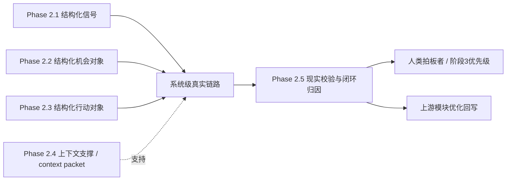

# Phase 2.5 启动与拍板

> **文档类型**：执行轨实例文档  
> **适用模块**：`Phase 2.5` 整合验证与复盘模块  
> **状态**：治理入口、待拍板清单、团队重组建议与角色面具配置方案已完成，设计前冻结拍板已通过；下一步由另一端建立执行期多角色面具协作小队、正式落档 `phase2.5_roles.md` 并推进方案设计；设计拍板后进入正式实现  
> **最后更新**：2026-03-16
---

## 一、模块基本信息

| 字段 | 内容 |
|------|------|
| **模块名称** | 阶段2.5 整合验证与复盘模块 |
| **模块编号** | `Phase 2.5` |
| **启动日期** | 2026-03-16 |
| **角色协作模式** | 设计阶段采用同一 Agent 下的角色面具协作小队（建议 `6-8` 个正式职责视角，执行时可压缩为 `5-6` 个角色面具） |
| **模块负责人** | 方案设计负责人视角（当前由治理收口与设计前冻结拍板筹备牵头；待首轮拍板完成后，再由另一端据此组织多角色讨论、正式落档 `phase2_roles/phase2.5_roles.md` 并推进方案设计） |
| **正式职责视角** | 总协调 / 架构连续性视角 / 方案设计负责人 / 现实校验负责人 / 系统复盘对象负责人 / 问题归因负责人 / 验证与验收负责人 / 结构化契约负责人 / 实现落地工程师视角 |
| **角色定义文档** | [phase2.5_roles.md](f:\AIProjects\DesignAssistant\data-layer\projects\proj_004\phase2_roles\phase2.5_roles.md)（待另一端在设计前冻结拍板后，参考 [阶段2团队构建方案.md](f:\AIProjects\DesignAssistant\data-layer\projects\proj_004\phase2_plan\阶段2团队构建方案.md)、[phase2.5_工作流总览与协作导航.md](f:\AIProjects\DesignAssistant\data-layer\projects\proj_004\phase2_plan\phase2.5_工作流总览与协作导航.md)、本文档、[phase2.5_团队重组建议清单.md](f:\AIProjects\DesignAssistant\data-layer\projects\proj_004\phase2_plan\phase2.5_团队重组建议清单.md)、[phase2.5_角色面具配置方案.md](f:\AIProjects\DesignAssistant\data-layer\projects\proj_004\phase2_plan\phase2.5_角色面具配置方案.md)，并可参考 [phase2.3_roles.md](f:\AIProjects\DesignAssistant\data-layer\projects\proj_004\phase2_roles\phase2.3_roles.md) 的落档方式正式建立） |
| **上游输入** | [phase2.5_目标说明.md](f:\AIProjects\DesignAssistant\data-layer\projects\proj_004\phase2_plan\phase2.5_目标说明.md)、[PHASE2_5_FIRST_PRINCIPLES_AND_ROLE_ESSENCE.md](f:\AIProjects\DesignAssistant\data-layer\projects\proj_004\phase2.5_implementation\docs\PHASE2_5_FIRST_PRINCIPLES_AND_ROLE_ESSENCE.md)、[PHASE2_5_MVP_SCOPE_AND_ITERATION_ALIGNMENT.md](f:\AIProjects\DesignAssistant\data-layer\projects\proj_004\phase2.5_implementation\docs\PHASE2_5_MVP_SCOPE_AND_ITERATION_ALIGNMENT.md)、`Phase 2.1 ~ 2.4` 的结构化输出、真实案例上下文、最小运行记录与人工复核结果 |
| **下游服务对象** | 人类拍板者、系统级优化回写、阶段3优先级收口、后续验证与联调工作 |
| **当前状态** | `治理入口、待拍板清单、团队重组建议与角色面具配置方案已完成，设计前冻结拍板已通过；下一步由另一端建立执行期多角色面具协作小队、正式落档 phase2.5_roles.md 并推进方案设计；设计拍板后进入正式实现` |
| **实现目录** | [phase2.5_implementation/](f:\AIProjects\DesignAssistant\data-layer\projects\proj_004\phase2.5_implementation) |

---

## 二、模块定位与目标

### 2.1 一句话定义

> `Phase 2.5` 的职责不是把 `2.1 ~ 2.4` 简单串成一次整合测试，也不是为了结项展示而先做案例包装与长篇复盘报告，而是把上游阶段形成的对象与流程压入真实案例和真实链路中，产出**可归因、可回写、可用于阶段3优先级收口的结构化系统复盘对象**。

### 2.2 当前阶段目标

- **要解决的问题**：`2.1 ~ 2.4` 即使各自具备局部产出能力，仍然不能自然推出“整套系统已经成立”。如果没有 `2.5`，团队只能看到局部模块是否能输出，却难以判断真实链路中哪里失真、为什么失真、哪些问题应优先修复、哪些结论可以带入阶段3。
- **直接价值**：交付“真实链路运行 → 输出检查 → 问题归因 → 阶段3优先级收口”的最小闭环，让系统不只是能跑，而是能被现实样本校验、被结构化复盘并被用于下一阶段决策。
- **复用价值**：后续可复用于战略研究、项目孵化、生态投资与复杂工作流设计中的系统级验证、失败归因和学习闭环场景。
- **面试展示价值**：体现“把多个 AI-native 中间层对象进一步压成系统级校验对象与学习闭环”的设计能力，而不是只会做单模块产出或把项目交给 AI 自动跑完。 [[memory:rebp86gg]]
- **工程沉淀价值**：沉淀 `2.1 ~ 2.5` 的系统消费关系、复盘对象骨架、归因口径、验证样例与阶段3优先级表达方式。

### 2.2.1 层级边界与模块职责

为避免 `2.5` 与上游阶段发生职责混淆，本文档中的“整合验证与复盘”采用以下层级定义：

- **`2.1` = 信号级对象形成**：从外部材料中形成结构化信号输入
- **`2.2` = 机会级判断**：把信号与证据组织成结构化机会对象
- **`2.3` = 行动级判断 / 资源承诺设计**：把机会对象组织成结构化行动对象
- **`2.4` = 上下文与支撑能力层**：为前述判断与行动提供方法、证据、模板或辅助上下文
- **`2.5` = 现实校验与闭环归因**：在真实案例和真实流程中验证系统级效果，识别关键偏差并输出可回写的系统复盘对象

因此：

- `2.5` 不回卷重做 `2.1 ~ 2.4` 的核心逻辑；
- `2.5` 不把“跑通链路”误认为“系统已经可信”；
- `2.5` 不越级把自己变成独立的复杂观测平台或长篇报告工程；
- `2.5` 当前要冻结的是**结构化系统复盘对象契约与现实校验最小闭环**。

### 2.3 本次启动范围

- **MVP 必做**
  - 冻结 `2.5` 当前模块边界：现实校验层 / 闭环学习层
  - 冻结 `2.5` 的最小输入契约（上游阶段关键输出、真实案例上下文、最小运行记录、轻量人工复核）
  - 冻结 `2.5` 的最小输出契约（结构化系统复盘对象）
  - 打通“真实链路运行 → 输出检查 → 问题归因 → 阶段3优先级收口”的最小闭环
  - 选择少量真实样本做首轮轻量验证
  - 保留轻量人工复核与关键异常记录
  - 为后续 `schema / protocol` 与联调回写准备稳定骨架
- **明确不做**
  - 不把 `2.5` 当前主产物定义成长篇复盘报告
  - 不在设计前冻结拍板前直接进入 `schema / protocol` 草案细化
  - 不把复杂观测平台、大规模案例池或自动归因平台作为当前 `MVP` 前提
  - 不让 `2.5` 在验证中接管 `2.1 ~ 2.4` 的核心职责
  - 不把多角色机制直接绑定为当前 `MVP` 的运行时多 Agent 工程承诺
- **完整版方向**
  - 更稳定的输入 / 输出契约与联调协议
  - 更系统的复盘对象字段体系与枚举体系
  - 更丰富的样本池、指标统计与案例比较能力
  - 自动归因增强、复杂观测增强与多 Agent 工程化增强
  - 更完整的阶段3优先级规划视图与派生报告视图
- **当前最大风险**
  - 如果在结构化系统复盘对象、模块边界与两轮拍板门禁尚未冻结前，直接进入协议、复杂观测或实现细节，`2.5` 会迅速偏离“现实校验层 / 闭环学习层”的本质，并导致后续返工。

---

## 三、上下游与依赖关系

### 3.1 上下游关系图



### 3.2 依赖说明

- **直接消费依赖**：`2.5` 要消费 `2.1 ~ 2.4` 的关键输出，但其重点不是重新生成这些对象，而是验证这些对象进入真实链路后的系统级表现。
- **案例依赖**：`2.5` 需要真实案例或接近真实的高价值样本，否则很难形成有效的现实压力测试。
- **运行记录依赖**：`2.5` 至少需要最小运行记录、输出物、人工复核结论与异常信息，否则只能做泛化描述，不能做有效归因。
- **治理依赖**：`2.5` 必须先冻结“模块边界 / 输入输出契约骨架 / `MVP` 闭环 / 角色定位 / 拍板事项”，否则另一端后续即使先写方案，也难以形成稳定执行轨。
- **阶段3依赖**：`2.5` 的价值不止在验证本身，还在于把问题收束成后续优化优先级，因此输出对象必须能支撑阶段3收口。

### 3.3 启动条件判断

- **现在可以启动的内容**
  - `2.5` 的输入 / 输出契约骨架草案
  - 结构化系统复盘对象 Schema 草案
  - 最小现实校验闭环主流程
  - 少量真实案例的样本走读与轻量验证策略
  - 不依赖复杂观测或多 Agent 工程化的最小复盘流程
- **暂不建议深做的内容**
  - 在治理文档补齐前直接深写 `schema / protocol`
  - 复杂观测平台、案例池统计体系和看板体系
  - 大规模 benchmark 和全自动根因分析平台
  - 强依赖所有上游完全成熟后才允许 `2.5` 启动的深耦合设计

---

## 四、契约草案

### 4.1 输入契约

#### A. `SystemRetrospectiveRequest`

| 字段 | 类型 | 必填 | 含义 | 备注 |
|------|------|------|------|------|
| `request_id` | `string` | Y | 本次系统复盘请求唯一ID | 用于追踪与回放 |
| `case_id` | `string` | Y | 真实案例唯一ID | 至少对应一条高价值样本 |
| `workflow_run_record` | `object` | Y | 本次真实链路运行记录 | 当前核心输入 |
| `upstream_outputs` | `object` | Y | `2.1 ~ 2.4` 的关键输出集合 | 允许按最小字段消费 |
| `review_notes` | `object[]` | N | 人工复核记录 | 当前为轻量增强项 |
| `validation_mode` | `string` | N | 验证模式 | 默认 `mvp_single_case` |
| `constraints` | `object` | N | 约束与提醒 | 如排除条件、优先级约束等 |

### 4.2 输出契约

#### A. `SystemRetrospectiveObject` 最小字段

| 字段 | 类型 | 必填 | 含义 | 备注 |
|------|------|------|------|------|
| `retrospective_id` | `string` | Y | 复盘对象唯一ID | 如 `retro_001` |
| `case_id` | `string` | Y | 对应案例ID | 与输入对齐 |
| `workflow_summary` | `string` | Y | 本次真实链路摘要 | 说明跑了什么、产出了什么 |
| `output_checks` | `object[]` | Y | 输出检查结果 | 至少覆盖完整性 / 一致性 / 可理解性 |
| `critical_findings` | `object[]` | Y | 关键发现列表 | 当前正式主字段之一 |
| `suspected_root_causes` | `object[]` | Y | 初步归因结果 | 至少尝试归到模块层或编排层 |
| `phase3_priorities` | `object[]` | Y | 阶段3优先级收口 | 至少形成一版可执行优先级 |
| `confidence_notes` | `string[]` | Y | 可信度与限制说明 | 允许为空数组但必须返回 |
| `retrospective_version` | `string` | Y | 复盘版本号 | 便于基线对照 |
| `processing_time_ms` | `integer` | Y | 处理耗时 | 毫秒 |
| `warnings` | `string[]` | N | 风险或异常提示 | 如“证据不足”“人工复核缺失”等 |

#### B. `CriticalFinding` 最小字段

| 字段 | 类型 | 必填 | 含义 | 备注 |
|------|------|------|------|------|
| `finding_id` | `string` | Y | 关键发现ID | 用于引用与跟踪 |
| `summary` | `string` | Y | 关键发现摘要 | 一句话说清问题 |
| `severity` | `string` | Y | 严重级别 | 当前建议 `high / medium / low` |
| `layer` | `string` | Y | 所属层级 | 当前建议 `signal / opportunity / action / orchestration / validation` |
| `evidence` | `string[]` | Y | 支撑证据 | 至少一项 |
| `impact` | `string` | Y | 影响说明 | 为什么值得进入优先级 |

#### C. `Phase3PriorityItem` 最小字段

| 字段 | 类型 | 必填 | 含义 | 备注 |
|------|------|------|------|------|
| `priority_id` | `string` | Y | 优先级项ID | 用于跟踪 |
| `title` | `string` | Y | 优先级标题 | 一句话说明 |
| `reason` | `string` | Y | 收口原因 | 对应关键发现与归因 |
| `scope` | `string` | Y | 作用范围 | 如模块级 / 系统级 |
| `suggested_order` | `integer` | Y | 建议顺序 | 用于阶段3排序 |

#### D. `SystemRetrospectiveResult` 最小字段

| 字段 | 类型 | 必填 | 含义 | 备注 |
|------|------|------|------|------|
| `request_id` | `string` | Y | 请求ID | 与输入对齐 |
| `retrospective` | `SystemRetrospectiveObject` | Y | 系统复盘对象 | 当前正式主产物 |
| `global_summary` | `string` | N | 当前整体复盘摘要 | 辅助阅读 |
| `analyzer_version` | `string` | Y | 版本号 | 用于基线与回放 |
| `processing_time_ms` | `integer` | Y | 总耗时 | 毫秒 |

### 4.3 契约原则

- **核心目标是“对象化系统复盘”，不是“文本化复盘扩写”**：`SystemRetrospectiveObject` 才是正式交付物，复盘报告与摘要只是派生视图。
- **校验必须与真实链路绑定**：`2.5` 讨论的是系统在真实样本中的表现，不是抽象讨论某个模块理论上是否合理。
- **问题必须进入归因结构**：输出不能只写“哪里不好”，而要至少尝试说明“可能为什么不好、影响到哪一层”。
- **阶段3优先级必须从复盘对象中长出来**：不能把“后续再优化”作为空泛结论，至少要形成一版可排序的收口项。
- **先冻结最小字段，再逐步增强**：`MVP` 先保证对象稳定、可回放、可复核、可用于收口，不追求一次做全复杂观测体系。
- **协议收口晚于治理收口**：当前草案用于稳定设计入口，不等于现在就把全部 `schema / protocol` 写死。

### 4.4 契约检查表

| 问题 | 结论 | 备注 |
|------|------|------|
| **输入是否明确？** | 基本明确 | 真实链路记录、上游输出与轻量人工复核已给出最小骨架 |
| **输出是否明确？** | 基本明确 | 结构化系统复盘对象已给出主字段 |
| **是否区分正式字段与辅助字段？** | 是 | `SystemRetrospectiveObject` 为主，摘要为辅 |
| **是否避免回卷 `2.1 ~ 2.4`？** | 是 | 当前只做验证、归因与优先级收口 |
| **是否支持后续增强？** | 是 | 可通过观测、案例池、自动归因与协议增强逐步扩展 |
| **是否便于阶段3消费？** | 有条件可以 | 仍需在设计方案阶段进一步冻结枚举与表达口径 |

---

## 五、验收与评测

### 5.1 效果定义

- **功能层目标**：能够稳定接收真实链路记录、上游关键输出与轻量人工复核信息，返回合法的结构化系统复盘对象。
- **质量层目标**：复盘对象应具备可解释性、可归因性和可回写性，而不是只把结果改写成更长的复盘文本。
- **协作层目标**：人类拍板者可以基于 `2.5` 输出更容易判断“系统问题是什么、为什么优先修、哪些项可进入阶段3”。
- **闭环层目标**：`2.5` 的输出能够反向服务 `2.1 ~ 2.4` 的后续优化，而不是停留在一次性问题记录。
- **工程层目标**：完成首轮对象契约、关键字段、验证方式与收口表达的冻结，为正式设计与实现打底。

### 5.2 指标表

| 层级 | 指标 | 目标值 | 测量方式 |
|------|------|--------|----------|
| **功能层** | 输出 Schema 合法率 | `100%` | JSON / 字段检查 |
| **质量层** | 关键发现可解释性 | `可读且可追溯` | 人工走读样例 |
| **质量层** | 初步归因合理性 | `基本具备` | 样例评审 |
| **质量层** | 阶段3优先级可执行性 | `能形成排序建议` | 人工复核 |
| **协作层** | 人类可拍板性 | `可直接用于讨论` | 样例联评 |
| **闭环层** | 上游可回写性 | `可定位到模块或流程层` | 字段映射检查 |
| **展示层** | 可演示性 | 至少 `1-2` 条完整案例 | Demo记录 |
| **工程层** | 契约冻结完成度 | `MVP 主字段冻结` | 文档检查 |

### 5.3 基线与实验

- **首轮验证样本数量**：建议 `2-4` 个高价值真实案例
- **样本选择原则**：优先选择能暴露链路失真、判断偏差、执行落差或复盘困难点的案例
- **验证重点**：
  - 是否能把真实链路组织成稳定的系统复盘对象
  - 是否能产出关键发现与初步归因
  - 是否能从复盘对象中长出阶段3优先级
  - 是否能保留轻量人工复核与可信度说明
- **责任建议**：验证与验收视角维护首轮案例基线，用户负责方向性拍板，另一端后续负责结合设计与实现结果回写验证结论
- **效果不达标时的排查顺序**：对象定义 → 输入契约 → 校验流程 → 归因口径 → 真实案例策略 → 是否需要增强机制

---

## 六、职责划分与协作边界

### 6.1 人与 AI 的职责划分

| 工作类型 | 负责人 | 原因 |
|----------|--------|------|
| **模块边界定义** | 人 | 涉及跨模块职责与范围控制 |
| **关键设计拍板** | 人 | 涉及系统收口与后续阶段优先级取舍 |
| **契约 / 文档初稿** | AI / 数字团队 | 适合快速结构化整理 |
| **系统复盘对象骨架与样例草拟** | AI / 数字团队 | 适合快速搭建与对比 |
| **质量验收** | 人主导 + AI辅助 | 需要业务判断与样例走读结合 |
| **最终取舍决策** | 人 | 避免执行端自行扩范围 |

### 6.2 协作机制

- **单一事实源**：
  - `2.5` 模块本质与边界，看 [PHASE2_5_FIRST_PRINCIPLES_AND_ROLE_ESSENCE.md](f:\AIProjects\DesignAssistant\data-layer\projects\proj_004\phase2.5_implementation\docs\PHASE2_5_FIRST_PRINCIPLES_AND_ROLE_ESSENCE.md)
  - `2.5` 当前范围与后续边界，看 [PHASE2_5_MVP_SCOPE_AND_ITERATION_ALIGNMENT.md](f:\AIProjects\DesignAssistant\data-layer\projects\proj_004\phase2.5_implementation\docs\PHASE2_5_MVP_SCOPE_AND_ITERATION_ALIGNMENT.md)
  - `2.5` 当前工作流入口与阅读顺序，看 [phase2.5_工作流总览与协作导航.md](f:\AIProjects\DesignAssistant\data-layer\projects\proj_004\phase2_plan\phase2.5_工作流总览与协作导航.md)
  - `2.5` 当前待拍板事项，看 [phase2.5_待拍板决策清单.md](f:\AIProjects\DesignAssistant\data-layer\projects\proj_004\phase2_plan\phase2.5_待拍板决策清单.md)
  - `2.5` 正式启动动作、拍板结果与执行依据，以本文档为准
- **文件所有权**：
  - 当前治理与启动节奏由宏观规划端维护
  - 后续方案设计文档由另一端负责补齐
  - 拍板结果必须回写本文档，才能视为正式生效
- **共享文件限制**：关键结论必须先写回本文档，再继续进入建队、设计与实现
- **同步节奏**：每完成一轮关键拍板、一次对象骨架冻结或一轮验证结果更新，先更新本文档，再继续推进执行

### 6.3 角色面具建队 / 启动清单

`2.5` 启动应遵循“**先冻结治理，再完成设计前冻结拍板，再定义执行期角色面具，再由多角色收敛设计，最后进入实现**”的顺序，而不是一上来直接做协议或直接写实现。

**重要说明**：
- `Phase 2.5` 采用**同一 Agent 下的角色面具协作模式**
- 多角色讨论是为了帮助系统复盘对象、归因逻辑与验证方案高质量收敛，不等于产品运行时已经采用多 Agent
- 角色定义正式落档是指在 `phase2_roles` 目录下建立 [phase2.5_roles.md](f:\AIProjects\DesignAssistant\data-layer\projects\proj_004\phase2_roles\phase2.5_roles.md)，不是创建多个独立自治 Agent
- 正式职责来源以 [phase2.5_团队重组建议清单.md](f:\AIProjects\DesignAssistant\data-layer\projects\proj_004\phase2_plan\phase2.5_团队重组建议清单.md) 为准；执行压缩与协作方式以 [phase2.5_角色面具配置方案.md](f:\AIProjects\DesignAssistant\data-layer\projects\proj_004\phase2_plan\phase2.5_角色面具配置方案.md) 为准

#### A. 建队与启动主路径

```text
总协调视角确认本轮目标与前置文档
→ 由这一端补齐 2.5 团队重组建议清单 与 2.5 角色面具配置方案
→ 用户完成设计前冻结拍板
→ 另一端依据 阶段2团队构建方案 / 2.5 工作流总览 / 本文档 / 2.5 团队重组建议 / 2.5 角色面具配置方案 建立执行期同一 Agent 下的多角色面具协作小队
→ 在 phase2_roles/ 下正式落档 phase2.5_roles.md（可参考 phase2.3_roles.md 的落档方式，但必须保持 2.5 自身职责边界）
→ 方案设计负责人牵头组织多角色讨论
→ 产出 2.5 设计方案
→ 用户完成设计拍板
→ 进入正式实现、轻量验证与资产沉淀
```

#### B. 启动检查清单

| 阶段 | 关键动作 | 主责角色视角 | 产出物 | 进入下一步条件 |
|------|----------|-------------|--------|----------------|
| **1. 冻结治理入口** | 确认 `2.5` 定位、`MVP` 范围、依赖模式与待拍板项 | 总协调视角 / 用户 | 本文档首轮确认版 | `2.5` 治理入口与待拍板清单已形成 |
| **2. 补齐治理依据** | 由这一端补 [phase2.5_团队重组建议清单.md](f:\AIProjects\DesignAssistant\data-layer\projects\proj_004\phase2_plan\phase2.5_团队重组建议清单.md) 与 [phase2.5_角色面具配置方案.md](f:\AIProjects\DesignAssistant\data-layer\projects\proj_004\phase2_plan\phase2.5_角色面具配置方案.md) | 总协调视角 | 两份治理依据文档 | 角色依据链补齐，方可进入设计前冻结拍板 |
| **3. 完成设计前冻结拍板** | 对模块边界、主产物、`MVP` 最小闭环、多角色定位、案例 / 复核口径与首轮设计范围做用户确认 | 总协调视角 / 用户 | 首轮拍板结论回写 | 首轮关键分歧已关闭，方可进入建队与 `roles` 落档 |
| **4. 定义执行期角色面具** | 由另一端基于治理文档建立执行期协作小队，并正式建立 [phase2.5_roles.md](f:\AIProjects\DesignAssistant\data-layer\projects\proj_004\phase2_roles\phase2.5_roles.md) | 总协调视角 / 另一端 | `phase2_roles/phase2.5_roles.md` | 正式角色定义已落档，职责边界与执行映射已明确，方可进入设计 |
| **5. 多角色收敛设计** | 基于 `phase2.5_roles.md` 组织现实校验、复盘对象、问题归因、验证与契约五视角讨论 | 方案设计负责人 / 相关职责视角 | `2.5` 设计方案草案 | 主流程、字段骨架、验证路径已收敛 |
| **6. 完成设计拍板** | 对设计方案、对象骨架、实现策略和验收口径做用户确认 | 总协调视角 / 用户 | 设计拍板结论回写 | 设计拍板通过后，方可进入正式实现 |
| **7. 启动正式实现** | 落地最小现实校验流程、样例运行与轻量验证 | 实现落地工程师视角 / 验证与验收负责人 | 可运行闭环、样例结果、验证记录 | 输出稳定、对象可读、可归因、可收口 |
| **8. 维护执行进度与联调** | 建立 [phase2.5_执行进度.md](f:\AIProjects\DesignAssistant\data-layer\projects\proj_004\phase2_plan\phase2.5_执行进度.md)，并持续补契约、验证与联调记录 | 结构化契约负责人 / 总协调视角 | 执行进度、联调结果、回写记录 | 治理链与执行链持续对齐 |

#### C. 执行纪律

- **先治理、先设计前冻结拍板，再建队、落 `roles`、做设计**：`2.5` 不应带着上层分歧进入执行期角色落档与方案设计。
- **设计完成后必须再做一次设计拍板**：未经设计拍板，不得直接进入正式实现。
- **本文档是启动动作单一事实源**：与“怎么启动、两次拍板何时发生、何时进入设计、何时进入实现”相关的执行动作，以本文档为准。
- **`2.5` 不得借启动之名扩大范围**：在用户未拍板前，不得把完整观测、规模化案例、多 Agent 工程化或自动归因平台提前塞进当前 `MVP`。
- **角色面具协作，不是多 Agent 自治**：当前角色面具用于设计期的高质量收敛，不代表产品运行时已经要采用多 Agent 编排。

---

## 七、待拍板事项

### 7.1 设计前冻结拍板（治理收口后、建队与设计前）

| 决策项 | 可选方案 | 推荐方案 | 为什么现在必须定 | 拍板结果 |
|--------|----------|----------|------------------|----------|
| **主产物形态** | A. 长篇复盘报告；B. 结构化系统复盘对象 + 可选派生视图；C. 案例汇总清单 + 简评 | **B** | 不冻结主对象，另一端在 `roles` 与设计方案阶段会把重点放散 | ✅ 通过：按 **B** 执行，正式冻结为“结构化系统复盘对象 + 可选派生视图”，复盘报告、阶段3摘要与案例总结仅作为派生表达 |
| **`MVP` 最小闭环** | A. 真实链路运行 → 输出检查 → 问题归因 → 阶段3优先级收口；B. 端到端跑通 → 输出归档 → 报告生成；C. 多 Agent 复盘 → 自动归因 → 优先级建议 | **A** | 决定 `2.5` 是按职责建模块，还是按手段堆能力 | ✅ 通过：按 **A** 执行，冻结为“真实链路运行 → 输出检查 → 问题归因 → 阶段3优先级收口”的最小闭环 |
| **与 `2.1 ~ 2.4` 的边界** | A. `2.5` 消费上游输出并做现实校验与归因；B. `2.5` 顺带兜底修正上游逻辑；C. 先不区分 | **A** | 不先定，`2.5` 很容易从校验层退化成临时兜底层 | ✅ 通过：按 **A** 执行，`2.5` 当前不接管 `2.1 ~ 2.4` 核心职责，优先暴露并归因问题，而不是在本层吞掉问题 |
| **`schema / protocol` 的推进时机** | A. 先完成治理、拍板、`roles` 与设计方案，再在正式设计 / 实现中细化；B. 现在直接先写协议草案；C. 一直拖到实现完成后再补 | **A** | 不先定，最容易越过当前工作流门禁 | ✅ 通过：按 **A** 执行，当前不越过工作流顺序直接进入协议草案，待 `roles` 与设计方案形成后再细化 |
| **真实案例首轮规模与定位** | A. 少量高价值样本，优先做现实压力测试；B. 多案例覆盖与统计先行；C. 先只做演示案例 | **A** | 不先定，设计阶段会在“先做验证还是先堆案例”之间摇摆 | ✅ 通过：按 **A** 执行，首轮采用少量高价值样本，优先承担现实压力测试而非展示包装 |
| **轻量人工复核口径** | A. 保留轻量人工复核；B. 当前完全不做人工复核；C. 直接做重型评分体系 | **A** | 不先定，输出可信度判断会失焦 | ✅ 通过：按 **A** 执行，当前保留轻量人工复核，不引入重型人工评分体系 |
| **多角色机制在当前阶段的定位** | A. 作为设计阶段固定工作方法与 `roles` 落档依据；B. 直接作为 `MVP` 必做多 Agent 运行时系统；C. 当前完全排除 | **A** | 当前最容易导致范围膨胀，必须先定 | ✅ 通过：按 **A** 执行，多角色机制当前固定为设计阶段的方法论与 `roles` 落档依据，不绑定为运行时多 Agent 硬前提 |
| **首轮设计产物范围** | A. `phase2.5_roles.md` + `phase2.5_设计方案.md` + 设计拍板准备；B. 直接进入实现计划；C. 先做协议与观测平台蓝图 | **A** | 不先定，另一端设计容易直接滑向实现细节或平台扩张 | ✅ 通过：按 **A** 执行，首轮设计产物聚焦 `phase2.5_roles.md`、`phase2.5_设计方案.md` 与设计拍板准备，不扩到观测平台与大规模工程蓝图 |

### 7.2 设计拍板（设计方案形成后、正式实现前）

| 决策项 | 可选方案 | 推荐方案 | 为什么现在必须定 | 拍板结果 |
|--------|----------|----------|------------------|----------|
| **设计方案主流程** | A. 按当前主流程进入实现；B. 局部调整后再进入实现；C. 退回重做设计 | **A / B 视草案质量而定** | 不先定，执行端会带着流程分歧直接开工 | ✅ 通过：按 **A** 执行，设计方案主流程（真实链路运行 → 输出检查 → 问题归因 → 阶段3优先级收口）已确认，可直接进入实现 |
| **系统复盘对象字段骨架** | A. 冻结当前主字段；B. 再补少量字段后冻结；C. 继续开放 | **A / B** | 字段不冻结，正式实现会反复返工 | ✅ 通过：按 **A** 执行，冻结 `SystemRetrospectiveObject` 核心字段（retrospective_id / case_id / workflow_summary / output_checks / critical_findings / suspected_root_causes / phase3_priorities / confidence_notes / retrospective_version / processing_time_ms / warnings），辅助字段可在实现期细化 |
| **问题归因与阶段3优先级表达口径** | A. 按当前设计进入实现；B. 微调后进入实现；C. 退回重做 | **A / B** | 不先定，回写链路会不稳定 | ✅ 通过：按 **A** 执行，问题归因采用6层归因（signal / opportunity / action / context / orchestration / validation），阶段3优先级从复盘对象中自然导出，可直接进入实现 |
| **实现起步范围** | A. 只做 `MVP` 最小闭环；B. 顺带扩一层增强项；C. 直接做完整版 | **A** | 不先定，最容易在实现阶段膨胀 | ✅ 通过：按 **A** 执行，实现起步范围严格限定为 `MVP` 最小闭环，不扩增强项 |
| **首轮验证与回写口径** | A. 轻量样例验证 + 执行进度回写；B. 先实现后补记录；C. 先不定 | **A** | 不先定，后续验证与治理链会脱节 | ✅ 通过：按 **A** 执行，采用轻量样例验证（2-4个真实案例）+ 执行进度回写方式 |

### 7.3 可后置拍板

| 决策项 | 建议何时再定 | 触发条件 | 备注 |
|--------|--------------|----------|------|
| **更完整的 `schema / protocol` 定义** | `2.5` 设计方案稳定后 | 主流程、对象骨架与联调关系明确 | 当前不应在治理阶段全部写死 |
| **复杂观测平台与指标看板** | `2.5 MVP` 闭环跑通后 | 发现轻量记录不足以支撑复盘 | 适合作为 `v1.1 / v1.2` 增强项 |
| **大规模案例池与统计体系** | 首轮真实案例验证后 | 发现少量高价值样本不足以支持比较与模式总结 | 不适合作为第一轮 `MVP` 前置 |
| **自动归因平台** | 首轮归因链稳定后 | 发现人工 + 半结构归因已成瓶颈 | 当前先保证归因对象成立更重要 |
| **多 Agent 工程化形态** | 角色职责、设计方案与实现闭环稳定后 | 发现确实需要更强的并行协作、审查与编排 | 当前先把角色面具用于治理与设计更稳妥 |

### 7.4 拍板项纪律

- 每个拍板项都必须附带**可选方案 + 推荐方案 + 推荐理由 + 延后风险**。
- 执行团队不得绕过本文档直接扩大 `2.5` 当前范围。
- 对话中形成的判断，只有写回本文档并经用户确认后，才算正式生效。

---

## 八、启动结论

### 8.1 启动结论页

- **是否允许启动**：允许继续推进到“另一端建立执行期多角色面具协作小队 → 正式落档 `phase2.5_roles.md` → 产出 `phase2.5_设计方案.md` → 完成设计拍板”的阶段；当前仍不允许绕过设计拍板直接进入正式实现
- **启动范围**：设计前冻结拍板已完成，当前正式进入执行期角色定义与设计方案收敛阶段
- **明确不做**：在设计拍板前不直接进入正式实现、不扩复杂观测平台、不扩大规模案例体系、不把长篇复盘报告作为主产物、不把运行时多 Agent 工程化升级为当前 `MVP` 前提
- **当前最大风险**：如果另一端在正式 `roles` 与设计方案尚未收敛前直接开工实现，`2.5` 仍会在对象字段、归因口径和实现范围上返工
- **下次复查时间**：`phase2.5_roles.md` 落档后立即复查一次；`phase2.5_设计方案.md` 形成后、设计拍板前再复查一次

### 8.2 启动前最后检查

| 检查项 | 状态 | 备注 |
|--------|------|------|
| **模块目标明确** | ✅ | 已明确为现实校验层 / 闭环学习层 |
| **上下游依赖明确** | ✅ | `2.1 ~ 2.4` 输入消费关系与阶段3收口关系已明确 |
| **契约草案明确** | ✅ | 已给出最小输入输出字段 |
| **拍板事项已整理** | ✅ | 已在 [phase2.5_待拍板决策清单.md](f:\AIProjects\DesignAssistant\data-layer\projects\proj_004\phase2_plan\phase2.5_待拍板决策清单.md) 中结构化整理并完成首轮拍板 |
| **设计前冻结拍板已完成** | ✅ | 八项首轮关键拍板已统一按推荐方案回写 |
| **设计拍板已完成** | ☐ | 待 `phase2.5_设计方案.md` 形成后完成 |
| **`MVP` 边界明确** | ✅ | 已冻结当前不做项与最小闭环 |
| **验收方式明确** | ✅ | 已给出轻量验证口径 |
| **团队重组原则明确** | ✅ | 见 [phase2.5_团队重组建议清单.md](f:\AIProjects\DesignAssistant\data-layer\projects\proj_004\phase2_plan\phase2.5_团队重组建议清单.md) |
| **角色面具方案明确** | ✅ | 见 [phase2.5_角色面具配置方案.md](f:\AIProjects\DesignAssistant\data-layer\projects\proj_004\phase2_plan\phase2.5_角色面具配置方案.md) |
| **另一端建立正式角色文件的依据明确** | ✅ | 启动文档、团队重组文档与角色面具文档已形成完整依据链 |

### 8.3 一句话总结

> `Phase 2.5` 现在已经完成治理依据补齐与设计前冻结拍板，下一步应由另一端按既定工作流建立执行期多角色面具协作小队、落 `phase2.5_roles.md`、产出设计方案，并在设计拍板通过后再进入正式实现。

---

## 九、下一步动作

基于当前顺序，本文档回写完成后的直接下一步应为：

1. 让另一端依据 [阶段2团队构建方案.md](f:\AIProjects\DesignAssistant\data-layer\projects\proj_004\phase2_plan\阶段2团队构建方案.md)、[phase2.5_工作流总览与协作导航.md](f:\AIProjects\DesignAssistant\data-layer\projects\proj_004\phase2_plan\phase2.5_工作流总览与协作导航.md)、本文档、[phase2.5_团队重组建议清单.md](f:\AIProjects\DesignAssistant\data-layer\projects\proj_004\phase2_plan\phase2.5_团队重组建议清单.md) 与 [phase2.5_角色面具配置方案.md](f:\AIProjects\DesignAssistant\data-layer\projects\proj_004\phase2_plan\phase2.5_角色面具配置方案.md)，在 `phase2_roles` 下建立 [phase2.5_roles.md](f:\AIProjects\DesignAssistant\data-layer\projects\proj_004\phase2_roles\phase2.5_roles.md)
2. 让另一端基于正式角色依据产出 [phase2.5_设计方案.md](f:\AIProjects\DesignAssistant\data-layer\projects\proj_004\phase2_plan\phase2.5_设计方案.md)
3. 完成设计拍板回写
4. 设计拍板通过后，再进入正式实现、验证与联调材料补齐，并在需要时建立 [phase2.5_执行进度.md](f:\AIProjects\DesignAssistant\data-layer\projects\proj_004\phase2_plan\phase2.5_执行进度.md)

---

**文档状态**：✅ 已建立  
**版本**：v0.1 Draft  
**建议下次更新时机**：当 `2.5` 团队重组与角色面具依据补齐，或设计前冻结拍板完成时