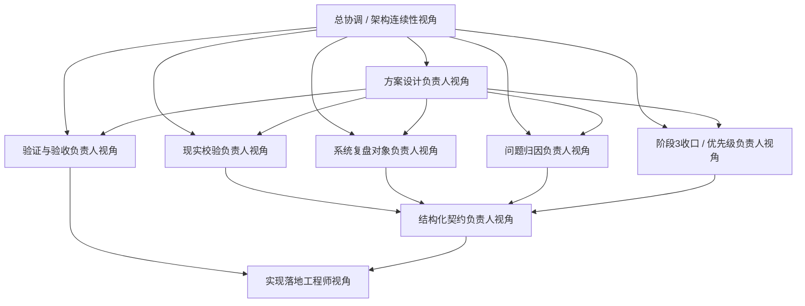

# Phase 2.5 团队重组建议清单

> **文档类型**：团队配置与组织建议文档
> **适用模块**：`Phase 2.5` 整合验证与复盘模块
> **状态**：建议版，待用户确认
> **最后更新**：2026-03-16

---

## 一、结论先行

> `2.5` 最合适的组织方式，不是直接沿用 `2.3` 的职责分布，也不是把“多 Agent 复盘系统”当成先验前提去倒推团队结构，而是**围绕 `2.5` 当前的核心目标——把 `2.1 ~ 2.4` 的阶段性产出压入真实案例和真实链路，形成可归因、可回写、可用于阶段3优先级收口的结构化系统复盘对象——做阶段性重组与补位**。

核心原因有三点：

1. **目标中心变了**：`2.3` 的中心是“把机会对象翻译为行动姿态、路径与资源承诺”；`2.5` 的中心则是“让整条系统链路经受现实样本压力测试，并沉淀为结构化系统复盘对象”。
2. **风险结构变了**：`2.3` 的主要风险是“行动设计是否可拍板、承诺节奏是否合理”；`2.5` 的主要风险是“是否把跑通过程误当成系统可信、是否只有现象没有归因、是否复盘了却无法回写”。
3. **拍板重点变了**：`2.5` 更需要拍板“系统复盘对象长什么样、现实校验最小闭环如何定义、归因如何分层、阶段3优先级如何从复盘对象中长出来、与 `2.1 ~ 2.4` 的边界怎么守住”，而不是先围绕复杂观测平台、自动归因平台或运行时多 Agent 工程做组织设计。

---

## 二、重组原则

### 2.0 层级边界前置说明

在本文件中，所有“验证”“复盘”“归因”“闭环”相关表述，都应优先理解为**系统级真实链路验证 / 结构化复盘 / 问题归因 / 回写收口**，而不是泛化意义上的“任何测试”“任何复盘”或“事后总结”。为了避免与 `2.1 ~ 2.4` 混淆，先明确五层边界：

- **`2.1 = 信号级对象形成`**：负责把外部材料转为结构化信号，不负责系统级现实校验。
- **`2.2 = 机会级判断`**：负责形成结构化机会对象，不负责真实链路表现的系统复盘。
- **`2.3 = 行动级判断 / 资源承诺设计`**：负责形成行动决策对象，不负责事后验证该行动对象在真实链路中的系统效果。
- **`2.4 = 上下文与支撑能力层`**：负责提供方法、证据、模板与辅助上下文，不替代 `2.5` 做系统级归因与回写。
- **`2.5 = 现实校验与闭环归因`**：负责让 `2.1 ~ 2.4` 的关键输出进入真实案例与真实流程，识别关键偏差、形成结构化系统复盘对象，并将结论回写为后续优化与阶段3优先级收口输入。

因此，本文件提到的“现实校验负责人”“系统复盘对象负责人”“问题归因负责人”“闭环”等说法，都特指：

- **围绕真实链路表现的验证与检查**
- **围绕系统问题的层级化归因与结构化表达**
- **围绕阶段3优先级收口与上游回写的闭环设计**
- **而不是重新生成 `2.1 ~ 2.4` 的对象，也不是把 `2.5` 变成复杂观测平台或运行时多 Agent 系统**

### 2.1 核心原则

- **围绕系统复盘对象与现实校验闭环组队，而不是围绕实现花样组队**：先看 `2.5` 需要哪些系统级校验与回写视角，再决定组织配置。
- **保留连续性，不复制上阶段惯性**：可以保留少量跨阶段连续角色，但不能把 `2.3` 的行动设计思维、或旧理解里的“整合测试 / 长报告 / 多 Agent showcase”原样带入 `2.5`。
- **优先补“系统级验证层缺口”**：`2.5` 当前最缺的不是更多实现手，而是“现实校验、系统复盘对象、问题归因、阶段3收口、结构化契约、轻量验证验收”这些关键视角。
- **遵循已有治理顺序，但不把流程写进本文件**：与“按什么顺序启动、何时拍板、何时进入设计与实现”相关内容，统一以工作流与启动文档为准；本文件只回答应该如何组队。

### 2.2 组织目标

本轮重组的目标不是把团队做大，而是形成一个**7-8 个职责视角的核心作战小队**，满足以下条件：

- 能守住 `2.5` 作为“现实校验层 / 闭环学习层”的边界
- 能先完成系统复盘对象、归因骨架、输入 / 输出契约与首轮设计前冻结拍板准备
- 能打通 `2.5 MVP` 的最小闭环：**真实链路运行 → 输出检查 → 问题归因 → 阶段3优先级收口**
- 能进行少量真实案例的轻量验证，而不是只停留在概念层
- 能把结果稳定回写到 `2.1 ~ 2.4` 的优化判断与阶段3优先级讨论
- 能与 `2.1 ~ 2.4` 保持必要协同但不过度耦合

---

## 三、现有团队基线与问题

### 3.1 当前基线

基于现有文档，`2.5` 当前已经有了：

- 第一性原理与职责边界对齐
- `MVP Scope` 与迭代边界收口
- 工作流与启动拍板治理材料
- 设计前冻结所需的待拍板决策清单

也就是说，`2.5` 当前不是“完全没有组织基础”，而是已经完成了上层治理收口，接下来要回答的是：

> **在这种前提下，正式进入设计与实现时，最适合采用什么样的团队配置。**

### 3.2 如果不做针对性重组，会出现的问题

| 问题 | 表现 | 风险 |
|------|------|------|
| **系统复盘对象中心不稳** | 团队讨论容易滑向“复盘报告怎么写”而不是“结构化复盘对象怎么成立” | `2.5` 变成长篇报告工程 |
| **现实校验边界不清** | 容易把 `2.5` 做成整合测试兜底层，顺带重做 `2.1 ~ 2.4` 的逻辑 | 模块职责漂移 |
| **归因角色不足** | 能看到问题现象，但缺少主责角色把问题归到模块层、编排层或验证层 | 结果难回写 |
| **阶段3收口无人主责** | 能列很多问题，却不能形成可排序、可执行的阶段3优先级 | 闭环断裂 |
| **验证角色偏弱** | 容易只看“有输出”，不看“是否可信、可解释、可回写” | `MVP` 难以正式验收 |
| **多角色机制被误解** | 把设计期角色面具误读成运行时多 Agent 系统 | 组织设计被工程预设绑架 |

---

## 四、建议保留 / 新增 / 强化的角色

### 4.1 建议保留的连续性角色

| 角色 | 来源 | 建议保留方式 | 保留原因 |
|------|------|--------------|----------|
| **总协调 / 架构连续性负责人** | 可由当前阶段治理主责视角兼任部分职责 | **保留** | 负责维持 `2.1 / 2.2 / 2.3 / 2.4 / 2.5` 的边界连续性，避免设计阶段把 `2.5` 带回“整合测试器”或“长报告器” |
| **上下游依赖把关角色** | 可由熟悉跨模块接口与阶段协同的成员兼任 | **保留或兼任** | 负责检查 `2.1 ~ 2.4 -> 2.5` 的输入消费边界，以及 `2.5 -> 阶段3` 的收口输出是否成立 |

### 4.2 建议新增或强化的核心角色

| 角色 | 建议状态 | 核心职责 | 为什么必须有 |
|------|----------|----------|---------------|
| **方案设计负责人** | **新增核心角色** | 汇总现实校验、复盘对象、问题归因、阶段3收口、验证多个视角，收敛 `2.5` 首版设计方案，并组织设计拍板 | `2.5` 很容易发散成“案例、复盘、归因、看板、协议”多条线，没有收敛者就难以形成正式方案 |
| **现实校验负责人** | **新增核心角色** | 定义真实链路如何运行、检查、记录与最小验证；负责现实压力测试主路径，而不是回卷重做上游对象 | `2.5` 的本体首先是现实校验层，没有这个角色就很容易退化成抽象复盘层 |
| **系统复盘对象负责人** | **新增核心角色** | 定义 `SystemRetrospectiveObject` 的主字段、对象骨架与主视图，保证正式主产物是“对象”而不是“长文” | 没有人主责对象骨架，`2.5` 很快会从对象层滑向文本层 |
| **问题归因负责人** | **新增核心角色** | 负责把发现的问题归到层级、模块、流程或验证口径，形成初步归因结构与解释边界 | 能看到问题不等于能形成可回写的归因；`2.5` 的价值高度依赖这一层 |
| **阶段3收口 / 优先级负责人** | **新增核心角色** | 负责把关键发现与归因转成阶段3可消费的优先级项与排序建议 | `2.5` 如果不能导出阶段3优先级，就会失去“闭环学习层”的一半价值 |
| **验证与验收负责人** | **强化** | 设计轻量案例验证、可信度检查与正式验收判断，确认当前对象是否足够可读、可解释、可回写 | 没有验证角色，`2.5` 很容易停留在“结构看起来齐全” |
| **结构化契约负责人** | **新增核心角色** | 冻结输入 / 输出契约最小字段、字段注释、兼容策略与联调骨架 | `2.5` 的对象稳定性、回写能力与后续协议演进都依赖契约负责人 |
| **实现落地工程师** | **保留并聚焦** | 把对象契约、现实校验流程、轻量验证路线落成可运行模块 | 负责把系统级验证层方案转成可运行 `MVP` |

### 4.3 建议弱化为支撑而非中心的角色方向

| 角色方向 | 为什么不应继续作为 `2.5` 中心 |
|----------|------------------------------|
| **长篇复盘报告导向** | 这会把 `2.5` 从对象层和闭环层带偏到展示层 |
| **复杂观测平台导向** | 当前 `2.5` 的第一优先级不是平台做得多复杂，而是最小闭环是否成立 |
| **自动归因平台导向** | 当前归因对象与表达口径都还在冻结中，不应反向决定团队配置 |
| **完整多 Agent 工程导向** | 当前多角色机制是设计期工作方法，不是 `MVP` 运行时前提 |

---

## 五、推荐团队结构（建议版）

### 5.0 角色协作模式说明

**重要**：Phase 2.5 当前采用**同一 Agent 下的角色面具协作模式**，而非多个独立 Agent 并行自治模式。

**同时需要再明确一层**：

- **本文件中的 8 个职责视角，是正式职责清单的来源**
- **后续 [phase2.5_角色面具配置方案.md](f:\AIProjects\DesignAssistant\data-layer\projects\proj_004\phase2_plan\phase2.5_角色面具配置方案.md) 中的角色面具，是这些正式职责在同一 Agent 下的执行化表达**
- **另一端后续建立 `phase2_roles/phase2.5_roles.md` 时，应以本文件确定“必须覆盖哪些正式职责”，再结合角色面具方案确定“这些职责如何协作与压缩执行”**

**核心理念**：
- ✅ **单一 Agent**：所有职责视角由同一个 AI Agent 承担
- ✅ **多职责视角**：Agent 在不同阶段切换不同角色面具
- ✅ **职责完整覆盖**：保证 `2.5` 的现实校验、系统复盘、问题归因与闭环回写关键视角都被覆盖
- ✅ **执行可压缩**：实际执行时可压缩为 `5-6` 个角色面具
- ✅ **协作而非自治**：角色之间是为了方案收敛与质量保障，不是运行时多 Agent 系统

**为什么不是多 Agent**：
- 多 Agent 更适合后续增强阶段的复杂并行审查、观测或展示型编排
- `2.5 MVP` 当前需要的是“现实校验与复盘对象收敛”，不是“Agent 之间互相辩论”
- 角色面具模式上下文天然共享，更适合当前设计期与轻量验证期

**详细角色定义**：
- 完整的角色定义、职责边界与协作方式见后续 [phase2.5_角色面具配置方案.md](f:\AIProjects\DesignAssistant\data-layer\projects\proj_004\phase2_plan\phase2.5_角色面具配置方案.md)
- 另一端后续正式落档的执行角色文件应为 [phase2.5_roles.md](f:\AIProjects\DesignAssistant\data-layer\projects\proj_004\phase2_roles\phase2.5_roles.md)

### 5.1 推荐编制

建议 `2.5` 采用以下 **8 个职责视角**（执行时可压缩为 `5-6` 个角色面具）：

### 5.2 角色视角说明

#### 1. 总协调 / 架构连续性视角

- **职责**：
  - 维护 `2.5` 启动与拍板文档的关键状态对齐
  - 把控 `2.1 ~ 2.5` 的边界与依赖
  - 组织关键拍板与文档回写
- **关键输出**：
  - 模块执行轨关键结论回写
  - 依赖状态判断
  - 拍板结果同步

#### 2. 方案设计负责人

- **职责**：
  - 汇总现实校验、复盘对象、问题归因、阶段3收口、验证多个视角的输入
  - 组织多角色讨论，收敛 `2.5` 首版设计方案
  - 明确 `MVP` 路线、非目标与设计取舍
  - 组织设计拍板，并把结论回写到正式文档
- **关键输出**：
  - `phase2.5_设计方案.md`
  - 方案备选路线与取舍说明
  - 设计拍板结论

#### 3. 现实校验负责人

- **职责**：
  - 定义真实链路如何运行、检查与记录
  - 设计最小现实压力测试主路径与样例策略
  - 明确“先校验什么、记录什么、保留什么人工复核”的主流程
- **关键输出**：
  - 现实校验主流程草案
  - 真实案例最小策略
  - 运行记录要求

#### 4. 系统复盘对象负责人

- **职责**：
  - 定义 `SystemRetrospectiveObject` 最小字段与对象骨架
  - 区分正式主字段、辅助摘要字段与派生视图
  - 保证 `2.5` 的正式交付物仍是对象，而不是长篇复盘文本
- **关键输出**：
  - 系统复盘对象骨架
  - 字段分层说明
  - 对象样例草案

#### 5. 问题归因负责人

- **职责**：
  - 设计问题如何分层归因到模块、流程、编排、验证或输入侧
  - 明确归因中的证据边界、可信度说明与不确定性表达
  - 防止“看到问题现象就直接给结论”的过度归因
- **关键输出**：
  - 归因结构草案
  - 证据与限制条件记录
  - 风险与不确定性说明

#### 6. 阶段3收口 / 优先级负责人

- **职责**：
  - 把关键发现与初步归因转成阶段3可消费的优先级项
  - 设计优先级标题、原因、范围与建议顺序表达
  - 保证 `2.5` 的输出能够服务后续优化排序，而不是只停留在问题清单
- **关键输出**：
  - 阶段3优先级草案
  - 收口逻辑说明
  - 优先级排序建议

#### 7. 验证与验收负责人

- **职责**：
  - 设计轻量案例验证、可信度检查与正式验收判断
  - 判断当前复盘对象是否足够可读、可解释、可回写
  - 给出“可推进 / 需返工”的正式建议
- **关键输出**：
  - 轻量验证方案
  - 验收检查表
  - 验证记录与结论

#### 8. 结构化契约负责人

- **职责**：
  - 定义 `SystemRetrospectiveRequest / SystemRetrospectiveObject / Phase3PriorityItem` 等最小字段集
  - 维护输入 / 输出 Schema、字段注释和兼容策略
  - 为后续联调与协议演进预留稳定骨架
- **关键输出**：
  - 输入 / 输出 Schema
  - 字段说明文档
  - 向联调方交付样例

#### 9. 实现落地工程师视角

- **职责**：
  - 把对象契约、主流程、样例验证路线落成可运行模块
  - 完成样例运行、错误处理与回写
  - 保证模块可被后续联调、验证与回写链路稳定接入
- **关键输出**：
  - `2.5` 实现代码
  - 示例输入输出
  - 运行记录与问题回写

---

### 5.3 正式职责视角与执行面具的映射关系

下面这张表的作用，是帮助另一端在建立 [phase2.5_roles.md](f:\AIProjects\DesignAssistant\data-layer\projects\proj_004\phase2_roles\phase2.5_roles.md) 时，不会把“正式职责视角”和“执行期角色面具”混成两套互相竞争的命名系统。

| 正式职责视角（本文件） | 对应执行面具（角色面具文档） | 使用说明 |
|------------------------|------------------------------|----------|
| **总协调 / 架构连续性视角** | **总协调面具** | 作为全局收口与跨阶段连续性的正式职责来源 |
| **方案设计负责人** | **方案设计 / 边界收口面具** | 在执行层负责方案收敛、边界检查与取舍整理 |
| **现实校验负责人** | **现实校验面具** | 对应 `2.5` 的真实链路运行与检查主路径 |
| **系统复盘对象负责人** | **系统复盘对象面具** | 负责正式主产物对象骨架 |
| **问题归因负责人** | **问题归因面具** | 负责归因层次、可信度与限制表达 |
| **阶段3收口 / 优先级负责人** | **阶段3收口面具** | 负责优先级收口、排序建议与后续消费表达 |
| **验证与验收负责人** | **验证验收面具** | 负责轻量验证、验收检查与可推进判断 |
| **结构化契约负责人** | **结构化契约面具** | 负责对象 Schema 与联调骨架 |
| **实现落地工程师视角** | **实现落地面具** | 负责从已拍板方案进入可运行实现 |

**落档优先级说明**：

1. [phase2.5_roles.md](f:\AIProjects\DesignAssistant\data-layer\projects\proj_004\phase2_roles\phase2.5_roles.md) 的正式职责命名，优先以**本文件**为准。
2. 各职责在同一 Agent 下如何协作、何时调用、如何压缩执行，以**角色面具配置方案**为准。
3. 如果两份文档出现角色命名偏差，应先回到本文件确认正式职责，再同步修订角色面具方案与正式角色文件。

---

## 六、从当前基线到新结构的映射建议

### 6.1 从旧理解到新结构的映射

| 旧理解 / 易滑向的方向 | 建议调整 | 原因 |
|----------------------|----------|------|
| **整合测试收尾器** | 调整为“现实校验负责人 + 问题归因负责人 + 验证与验收负责人”组合 | `2.5` 首先是系统级验证与闭环层，而不是简单跑通层 |
| **长篇复盘报告生成器** | 调整为“方案设计负责人 + 系统复盘对象负责人 + 结构化契约负责人”组合 | `2.5` 的正式交付物应是结构化对象，而不是复盘长文 |
| **问题列表汇总器** | 调整为“问题归因负责人 + 阶段3收口负责人” | 能列问题不等于形成可回写闭环 |
| **复杂观测平台** | 调整为“现实校验负责人 + 验证与验收负责人”的轻量 `MVP` 路线 | 当前最重要的是最小闭环成立，而不是平台铺太大 |
| **多 Agent 复盘系统** | 调整为“角色面具协作模式 + 后续可选增强” | 当前多 Agent 不是 `MVP` 前提 |
| **无专门复盘对象角色** | 新增“系统复盘对象负责人” | 这是 `2.5` 当前最关键的新补位之一 |
| **无专门阶段3收口角色** | 新增“阶段3收口 / 优先级负责人” | 没有人主责收口，`2.5` 就很难真正变成闭环学习层 |

### 6.2 与其他阶段团队的关系

建议把其他阶段团队视为**协同方**而不是 `2.5` 主导方：

- `2.1` 继续负责：结构化信号输出与信号质量问题
- `2.2` 继续负责：机会对象、机会级判断与关键假设表达
- `2.3` 继续负责：行动对象、资源承诺与行动结构
- `2.4` 继续负责：证据、模板、方法论与辅助上下文
- `2.5` 自己负责：现实校验、系统复盘对象、问题归因、阶段3优先级收口与回写闭环

协同原则应是：

- `2.1 ~ 2.4` 提供对象与上下文，`2.5` 不回头重做其核心逻辑
- `2.5` 消费上游输出，但不越级把自己变成上游兜底层
- `2.5` 产出的问题与优先级应可回写上游，而不是替上游重新设计对象

---

## 七、建议采用的启动口径

### 7.1 执行口径

本文件只回答**为什么要这样重组、应该保留 / 新增 / 强化哪些角色、角色之间如何分工**；与“按什么顺序启动、何时拍板、何时进入设计与实现”相关的执行动作，统一以：

- [phase2.5_工作流总览与协作导航.md](f:\AIProjects\DesignAssistant\data-layer\projects\proj_004\phase2_plan\phase2.5_工作流总览与协作导航.md)
- [phase2.5_启动与拍板.md](f:\AIProjects\DesignAssistant\data-layer\projects\proj_004\phase2_plan\phase2.5_启动与拍板.md)

为准。

### 7.2 为什么不是把工作流再写一遍

因为当前缺的不是“流程有没有说过”，而是“`2.5` 正式进入设计与实现前，到底应该按什么组织方式建队与补位”。

所以本轮更合理的做法是：

- **沿用已有治理顺序**
- **按 `2.5` 目标补齐关键角色，而不是在本文件重复工作流**
- **由角色面具和后续正式角色定义文件支撑设计收敛与实现推进**
- **把关键设计项拉出来拍板，再进入实现与验证**

### 7.3 本文件与其他文档的分工

- **本文件负责**：组织原则、角色配置、保留 / 新增 / 强化建议、旧理解到新结构的映射，以及 [phase2.5_roles.md](f:\AIProjects\DesignAssistant\data-layer\projects\proj_004\phase2_roles\phase2.5_roles.md) 的正式职责来源。
- **工作流文档负责**：另一端阅读顺序、后续产物链、接手步骤与导航入口。
- **启动文档负责**：正式执行轨、拍板项、进入实现条件与执行纪律。
- **角色面具文档负责**：同一 Agent 下的执行视角定义、角色调用顺序与协作方式。
- **`phase2_roles/phase2.5_roles.md` 负责**：把本文件中的正式职责清单，结合角色面具方案，正式落档为另一端后续设计与实现的执行角色依据。

---

## 八、需要你拍板的组织决策

### 8.1 现在必须拍板

| 决策项 | 可选方案 | 推荐方案 | 原因 | 当前状态 |
|--------|----------|----------|------|----------|
| **是否做针对性重组** | A. 沿用泛化旧理解；B. 围绕现实校验与闭环归因补位重组；C. 先不重组 | **B** | `2.5` 的中心已经被重新定义，组织结构也应跟着调整 | 待定 |
| **是否新增系统复盘对象负责人** | A. 新增专责；B. 由方案设计兼任；C. 不设 | **A** | `2.5` 的主产物稳定性高度依赖该角色 | 待定 |
| **是否新增问题归因负责人** | A. 新增专责；B. 由验证兼任；C. 不设 | **A** | 归因质量决定 `2.5` 是否真的可回写 | 待定 |
| **是否新增阶段3收口负责人** | A. 新增专责；B. 由总协调兼任；C. 不设 | **A** | 没有人主责收口，闭环很容易停在问题记录层 | 待定 |
| **验证是否独立成角色** | A. 独立；B. 由开发顺带做；C. 用户单独做 | **A** | 没有独立验证角色，很难正式判断 `2.5 MVP` 是否成立 | 待定 |

### 8.2 本周最好拍板

| 决策项 | 可选方案 | 推荐方案 | 延后风险 | 当前状态 |
|--------|----------|----------|----------|----------|
| **团队规模** | A. `4-5` 人；B. `5-6` 人核心小队；C. `7-8` 职责视角、执行压缩为 `5-6` 面具 | **C** | 过小会缺失归因与收口视角，过大又会执行过重 | 待定 |
| **现实校验与系统复盘对象是否分角色** | A. 合并；B. 分开；C. 先合并后拆分 | **B** | 不分开容易导致“怎么跑”和“产出什么对象”互相挤压 | 待定 |
| **问题归因与阶段3收口是否分角色** | A. 合并；B. 分开；C. 视执行情况再定 | **B** | 合并后容易弱化“解释问题”和“形成优先级”这两类不同职责 |
| **正式角色文件产出方式** | A. 直接进入设计；B. 先由另一端建立 [phase2.5_roles.md](f:\AIProjects\DesignAssistant\data-layer\projects\proj_004\phase2_roles\phase2.5_roles.md) 再设计；C. 边设计边补 | **B** | 若跳过正式角色定义，后续设计与实现容易缺少统一执行依据 | 待定 |

---

## 九、建议的使用方式

本文件的使用顺序建议为：

1. 先用本文件确认 `2.5` 需要什么样的团队配置、正式职责覆盖与角色补位；
2. 再结合后续 [phase2.5_角色面具配置方案.md](f:\AIProjects\DesignAssistant\data-layer\projects\proj_004\phase2_plan\phase2.5_角色面具配置方案.md) 理解这些职责在同一 Agent 下如何执行；
3. 由另一端基于这两份文档建立 [phase2.5_roles.md](f:\AIProjects\DesignAssistant\data-layer\projects\proj_004\phase2_roles\phase2.5_roles.md)，把正式职责与执行面具关系正式落档；
4. 再按 [phase2.5_工作流总览与协作导航.md](f:\AIProjects\DesignAssistant\data-layer\projects\proj_004\phase2_plan\phase2.5_工作流总览与协作导航.md) 和 [phase2.5_启动与拍板.md](f:\AIProjects\DesignAssistant\data-layer\projects\proj_004\phase2_plan\phase2.5_启动与拍板.md) 推进启动、拍板、设计与实现。

如果本文件与工作流文档在“后续步骤”上存在表述差异，以工作流与启动文档为准；如果本文件与角色面具文档在“角色设置”上存在表述差异，应先回到本文件完成组织拍板，再同步更新角色面具方案与正式角色文件。

---

## 十、一句话结论

> `2.5` 最值得做的不是把团队组织成一个“多 Agent 复盘系统”或“复杂观测平台团队”，而是围绕“现实校验、系统复盘对象、问题归因、阶段3优先级收口、验证闭环、结构化契约”重新组织一个更贴合目标的核心小队；建议采用“保留少量连续性角色 + 补齐关键新角色 + 先完成角色定义再进入设计方案”的方式推进。
