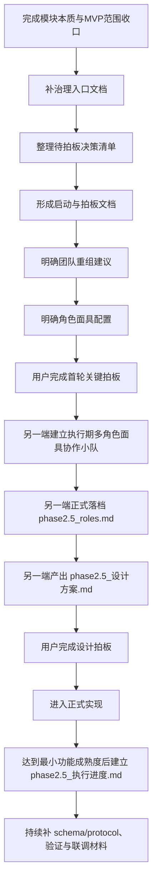

# Phase 2.5 工作流总览与协作导航

> **文档类型**：治理入口 / 协作导航文档  
> **适用模块**：`Phase 2.5` 整合验证与复盘模块  
> **归档位置**：`proj_004 / phase2_plan`  
> **状态**：模块本质与 `MVP Scope` 已补齐，治理入口现已建立；待依次补齐四份治理文档、完成设计前冻结拍板，再由另一端建立执行期多角色面具协作小队并接手方案设计  
> **最后更新**：2026-03-16

---

## 一、为什么这份文档要先补

当前 `2.5` 已经具备两份关键的实现侧前置文档：

- [PHASE2_5_FIRST_PRINCIPLES_AND_ROLE_ESSENCE.md](../phase2.5_implementation/docs/PHASE2_5_FIRST_PRINCIPLES_AND_ROLE_ESSENCE.md)
- [PHASE2_5_MVP_SCOPE_AND_ITERATION_ALIGNMENT.md](../phase2.5_implementation/docs/PHASE2_5_MVP_SCOPE_AND_ITERATION_ALIGNMENT.md)

这两份文档已经把 `2.5` 最关键的两层基础说清楚了：

- `2.5` 从第一性原理上到底是什么；
- `2.5` 当前 `MVP` 的合理边界在哪里；
- 哪些能力现在做，哪些能力后置。

但如果对齐 [phase2.2_工作流总览与协作导航.md](f:\AIProjects\DesignAssistant\data-layer\projects\proj_004\phase2_plan\phase2.2_工作流总览与协作导航.md) 与 [phase2.3_工作流总览与协作导航.md](f:\AIProjects\DesignAssistant\data-layer\projects\proj_004\phase2_plan\phase2.3_工作流总览与协作导航.md) 的治理节奏，可以看到当前还缺少另一层完全不同的文档体系：

- 工作流总览与协作导航
- 待拍板决策清单
- 启动与拍板
- 团队重组建议清单
- 角色面具配置方案
- 设计方案
- 执行进度

这些文档的功能，不是继续解释 `2.5` 的本质，也不是直接进入 `schema / protocol`，而是：

> **把当前阶段的正式口径、接手顺序、拍板门禁、双端分工与后续执行轨，收口成一条可交接、可回写、可持续推进的治理主路径。**

因此，这份文档要先补出来，原因不是因为 `2.5` 缺解释，而是因为：

- 另一端还没有一个统一入口来理解 `2.5` 当前到底进行到哪里；
- 这一端如果继续往下补材料，需要先把顺序与门禁写清楚，避免越过流程直接进入协议草案；
- 用户已经明确要求后续工作必须**符合 `2.2 / 2.3` 的工作流程**，不能擅自改环节；
- 后续四份治理文档、`roles` 文件、设计方案与实现推进，都需要一个上位导航页作为正式入口。

换句话说，`2.5` 当前最应该先做的，不是继续往下写协议，而是：

> **先把“这一端接下来要依次补什么、另一端何时接手、拍板发生在哪些位置、什么条件下才能进入实现”固定下来。**

---

## 二、这份文档在整个 `2.5` 工作流中的定位

这份文档应被视为：

- `2.5` 当前阶段的**治理入口**；
- 双端协作时给另一端的**接手说明页**；
- 后续治理文档与执行轨文档的**上位导航层**；
- 当前阶段“哪些已经明确、哪些即将推进、哪些必须拍板、哪些要交给另一端”的**单点概览**。

它不是：

- `2.5` 的第一性原理替代文档；
- `2.5` 的 `MVP Scope` 替代文档；
- `2.5` 的具体实现说明；
- `2.5` 的 `schema / protocol` 细化文档；
- 直接进入编码的任务拆解单。

也就是说，如果另一端要先问：

- `2.5` 现在到底怎么定义；
- 该先看哪些文档；
- 这一端接下来先补什么；
- 哪一步才轮到 `phase2.5_roles.md`；
- 什么阶段才能进入 `phase2.5_设计方案.md`；
- 什么时候才适合补 `schema / protocol` 和真实集成实现；

那么默认都应该先回到这份文档。

---

## 三、`Phase 2.5` 当前的正式定位

基于现有讨论与正式文档，`2.5` 当前已经形成的正式定位可以概括为：

> **`Phase 2.5` 的本质，不是整合测试收尾器，也不是案例包装与结项材料生成层，而是面向战略研究、项目孵化与生态投资工作流的“现实校验层 / 闭环学习层”。**

它的职责是：

> **把 `2.1 ~ 2.4` 形成的局部能力压入真实案例与真实流程中，验证整套系统的系统级有效性，识别关键失真点，并将这些结论转化为后续优化与阶段3规划的依据。**

这一定位意味着几项关键边界：

- `2.5` 不重做 `2.1 ~ 2.4` 的核心职责；
- `2.5` 不把“端到端能跑”误当成“系统已经可信”；
- `2.5` 不把真实案例当成包装材料，而是当成暴露系统边界的压力样本；
- `2.5` 当前最重要的不是“复盘文档写得多完整”，而是“系统复盘对象是否成立、是否能给出归因和阶段3优先级”；
- 多角色机制在当前阶段首先服务于**设计推进与职责覆盖**，而不是直接等同于运行时多 Agent 工程形态。

这一定义是后续治理文档、角色文件、设计方案与实现材料的共同前提。

---

## 四、当前已经具备的前置文档

截至当前阶段，`2.5` 已经具备三份关键前置材料。

### 4.1 模块本质定位文档

- [PHASE2_5_FIRST_PRINCIPLES_AND_ROLE_ESSENCE.md](../phase2.5_implementation/docs/PHASE2_5_FIRST_PRINCIPLES_AND_ROLE_ESSENCE.md)

这份文档主要回答：

- `2.5` 为什么存在；
- `2.5` 在整条链路里到底负责哪一级职责；
- `2.5` 应该做什么，不应该做什么；
- 为什么它更接近“现实校验层 / 闭环学习层”，而不是“整合测试收尾阶段”。

### 4.2 MVP 范围与后续迭代边界文档

- [PHASE2_5_MVP_SCOPE_AND_ITERATION_ALIGNMENT.md](../phase2.5_implementation/docs/PHASE2_5_MVP_SCOPE_AND_ITERATION_ALIGNMENT.md)

这份文档主要回答：

- 哪些内容应该进入当前 `2.5 MVP`；
- 哪些内容适合作为 `P1 / P2` 增强项；
- 为什么当前不应把复杂观测、全量统计、大规模案例池和自动归因平台一次性并进 `MVP`；
- 当前最合理的推进顺序是什么。

### 4.3 原始阶段目标文档

- [phase2.5_目标说明.md](./phase2.5_目标说明.md)

这份文档保留了 `2.5` 最初的任务表达、工作拆分和实现导向计划，是重要背景材料，但当前阶段不能再直接把它当作唯一正式口径。原因是：

- 它更偏“如何做系统集成、端到端测试、真实案例和复盘分析”；
- 它天然会把注意力放在输出物清单与工程排期上；
- 它还没有像新增文档那样，把 `2.5` 收口为“结构化系统复盘对象 + 现实校验最小闭环”。

因此，当前更准确的理解顺序应是：

- `phase2.5_目标说明.md`：原始计划背景；
- `PHASE2_5_FIRST_PRINCIPLES_AND_ROLE_ESSENCE.md`：模块本质校正；
- `PHASE2_5_MVP_SCOPE_AND_ITERATION_ALIGNMENT.md`：当前范围收口；
- 本文档：治理入口、协作顺序与交接导航。

---

## 五、另一端接手时应如何阅读

为了避免另一端一上来就直接进入协议、设计或实现，建议使用下面这套固定阅读顺序。

### 5.1 推荐阅读顺序

#### 第一层：先理解模块现在到底是什么

1. [PHASE2_5_FIRST_PRINCIPLES_AND_ROLE_ESSENCE.md](../phase2.5_implementation/docs/PHASE2_5_FIRST_PRINCIPLES_AND_ROLE_ESSENCE.md)
2. [PHASE2_5_MVP_SCOPE_AND_ITERATION_ALIGNMENT.md](../phase2.5_implementation/docs/PHASE2_5_MVP_SCOPE_AND_ITERATION_ALIGNMENT.md)

目标是先理解：

- `2.5` 的本体定义；
- 当前 `MVP` 要做什么；
- 当前不做什么；
- 为什么系统复盘对象、归因与阶段3优先级比直接补 `schema / protocol` 更需要先经过治理收口。

#### 第二层：再理解阶段背景与原始计划来源

3. [phase2.5_目标说明.md](./phase2.5_目标说明.md)

目标是理解：

- 原始规划为什么会写成“集成 + 测试 + 案例 + 复盘 + 阶段3”的形态；
- 当前新增文档是如何对其进行语义收口与范围纠偏的。

#### 第三层：最后进入治理与执行入口

4. 本文档 `phase2.5_工作流总览与协作导航.md`
5. 后续将依次补齐的治理文档：
   - `phase2.5_待拍板决策清单.md`
   - `phase2.5_启动与拍板.md`
   - `phase2.5_团队重组建议清单.md`
   - `phase2.5_角色面具配置方案.md`

目标是正式进入：

- 当前工作流；
- 待拍板事项；
- 双端分工；
- 团队组织与角色面具配置；
- 从治理进入设计与实现的顺序。

### 5.2 不建议的接手方式

当前阶段不建议另一端：

- 只看 [phase2.5_目标说明.md](./phase2.5_目标说明.md) 就直接开始设计或实现；
- 先补 `schema / protocol`，再回头补工作流与角色依据；
- 先做复杂观测、案例池、可视化看板，再回头定义系统复盘对象；
- 在用户未完成首轮拍板前，自行扩大 `2.5` 的当前范围；
- 把多角色协作直接等同为当前 `MVP` 运行时必须落地的多 Agent 系统。

---

## 六、`2.5` 当前的阶段判断

基于现有状态，`2.5` 当前更准确的阶段判断不是“进入协议草案阶段”，也不是“进入全面实现阶段”，而是：

> **进入“治理入口建立、设计前冻结待补齐、待另一端接手方案设计”的阶段。**

这句话很重要，因为它直接决定当前阶段的主要工作不是写代码，也不是直接补 `protocol / schema`，而是进入下面这条主路径：

- 先建立 `2.5` 的治理入口；
- 再依次补齐待拍板清单、启动与拍板、团队重组、角色面具配置；
- 由用户完成设计前冻结拍板；
- 再由另一端建立执行期多角色面具协作小队；
- 正式落档 `phase2.5_roles.md`；
- 产出 `phase2.5_设计方案.md`；
- 由用户完成**设计拍板**；
- 设计拍板通过后再进入正式实现；
- 进入正式实现后，再维护执行进度并逐步补 `schema / protocol`、验证与联调材料。

因此，`2.5` 当前阶段的工作重点应被定义为：

- **先治理入口，后治理文档；**
- **先拍板前冻结，后进入设计；**
- **先落 `roles` 与设计方案，后进入实现；**
- **`schema / protocol` 继续按正式设计收口与联调节奏推进。**

---

## 七、为什么 `2.5` 要沿用 `2.2 / 2.3` 的治理启动方式

从目前已有协作经验来看，`2.2 / 2.3` 的成熟之处，并不只是文档写得多，而在于：

- 模块边界先被说清楚；
- 模块本质先被说清楚；
- 用户拍板点先被整理清楚；
- 角色依据和执行顺序先被固定下来；
- 正式要求与探索性讨论被区分开；
- 另一端接手前已有稳定入口和执行轨。

这套方式对 `2.5` 同样重要，原因是 `2.5` 特别容易出现以下偏差：

- 名义上在做“整合验证”，实际上在做“收尾材料整理”；
- 名义上在做“闭环学习”，实际上过早跳进 `schema / protocol` 细节，导致上层口径还没冻结；
- 名义上想体现多角色协作，实际上没有角色文件、拍板门禁与正式接手路径；
- 名义上已经开始实现，实际上系统复盘对象、归因骨架与阶段3优先级口径仍未拍板。

因此，`2.5` 更应该沿用成熟的治理顺序：

也就是说，当前最稳的顺序不是“继续想功能”，也不是“直接写协议”，而是：

> **先把治理入口和四份治理文档补齐，让设计前冻结、角色依据与拍板门禁稳定下来；再由另一端建立执行期多角色面具协作小队、正式落档 `roles` 文件并产出设计方案；随后再做设计拍板，最后才进入正式实现。**

---

## 八、这一端与另一端的当前分工

结合双端协作规范，`2.5` 当前阶段建议保持如下分工。

### 8.1 这一端负责什么

这一端更适合继续承担：

- `2.5` 的宏观定位收口；
- `MVP Scope` 与后续迭代边界梳理；
- 工作流与治理文档搭建；
- 待拍板决策清单整理；
- 启动节奏、角色配置、团队重组建议；
- 方案设计前的上位判断与边界控制；
- 需要用户拍板的事项提炼与表达。

换句话说，这一端当前负责的是：

> **让 `2.5` 在正式进入设计和实现前，拥有稳定的上层框架、正式口径与协作轨道。**

### 8.2 另一端负责什么

另一端更适合在治理入口与设计前冻结完成后，承担：

- 基于拍板结论完成具体设计方案；
- 基于角色面具配置建立执行期 `roles` 文件；
- 细化系统复盘对象、处理流程与验证思路；
- 在适当时机再细化输入 / 输出契约；
- 选择技术方案并落地实现；
- 产出运行结果、验证报告和后续优化建议。

换句话说，另一端当前不应先负责重新定义 `2.5` 是什么，而应在已冻结的上层口径之上，承担：

> **把 `2.5` 的现实校验层做细、做实，并推进到可验证实现。**

### 8.3 当前阶段的协作边界

当前阶段要特别避免两种协作失衡：

- **这一端替另一端做过多实现前细节设计**，导致职责混乱；
- **另一端绕过治理入口直接扩张范围**，导致后续拍板失效。

因此当前最推荐的协作关系是：

- 这一端先搭好治理与导航；
- 用户先完成**设计前冻结拍板**；
- 另一端再基于正式口径进入执行期角色落档与方案设计；
- 用户再完成**设计拍板**；
- 只有设计拍板通过后，才进入正式实现。

---

## 九、当前最稳的推进顺序

基于现有状态，`2.5` 当前阶段最稳的推进顺序如下。

### 9.1 第一步：治理入口文档先建立

当前已完成：

- `phase2.5_工作流总览与协作导航.md`

它的作用是：

- 给另一端一个统一入口；
- 固定当前背景、结论、分工与步骤；
- 作为后续治理文档的上位导航页。

### 9.2 第二步：由这一端依次补齐四份治理文档

当前下一批需要补齐的治理文档为：

1. `phase2.5_待拍板决策清单.md`
2. `phase2.5_启动与拍板.md`
3. `phase2.5_团队重组建议清单.md`
4. `phase2.5_角色面具配置方案.md`

这四份文档分别承担：

- **待拍板决策清单**：把需要用户明确取舍的问题结构化；
- **启动与拍板**：定义正式执行轨、启动门槛、当前结论与拍板结果回写位置；
- **团队重组建议清单**：从组织层定义 `2.5` 必须覆盖哪些正式职责视角，以及这些职责为什么必须存在；
- **角色面具配置方案**：从执行层定义同一 Agent 下如何把正式职责转成可切换、可压缩、可协作的执行面具。

### 9.3 第三步：用户完成设计前冻结拍板

这一轮拍板的作用，不是审批某一份具体设计方案，而是确保下面这些内容不带分歧进入另一端的设计阶段：

- `2.5` 的主产物是**结构化系统复盘对象**，而不是长篇收尾报告；
- `2.5` 当前 `MVP` 采用**真实链路运行 → 输出检查 → 问题归因 → 阶段3优先级收口**的最小闭环；
- `2.5` 与 `2.1 ~ 2.4` 的当前协作边界不被越级改写；
- 多角色机制当前固定定位为：**设计阶段的方法论与正式 `roles` 落档依据，不与当前 `MVP` 的运行时工程形态绑定**；
- 当前首轮设计产物范围、验证粒度、案例规模、轻量人工复核与后续增强项边界不带分歧进入设计。

### 9.4 第四步：另一端建立执行期多角色面具协作小队，并正式落档 `phase2.5_roles.md`

完成设计前冻结拍板后，另一端的第一步不应是直接写 `phase2.5_设计方案.md`，而应先基于以下文档建立 `2.5` 的执行期多角色面具协作小队：

- [阶段2团队构建方案.md](./阶段2团队构建方案.md)
- `phase2.5_工作流总览与协作导航.md`
- `phase2.5_启动与拍板.md`
- `phase2.5_团队重组建议清单.md`
- `phase2.5_角色面具配置方案.md`
- `phase2_roles/phase2.3_roles.md`

这里的“建队”要明确理解为：

- 是**同一 Agent 下、服务于 `2.5` 执行期设计推进的多角色面具协作小队**；
- 不是多个独立 Agent 并行自治；
- 不是对当前 `MVP` 运行时系统形态的预设承诺；
- 目标是为后续 `2.5` 设计方案提供完整职责覆盖与讨论框架；
- 执行上可以压缩角色数量，但不能丢失关键职责视角。

在此基础上，另一端再在 `phase2_roles` 目录下正式落档：

- `phase2_roles/phase2.5_roles.md`

`phase2.5_roles.md` 至少应明确：

- `2.5` 当前采用的是同一 Agent 下、面向执行期设计推进的角色面具协作模式；
- 正式职责命名优先以 `phase2.5_团队重组建议清单.md` 为准；
- 执行压缩方式、调用顺序与面具映射优先以 `phase2.5_角色面具配置方案.md` 为准；
- 当前标准配置与压缩配置分别覆盖哪些职责视角；
- 每个角色 / 视角的职责边界、输入输出与非职责；
- 多角色如何共同产出 `phase2.5_设计方案.md`；
- 哪些事项必须先经过用户拍板，不能由执行端自行扩大范围。

### 9.5 第五步：另一端基于正式角色依据接手方案设计

在正式角色定义文件落档后，另一端再进入：

- `phase2.5_设计方案.md` 的正式编写；
- 系统复盘对象骨架与主流程细化；
- 多角色讨论下的关键步骤澄清；
- 轻量验证方案与真实案例策略设计；
- 与 `2.1 ~ 2.4` 联调事实基础上的输入消费收口。

这一阶段的重点，是把 `2.5` 做成稳定的“现实校验对象层 / 闭环学习对象层”，而不是先去卷复杂观测平台、长篇复盘模板或自动归因工程化。

### 9.6 第六步：用户完成设计拍板

在 `phase2.5_设计方案.md` 形成正式草案后，必须先做一次独立的设计拍板，再进入实现。**这次拍板不是对设计前冻结拍板的重复，而是针对正式设计方案本身的批准动作。** 该轮拍板至少应覆盖：

- 系统复盘对象主字段骨架是否冻结；
- 主流程与关键步骤是否同意按当前方案推进；
- 真实案例策略、人工复核与归因方法口径是否接受；
- 当前实现策略是否仍然停留在 `MVP` 边界内；
- 哪些开放问题允许带入实现，哪些必须在实现前关闭。

### 9.7 第七步：设计拍板后再进入正式实现

只有在设计层也完成关键取舍后，才建议正式进入：

- 代码实现；
- 样例运行；
- 契约冻结与实现侧回写；
- 联调与下一轮迭代。

### 9.8 第八步：进入正式实现后维护 `phase2.5_执行进度.md`

这一步是 `2.5` 同样值得显式补上的执行轨要求。

建议触发条件为：

- `phase2.5_设计方案.md` 已完成设计拍板；
- 至少一条最小链路已被正式进入实现：`真实链路运行 -> 输出检查 -> 问题归因 -> 阶段3优先级收口`；
- 另一端已经开始把设计转向可运行实现，或已经完成首轮样例运行。

一旦满足上述条件，应在 `phase2_plan` 下建立：

- `phase2.5_执行进度.md`

这份文档的作用不是复述设计方案，而是持续记录：

- 当前执行到哪一阶段；
- 哪些关键决策已冻结；
- 哪些问题正在阻塞；
- 哪些实现结果已跑通；
- 哪些内容仍需用户拍板；
- 何时进入联调、验证和回写。

### 9.9 第九步：在正式实现中逐步补 `schema / protocol`、验证与联调材料

只有在：

- 工作流已经稳定；
- 角色分工已经明确；
- 系统复盘对象骨架已经通过设计拍板；
- `2.1 ~ 2.4 -> 2.5` 的真实消费关系已经通过设计阶段澄清；

之后，才建议在正式实现中继续补：

- `2.5` 的输入 / 输出契约说明；
- `system retrospective schema`；
- `phase2.5_implementation/docs` 下的验证、联调与实现文档；
- 具体代码与样例输出。

这一步不应被前置到首轮拍板或设计拍板之前。

---

## 十、当前阶段默认采用的核心判断

为了防止另一端接手后仍沿旧路径理解 `2.5`，建议在当前阶段默认采用以下判断口径。

### 10.1 关于 `2.5 MVP`

当前 `2.5 MVP` 的中心应是：

> **结构化系统复盘对象 + 现实校验最小闭环**

而不是：

- 长篇复盘报告优先；
- 复杂观测平台优先；
- 大规模案例池优先。

### 10.2 关于角色面具

当前阶段的默认口径应是：

- **多角色机制是 `2.5` 当前设计阶段的固定工作方法；**
- **角色面具文件应先于实现细节正式落档；**
- **它的作用是通过不同职责视角产出更高质量的设计方案；**
- **是否把它进一步工程化为多 Agent 系统，属于后续实现策略问题，不作为当前 `2.5 MVP` 的前提判断。**

### 10.3 关于设计优先级

当前默认优先级建议为：

- **P0**：工作流、角色依据与拍板流程
- **P1**：真实链路运行 / 输出检查 / 问题归因 / 阶段3优先级的最小闭环
- **P2**：轻量真实案例验证与人工复核
- **P3**：简版复盘视图与轻量运行指标
- **P4**：复杂观测、规模化案例体系、多 Agent 增强

这里的含义是：**当前这一端先补的是 `P0` 所需治理材料；另一端产出的正式设计方案仍需用户再完成一次设计拍板，才能进入实现。**

---

## 十一、当前需要固定下来的文档工作流

为了让另一端接手时能够直接顺着文档进入工作，而不需要重新靠对话理解背景，建议把 `2.5` 当前阶段的文档工作流固定为下面这组关系。

### 11.1 治理层文档

- `phase2.5_工作流总览与协作导航.md`
- `phase2.5_待拍板决策清单.md`
- `phase2.5_启动与拍板.md`
- `phase2.5_团队重组建议清单.md`
- `phase2.5_角色面具配置方案.md`
- `phase2.5_设计方案.md`
- `phase2.5_执行进度.md`

### 11.2 模块定位与范围文档

- [PHASE2_5_FIRST_PRINCIPLES_AND_ROLE_ESSENCE.md](../phase2.5_implementation/docs/PHASE2_5_FIRST_PRINCIPLES_AND_ROLE_ESSENCE.md)
- [PHASE2_5_MVP_SCOPE_AND_ITERATION_ALIGNMENT.md](../phase2.5_implementation/docs/PHASE2_5_MVP_SCOPE_AND_ITERATION_ALIGNMENT.md)
- [phase2.5_目标说明.md](./phase2.5_目标说明.md)

### 11.3 执行角色定义文档

- `phase2_roles/phase2.5_roles.md`

目标是把团队重组建议和角色面具配置，正式转化为 `2.5` 设计推进期可直接使用的角色定义文件。

### 11.4 后续实现与联调文档

在当前治理阶段结束、设计前冻结拍板完成、另一端完成 `roles` 落档与设计拍板后，另一端应按顺序继续补以下产物：

- `phase2.5_implementation/docs` 下的输入 / 输出契约说明
- `system retrospective schema` 或等价 `schemas.py`
- Prompt / reasoning 设计说明
- 轻量真实案例验证方案
- case validation / benchmark 结果
- 联调记录与回写文档

也就是说，另一端正式接手后的核心产物链应至少形成：

- `phase2_roles/phase2.5_roles.md`
- `phase2.5_设计方案.md`
- **设计拍板结论回写**
- `phase2.5_执行进度.md`
- `phase2.5_implementation/docs` 下的契约、验证与联调材料

### 11.5 文档使用规则

- 模块定义与边界问题，优先看本质定位文档与 `MVP Scope` 文档；
- 当前该做什么、先看什么、由谁做什么，优先看本文档；
- 正式进入执行前，必须以 `启动与拍板` 文档中的正式结论为准；
- 对话中的临时想法，只有写回执行轨文档后，才视为正式要求。

---

## 十二、这一阶段需要另一端明确知道的事

如果这份文档是要给另一端直接阅读，那么当前最重要的是让另一端一开始就明确以下几点。

### 12.1 现在不是直接开写协议或实现的时候

当前阶段已经完成 `2.5` 的本质定位与 `MVP Scope` 收口，但仍没有到“可以跳过治理文档与拍板直接进入 `schema / protocol` 或正式实现”的阶段。

### 12.2 现在最重要的是先建立稳定启动条件

当前首要目标不是把功能做满，而是让 `2.5`：

- 有稳定定义；
- 有稳定边界；
- 有稳定工作流；
- 有稳定角色依据；
- 有明确设计前冻结拍板点；
- 有后续设计拍板与执行进度的回写位置。

### 12.3 当前后续顺序已经确定

即：

1. 治理入口文档先建立；
2. 再补待拍板清单、启动与拍板、团队重组、角色面具配置；
3. 用户完成**设计前冻结拍板**；
4. 另一端建立执行期多角色面具协作小队，并在 `phase2_roles` 下建立 `phase2.5_roles.md`；
5. 另一端基于正式角色依据建立 `phase2.5_设计方案.md`；
6. 用户完成**设计拍板**；
7. 再进入正式实现；
8. 进入正式实现后维护 `phase2.5_执行进度.md`；
9. 持续补 `schema / protocol`、验证与联调材料。

### 12.4 另一端接手后的最低执行清单

为了避免另一端只知道“要开始设计”，却不知道具体要先落哪些东西，当前应默认另一端接手后的最低执行清单为：

- 先依据 [阶段2团队构建方案.md](./阶段2团队构建方案.md)、本文档、`phase2.5_启动与拍板.md`、`phase2.5_团队重组建议清单.md`、`phase2.5_角色面具配置方案.md` 建立 `2.5` 的执行期多角色面具协作小队；
- 在 `phase2_roles` 目录下建立 `phase2.5_roles.md`，把角色协作模式、职责边界、压缩方案与设计产出路径正式落档；
- 由多角色面具讨论并收敛，在 `phase2_plan` 中建立 `phase2.5_设计方案.md`；
- 完成设计拍板结论回写；
- 在正式实现启动后建立 `phase2.5_执行进度.md`；
- 在 `phase2.5_implementation/docs` 中补输入 / 输出契约说明与 Schema 说明；
- 继续补 Prompt / reasoning 设计、轻量验证方案、案例结果与联调记录；
- 在实现期回写关键验证结论，保证治理链路和执行链路持续对齐。

---

## 十三、当前阶段的进入下一步条件

在这份文档完成后，`2.5` 进入下一步的条件应定义为：

### 13.1 文档条件

- `phase2.5_工作流总览与协作导航.md` 已完成；
- 当前阶段的关键背景和结论已有固定入口；
- 后续执行轨文档列表已明确。

### 13.2 治理条件

- `2.5` 的正式启动顺序已明确；
- 设计前冻结拍板与设计拍板的位置和作用已明确；
- 这一端与另一端的职责边界已明确；
- 另一端建立 `phase2.5_roles.md` 的依据链已明确。

### 13.3 拍板条件

在正式进入实现前，需要满足两次关键拍板中的不同门禁：

- **第一轮：设计前冻结拍板待完成**，用于确保模块边界、主产物、`MVP` 闭环、多角色定位与首轮设计范围不带分歧进入正式设计；
- **第二轮：设计拍板待完成**，用于确保正式设计方案、主流程、对象骨架与实现策略不带分歧进入正式实现。

也就是说：**当前本质定位、`MVP Scope` 与治理入口条件已具备；下一步应由这一端继续补齐四份治理文档，并在设计前冻结拍板完成后，再进入另一端的角色落档与方案设计。**

---

## 十四、当前阶段的一句话结论

如果要把这份文档压缩成一句最重要的话，可以写成：

> **`Phase 2.5` 当前不是协议草案阶段，也不是直接实现阶段，而是“治理入口已建立、设计前冻结待补齐、待另一端接手方案设计”的阶段；当前最稳的推进方式，是先由这一端补齐治理文档并完成设计前冻结拍板，再让另一端落 `roles` 文件与设计方案，随后做设计拍板，最后才进入正式实现。**

---

## 十五、下一步动作

基于当前顺序，本文档完成后的直接下一步应为：

1. 由这一端补 `phase2.5_待拍板决策清单.md`
2. 再补 `phase2.5_启动与拍板.md`
3. 再补 `phase2.5_团队重组建议清单.md`
4. 再补 `phase2.5_角色面具配置方案.md`
5. 完成设计前冻结拍板
6. 再让另一端建立 `phase2_roles/phase2.5_roles.md`
7. 由另一端产出 `phase2.5_设计方案.md`
8. 完成设计拍板
9. 再进入正式实现与后续 `schema / protocol`、验证、联调材料补齐

---

**文档状态**：✅ 已建立  
**版本**：v0.1 Draft  
**建议下次更新时机**：当 `phase2.5_待拍板决策清单.md` 开始落档，或进入设计前冻结拍板前