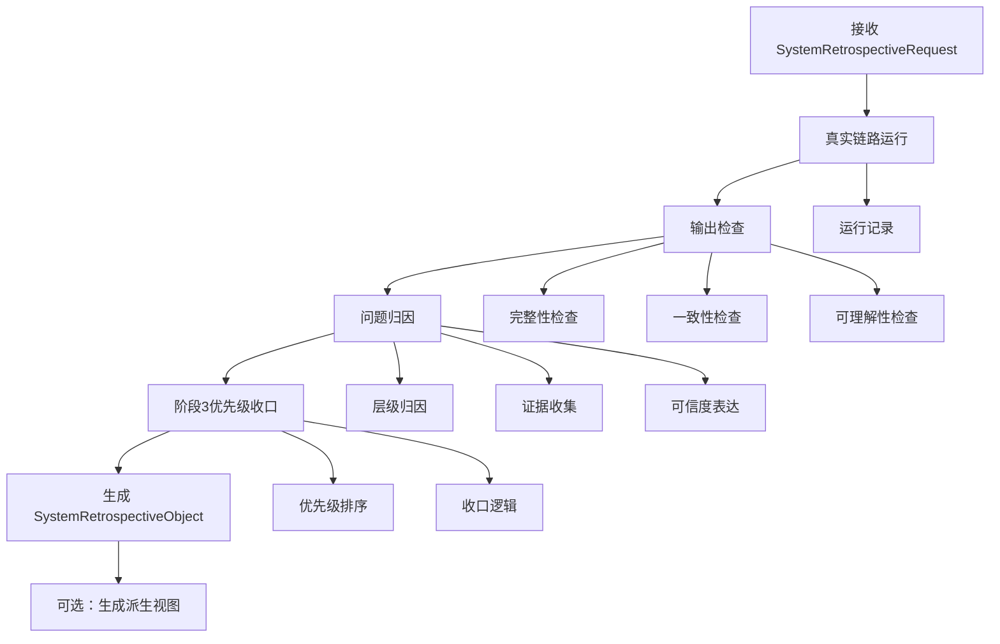

# Phase 2.5 设计方案

> **文档类型**：设计方案文档
> **适用模块**：Phase 2.5 整合验证与复盘模块
> **状态**：设计草案，待设计拍板
> **最后更新**：2026-03-16

---

## 一、设计目标与非目标

### 1.1 设计目标

Phase 2.5 的设计目标是建立一个**现实校验层 / 闭环学习层**，而不是简单的整合测试收尾器或长篇复盘报告生成器。

**核心目标**：
1. **验证系统级有效性**：把 `2.1 ~ 2.4` 的局部能力压入真实案例与真实流程中，验证整套系统的系统级有效性
2. **识别关键失真点**：通过真实链路运行，识别系统在现实条件下的关键失真点
3. **产出结构化系统复盘对象**：输出可归因、可回写、可用于阶段3优先级收口的结构化系统复盘对象
4. **形成闭环学习能力**：把验证结果转化为后续优化与阶段3规划的依据，形成组织级学习闭环

**具体目标**：
- 打通"真实链路运行 → 输出检查 → 问题归因 → 阶段3优先级收口"的最小闭环
- 在少量真实案例上完成现实压力测试
- 产出稳定的 `SystemRetrospectiveObject` 作为主产物
- 把关键发现组织成层级化归因结构
- 把归因结果转化为阶段3可消费的优先级项

### 1.2 非目标

**明确不做的事情**：
- ❌ 不做整合测试收尾器：`2.5` 不是简单的"把模块串起来跑一遍"
- ❌ 不做长篇复盘报告生成器：主产物是结构化对象，不是长篇文本
- ❌ 不做案例包装展示层：真实案例的首要任务是暴露问题，不是证明系统多厉害
- ❌ 不回卷重做 `2.1 ~ 2.4`：如果发现上游问题，优先暴露、记录、归因，而不是在 `2.5` 内直接吞掉
- ❌ 不把"能跑通"等同于"系统可信"：流程能执行不等于系统已经可依赖
- ❌ 不做复杂观测平台（当前 MVP）：完整监控平台、大规模案例池、自动归因平台属于后续增强项

### 1.3 与 2.1 ~ 2.4、阶段3 的边界关系

**与 2.1 ~ 2.4 的关系**：
- `2.5` **消费**上游输出，但**不重做**其核心逻辑
- `2.5` **验证**系统级效果，但**不替代**上游职责
- `2.5` **暴露**上游问题，但**不在本层吞掉**问题

**与阶段3的关系**：
- `2.5` 是阶段3的**直接入口**，不是附带输出
- `2.5` 的优先级收口是阶段3规划的**自然延伸**
- `2.5` 的验证结果直接影响阶段3的**决策质量**

**边界原则**：
- `2.1` = 信号级对象形成
- `2.2` = 机会级判断
- `2.3` = 行动级判断 / 资源承诺设计
- `2.4` = 上下文与支撑能力层
- `2.5` = 现实校验与闭环归因
- 阶段3 = 基于 `2.5` 输出的系统优化与能力扩张

---

## 二、核心设计理念

### 2.1 为什么是"结构化系统复盘对象"

**设计理念**：
`2.5` 的主产物必须是**结构化对象**，而不是长篇复盘文本。

**原因**：
1. **可编程消费**：结构化对象可以被阶段3、后续联调、自动化工具稳定消费
2. **可归因追溯**：对象化表达支持层级化归因、证据链追溯
3. **可演进扩展**：对象骨架稳定后，可以逐步增强字段，而不是重写整篇报告
4. **可对比分析**：多次复盘对象可以进行结构化对比，识别系统演进趋势

**复盘报告的定位**：
- 复盘报告是 `SystemRetrospectiveObject` 的**派生视图**
- 用于人类阅读、团队沟通、项目汇报
- 不是 `2.5` 的唯一主产物

### 2.2 为什么是"现实校验最小闭环"

**设计理念**：
`2.5` 的核心不是"把系统跑通"，而是"验证系统是否可信"。

**最小闭环定义**：
```
真实链路运行 → 输出检查 → 问题归因 → 阶段3优先级收口
```

**为什么是这四步**：
1. **真实链路运行**：不是 mock 数据，而是真实案例压力测试
2. **输出检查**：不只看"有没有生成"，而要看完整性、一致性、可理解性
3. **问题归因**：不只列现象，而要尝试归到层级（信号/机会/行动/编排/验证）
4. **阶段3优先级收口**：不只说"后续优化"，而要形成可排序的收口项

### 2.3 设计取舍的核心原则

**原则1：对象稳定性优先于表达丰富性**
- 先冻结 `SystemRetrospectiveObject` 的核心字段
- 再考虑派生视图、可读报告、统计分析

**原则2：归因质量优先于问题数量**
- 宁可少量高质量归因，不要大量泛化描述
- 明确表达不确定性，不过度自信

**原则3：现实压力测试优先于案例规模**
- 少量高价值样本，优先暴露系统边界
- 不追求案例数量，追求失真点识别

**原则4：可拍板性优先于理论完美性**
- 设计方案要能让用户明确判断"可以推进 / 需要返工"
- 不追求学术完整性，追求工程可执行性

**原则5：MVP 闭环优先于增强能力**
- 先证明最小闭环成立
- 再决定哪些增强值得进入后续迭代

---

## 三、主流程设计

### 3.1 主流程概览



### 3.2 真实链路运行

**输入**：
- `SystemRetrospectiveRequest`
  - `request_id`: 本次复盘请求唯一ID
  - `case_id`: 真实案例唯一ID
  - `workflow_run_record`: 真实链路运行记录
  - `upstream_outputs`: `2.1 ~ 2.4` 的关键输出
  - `review_notes`: 轻量人工复核记录（可选）
  - `validation_mode`: 验证模式（默认 `mvp_single_case`）

**处理逻辑**：
1. 加载真实案例上下文
2. 串起 `2.1 → 2.2 → 2.3` 主链路
3. 接入 `2.4` 的上下文支撑
4. 保留中间对象、运行证据和关键产出
5. 记录运行时长、错误、重试等信息

**输出**：
- 完整的 `workflow_run_record`
- 各模块的中间输出对象
- 运行日志与异常记录

### 3.3 输出检查

**检查维度**：

#### A. 完整性检查
- 是否所有必需字段都已生成
- 是否存在明显的信息缺失
- 是否符合模板结构要求

#### B. 一致性检查
- 结论与证据是否一致
- 不同模块输出之间是否存在矛盾
- 行动建议与机会判断是否对齐

#### C. 可理解性检查
- 输出是否可被人类理解
- 关键判断是否有足够解释
- 建议是否具备可执行性

**输出**：
- `output_checks` 数组，每项包含：
  - `check_type`: 检查类型（completeness / consistency / understandability）
  - `status`: 检查状态（pass / warning / fail）
  - `details`: 检查详情
  - `evidence`: 支撑证据

### 3.4 问题归因

**归因层级**：
- `signal`: 信号级问题（`2.1` 相关）
- `opportunity`: 机会级问题（`2.2` 相关）
- `action`: 行动级问题（`2.3` 相关）
- `context`: 上下文问题（`2.4` 相关）
- `orchestration`: 编排级问题（模块协作、接口、流程）
- `validation`: 验证级问题（`2.5` 自身验证逻辑）

**归因流程**：
1. 识别关键发现（`critical_findings`）
2. 收集支撑证据
3. 尝试归因到具体层级
4. 表达归因可信度与限制条件
5. 区分"确定性归因"与"怀疑性归因"

**输出**：
- `critical_findings` 数组
- `suspected_root_causes` 数组
- `confidence_notes` 说明

### 3.5 阶段3优先级收口

**收口逻辑**：
1. 从 `critical_findings` 中筛选高影响问题
2. 基于 `suspected_root_causes` 判断修复杠杆
3. 考虑问题频率、严重度、系统级影响
4. 形成可排序的优先级项

**优先级项结构**：
- `priority_id`: 优先级项ID
- `title`: 优先级标题
- `reason`: 收口原因（对应关键发现与归因）
- `scope`: 作用范围（模块级 / 系统级）
- `suggested_order`: 建议顺序

**输出**：
- `phase3_priorities` 数组
- 优先级排序建议
- 后续优化方向提示

---

## 四、SystemRetrospectiveObject 设计

### 4.1 对象骨架

```typescript
interface SystemRetrospectiveObject {
  // 基础信息
  retrospective_id: string;
  case_id: string;
  retrospective_version: string;
  processing_time_ms: number;

  // 核心内容
  workflow_summary: string;
  output_checks: OutputCheck[];
  critical_findings: CriticalFinding[];
  suspected_root_causes: RootCause[];
  phase3_priorities: Phase3PriorityItem[];

  // 辅助信息
  confidence_notes: string[];
  warnings: string[];
}
```

### 4.2 核心字段设计理由

#### workflow_summary
**作用**：一句话说明本次真实链路跑了什么、产出了什么
**设计理由**：提供快速上下文，避免每次都要深入细节才能理解复盘对象

#### output_checks
**作用**：结构化记录输出检查结果
**设计理由**：
- 不只说"有问题"，而要说"哪个维度有问题"
- 支持后续自动化检查与趋势分析

#### critical_findings
**作用**：记录关键发现（现象层）
**设计理由**：
- 与 `suspected_root_causes` 分离，避免现象和归因混写
- 支持"先记录现象，再尝试归因"的渐进式分析

#### suspected_root_causes
**作用**：记录初步归因（解释层）
**设计理由**：
- 明确表达"怀疑"而非"确定"
- 支持可信度表达与证据链追溯

#### phase3_priorities
**作用**：从复盘对象中长出阶段3优先级
**设计理由**：
- 不是外贴结论，而是从归因自然导出
- 支持阶段3直接消费

#### confidence_notes
**作用**：说明复盘对象的可信度与限制条件
**设计理由**：
- 避免过度自信
- 明确哪些结论是基于充分证据，哪些是基于有限观察

#### warnings
**作用**：记录风险或异常提示
**设计理由**：
- 如"证据不足""人工复核缺失""样本规模过小"
- 帮助后续判断复盘对象的使用边界

---

## 五、CriticalFinding 设计

### 5.1 字段结构

```typescript
interface CriticalFinding {
  finding_id: string;
  summary: string;
  severity: 'high' | 'medium' | 'low';
  layer: 'signal' | 'opportunity' | 'action' | 'context' | 'orchestration' | 'validation';
  evidence: string[];
  impact: string;
}
```

### 5.2 如何表达严重级别

**严重级别定义**：
- `high`: 严重影响系统可用性或输出质量，必须优先修复
- `medium`: 明显影响用户体验或部分场景失效，应尽快修复
- `low`: 轻微问题或边缘场景，可后续优化

**判断依据**：
- 影响范围（单个案例 / 多个案例 / 系统级）
- 失效频率（偶发 / 频繁 / 必现）
- 后果严重性（信息缺失 / 结论错误 / 系统不可用）

### 5.3 如何表达层级

**层级映射**：
- `signal`: 信号提取、解析、结构化问题
- `opportunity`: 机会判断、证据组织、假设验证问题
- `action`: 行动设计、资源承诺、路径规划问题
- `context`: 上下文检索、知识供给、证据支撑问题
- `orchestration`: 模块协作、接口对齐、流程编排问题
- `validation`: 验证逻辑、检查口径、复盘方法问题

**归因原则**：
- 优先归到最直接的层级
- 如果跨层级，选择影响最大的层级
- 如果不确定，归到 `orchestration`

### 5.4 如何组织证据

**证据类型**：
- 输出片段：直接引用输出中的问题片段
- 运行日志：引用错误日志、异常记录
- 人工复核：引用人工复核中的观察
- 对比结果：与预期输出或历史结果的对比

**证据原则**：
- 至少一项证据
- 证据应具体、可追溯
- 避免泛化描述

### 5.5 如何表达影响

**影响描述**：
- 对当前案例的影响
- 对系统整体的影响
- 对后续阶段的影响

**表达原则**：
- 具体而非抽象
- 可量化尽量量化
- 说明为什么值得进入优先级

---

## 六、问题归因设计

### 6.1 归因如何分层

**分层逻辑**：
```
现象层（CriticalFinding）
  ↓
归因层（SuspectedRootCause）
  ↓
优先级层（Phase3PriorityItem）
```

**分层原则**：
- 现象与归因分离
- 归因与优先级分离
- 每层都有独立的表达结构

### 6.2 如何表达不确定性与可信度

**可信度等级**：
- `high_confidence`: 有充分证据支持，归因基本确定
- `medium_confidence`: 有部分证据支持，归因较为合理
- `low_confidence`: 证据不足，归因仅为怀疑

**不确定性表达**：
- 在 `suspected_root_causes` 中明确标注可信度
- 在 `confidence_notes` 中说明限制条件
- 在 `warnings` 中提示证据不足的情况

**表达示例**：
```json
{
  "suspected_root_cause": "信号提取阶段可能遗漏了关键时间信息",
  "confidence": "medium_confidence",
  "reasoning": "输出中缺少时间维度，但无法确定是提取遗漏还是原始材料本身缺失",
  "evidence": ["输出对象中 temporal_context 字段为空"],
  "limitations": ["未获取原始输入材料，无法对比验证"]
}
```

### 6.3 如何避免现象和归因混写

**区分原则**：
- `CriticalFinding` 只记录**观察到的现象**
- `SuspectedRootCause` 才记录**对原因的推测**

**错误示例**（混写）：
```json
{
  "finding": "因为信号提取有问题，所以输出不完整"
}
```

**正确示例**（分离）：
```json
{
  "critical_finding": {
    "summary": "输出中缺少时间维度信息",
    "evidence": ["temporal_context 字段为空"]
  },
  "suspected_root_cause": {
    "cause": "信号提取阶段可能遗漏了时间信息",
    "confidence": "medium_confidence"
  }
}
```

---

## 七、阶段3优先级设计

### 7.1 如何从复盘对象中长出来

**生成逻辑**：
```
CriticalFinding (现象)
  + SuspectedRootCause (归因)
  + 严重度 + 影响范围 + 修复杠杆
  ↓
Phase3PriorityItem (优先级)
```

**不是外贴结论**：
- 优先级项必须能追溯到具体的 `finding_id` 和 `cause_id`
- 优先级排序必须基于明确的判断依据
- 不能凭空产生"后续应该优化XX"的结论

### 7.2 Phase3PriorityItem 结构

```typescript
interface Phase3PriorityItem {
  priority_id: string;
  title: string;
  reason: string;  // 对应哪个 finding 和 cause
  scope: 'module' | 'system' | 'workflow';
  suggested_order: number;
  expected_impact: string;
  related_findings: string[];  // finding_id 列表
}
```

### 7.3 排序逻辑

**排序依据**：
1. **严重度**：high > medium > low
2. **影响范围**：system > workflow > module
3. **修复杠杆**：一次修复解决多个问题 > 单点修复
4. **依赖关系**：基础问题 > 衍生问题

**排序原则**：
- 不追求绝对精确的排序
- 给出合理的优先级分组
- 明确说明排序理由

---

## 八、轻量人工复核设计

### 8.1 如何进入当前 MVP

**定位**：
轻量人工复核是 `2.5 MVP` 的**辅助增强项**，不是硬前提，但建议保留。

**进入时机**：
- 在真实链路运行完成后
- 在自动输出检查完成后
- 在问题归因之前或同时

**复核重点**：
1. **输出完整性**：是否所有必需字段都已生成
2. **证据一致性**：结论与证据是否一致
3. **建议可理解性**：行动建议是否可被人类理解和执行
4. **整体可信度感知**：从人类视角判断系统输出是否可信

### 8.2 不做重型评分体系

**当前不做**：
- ❌ 复杂的全量人工评分矩阵
- ❌ 多维度细粒度打分
- ❌ 多人交叉评审
- ❌ 标准化评分流程

**当前只做**：
- ✅ 轻量人工走读
- ✅ 关键问题标注
- ✅ 可信度感知记录
- ✅ 明显错误识别

**记录方式**：
```json
{
  "review_notes": [
    {
      "reviewer": "human_reviewer_01",
      "timestamp": "2026-03-16T12:00:00Z",
      "observations": [
        "输出完整性良好",
        "发现时间维度信息缺失",
        "行动建议可理解但缺少具体时间节点"
      ],
      "confidence_level": "medium",
      "major_concerns": ["时间维度缺失"]
    }
  ]
}
```

---

## 九、首轮真实案例策略

### 9.1 案例选择原则

**核心原则**：
少量高价值样本，优先暴露系统边界与关键失真点。

**选择标准**：
1. **代表性**：能代表典型工作场景
2. **压力性**：能暴露系统在真实条件下的问题
3. **可追溯性**：有足够上下文支持后续归因
4. **多样性**：覆盖不同材料质量或不同失真风险

**首轮规模**：
- 建议 2-4 个真实案例
- 不追求数量，追求质量
- 优先选择"能暴露问题"的案例，而非"容易成功"的案例

### 9.2 验证方案

**验证维度**：
1. **端到端可运行性**：系统能否完整跑通
2. **输出质量**：输出是否符合预期
3. **归因有效性**：能否识别关键问题并归因
4. **优先级合理性**：阶段3优先级是否可执行

**验证方法**：
- 自动检查 + 人工走读
- 对比预期输出（如果有）
- 识别明显失真点
- 记录典型失败模式

**成功标准**：
- 不是"所有案例都成功"
- 而是"能识别关键失真点并形成可回写的归因"

### 9.3 失真点识别策略

**关注重点**：
1. **信息损耗**：从 `2.1` 到 `2.3` 的信息是否有明显损耗
2. **判断偏差**：机会判断、行动设计是否存在明显偏差
3. **协作失效**：模块之间是否存在协作失效
4. **输出质量**：最终输出是否达到可用标准

**识别方法**：
- 对比输入与输出
- 检查中间对象
- 分析运行日志
- 人工复核感知

---

## 十、当前 MVP 先做什么、明确不做什么

### 10.1 MVP 必做清单

**P0：输入输出契约**
- [ ] 定义 `SystemRetrospectiveRequest` 最小字段
- [ ] 定义 `SystemRetrospectiveObject` 最小字段
- [ ] 定义 `CriticalFinding` 结构
- [ ] 定义 `Phase3PriorityItem` 结构
- [ ] 冻结核心字段，标注可选字段

**P0：最小闭环实现**
- [ ] 实现真实链路运行（`2.1 → 2.2 → 2.3` + `2.4` 支撑）
- [ ] 实现输出检查（完整性、一致性、可理解性）
- [ ] 实现问题归因（层级化、证据收集、可信度表达）
- [ ] 实现阶段3优先级收口（从归因导出优先级）

**P1：轻量验证**
- [ ] 选择 2-4 个真实案例
- [ ] 完成首轮真实链路运行
- [ ] 保留轻量人工复核
- [ ] 识别关键失真点

**P1：基础文档**
- [ ] 产出至少 1 份完整的 `SystemRetrospectiveObject` 示例
- [ ] 产出轻量复盘摘要（派生视图）
- [ ] 记录典型失败模式

### 10.2 明确不做清单

**当前 MVP 不做**：
- ❌ 复杂观测平台
- ❌ 大规模案例池（> 10 个案例）
- ❌ 完整统计分析体系
- ❌ 自动归因平台
- ❌ 多 Agent 运行时系统（作为 MVP 硬前提）
- ❌ 完整质量看板
- ❌ 重型人工评分体系
- ❌ 在 `2.5` 内重做 `2.1 ~ 2.4` 的核心逻辑

**后续增强方向**（P2/P3）：
- 更完整的指标体系
- 更系统的回归样本库
- 更细的成本 / 时间 / 质量追踪
- 更成熟的可视化管理视图
- 更自动化的问题聚类与归因辅助
- 多 Agent 协同分析机制（如果收益明确）

---

## 十一、契约字段冻结策略

### 11.1 哪些字段现在冻结

**必须冻结的核心字段**：

#### SystemRetrospectiveRequest
- `request_id` ✅
- `case_id` ✅
- `workflow_run_record` ✅
- `upstream_outputs` ✅

#### SystemRetrospectiveObject
- `retrospective_id` ✅
- `case_id` ✅
- `workflow_summary` ✅
- `output_checks` ✅
- `critical_findings` ✅
- `suspected_root_causes` ✅
- `phase3_priorities` ✅
- `confidence_notes` ✅
- `retrospective_version` ✅
- `processing_time_ms` ✅

#### CriticalFinding
- `finding_id` ✅
- `summary` ✅
- `severity` ✅
- `layer` ✅
- `evidence` ✅
- `impact` ✅

#### Phase3PriorityItem
- `priority_id` ✅
- `title` ✅
- `reason` ✅
- `scope` ✅
- `suggested_order` ✅

### 11.2 哪些字段实现期细化

**可在实现期细化的字段**：

#### SystemRetrospectiveRequest
- `review_notes`（可选，结构可细化）
- `validation_mode`（可选，枚举值可扩展）
- `constraints`（可选，结构可细化）

#### SystemRetrospectiveObject
- `warnings`（可选，内容可细化）
- 未来可能增加的辅助字段（如 `metrics`、`assets_to_keep` 等）

#### CriticalFinding
- 未来可能增加的辅助字段（如 `frequency`、`affected_cases` 等）

#### Phase3PriorityItem
- `expected_impact`（可选，可在实现期细化）
- `related_findings`（可选，可在实现期细化）

### 11.3 冻结理由

**为什么现在冻结核心字段**：
1. **设计拍板需要**：用户需要明确知道主产物长什么样
2. **实现依据需要**：实现团队需要稳定的契约
3. **阶段3消费需要**：阶段3需要知道能消费什么

**为什么部分字段可后置**：
1. **不影响主流程**：这些字段是辅助增强项
2. **需要实践验证**：需要在实现中验证是否真的需要
3. **避免过早设计**：避免设计过多未经验证的字段

---

## 十二、当前仍待设计拍板的问题

### 12.1 必须拍板的问题

**问题1：SystemRetrospectiveObject 的核心字段是否冻结？**
- 可选方案：A. 按当前设计冻结；B. 再补少量字段后冻结；C. 继续开放
- 推荐方案：**A**
- 拍板理由：当前字段已覆盖核心需求，过早扩展会增加实现复杂度

**问题2：问题归因的层级定义是否冻结？**
- 可选方案：A. 按当前 6 层定义冻结；B. 调整后冻结；C. 实现期再定
- 推荐方案：**A**
- 拍板理由：当前层级定义已覆盖主要归因场景

**问题3：阶段3优先级的排序逻辑是否接受？**
- 可选方案：A. 按当前设计进入实现；B. 微调后进入实现；C. 退回重做
- 推荐方案：**A**
- 拍板理由：当前排序逻辑合理，可在实践中验证和调整

**问题4：首轮真实案例的数量是否确定？**
- 可选方案：A. 2-4 个；B. 5-10 个；C. 实现期再定
- 推荐方案：**A**
- 拍板理由：少量高价值样本足以验证最小闭环

**问题5：轻量人工复核的方式是否接受？**
- 可选方案：A. 按当前轻量方式；B. 增加评分维度；C. 完全不做
- 推荐方案：**A**
- 拍板理由：轻量方式平衡了质量把关与实现成本

### 12.2 可后置拍板的问题

**问题1：是否需要更完整的指标体系？**
- 建议时机：首轮验证完成后
- 触发条件：发现轻量记录不足以支撑归因

**问题2：是否需要引入多 Agent 协同分析？**
- 建议时机：`2.5 MVP` 闭环跑通后
- 触发条件：发现单 Agent 归因质量不足

**问题3：是否需要建立大规模案例池？**
- 建议时机：首轮真实案例验证后
- 触发条件：发现少量样本不足以支持模式总结

---

## 十三、设计取舍说明

### 13.1 为什么主产物是对象而非报告

**取舍**：
- 选择：结构化系统复盘对象
- 放弃：长篇复盘报告作为主产物

**理由**：
1. **可编程消费**：对象可被阶段3、自动化工具稳定消费
2. **可演进扩展**：对象骨架稳定后可逐步增强
3. **可对比分析**：多次复盘对象可进行结构化对比
4. **报告可派生**：报告可从对象自动生成，反之不行

### 13.2 为什么归因分层而非扁平

**取舍**：
- 选择：层级化归因（signal / opportunity / action / context / orchestration / validation）
- 放弃：扁平化问题列表

**理由**：
1. **可回写性**：层级归因可直接映射到上游模块
2. **可优先级化**：不同层级的问题有不同的修复杠杆
3. **可追溯性**：层级归因支持证据链追溯
4. **可演进性**：层级结构支持后续细化

### 13.3 为什么少量案例而非大规模

**取舍**：
- 选择：2-4 个高价值真实案例
- 放弃：大规模案例池（首轮）

**理由**：
1. **MVP 聚焦**：先证明最小闭环成立
2. **失真识别**：少量案例足以暴露关键问题
3. **实现成本**：大规模案例需要更多基础设施
4. **可扩展性**：验证通过后可逐步扩展

### 13.4 为什么轻量人工复核而非重型评分

**取舍**：
- 选择：轻量人工走读 + 关键问题标注
- 放弃：复杂的全量人工评分矩阵

**理由**：
1. **成本可控**：轻量方式不需要大量人力
2. **质量保障**：足以识别明显问题
3. **可演进性**：后续可根据需要增强
4. **避免过度设计**：当前阶段不需要重型体系

---

## 十四、验证口径

### 14.1 如何判断设计方案是否可推进

**判断标准**：
1. **边界清晰**：`2.5` 与 `2.1 ~ 2.4`、阶段3 的边界是否清晰
2. **对象稳定**：`SystemRetrospectiveObject` 的核心字段是否稳定
3. **流程完整**：最小闭环的四个步骤是否完整
4. **可实现性**：当前设计是否可在合理时间内实现
5. **可验证性**：是否有明确的验收标准

**推进条件**：
- ✅ 用户完成设计拍板
- ✅ 核心字段冻结
- ✅ 主流程设计收敛
- ✅ 验证策略明确

### 14.2 如何判断实现是否成功

**成功标准**：
1. **功能层**：输出 Schema 合法率 = 100%
2. **质量层**：关键发现可解释且可追溯
3. **质量层**：初步归因基本合理
4. **质量层**：阶段3优先级可执行
5. **协作层**：人类可基于输出进行拍板讨论
6. **闭环层**：可定位到模块或流程层
7. **展示层**：至少 1-2 条完整案例
8. **工程层**：MVP 主字段冻结

**验证方法**：
- 自动检查：Schema 合法性、字段完整性
- 人工走读：可解释性、可理解性、可拍板性
- 案例验证：真实案例是否能跑通并产出有效复盘对象

---

## 十五、下一步行动

### 15.1 设计拍板前

**当前阶段**：
- ✅ `phase2.5_roles.md` 已完成
- ✅ `phase2.5_设计方案.md` 已完成
- ⏳ 等待用户设计拍板

**待拍板事项**：
1. SystemRetrospectiveObject 的核心字段是否冻结
2. 问题归因的层级定义是否冻结
3. 阶段3优先级的排序逻辑是否接受
4. 首轮真实案例的数量是否确定
5. 轻量人工复核的方式是否接受

### 15.2 设计拍板后

**立即行动**：
1. 建立 `phase2.5_执行进度.md`
2. 开始实现最小闭环
3. 细化输入输出 Schema
4. 选择首轮真实案例

**实现顺序**：
1. 定义并冻结 Schema
2. 实现真实链路运行
3. 实现输出检查
4. 实现问题归因
5. 实现阶段3优先级收口
6. 完成首轮案例验证
7. 产出示例复盘对象
8. 回写验证结论

---

## 十六、设计方案总结

### 16.1 核心设计决策

1. **主产物**：结构化系统复盘对象（`SystemRetrospectiveObject`）
2. **最小闭环**：真实链路运行 → 输出检查 → 问题归因 → 阶段3优先级收口
3. **归因方式**：层级化归因（6 层）+ 证据收集 + 可信度表达
4. **验证策略**：2-4 个真实案例 + 轻量人工复核
5. **边界原则**：消费上游输出，不重做其核心逻辑

### 16.2 关键设计取舍

1. **对象 vs 报告**：选择对象，报告作为派生视图
2. **层级 vs 扁平**：选择层级化归因，支持可回写性
3. **少量 vs 大规模**：选择少量高价值案例，优先暴露问题
4. **轻量 vs 重型**：选择轻量人工复核，平衡质量与成本
5. **MVP vs 完整**：选择最小闭环，后续增强

### 16.3 设计方案的价值

**对用户的价值**：
- 明确知道 `2.5` 要产出什么
- 明确知道如何判断 `2.5` 是否成功
- 明确知道哪些是 MVP，哪些是后续增强

**对实现团队的价值**：
- 有稳定的输入输出契约
- 有清晰的主流程设计
- 有明确的验收标准

**对阶段3的价值**：
- 有可消费的结构化对象
- 有可执行的优先级项
- 有可追溯的归因结构

**对项目的价值**：
- 体现"现实校验层 / 闭环学习层"的设计能力
- 体现结构化系统复盘的工程实践
- 体现可讲述的设计取舍与边界判断

---

**文档状态**：✅ 设计草案已完成，待设计拍板
**版本**：v0.1 Draft
**建议下次更新时机**：设计拍板完成后，根据拍板结论更新设计方案
