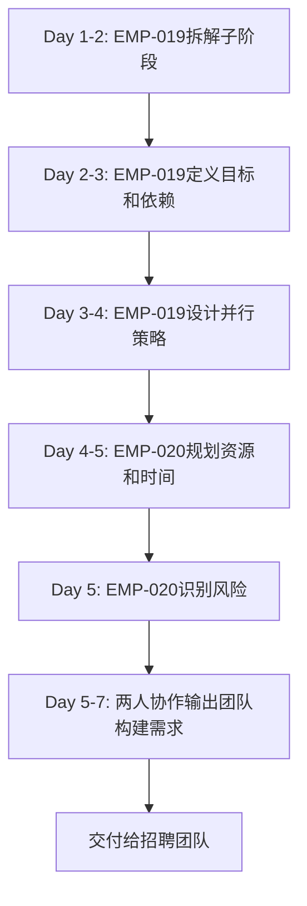

# 阶段2.0团队角色定义

> **制定者**：招聘团队（基于阶段1输出）
> **制定时间**：2026-03-12
> **适用阶段**：阶段2.0（规划与协调）
> **版本**：v1.0

---

## 团队概述

**团队名称**：阶段2.0规划与协调团队

**团队目标**：将阶段2拆解为可执行的子阶段，定义依赖关系和并行策略，为后续子阶段团队构建提供清晰输入。

**团队规模**：2人

**工作周期**：Week 1（1周）

---

## 角色1：阶段2规划师（EMP-019）

### 角色定位

负责将阶段2整体目标拆解为可执行的子阶段，定义每个子阶段的目标、产出和验收标准。

### 核心职责

1. **子阶段拆解**
   - 基于系统架构设计，将阶段2拆解为专业化子阶段
   - 定义每个子阶段的核心目标和关键产出
   - 确保子阶段粒度合理（不过粗也不过细）

2. **目标说明编写**
   - 为每个子阶段编写详细的目标说明文档
   - 明确子阶段的输入、处理、输出
   - 定义子阶段的验收标准和成功指标

3. **依赖关系分析**
   - 识别子阶段之间的依赖关系
   - 绘制依赖关系图（使用mermaid）
   - 确保无循环依赖

4. **并行策略设计**
   - 识别可并行执行的子阶段
   - 设计并行执行策略，最大化效率
   - 评估并行执行的资源需求

### 关键能力

- **系统化思维**：能够将复杂系统拆解为清晰的子系统
- **架构理解**：深刻理解阶段1的系统架构设计
- **目标管理**：能够定义清晰、可衡量的目标
- **依赖分析**：能够识别和管理复杂的依赖关系

### 输入

- 阶段1输出：系统架构设计
- 阶段1输出：阶段2团队构建方案（初版）
- 阶段0目标：AI Native思维、第一性原理、系统化设计、可复用方法论

### 输出

1. **子阶段目标说明文档**（2.1~2.5）
   - 每个子阶段的详细目标
   - 核心产出和验收标准
   - 技术栈和工具要求

2. **子阶段依赖关系图**
   - 使用mermaid绘制
   - 标注依赖类型（强依赖/弱依赖）
   - 标注并行机会

3. **并行执行策略文档**
   - 哪些子阶段可并行
   - 并行执行的时间安排
   - 并行执行的资源分配

### 验收标准

- ✅ 每个子阶段目标清晰可执行
- ✅ 依赖关系明确，无循环依赖
- ✅ 并行策略合理，资源不冲突
- ✅ 所有文档结构完整，格式规范

### 协作关系

- **输入来源**：阶段1团队（EMP-014、EMP-015、EMP-016、EMP-017、EMP-018）
- **协作对象**：EMP-020（阶段2协调官）
- **输出对象**：招聘团队（用于构建2.1~2.5团队）

---

## 角色2：阶段2协调官（EMP-020）

### 角色定位

负责协调各子阶段团队，管理进度和资源，识别风险并提出应对方案。

### 核心职责

1. **资源分配规划**
   - 评估每个子阶段的资源需求（人力、技术、预算）
   - 制定资源分配计划
   - 识别资源冲突并提出解决方案

2. **进度管理**
   - 制定阶段2整体时间表
   - 定义关键里程碑和检查点
   - 设计进度跟踪机制

3. **风险识别与应对**
   - 识别阶段2的关键风险
   - 评估风险概率和影响
   - 制定风险应对方案

4. **团队构建需求输出**
   - 为每个子阶段定义团队构建需求
   - 明确每个子阶段需要的角色和能力
   - 提供给招聘团队作为构建输入

### 关键能力

- **项目管理**：熟悉项目管理方法论（如敏捷、瀑布）
- **资源协调**：能够平衡多个团队的资源需求
- **风险管理**：能够识别和应对项目风险
- **沟通协调**：能够协调多个团队的协作

### 输入

- EMP-019的输出：子阶段目标说明、依赖关系图、并行策略
- 阶段1输出：阶段2团队构建方案（初版）
- 阶段1输出：系统架构设计

### 输出

1. **资源分配计划**
   - 人力需求表（每个子阶段需要多少人）
   - 技术资源清单（LLM API、向量数据库等）
   - 预算估算（每个子阶段的成本）

2. **阶段2时间表**
   - 整体时间线（Week 1~8）
   - 关键里程碑（每个子阶段的开始/结束）
   - 检查点（每周/每两周的进度检查）

3. **风险识别与应对方案**
   - 风险清单（概率、影响、风险等级）
   - 应对措施（预防、缓解、转移、接受）
   - 风险负责人和跟踪机制

4. **团队构建需求文档**
   - 2.1~2.5每个子阶段的团队构建需求
   - 角色清单、能力要求、人数配置
   - 交付给招聘团队

### 验收标准

- ✅ 资源分配合理，无明显冲突
- ✅ 时间表可行，里程碑清晰
- ✅ 风险识别全面，应对措施具体
- ✅ 团队构建需求清晰，可直接用于招聘

### 协作关系

- **输入来源**：EMP-019（阶段2规划师）
- **协作对象**：EMP-019（阶段2规划师）
- **输出对象**：招聘团队（用于构建2.1~2.5团队）

---

## 团队协作流程

### Week 1 工作流程

### 协作要点

1. **Day 1-3**：EMP-019主导，EMP-020协助
   - EMP-019负责子阶段拆解和目标定义
   - EMP-020提供资源和风险视角的反馈

2. **Day 4-5**：EMP-020主导，EMP-019协助
   - EMP-020负责资源规划和风险识别
   - EMP-019提供技术和依赖视角的反馈

3. **Day 5-7**：两人协作
   - 共同编写团队构建需求文档
   - 确保所有输出物质量达标

---

## 输出物清单

### 1. 子阶段目标说明文档（5份）

- `phase2_plan/phase2.1_目标说明.md`（情报解码模块）
- `phase2_plan/phase2.2_目标说明.md`（机会评估模块）
- `phase2_plan/phase2.3_目标说明.md`（决策建议模块）
- `phase2_plan/phase2.4_目标说明.md`（知识库&RAG系统）
- `phase2_plan/phase2.5_目标说明.md`（整合验证与复盘）

### 2. 依赖关系与并行策略文档

- `phase2_plan/子阶段依赖关系与并行策略.md`

### 3. 资源分配与时间表

- `phase2_plan/资源分配计划.md`
- `phase2_plan/阶段2时间表.md`

### 4. 风险管理文档

- `phase2_plan/风险识别与应对方案.md`

### 5. 团队构建需求（5份）

- `phase2_plan/phase2.1_团队构建需求.md`
- `phase2_plan/phase2.2_团队构建需求.md`
- `phase2_plan/phase2.3_团队构建需求.md`
- `phase2_plan/phase2.4_团队构建需求.md`
- `phase2_plan/phase2.5_团队构建需求.md`

---

## 验收标准

### 整体验收标准

- ✅ 所有输出物完整，格式规范
- ✅ 子阶段拆解合理，目标清晰
- ✅ 依赖关系明确，无循环依赖
- ✅ 并行策略可行，资源不冲突
- ✅ 风险识别全面，应对措施具体
- ✅ 团队构建需求清晰，可直接用于招聘

### 质量评估（使用阶段1的质量评估矩阵）

- 完整性：≥ 4.5/5.0
- 准确性：≥ 4.5/5.0
- 一致性：≥ 4.5/5.0
- 可用性：≥ 4.5/5.0
- 可复用性：≥ 4.0/5.0

---

## 成功标准

### 阶段2.0成功标准

1. ✅ 所有子阶段（2.1~2.5）目标清晰可执行
2. ✅ 依赖关系和并行策略明确
3. ✅ 资源分配和时间表合理可行
4. ✅ 风险识别全面，应对措施具体
5. ✅ 团队构建需求清晰，招聘团队可直接使用

### 交付给招聘团队

完成阶段2.0后，招聘团队将获得：
- 5个子阶段的详细目标说明
- 5个子阶段的团队构建需求
- 清晰的依赖关系和并行策略
- 完整的资源分配和时间表
- 全面的风险识别和应对方案

招聘团队可基于这些输入，开始建立阶段2.1~2.5的阶段级团队基线、候选角色池与启动准备，其中：
- `2.1`、`2.4` 可在启动窗口直接落地组队
- `2.2` 需以 `2.1` 阶段性冻结契约为依据，在自身启动窗口补充执行版细化
- `2.3` 需以 `2.2` 稳定输出为依据，在自身启动窗口补充执行版细化
- `2.5` 继续按原计划在前序模块完成后再构建

---

📌 **本角色定义文档由招聘团队制定，用于构建阶段2.0规划与协调团队。**
