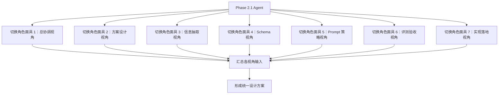

# Phase 2.1 情报解码模块角色定义

> **文档类型**：角色定义与职责边界
> **适用模块**：Phase 2.1 情报解码模块
> **角色协作模式**：同一 Agent 下的角色面具协作小队
> **状态**：正式版
> **最后更新**：2026-03-14

---

## 一、角色协作模式说明

### 1.1 核心理念

Phase 2.1 采用**角色面具协作模式**，而非多 Agent 并行自治模式：

- ✅ **单一 Agent**：所有角色由同一个 AI Agent 承担
- ✅ **多职责视角**：Agent 在不同阶段切换不同的角色面具
- ✅ **职责完整覆盖**：7 个职责维度保证视角完整性
- ✅ **执行可压缩**：实际执行时可压缩为 5-6 个角色面具
- ✅ **协作而非自治**：角色之间是协作讨论，不是独立决策

### 1.2 为什么不是多 Agent

| 对比维度 | 多 Agent 模式 | 角色面具模式（Phase 2.1 采用） |
|----------|--------------|------------------------------|
| **执行主体** | 多个独立 Agent | 同一个 Agent |
| **决策方式** | 各自独立决策，需要协调机制 | 同一 Agent 切换视角，内部整合 |
| **上下文** | 需要显式传递 | 天然共享 |
| **冲突处理** | 需要仲裁机制 | 内部权衡取舍 |
| **适用场景** | 大规模并行、独立子任务 | 需要多视角讨论的设计收敛 |

### 1.3 角色面具如何协作



---

## 二、7 个职责视角定义

### 2.1 职责视角清单

| 序号 | 职责视角 | 角色类型 | 核心职责 | 关键输出 |
|------|----------|----------|----------|----------|
| 1 | **总协调 / 架构连续性视角** | 保留角色 | 把控跨阶段边界、组织拍板、维护执行轨 | 执行轨文档、拍板结论、依赖状态 |
| 2 | **方案设计负责人视角** | 新增核心角色 | 汇总多视角输入、收敛设计方案、组织讨论 | 设计方案草案、取舍说明、待拍板清单 |
| 3 | **信息抽取负责人视角** | 新增核心角色 | 定义范式信号、设计抽取流程、排查误报漏报 | 信号定义、抽取流程图、误差分析 |
| 4 | **结构化契约负责人视角** | 新增核心角色 | 冻结 Schema、字段口径、枚举、兼容策略 | JSON Schema、字段说明、样例 |
| 5 | **Prompt / Extraction 策略负责人视角** | 强化角色 | 设计 Prompt-first 策略、few-shot、边界样本 | Prompt 模板库、few-shot 样例集 |
| 6 | **评测与验收负责人视角** | 强化角色 | 设计 benchmark、维护标注规则、出具质量结论 | 标注规范、benchmark 集合、验收报告 |
| 7 | **实现落地工程师视角** | 保留并聚焦 | 把方案落为可运行模块、样例联调、工程可行性 | 解码代码、校验逻辑、示例输入输出 |

### 2.2 执行压缩建议

虽然职责维度是 7 个，但执行时可以压缩：

**建议压缩方案 A（6 个角色面具）**：
1. 总协调 / 架构连续性视角（独立）
2. 方案设计负责人视角（独立）
3. **信息抽取 + Prompt 策略视角**（合并，因为抽取与 Prompt 策略高度耦合）
4. 结构化契约负责人视角（独立）
5. 评测与验收负责人视角（独立）
6. 实现落地工程师视角（独立）

**建议压缩方案 B（5 个角色面具）**：
1. **总协调 + 方案设计视角**（合并，因为都是收敛与拍板）
2. **信息抽取 + Prompt 策略视角**（合并）
3. 结构化契约负责人视角（独立）
4. 评测与验收负责人视角（独立）
5. 实现落地工程师视角（独立）

**不建议的合并**：
- ❌ 结构化契约 + 实现落地：Schema 设计与实现应分离，避免实现主导契约
- ❌ 评测 + 实现落地：评测应独立，避免"自己测自己"
- ❌ 总协调 + 实现落地：治理与执行应分离

---

## 三、各职责视角详细定义

### 3.1 总协调 / 架构连续性视角

**角色定位**：Phase 2.1 的治理与边界把控者

**核心职责**：
1. 维护 `phase2.1_启动与拍板.md` 执行轨文档
2. 把控 2.1 与 2.4 / 2.2 的边界与依赖
3. 组织关键拍板与文档回写
4. 确保 2.1 不越界侵入 2.2 / 2.3
5. 协调各职责视角的讨论节奏

**关键输出**：
- 模块执行轨文档
- 依赖状态判断
- 拍板结果回写
- 跨阶段边界说明

**工作方式**：
- 在设计讨论开始前：明确边界、非目标、依赖约束
- 在设计讨论过程中：识别越界风险、提醒职责边界
- 在设计讨论结束后：汇总拍板项、组织用户确认

**与其他视角的协作**：
- 向方案设计视角提供：边界约束、非目标清单、依赖状态
- 从方案设计视角接收：设计方案草案、待拍板清单
- 向用户提交：拍板请求、风险提示

---

### 3.2 方案设计负责人视角

**角色定位**：Phase 2.1 设计方案的收敛者

**核心职责**：
1. 组织多角色视角讨论
2. 汇总信息抽取、Schema、Prompt、评测四个视角的输入
3. 识别冲突与取舍点
4. 收敛为统一的设计方案草案
5. 明确 MVP 路线、非目标与设计取舍
6. 整理待拍板事项

**关键输出**：
- `phase2.1_设计方案.md` 草案
- 方案备选路线与取舍说明
- 首轮设计拍板清单

**工作方式**：
- 第一轮：向各职责视角征集输入（信号定义、Schema、Prompt 策略、评测口径）
- 第二轮：识别冲突点（如：Schema 复杂度 vs 实现难度、准确率 vs 召回率）
- 第三轮：提出取舍方案，形成设计草案
- 第四轮：整理待拍板事项，提交总协调视角

**与其他视角的协作**：
- 向信息抽取视角询问：什么是要抽的信号、抽取流程、边界样本
- 向 Schema 视角询问：字段设计、枚举定义、兼容策略
- 向 Prompt 策略视角询问：Prompt-first 可行性、few-shot 需求
- 向评测视角询问：验收口径、benchmark 设计、准确率目标
- 向实现视角询问：工程可行性、性能约束、联调复杂度

---

### 3.3 信息抽取负责人视角

**角色定位**：Phase 2.1 核心抽取任务的定义者

**核心职责**：
1. 定义"什么是要抽的信号"
2. 设计抽取步骤与错误分层
3. 决定何时需要引入规则辅助
4. 排查误报 / 漏报模式
5. 提供边界样本与失败案例

**关键输出**：
- 信号定义说明
- 抽取流程图
- 误报 / 漏报分析记录
- 边界样本集

**工作方式**：
- 从 `phase2.1_启动与拍板.md` 的契约草案出发
- 明确四类信号（technical / market / team / capital）的判断标准
- 设计抽取单元（单信号 vs 多信号、串行 vs 并行）
- 识别失败模式（证据不足、信号模糊、多义性）

**与其他视角的协作**：
- 向 Schema 视角提供：信号分类、必填字段需求、证据追溯要求
- 向 Prompt 策略视角提供：抽取目标、边界样本、失败案例
- 向评测视角提供：准确率定义、召回率定义、标注规则输入

---

### 3.4 结构化契约负责人视角

**角色定位**：Phase 2.1 输出契约的冻结者

**核心职责**：
1. 定义 `Signal` 与 `DecodedIntelligence` 最小字段
2. 维护枚举、评分口径和兼容策略
3. 对接 2.2 的消费要求
4. 保证字段稳定性与向下兼容
5. 提供 JSON Schema 与校验规则

**关键输出**：
- JSON Schema
- 字段说明文档
- 向下游交付样例
- 兼容性说明

**工作方式**：
- 从 `phase2.1_启动与拍板.md` 的契约草案出发
- 明确哪些字段是必填、哪些是可选
- 定义枚举值（如 signal_type 的四类）
- 设计评分口径（intensity / confidence / timeliness 的 1-10 含义）
- 预留扩展字段（metadata）

**与其他视角的协作**：
- 从信息抽取视角接收：信号分类、证据追溯要求
- 向 Prompt 策略视角提供：输出格式约束、字段示例
- 向评测视角提供：Schema 合法率校验规则
- 向实现视角提供：JSON Schema、校验逻辑

---

### 3.5 Prompt / Extraction 策略负责人视角

**角色定位**：Phase 2.1 Prompt-first 实现策略的设计者

**核心职责**：
1. 设计 Prompt-first MVP 方案
2. 组织 few-shot 与边界样例
3. 设计 Prompt 迭代记录方式
4. 决定何时引入后处理规则
5. 评估 Prompt 策略的准确率与稳定性

**关键输出**：
- Prompt 模板库
- few-shot 样例集
- Prompt 版本对比记录
- 后处理规则建议

**工作方式**：
- 从信息抽取视角接收：抽取目标、边界样本
- 从 Schema 视角接收：输出格式约束
- 设计 Prompt 结构（System Prompt + Few-shot + User Input）
- 选择 few-shot 样例（正例 + 边界例 + 负例）
- 设计后处理规则（格式规范化、字段补全）

**与其他视角的协作**：
- 从信息抽取视角接收：抽取目标、失败案例
- 从 Schema 视角接收：输出格式、字段约束
- 向评测视角提供：Prompt 版本、预期效果
- 向实现视角提供：Prompt 模板、调用方式

---

### 3.6 评测与验收负责人视角

**角色定位**：Phase 2.1 质量基线的守护者

**核心职责**：
1. 设计 benchmark 与标注规则
2. 度量准确率、召回率、Schema 合法率
3. 形成"可验收 / 不可验收"的正式判断
4. 维护回归测试集
5. 出具验收报告

**关键输出**：
- 标注规范
- benchmark 集合（首轮 30 条）
- 验收报告
- 回归测试结果

**工作方式**：
- 从信息抽取视角接收：准确率定义、召回率定义
- 从 Schema 视角接收：Schema 合法率校验规则
- 构建 benchmark（覆盖 news / report / announcement 三类输入）
- 维护标注规则（什么算正确、什么算错误）
- 运行基线测试，出具验收报告

**与其他视角的协作**：
- 从信息抽取视角接收：标注规则输入
- 从 Schema 视角接收：合法率校验规则
- 从 Prompt 策略视角接收：Prompt 版本
- 向方案设计视角提供：质量基线、验收结论

---

### 3.7 实现落地工程师视角

**角色定位**：Phase 2.1 方案的工程实现者

**核心职责**：
1. 把 Schema、Prompt、后处理与校验落成可运行模块
2. 完成样例联调与错误处理
3. 保证模块可被 2.2 集成
4. 提供接口文档与使用示例
5. 评估性能与资源消耗

**关键输出**：
- 解码代码
- 校验逻辑
- 示例输入输出
- 接口文档

**工作方式**：
- 从 Schema 视角接收：JSON Schema、字段说明
- 从 Prompt 策略视角接收：Prompt 模板、调用方式
- 实现解码流程（输入 → Prompt 调用 → 后处理 → 校验 → 输出）
- 完成样例联调（至少 1-2 个完整案例）
- 提供接口文档与使用示例

**与其他视角的协作**：
- 从 Schema 视角接收：输出格式、校验规则
- 从 Prompt 策略视角接收：Prompt 模板
- 向评测视角提供：可运行模块、测试接口
- 向总协调视角反馈：工程可行性、性能瓶颈

---

## 四、角色协作流程

### 4.1 设计方案产出流程

```
阶段 1：各视角独立输入（并行）
  ├─ 信息抽取视角：提出信号定义、抽取流程
  ├─ Schema 视角：提出字段设计、枚举定义
  ├─ Prompt 策略视角：提出 Prompt-first 可行性
  └─ 评测视角：提出验收口径、benchmark 设计

阶段 2：方案设计视角收敛（串行）
  ├─ 汇总各视角输入
  ├─ 识别冲突与取舍点
  ├─ 提出设计方案草案
  └─ 整理待拍板事项

阶段 3：总协调视角拍板（串行）
  ├─ 审阅设计方案草案
  ├─ 识别越界风险
  ├─ 提交用户拍板
  └─ 回写拍板结论

阶段 4：实现视角落地（串行）
  ├─ 实现解码模块
  ├─ 完成样例联调
  └─ 提供接口文档

阶段 5：评测视角验收（串行）
  ├─ 运行 benchmark
  ├─ 出具验收报告
  └─ 判断是否可进入联调
```

### 4.2 角色切换时机

| 阶段 | 当前角色面具 | 关键动作 | 切换条件 |
|------|-------------|----------|----------|
| **启动阶段** | 总协调视角 | 明确边界、非目标、依赖约束 | 边界明确后切换 |
| **设计阶段** | 方案设计视角 | 组织多角色讨论 | 需要专业输入时切换 |
| **专业输入** | 信息抽取 / Schema / Prompt / 评测视角 | 提供专业视角输入 | 输入完成后切回方案设计 |
| **收敛阶段** | 方案设计视角 | 汇总输入、识别冲突、形成草案 | 草案完成后切换 |
| **拍板阶段** | 总协调视角 | 审阅草案、提交拍板、回写结论 | 拍板完成后切换 |
| **实现阶段** | 实现落地视角 | 落地代码、样例联调 | 实现完成后切换 |
| **验收阶段** | 评测验收视角 | 运行 benchmark、出具报告 | 验收通过后结束 |

---

## 五、角色定义的使用方式

### 5.1 如何使用本角色定义文档

**在设计阶段**：
- 方案设计负责人视角：按照本文档第三节的职责定义，依次向各专业视角征集输入
- 各专业视角：按照本文档定义的职责边界，提供专业输入，不越界

**在实现阶段**：
- 实现落地工程师视角：按照本文档定义的输入来源，从 Schema、Prompt 策略视角接收设计
- 不应跳过设计阶段直接实现

**在验收阶段**：
- 评测与验收负责人视角：按照本文档定义的验收职责，独立出具质量结论
- 不应由实现视角"自己测自己"

### 5.2 角色定义的更新机制

**何时需要更新本文档**：
- Phase 2.1 的职责边界发生变化
- 发现角色定义存在遗漏或冲突
- 执行过程中发现角色压缩方案不合理

**更新流程**：
1. 由总协调视角识别更新需求
2. 提交用户确认
3. 更新本文档
4. 同步更新 `phase2.1_启动与拍板.md` 和 `phase2.1_团队重组建议清单.md`

### 5.3 与其他文档的关系

```
阶段2团队构建方案.md（阶段级基线）
  ↓ 细化为
phase2.1_启动与拍板.md（治理与启动说明）
  ↓ 引用
phase2.1_roles.md（本文档，执行角色定义）
  ↓ 指导产出
phase2.1_设计方案.md（多角色讨论产物）
```

**文档权威性**：
- 阶段级目标：以 `阶段2团队构建方案.md` 为准
- 治理与边界：以 `phase2.1_启动与拍板.md` 为准
- 角色定义：以本文档为准
- 设计方案：以 `phase2.1_设计方案.md` 为准（需基于本文档的多角色讨论产出）

---

## 六、常见问题

### Q1：为什么是 7 个职责视角，而不是 3 个或 5 个？

**A**：7 个职责维度是为了保证视角完整性：
- 如果只有 3 个（如旧版的"情报解码工程师、Prompt 工程师、测试工程师"），会缺少：
  - ❌ 方案设计收敛角色 → 导致设计方案无人主责收敛
  - ❌ 结构化契约角色 → 导致 Schema 不稳定
  - ❌ 总协调角色 → 导致与 2.4/2.2 边界模糊
- 7 个职责维度覆盖了：治理、设计、抽取、契约、策略、评测、实现

### Q2：执行时真的需要 7 个独立 Agent 吗？

**A**：不需要。7 个是职责维度，执行时可以压缩：
- 推荐压缩为 5-6 个角色面具
- 由同一个 Agent 切换角色面具完成
- 不是 7 个独立 Agent 并行自治

### Q3：角色面具协作与多 Agent 协作有什么区别？

**A**：
| 维度 | 角色面具协作 | 多 Agent 协作 |
|------|-------------|--------------|
| 执行主体 | 同一个 Agent | 多个独立 Agent |
| 上下文 | 天然共享 | 需要显式传递 |
| 决策方式 | 内部整合 | 需要协调机制 |
| 适用场景 | 设计收敛、多视角讨论 | 大规模并行、独立子任务 |

### Q4：如果某个视角的输入与另一个视角冲突怎么办？

**A**：由方案设计负责人视角识别冲突，提出取舍方案：
- 如果是技术冲突（如 Schema 复杂度 vs 实现难度），由方案设计视角权衡
- 如果是目标冲突（如准确率 vs 召回率），提交总协调视角，由用户拍板

### Q5：Phase 2.1 的设计方案是由谁产出的？

**A**：由多角色讨论产出，而不是单一视角直接起草：
1. 方案设计负责人视角组织讨论
2. 各专业视角提供输入
3. 方案设计视角汇总并形成草案
4. 总协调视角审阅并提交拍板
5. 用户拍板后，形成正式版 `phase2.1_设计方案.md`

### Q6：角色定义落档是什么意思？

**A**：指将角色定义正式写入本文档，而不是：
- ❌ 创建 7 个独立 Agent 的档案
- ❌ 在 `data-layer/employees/` 创建 7 个员工文件
- ✅ 在本文档明确 7 个职责视角的定义
- ✅ 后续可追溯、可审计

---

## 七、一句话总结

> Phase 2.1 采用**同一 Agent 下的角色面具协作模式**，通过 7 个职责视角保证完整性，执行时可压缩为 5-6 个角色面具，由方案设计负责人视角组织多角色讨论，产出 `phase2.1_设计方案.md`，而不是由单一视角直接起草或由多个独立 Agent 并行自治。
