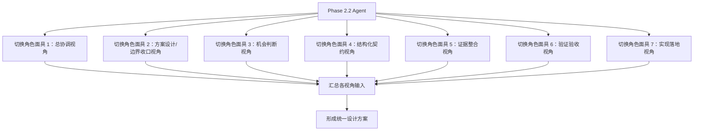

# Phase 2.2 机会判断模块角色定义

> **文档类型**：角色定义与职责边界
> **适用模块**：Phase 2.2 机会判断模块
> **角色协作模式**：同一 Agent 下的角色面具协作小队
> **状态**：正式版
> **最后更新**：2026-03-16

---

## 一、角色协作模式说明

### 1.1 核心理念

Phase 2.2 采用**角色面具协作模式**，而非多 Agent 并行自治模式：

- ✅ **单一 Agent**：所有角色由同一个 AI Agent 承担
- ✅ **多职责视角**：Agent 在不同阶段切换不同的角色面具
- ✅ **职责完整覆盖**：7 个职责维度保证机会判断层视角完整性
- ✅ **执行可压缩**：实际执行时可压缩为 5-6 个角色面具
- ✅ **协作而非自治**：角色之间是协作讨论，不是独立决策

### 1.2 为什么不是多 Agent

| 对比维度 | 多 Agent 模式 | 角色面具模式（Phase 2.2 采用） |
|----------|--------------|------------------------------|
| **执行主体** | 多个独立 Agent | 同一个 Agent |
| **决策方式** | 各自独立决策，需要协调机制 | 同一 Agent 切换视角，内部整合 |
| **上下文** | 需要显式传递 | 天然共享 |
| **冲突处理** | 需要仲裁机制 | 内部权衡取舍 |
| **适用场景** | 大规模并行、独立子任务 | 需要多视角讨论的设计收敛 |
| **当前定位** | 可作为 P1/P2 增强项 | MVP 采用的协作模式 |

**重要说明**：
- 多 Agent 不是 Phase 2.2 MVP 的硬要求
- 当前角色面具协作是为了设计质量收敛，不是为了展示多 Agent 系统
- 后续如需工程展示多 Agent，可在 2.2 增强阶段或 2.5 重点体现

### 1.3 角色面具如何协作



---

## 二、7 个职责视角定义

### 2.1 职责视角清单

| 序号 | 职责视角 | 角色类型 | 核心职责 | 关键输出 |
|------|----------|----------|----------|----------|
| 1 | **总协调 / 架构连续性视角** | 保留角色 | 把控跨阶段边界、组织拍板、维护执行轨 | 执行轨文档、拍板结论、依赖状态 |
| 2 | **方案设计 / 边界收口负责人视角** | 新增核心角色 | 汇总多视角输入、收敛设计方案、守住模块边界 | 设计方案草案、边界检查、取舍说明 |
| 3 | **机会判断负责人视角** | 新增核心角色 | 定义机会对象如何成立、如何分级、如何升级 | 机会判断骨架、分级建议、假设说明 |
| 4 | **结构化契约负责人视角** | 新增核心角色 | 冻结 OpportunityObject Schema、对接 2.3 消费 | JSON Schema、字段说明、交接样例 |
| 5 | **证据整合负责人视角** | 新增核心角色 | 组织支持/反对证据、假设、不确定性表达 | 证据组织说明、反证记录、风险提示 |
| 6 | **验证与验收负责人视角** | 强化角色 | 设计轻量验证、检查下游可消费性、出具验收判断 | 验证方案、验收检查表、验证记录 |
| 7 | **实现落地工程师视角** | 保留并聚焦 | 把对象契约、流程落成可运行模块 | 判断代码、样例输出、联调记录 |

### 2.2 正式职责来源与执行映射

**正式职责命名**：以 [phase2.2_团队重组建议清单.md](../phase2.2_团队重组建议清单.md) 为准

**执行压缩与协作方式**：以 [phase2.2_角色面具配置方案.md](../phase2.2_角色面具配置方案.md) 为准

**映射关系**：

| 正式职责视角（团队重组文档） | 执行面具（角色面具配置） | 压缩建议 |
|----------------------------|------------------------|----------|
| 总协调 / 架构连续性视角 | 总协调面具 | 独立保留 |
| 方案设计负责人 | 方案设计 / 边界收口面具 | 可合并边界检查职责 |
| 机会判断负责人 | 机会判断面具 | 独立保留 |
| 结构化契约负责人 | 结构化契约面具 | 独立保留 |
| 证据整合负责人 | 证据整合面具 | 独立保留 |
| 验证与验收负责人 | 验证验收面具 | 独立保留 |
| 实现落地工程师视角 | 实现落地面具 | 独立保留 |

### 2.3 执行压缩建议

虽然职责维度是 7 个，但执行时可以压缩：

**建议压缩方案 A（6 个角色面具）**：
1. 总协调 / 架构连续性视角（独立）
2. **方案设计 + 边界收口视角**（合并，因为都需要持续检查边界）
3. 机会判断负责人视角（独立）
4. 结构化契约负责人视角（独立）
5. 证据整合负责人视角（独立）
6. **验证验收 + 实现落地视角**（在实现期可合并）

**建议压缩方案 B（5 个角色面具）**：
1. **总协调 + 方案设计视角**（合并，因为都是收敛与拍板）
2. **机会判断 + 证据整合视角**（合并，因为判断依赖证据组织）
3. 结构化契约负责人视角（独立）
4. 验证验收负责人视角（独立）
5. 实现落地工程师视角（独立）

**不建议的合并**：
- ❌ 机会判断 + 结构化契约：判断逻辑与对象定义应分离，避免混淆
- ❌ 结构化契约 + 实现落地：Schema 设计与实现应分离，避免实现主导契约
- ❌ 验证 + 实现落地（在设计期）：验证应独立，避免"自己测自己"
- ❌ 方案设计 + 机会判断：收敛者与专业输入者应分离

---

## 三、各职责视角详细定义

### 3.1 总协调 / 架构连续性视角

**角色定位**：Phase 2.2 的治理与边界把控者

**核心职责**：
1. 维护 `phase2.2_启动与拍板.md` 执行轨文档
2. 把控 2.2 与 2.1 / 2.4 / 2.3 的边界与依赖
3. 组织关键拍板与文档回写
4. 确保 2.2 不越界侵入 2.3，也不回卷重做 2.1
5. 协调各职责视角的讨论节奏

**关键输出**：
- 模块执行轨文档
- 依赖状态判断
- 拍板结果回写
- 跨阶段边界说明

**工作方式**：
- 在设计讨论开始前：明确边界、非目标、依赖约束
- 在设计讨论过程中：识别越界风险、提醒职责边界
- 在设计讨论结束后：汇总拍板项、组织用户确认

**与其他视角的协作**：
- 向方案设计视角提供：边界约束、非目标清单、依赖状态
- 从方案设计视角接收：设计方案草案、待拍板清单
- 向用户提交：拍板请求、风险提示

**判断层级说明**：
- 2.2 负责的是**机会级判断**，不是信号级准入判断（2.1），也不是行动级判断（2.3）

---

### 3.2 方案设计 / 边界收口负责人视角

**角色定位**：Phase 2.2 设计方案的收敛者与边界守护者

**核心职责**：
1. 组织多角色视角讨论
2. 汇总机会判断、契约、证据整合、验证四个视角的输入
3. 持续检查 2.2 是否仍在"机会判断层"边界内
4. 识别冲突与取舍点
5. 收敛为统一的设计方案草案
6. 明确 MVP 路线、非目标与设计取舍
7. 整理待拍板事项

**关键输出**：
- `phase2.2_设计方案.md` 草案
- 边界检查结论
- 方案备选路线与取舍说明
- 首轮设计拍板清单

**工作方式**：
- 第一轮：向各职责视角征集输入（机会判断骨架、对象字段、证据组织、验证方案）
- 第二轮：识别冲突点（如：对象复杂度 vs 下游可消费性、判断深度 vs MVP 范围）
- 第三轮：检查边界（是否向 2.1 回卷、向 2.3 越界、向报告层偏移）
- 第四轮：提出取舍方案，形成设计草案
- 第五轮：整理待拍板事项，提交总协调视角

**与其他视角的协作**：
- 向机会判断视角询问：机会对象如何成立、如何分级、如何升级
- 向契约视角询问：OpportunityObject 最小字段、2.3 消费要求
- 向证据整合视角询问：证据如何组织、假设如何表达、不确定性如何显式化
- 向验证视角询问：验证方案、可消费性检查、验收口径
- 向实现视角询问：工程可行性、性能约束、联调复杂度

**边界检查重点**：
- ❌ 是否把 2.2 写成报告生成器
- ❌ 是否让 2.2 回卷重做信号识别
- ❌ 是否让 2.2 越级做行动方案
- ❌ 是否把多 Agent 提前塞进 MVP

---

### 3.3 机会判断负责人视角

**角色定位**：Phase 2.2 核心判断任务的定义者

**核心职责**：
1. 定义一组信号如何被组装为一个机会对象
2. 设计机会论点、分级与升级建议口径
3. 明确判断中的关键假设与不确定性表达
4. 区分"机会级判断"与"信号级准入判断"、"行动级判断"
5. 提供判断骨架与分流逻辑

**关键输出**：
- 机会对象判断骨架
- 分级建议草案（如 watch / research / deep_dive / escalate）
- 假设与不确定性说明
- 升级建议表达方式

**工作方式**：
- 从 `phase2.2_启动与拍板.md` 的契约草案出发
- 明确"什么样的信号组合构成一个机会主题"
- 设计机会论点形成方式（opportunity_thesis）
- 设计分级口径（priority_level）
- 设计升级建议方式（next_validation_questions）
- 识别关键假设（key_assumptions）
- 识别不确定性（uncertainty_map）

**与其他视角的协作**：
- 向契约视角提供：判断结果需要哪些字段、分级枚举值
- 向证据整合视角提供：判断需要哪些证据支撑、如何组织支持/反对证据
- 向验证视角提供：判断合理性定义、分级一致性检查方式
- 从契约视角接收：2.1 输入字段、2.4 证据包结构

**判断层级边界**：
- ✅ 负责：把信号升级为机会对象、给出分级与升级建议
- ❌ 不负责：重做信号识别（2.1）、直接给出行动方案（2.3）

---

### 3.4 结构化契约负责人视角

**角色定位**：Phase 2.2 输出契约的冻结者

**核心职责**：
1. 定义 `OpportunityObject` 最小字段集
2. 维护输入 / 输出 Schema、字段注释和兼容策略
3. 对接 2.3 的最小消费要求
4. 保证字段稳定性与可追溯性
5. 提供 JSON Schema 与校验规则

**关键输出**：
- 输入 Schema（OpportunityJudgmentRequest）
- 输出 Schema（OpportunityObject、OpportunityJudgmentResult）
- 字段说明文档
- 向下游交付样例
- 兼容性说明

**工作方式**：
- 从 `phase2.2_启动与拍板.md` 的契约草案出发
- 明确哪些字段是必填、哪些是可选
- 定义字段语义（如 opportunity_thesis、supporting_evidence、counter_evidence）
- 设计证据、假设、不确定性的并列组织方式
- 确保字段可追溯到 2.1 信号
- 预留扩展字段（metadata）

**与其他视角的协作**：
- 从机会判断视角接收：判断结果需要哪些字段、分级枚举值
- 从证据整合视角接收：证据字段组织方式、假设与不确定性字段
- 向验证视角提供：Schema 合法率校验规则
- 向实现视角提供：JSON Schema、校验逻辑
- 向 2.3 提供：最小消费字段集、交接样例

**契约原则**：
- 核心目标是"对象化判断"，不是"文本化扩写"
- 证据必须可追溯
- 判断不等于行动方案
- 先冻结最小字段，再逐步增强

---

### 3.5 证据整合负责人视角

**角色定位**：Phase 2.2 证据组织与质量把控者

**核心职责**：
1. 组织支持证据、反对证据、边界提醒与限制条件
2. 明确 2.4 输入如何参与判断，而不是替代判断
3. 检查当前对象是否存在证据不足或过度自信问题
4. 设计假设与不确定性的显式表达方式
5. 提供反证与风险提示

**关键输出**：
- 证据组织说明
- 反证与限制条件记录
- 风险提示
- 假设与不确定性表达方式

**工作方式**：
- 从机会判断视角接收：判断需要哪些证据支撑
- 从契约视角接收：证据字段定义
- 设计 supporting_evidence 组织方式
- 设计 counter_evidence 组织方式
- 设计 key_assumptions 表达方式
- 设计 uncertainty_map 表达方式
- 识别证据边界与限制条件

**与其他视角的协作**：
- 从机会判断视角接收：判断需要哪些证据类型
- 向契约视角提供：证据字段组织方式、假设与不确定性字段
- 向验证视角提供：证据完整性检查方式
- 从 2.4 接收：context packet 结构

**证据组织原则**：
- 支持证据与反对证据必须并列，不能只有支持证据
- 假设必须显式写出，不能隐藏在判断中
- 不确定性必须显式标注，不能过度自信
- 证据不足时必须提示，不能强行给出判断

---

### 3.6 验证与验收负责人视角

**角色定位**：Phase 2.2 质量基线的守护者

**核心职责**：
1. 设计轻量案例验证与可消费性检查
2. 判断当前对象是否足够稳定、可读、可被下游理解
3. 给出"可推进 / 需返工"的正式建议
4. 维护验收检查表
5. 出具验证记录与结论

**关键输出**：
- 轻量验证方案
- 验收检查表
- 验证记录与结论
- 可消费性评估

**工作方式**：
- 从契约视角接收：Schema 定义、字段说明
- 从机会判断视角接收：判断合理性定义
- 设计轻量案例验证（3-8 组真实案例）
- 检查对象稳定性（Schema 合法率）
- 检查判断可解释性（论点是否清晰、证据是否充分）
- 检查下游可消费性（2.3 是否能直接使用）
- 出具验收报告

**与其他视角的协作**：
- 从契约视角接收：Schema 合法率校验规则
- 从机会判断视角接收：判断合理性定义
- 从证据整合视角接收：证据完整性检查方式
- 向方案设计视角提供：验收结论、返工建议
- 向 2.3 提供：可消费性评估

**验收重点**：
- 输出 Schema 是否合法
- 机会论点是否可解释
- 支持/反对证据是否完整
- 分级是否合理
- 2.3 是否可直接消费

---

### 3.7 实现落地工程师视角

**角色定位**：Phase 2.2 方案的工程实现者

**核心职责**：
1. 把对象契约、主流程、样例验证路线落成可运行模块
2. 完成样例运行、错误处理与回写
3. 保证模块可被 2.3 和后续联调稳定接入
4. 提供接口文档与使用示例
5. 评估性能与资源消耗

**关键输出**：
- 2.2 实现代码
- 示例输入输出
- 运行记录与问题回写
- 接口文档

**工作方式**：
- 从契约视角接收：JSON Schema、字段说明
- 从机会判断视角接收：判断流程设计
- 从证据整合视角接收：证据组织方式
- 实现判断流程（输入 → 机会组装 → 判断 → 分级 → 输出）
- 完成样例联调（至少 1-2 个完整案例）
- 提供接口文档与使用示例

**与其他视角的协作**：
- 从契约视角接收：输出格式、校验规则
- 从机会判断视角接收：判断流程
- 从证据整合视角接收：证据组织方式
- 向验证视角提供：可运行模块、测试接口
- 向总协调视角反馈：工程可行性、性能瓶颈

**实现原则**：
- 不在拍板未完成时反向决定边界
- 不自行新增当前 MVP 之外的大功能
- 不把实现方便性当成模块本质

---

## 四、角色协作流程

### 4.1 设计方案产出流程

```
阶段 1：各视角独立输入（并行）
  ├─ 机会判断视角：提出机会对象判断骨架、分级口径
  ├─ 契约视角：提出 OpportunityObject 字段设计
  ├─ 证据整合视角：提出证据组织方式、假设与不确定性表达
  └─ 验证视角：提出验收口径、轻量验证方案

阶段 2：方案设计视角收敛（串行）
  ├─ 汇总各视角输入
  ├─ 识别冲突与取舍点
  ├─ 检查边界（是否越界到 2.1/2.3、是否偏向报告层）
  ├─ 提出设计方案草案
  └─ 整理待拍板事项

阶段 3：总协调视角拍板（串行）
  ├─ 审阅设计方案草案
  ├─ 识别越界风险
  ├─ 提交用户拍板
  └─ 回写拍板结论

阶段 4：实现视角落地（串行）
  ├─ 实现判断模块
  ├─ 完成样例联调
  └─ 提供接口文档

阶段 5：验证视角验收（串行）
  ├─ 运行轻量案例验证
  ├─ 出具验收报告
  └─ 判断是否可进入联调
```

### 4.2 角色切换时机

| 阶段 | 当前角色面具 | 关键动作 | 切换条件 |
|------|-------------|----------|----------|
| **启动阶段** | 总协调视角 | 明确边界、非目标、依赖约束 | 边界明确后切换 |
| **设计阶段** | 方案设计/边界收口视角 | 组织多角色讨论 | 需要专业输入时切换 |
| **专业输入** | 机会判断/契约/证据整合/验证视角 | 提供专业视角输入 | 输入完成后切回方案设计 |
| **收敛阶段** | 方案设计视角 | 汇总输入、识别冲突、形成草案 | 草案完成后切换 |
| **拍板阶段** | 总协调视角 | 审阅草案、提交拍板、回写结论 | 拍板完成后切换 |
| **实现阶段** | 实现落地视角 | 落地代码、样例联调 | 实现完成后切换 |
| **验收阶段** | 验证验收视角 | 运行验证、出具报告 | 验收通过后结束 |

### 4.3 冲突处理规则

**常见冲突类型**：
- 边界收口视角认为当前方案越界，但实现落地视角希望继续推进
- 机会判断视角希望增加表达能力，但契约视角希望保持对象简洁
- 证据整合视角认为证据不足，但验证视角认为当前仍可先做轻量验证

**解决原则**：
1. **模块边界优先于实现便利**
2. **正式对象优先于表达花样**
3. **验证可用性优先于理论完整性**
4. **用户拍板优先于角色面具内部偏好**

**必须回到用户拍板的情况**：
- 需要修改 2.2 与 2.3 边界
- 需要把多 Agent 升级为当前 MVP 的硬要求
- 需要将 2.4 从增强依赖改为强依赖
- 需要大幅改变主产物形态

---

## 五、角色定义的使用方式

### 5.1 如何使用本角色定义文档

**在设计阶段**：
- 方案设计负责人视角：按照本文档第三节的职责定义，依次向各专业视角征集输入
- 各专业视角：按照本文档定义的职责边界，提供专业输入，不越界
- 边界收口视角：持续检查是否偏离"机会判断层"定位

**在实现阶段**：
- 实现落地工程师视角：按照本文档定义的输入来源，从契约、判断、证据视角接收设计
- 不应跳过设计阶段直接实现

**在验收阶段**：
- 验证与验收负责人视角：按照本文档定义的验收职责，独立出具质量结论
- 不应由实现视角"自己测自己"

### 5.2 角色定义的更新机制

**何时需要更新本文档**：
- Phase 2.2 的职责边界发生变化
- 发现角色定义存在遗漏或冲突
- 执行过程中发现角色压缩方案不合理

**更新流程**：
1. 由总协调视角识别更新需求
2. 提交用户确认
3. 更新本文档
4. 同步更新 `phase2.2_启动与拍板.md` 和 `phase2.2_团队重组建议清单.md`

### 5.3 与其他文档的关系

```
阶段2团队构建方案.md（阶段级基线）
  ↓ 细化为
phase2.2_工作流总览与协作导航.md（协作导航）
  ↓ 引用
phase2.2_启动与拍板.md（治理与启动说明）
  ↓ 引用
phase2.2_团队重组建议清单.md（正式职责来源）
  ↓ 结合
phase2.2_角色面具配置方案.md（执行压缩方案）
  ↓ 落档为
phase2.2_roles.md（本文档，执行角色定义）
  ↓ 指导产出
phase2.2_设计方案.md（多角色讨论产物）
```

**文档权威性**：
- 阶段级目标：以 `阶段2团队构建方案.md` 为准
- 治理与边界：以 `phase2.2_启动与拍板.md` 为准
- 正式职责命名：以 `phase2.2_团队重组建议清单.md` 为准
- 执行压缩方案：以 `phase2.2_角色面具配置方案.md` 为准
- 角色定义：以本文档为准
- 设计方案：以 `phase2.2_设计方案.md` 为准（需基于本文档的多角色讨论产出）

---

## 六、常见问题

### Q1：为什么是 7 个职责视角，而不是 3 个或 5 个？

**A**：7 个职责维度是为了保证机会判断层视角完整性：
- 如果只有 3 个（如"机会评估工程师、Schema 工程师、测试工程师"），会缺少：
  - ❌ 方案设计收敛角色 → 导致设计方案无人主责收敛
  - ❌ 边界收口角色 → 导致容易向 2.1/2.3 越界或偏向报告层
  - ❌ 证据整合角色 → 导致证据组织不系统、假设与不确定性隐藏
  - ❌ 总协调角色 → 导致与 2.1/2.4/2.3 边界模糊
- 7 个职责维度覆盖了：治理、设计、判断、契约、证据、验证、实现

### Q2：执行时真的需要 7 个独立 Agent 吗？

**A**：不需要。7 个是职责维度，执行时可以压缩：
- 推荐压缩为 5-6 个角色面具
- 由同一个 Agent 切换角色面具完成
- 不是 7 个独立 Agent 并行自治

### Q3：角色面具协作与多 Agent 协作有什么区别？

**A**：
| 维度 | 角色面具协作 | 多 Agent 协作 |
|------|-------------|--------------|
| 执行主体 | 同一个 Agent | 多个独立 Agent |
| 上下文 | 天然共享 | 需要显式传递 |
| 决策方式 | 内部整合 | 需要协调机制 |
| 适用场景 | 设计收敛、多视角讨论 | 大规模并行、独立子任务 |
| 当前定位 | MVP 采用 | P1/P2 增强项 |

### Q4：如果某个视角的输入与另一个视角冲突怎么办？

**A**：由方案设计负责人视角识别冲突，提出取舍方案：
- 如果是技术冲突（如对象复杂度 vs 下游可消费性），由方案设计视角权衡
- 如果是目标冲突（如判断深度 vs MVP 范围），提交总协调视角，由用户拍板

### Q5：Phase 2.2 的设计方案是由谁产出的？

**A**：由多角色讨论产出，而不是单一视角直接起草：
1. 方案设计负责人视角组织讨论
2. 各专业视角提供输入
3. 方案设计视角汇总并形成草案
4. 总协调视角审阅并提交拍板
5. 用户拍板后，形成正式版 `phase2.2_设计方案.md`

### Q6：2.2 的"机会级判断"与 2.1 的"信号级判断"有什么区别？

**A**：
- **2.1 = 信号级准入判断**：判断外部事实是否值得进入正式信号流
- **2.2 = 机会级判断**：判断一组信号与证据是否构成值得跟踪、研究、深挖或升级的机会对象
- **2.3 = 行动级判断**：判断基于机会对象应采取什么行动、投入什么资源

2.2 不回卷重做 2.1 的工作，也不越级做 2.3 的工作。

---

## 七、一句话总结

> Phase 2.2 采用**同一 Agent 下的角色面具协作模式**，通过 7 个职责视角保证机会判断层的完整性，执行时可压缩为 5-6 个角色面具，由方案设计/边界收口负责人视角组织多角色讨论，产出 `phase2.2_设计方案.md`，确保 2.2 聚焦于"把信号升级为结构化机会对象"，而不是偏向报告生成器、回卷到信号识别或越级到行动方案。

---

**文档状态**：✅ 已建立
**版本**：v1.0
**前置参考文档**：
- [阶段2团队构建方案.md](../阶段2团队构建方案.md)
- [phase2.2_工作流总览与协作导航.md](../phase2.2_工作流总览与协作导航.md)
- [phase2.2_启动与拍板.md](../phase2.2_启动与拍板.md)
- [phase2.2_团队重组建议清单.md](../phase2.2_团队重组建议清单.md)
- [phase2.2_角色面具配置方案.md](../phase2.2_角色面具配置方案.md)

**后续产物**：
- [phase2.2_设计方案.md](../phase2.2_设计方案.md)（待产出，需基于本文档的多角色讨论）

