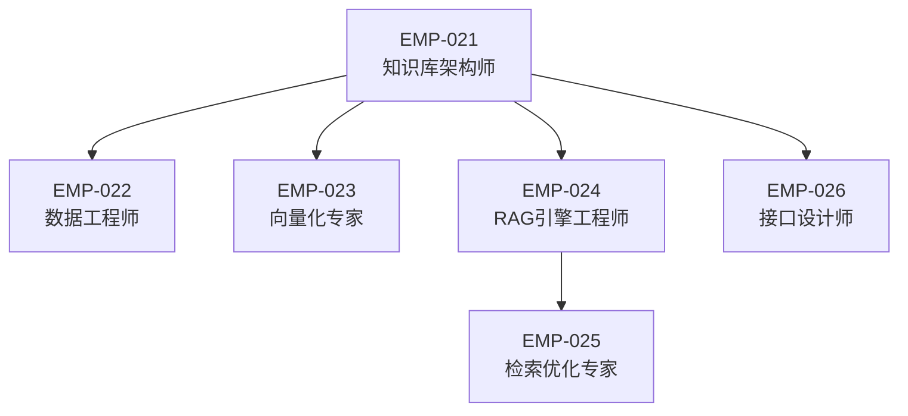
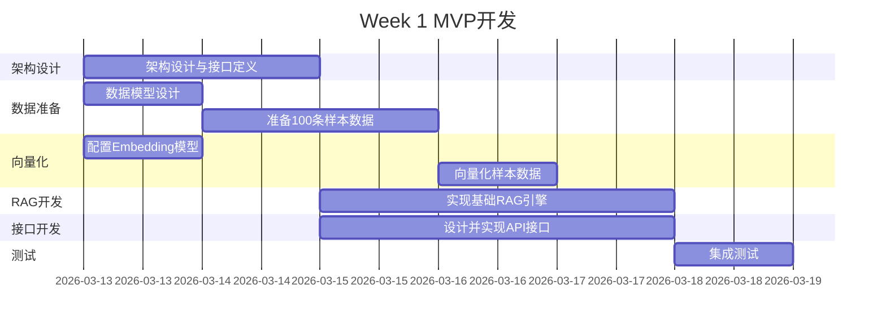

# 阶段2.4团队角色定义：知识库与RAG系统

**子阶段编号**: Phase 2.4
**团队规模**: 6人
**工作周期**: 4周（含1周MVP + 3周完善）
**依赖关系**: 无前置依赖（基础设施阶段）
**被依赖**: 2.1、2.2、2.3均依赖本阶段输出

---

## 团队结构



---

## 角色详细定义

### EMP-021: 知识库架构师（Team Lead）

**核心职责**:
- 设计知识库整体架构（数据模型、存储方案、索引策略）
- 制定MVP版本范围和接口规范
- 协调团队成员工作，确保按时交付
- 对接2.1/2.2/2.3团队，收集接口需求

**关键能力**:
- 数据架构设计经验
- 向量数据库选型能力（Qdrant/Pinecone/Milvus）
- 项目管理能力
- 跨团队沟通能力

**工作重点**:
- Week 1: 设计MVP架构，定义核心接口
- Week 2-4: 监督实施，优化架构

**输出物**:
- 知识库架构设计文档
- 接口规范文档（供其他阶段使用）
- 技术选型报告

---

### EMP-022: 数据工程师

**核心职责**:
- 设计知识库数据模型（YAML元数据结构）
- 实现数据清洗和预处理流程
- 建立数据质量监控机制
- 导入历史游戏行业数据

**关键能力**:
- 数据建模能力
- ETL流程设计
- 数据质量管理
- Python数据处理（pandas/polars）

**工作重点**:
- Week 1: 设计数据模型，实现MVP数据集（100条样本）
- Week 2-4: 扩展数据集，优化清洗流程

**输出物**:
- 数据模型定义（YAML Schema）
- 数据清洗脚本
- 初始知识库数据集（MVP: 100条，完整版: 1000+条）

**MVP关键输出**:
```yaml
# 示例数据结构
document:
  id: "kb_001"
  title: "《原神》开放世界设计范式"
  category: "game_design"
  tags: ["开放世界", "二次元", "gacha"]
  content: "..."
  metadata:
    source: "GDC 2021"
    confidence: 0.95
    last_updated: "2024-03-15"
```

---

### EMP-023: 向量化专家

**核心职责**:
- 选择和配置Embedding模型（text-embedding-3-large）
- 实现文本向量化流程
- 优化向量维度和精度
- 建立向量索引

**关键能力**:
- Embedding模型使用经验
- 向量相似度算法理解（cosine/dot product）
- 性能优化能力
- OpenAI API使用经验

**工作重点**:
- Week 1: 配置Embedding模型，向量化MVP数据集
- Week 2-4: 优化向量质量，批量处理完整数据集

**输出物**:
- 向量化配置文档
- 向量索引（存储在向量数据库）
- 向量质量评估报告

**MVP关键输出**:
- 100条文档的向量表示（1536维）
- 向量相似度测试结果

---

### EMP-024: RAG引擎工程师（核心角色）

**核心职责**:
- 实现RAG核心引擎（检索+生成）
- 集成LangChain/LangGraph框架
- 实现混合检索（向量+关键词）
- 定义检索API接口

**关键能力**:
- LangChain深度使用经验
- RAG架构设计能力
- API设计能力
- Claude API集成经验

**工作重点**:
- Week 1: 实现MVP版RAG（纯向量检索+简单生成）
- Week 2-4: 增加混合检索、重排序、上下文优化

**输出物**:
- RAG引擎代码（Python）
- 检索API服务
- RAG性能测试报告

**MVP关键输出**:
```python
# 核心接口定义
def retrieve(query: str, top_k: int = 5) -> List[Document]:
    """
    检索相关文档

    Args:
        query: 查询文本
        top_k: 返回文档数量

    Returns:
        相关文档列表，按相似度排序
    """
    pass

def generate_with_context(query: str, context: List[Document]) -> str:
    """
    基于检索上下文生成回答

    Args:
        query: 用户问题
        context: 检索到的文档

    Returns:
        生成的回答
    """
    pass
```

---

### EMP-025: 检索优化专家

**核心职责**:
- 优化检索性能（延迟、准确率）
- 实现缓存策略（Redis）
- 调优检索参数（top_k、相似度阈值）
- 监控检索质量

**关键能力**:
- 信息检索理论知识
- 性能优化经验
- 缓存系统设计
- 监控指标定义

**工作重点**:
- Week 1: 建立性能基准测试
- Week 2-4: 实施缓存、优化参数、降低延迟

**输出物**:
- 性能优化报告
- 缓存策略文档
- 检索质量监控仪表板

**关键指标**:
- P95延迟 < 500ms（MVP目标: < 1s）
- 检索准确率 > 80%（MVP目标: > 60%）
- 缓存命中率 > 50%（MVP后实施）

---

### EMP-026: 接口设计师

**核心职责**:
- 设计对外API接口（供2.1/2.2/2.3使用）
- 编写接口文档和使用示例
- 实现接口版本管理
- 提供接口测试工具

**关键能力**:
- RESTful API设计
- OpenAPI/Swagger文档编写
- 接口版本管理经验
- 技术文档写作能力

**工作重点**:
- Week 1: 设计MVP接口，编写文档（优先级最高）
- Week 2-4: 完善接口，增加高级功能

**输出物**:
- API接口文档（OpenAPI格式）
- 接口使用示例代码
- Postman测试集合

**MVP关键输出**:
```yaml
# API接口定义（简化版）
endpoints:
  - path: /api/v1/retrieve
    method: POST
    description: 检索相关文档
    request:
      query: string
      top_k: integer (default: 5)
    response:
      documents: List[Document]

  - path: /api/v1/generate
    method: POST
    description: 基于上下文生成回答
    request:
      query: string
      context_ids: List[string]
    response:
      answer: string
      sources: List[Document]
```

---

## MVP版本定义

### MVP目标（Week 1交付）

**核心功能**:
1. ✅ 基础知识库（100条游戏行业文档）
2. ✅ 向量检索（纯向量相似度）
3. ✅ 简单RAG生成（检索+Claude生成）
4. ✅ 核心API接口（retrieve + generate）

**非MVP功能**（Week 2-4完善）:
- 混合检索（向量+关键词）
- 重排序算法
- 缓存系统
- 高级过滤（按类别、时间）
- 性能优化

### MVP验收标准

| 指标 | MVP目标 | 完整版目标 |
|-----|---------|-----------|
| 知识库规模 | 100条 | 1000+条 |
| 检索延迟 | <1s | <500ms |
| 检索准确率 | >60% | >80% |
| API可用性 | 99% | 99.9% |

---

## 接口规范（供其他阶段使用）

### 数据格式约定

```python
# Document对象结构
class Document:
    id: str              # 文档唯一ID
    title: str           # 文档标题
    content: str         # 文档内容
    category: str        # 分类（game_design/market_trend/tech_innovation）
    tags: List[str]      # 标签列表
    metadata: dict       # 元数据（来源、置信度等）
    score: float         # 相似度分数（检索时返回）
```

### 调用示例

```python
# 2.1情报解码模块调用示例
from rag_engine import retrieve, generate_with_context

# 检索相关游戏设计范式
query = "开放世界游戏的核心设计要素"
docs = retrieve(query, top_k=5)

# 基于检索结果生成分析
analysis = generate_with_context(
    query="分析这些设计范式的共性",
    context=docs
)
```

---

## 工作协作流程

### Week 1: MVP冲刺



### Week 2-4: 完善与优化

- Week 2: 扩展数据集，实现混合检索
- Week 3: 性能优化，缓存系统
- Week 4: 文档完善，交付验收

---

## 风险与应对

### 关键风险

1. **向量数据库选型延迟**
   - 应对：MVP阶段使用FAISS（本地），后续迁移到云端

2. **检索质量不达标**
   - 应对：先保证可用性，质量问题在Week 2-4优化

3. **接口设计变更**
   - 应对：Week 1尽早发布接口文档，收集反馈

---

## 下一步行动

1. 创建6个数字员工档案（EMP-021~026）
2. 启动Week 1 MVP开发
3. 发布接口规范文档（供2.1/2.2/2.3团队参考）

---

**文档状态**: ✅ 已完成
**创建日期**: 2026-03-13
**负责人**: EMP-019（系统架构师）
