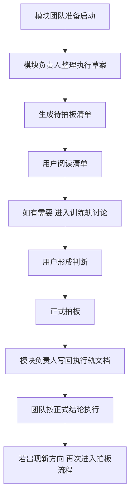

# 双端协作与用户拍板规范

> **文档版本**：v1.0  
> **适用范围**：`proj_004` 全项目，重点适用于 `Phase 2` 多端异步协作  
> **核心目的**：把“训练思考”和“正式执行”拆成两条稳定轨道，降低上下文污染、同步混乱与多人并行失控风险。

---

## 一、核心原则

### 1. 双轨分离

`proj_004` 中与模块启动相关的材料，必须区分为两类：

- **训练轨**：服务于用户本人，用于思考、提问、打磨表达、理解标准答案
- **执行轨**：服务于项目团队，用于记录正式范围、契约、拍板结果和执行边界

默认对应文档为：

- [模块思维训练模板.md](f:/AIProjects/DesignAssistant/data-layer/projects/proj_004/phase2_plan/模块思维训练模板.md)
- [模块启动与拍板模板.md](f:/AIProjects/DesignAssistant/data-layer/projects/proj_004/phase2_plan/模块启动与拍板模板.md)

### 2. 正式生效规则

- 训练轨中的讨论、追问、参考答案、草案，不直接构成正式要求
- 只有写入执行轨文档并经用户确认的结论，才视为正式生效
- 对话中的临时意见，不得替代文档中的正式结论

### 3. 单一事实源

在多端协作中，必须明确事实源：

- `PROJECT_CONTEXT.md`：当前状态、阅读入口、近期优先级
- `工程背景手册.md`：长期背景、方法论、稳定规范
- 各模块执行轨文档：模块范围、契约、拍板结果、执行边界
- 各模块进展文档：实现现状、差距、增量待拍板事项

---

## 二、角色分工

### 1. 用户

用户负责：

- 方向拍板
- 范围取舍
- 契约与验收的关键决策
- 是否接受某项正式结论进入执行轨

### 2. 模块负责人

模块负责人负责：

- 汇总团队讨论结果
- 整理待拍板清单
- 提供候选方案、推荐方案和推荐理由
- 在用户拍板后，将正式结论写回执行轨文档

### 3. 执行团队 / 数字员工

执行团队负责：

- 在既定边界内完成资料整理、文档初稿、实现与验证
- 发现问题后上报，不得绕过用户扩大范围
- 按文件所有权规则修改各自负责的文件

### 4. 场外思考顾问

允许存在“场外思考顾问”角色，帮助用户：

- 理解问题本质
- 比较方案优劣
- 打磨面试级回答
- 提醒潜在后果与常见误区

但该角色的输出**不直接进入正式同步链路**；只有在用户确认并写回执行轨文档后，才产生正式约束。

---

## 三、标准工作流

### 1. 工作流解释

- **正式同步链**：模块负责人 → 用户 → 执行轨文档 → 团队执行
- **非正式思考链**：用户 ↔ 训练轨 / 场外讨论

这两条链路必须分开，避免把探索性讨论误当成正式要求。

---

## 四、模块启动门槛

任一 `Phase 2.x` 模块，若要被视为“正式启动”，至少应具备以下材料：

- 一份目标说明
- 一份角色定义
- 一份执行轨启动与拍板文档
- 一份当前进展与待拍板事项文档（若已进入实施）

若缺少上述材料，则只可视为“开始尝试”，不应视为“稳定启动”。

---

## 五、文档职责边界

### 1. 训练轨文档

训练轨文档可以包含：

- 标准答案参考
- 追问与反问
- 思路修正过程
- 面试表达打磨
- 暂未成熟的探索性判断

训练轨文档不应用于：

- 直接指挥执行团队
- 作为正式接口约束
- 作为用户已经拍板的唯一证据

### 2. 执行轨文档

执行轨文档应只保留：

- 正式范围
- 正式契约
- 正式拍板结果
- 正式验收标准
- 正式协作边界

执行轨文档不应混入：

- 大量思维训练内容
- 长篇参考答案推演
- 尚未确定的开放性探索

---

## 六、文件所有权与同步纪律

### 1. 文件所有权

建议按以下方式执行：

- **项目背景与治理文档**：主控端维护
- **模块目标、角色、执行轨文档**：对应模块负责人维护
- **模块实现代码与数据文件**：对应执行团队维护
- **共享索引与总表**：协调端统一维护

### 2. 同步纪律

- 不同端避免同时修改同一共享文件
- 共享文件变更后，其他端应重新读取再继续工作
- 正式拍板完成后，应优先更新执行轨文档，再继续下游实现
- 关键共识若未写回文档，不得默认其他端已经知道

### 3. Git 协作建议

- 每个模块或窗口使用相对独立的分支
- 合并前先同步最新内容
- 对共享文档的改动应尽量集中提交，减少交叉覆盖

---

## 七、待拍板事项的整理规则

模块负责人整理待拍板事项时，必须遵守：

- 只把真正影响方向、边界、契约、验收和优先级的事项提交给用户
- 不把普通实现细节伪装成重大决策
- 每个拍板项必须附带：**可选方案 + 推荐方案 + 推荐理由 + 延后风险**
- 默认分为三类：**现在必须拍板 / 本周最好拍板 / 可后置拍板**

---

## 八、何时必须重新进入拍板流程

出现以下任一情况时，必须重新发起拍板：

- 模块目标发生明显变化
- 原定 MVP 范围明显扩大或收缩
- 对外接口字段出现破坏性变化
- 下游模块反馈当前契约无法稳定消费
- 评测标准或验收标准需要重定义
- 多端协作出现职责冲突或文件冲突

---

## 九、推荐的模块文档组合

每个 `Phase 2.x` 模块，建议固定维护以下文档：

- `phase2.x_目标说明.md`
- `phase2_roles/phase2.x_roles.md`
- `phase2.x_进展与待拍板事项.md`
- 训练轨实例文档（基于 [模块思维训练模板.md](f:/AIProjects/DesignAssistant/data-layer/projects/proj_004/phase2_plan/模块思维训练模板.md)）
- 执行轨实例文档（基于 [模块启动与拍板模板.md](f:/AIProjects/DesignAssistant/data-layer/projects/proj_004/phase2_plan/模块启动与拍板模板.md)）

---

## 十、从旧模板迁移到双轨制

历史上的 [模块启动拷问与拍板模板.md](f:/AIProjects/DesignAssistant/data-layer/projects/proj_004/phase2_plan/模块启动拷问与拍板模板.md) 同时承载了训练与执行两种用途。为减少双端协作中的上下文污染，现将其拆分为：

- 训练轨：[模块思维训练模板.md](f:/AIProjects/DesignAssistant/data-layer/projects/proj_004/phase2_plan/模块思维训练模板.md)
- 执行轨：[模块启动与拍板模板.md](f:/AIProjects/DesignAssistant/data-layer/projects/proj_004/phase2_plan/模块启动与拍板模板.md)

后续若引用旧文件，应将其视为**分流入口**，而不是继续作为唯一正式模板。

---

📌 **一句话规则**：训练轨负责把问题想透，执行轨负责把结论落地；只有写进执行轨并经用户确认的内容，才算正式要求。
