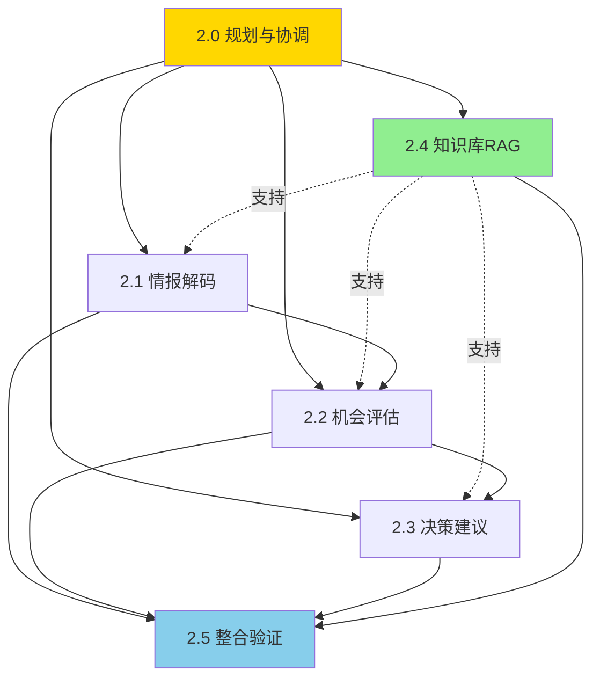

# 子阶段依赖关系与并行策略

> **制定者**：EMP-019 阶段2规划师 + EMP-020 阶段2协调官
> **制定时间**：2026-03-12
> **版本**：v1.0

---

## 1. 依赖关系图

### 1.1 整体依赖关系



### 1.2 依赖类型说明

**强依赖（实线）**：
- 2.0 → 2.1/2.2/2.3/2.4：必须等待2.0完成才能启动
- 2.1 → 2.2：2.2需要2.1的信号数据
- 2.2 → 2.3：2.3需要2.2的评估结果
- 2.1/2.2/2.3/2.4 → 2.5：2.5需要所有模块完成

**弱依赖（虚线）**：
- 2.4 → 2.1/2.2/2.3：2.4提供知识支持，但不阻塞启动
- 2.1/2.2/2.3可以先用基础知识启动，2.4逐步补充

---

## 2. 时间线与并行策略

### 2.1 整体时间线

```
Week 1: 阶段2.0（规划与协调）
Week 2-3: 阶段2.1（情报解码）并行 阶段2.4（知识库RAG）
Week 3-4: 阶段2.2（机会评估）并行 阶段2.4（知识库RAG）
Week 4-5: 阶段2.3（决策建议）并行 阶段2.4（知识库RAG）
Week 6-8: 阶段2.5（整合验证与复盘）
```

### 2.2 详细时间表

| 子阶段 | 开始时间 | 结束时间 | 周期 | 并行子阶段 |
|--------|---------|---------|------|-----------|
| 2.0 规划 | Week 1, Day 1 | Week 1, Day 7 | 1周 | - |
| 2.1 情报解码 | Week 2, Day 1 | Week 3, Day 7 | 2周 | 2.4 |
| 2.2 机会评估 | Week 3, Day 1 | Week 4, Day 7 | 2周 | 2.4 |
| 2.3 决策建议 | Week 4, Day 1 | Week 5, Day 7 | 2周 | 2.4 |
| 2.4 知识库RAG | Week 2, Day 1 | Week 5, Day 7 | 4周 | 2.1/2.2/2.3 |
| 2.5 整合验证 | Week 6, Day 1 | Week 8, Day 7 | 3周 | - |

### 2.3 关键里程碑

| 里程碑 | 时间 | 内容 | 验收标准 |
|--------|------|------|---------|
| M0: 规划完成 | Week 1, Day 7 | 所有子阶段目标明确 | 目标说明文档齐全 |
| M1: 情报解码完成 | Week 3, Day 7 | 情报解码模块可用 | 准确率≥80% |
| M2: 机会评估完成 | Week 4, Day 7 | 机会评估模块可用 | 2个案例完成 |
| M3: 决策建议完成 | Week 5, Day 7 | 决策建议模块可用 | 2个案例完成 |
| M4: 知识库完成 | Week 5, Day 7 | 知识库和RAG可用 | 100+条知识，检索达标 |
| M5: 整合验证完成 | Week 8, Day 7 | 端到端流程可用 | 2个真实案例完成 |

---

## 3. 并行执行策略

### 3.1 可并行子阶段

**Week 2-5：2.1/2.2/2.3/2.4 可并行**

**并行原因**：
- 2.1/2.2/2.3虽有依赖，但可以错峰启动（2.1先行2周，2.2再启动）
- 2.4与2.1/2.2/2.3是弱依赖，可以并行开发
- 2.4优先产出其他模块急需的知识，支持并行

**并行策略**：
1. **2.4优先启动**（Week 2, Day 1）
   - 优先产出：行业术语库、信号分类标准（支持2.1）
   - Week 2末交付给2.1

2. **2.1启动**（Week 2, Day 1）
   - 使用2.4提供的基础知识
   - Week 3末完成，交付给2.2

3. **2.2启动**（Week 3, Day 1）
   - 使用2.1的输出和2.4的案例库
   - Week 4末完成，交付给2.3

4. **2.3启动**（Week 4, Day 1）
   - 使用2.2的输出和2.4的决策模型
   - Week 5末完成

5. **2.4持续运行**（Week 2-5）
   - 根据其他模块需求，动态调整优先级
   - Week 5末完成所有知识采集

### 3.2 必须串行子阶段

**Week 1：2.0 必须先完成**
- 原因：2.0定义所有子阶段的目标和接口规范
- 阻塞：2.1/2.2/2.3/2.4都依赖2.0的输出

**Week 6-8：2.5 必须最后执行**
- 原因：2.5需要整合所有模块
- 阻塞：2.1/2.2/2.3/2.4必须全部完成

---

## 4. 依赖管理

### 4.1 接口依赖

| 上游模块 | 下游模块 | 接口内容 | 交付时间 | 风险 |
|---------|---------|---------|---------|------|
| 2.0 | 2.1/2.2/2.3/2.4 | 目标说明、接口规范 | Week 1末 | 低 |
| 2.1 | 2.2 | 信号数据（JSON） | Week 3末 | 中 |
| 2.2 | 2.3 | 评估结果（JSON） | Week 4末 | 中 |
| 2.4 | 2.1 | 术语库、分类标准 | Week 2末 | 高 |
| 2.4 | 2.2 | 案例库、评估框架 | Week 3末 | 高 |
| 2.4 | 2.3 | 决策模型、资源标准 | Week 4末 | 高 |
| 2.1/2.2/2.3/2.4 | 2.5 | 完整代码和文档 | Week 5末 | 中 |

### 4.2 依赖风险应对

**高风险依赖**：2.4 → 2.1/2.2/2.3
- **风险**：2.4延期导致其他模块缺少知识支持
- **应对**：
  - 2.4优先产出其他模块急需的知识
  - 其他模块准备降级方案（使用基础知识或纯LLM）
  - 每周同步进度，及时调整优先级

**中风险依赖**：2.1 → 2.2 → 2.3
- **风险**：上游延期导致下游无法启动
- **应对**：
  - 预留1-2天缓冲时间
  - 提前对齐接口格式，下游可以先用模拟数据开发
  - 每日站会同步进度

---

## 5. 资源协调

### 5.1 人力资源峰值

```
Week 1: 2人（2.0团队）
Week 2-3: 7人（2.1: 3人 + 2.4: 4人）
Week 3-4: 8人（2.2: 4人 + 2.4: 4人）
Week 4-5: 7人（2.3: 3人 + 2.4: 4人）
Week 6-8: 4人（2.5团队）

峰值：Week 3-4，8人
```

### 5.2 技术资源协调

**LLM API**：
- 2.1/2.2/2.3/2.5 都需要调用LLM API
- 并行期间（Week 2-5）需要控制总调用量
- 建议：设置每日调用上限，避免成本超支

**向量数据库**：
- 2.4独占使用
- 其他模块通过2.4的RAG接口访问

**开发环境**：
- 各团队独立开发环境
- 共享代码仓库（Git）
- 统一配置管理

---

## 6. 沟通协调机制

### 6.1 每日站会

**时间**：每天上午9:00
**参与人**：所有子阶段团队代表 + 2.0团队
**内容**：
- 昨日进展
- 今日计划
- 阻塞问题

### 6.2 每周同步会

**时间**：每周五下午3:00
**参与人**：所有子阶段团队 + 2.0团队
**内容**：
- 本周进展回顾
- 下周计划
- 依赖协调
- 风险识别

### 6.3 接口对接会

**时间**：按需召开
**参与人**：上下游团队
**内容**：
- 接口格式确认
- 数据样例验证
- 联调测试

---

## 7. 风险识别

### 7.1 依赖风险

| 风险 | 概率 | 影响 | 应对措施 |
|------|------|------|---------|
| 2.4延期影响其他模块 | 高 | 高 | 2.4优先产出急需知识，其他模块准备降级方案 |
| 2.1延期影响2.2 | 中 | 高 | 预留缓冲时间，2.2可先用模拟数据开发 |
| 接口不兼容 | 中 | 高 | 2.0阶段明确接口规范，提前对齐 |

### 7.2 资源风险

| 风险 | 概率 | 影响 | 应对措施 |
|------|------|------|---------|
| 人力资源不足 | 低 | 中 | 峰值8人，可控 |
| LLM API成本超支 | 中 | 中 | 设置每日调用上限，优先使用Sonnet |
| 向量数据库成本高 | 低 | 低 | 使用开源方案（Qdrant） |

### 7.3 时间风险

| 风险 | 概率 | 影响 | 应对措施 |
|------|------|------|---------|
| 某个子阶段延期 | 中 | 高 | 预留缓冲时间，及时调整计划 |
| 整体延期超过8周 | 低 | 中 | 可适当压缩2.5的时间（最少2周） |

---

## 8. 成功标准

### 8.1 依赖管理成功标准

- ✅ 所有接口按时交付
- ✅ 无因依赖问题导致的严重延期（>3天）
- ✅ 上下游协作顺畅

### 8.2 并行执行成功标准

- ✅ 并行期间无资源冲突
- ✅ 2.4成功支持其他模块
- ✅ 整体时间控制在8周内

### 8.3 沟通协调成功标准

- ✅ 每日站会按时召开
- ✅ 问题及时识别和解决
- ✅ 团队协作高效

---

📌 **本文档由EMP-019和EMP-020共同制定，用于指导阶段2的依赖管理和并行执行。**
