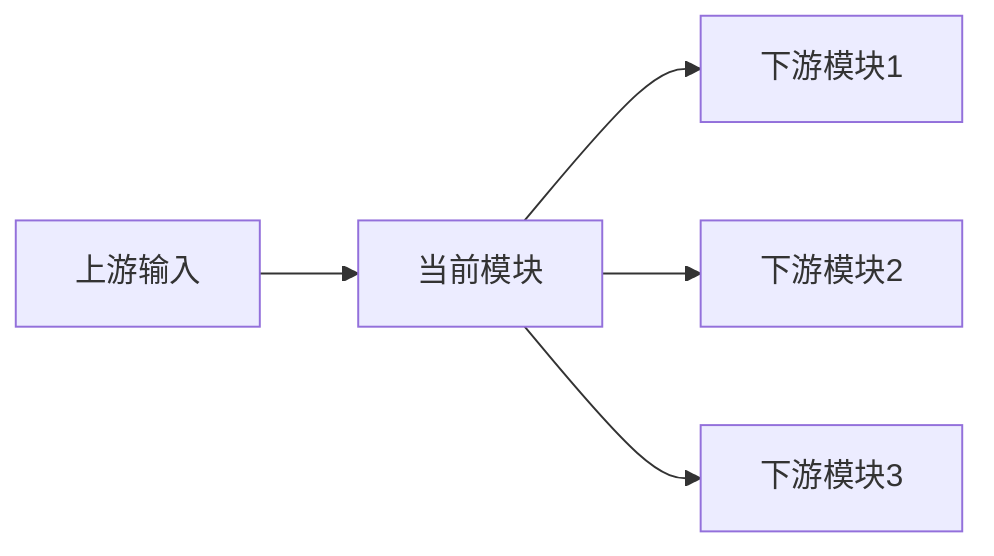

# 模块启动与拍板模板

> **模板版本**：v1.0  
> **适用范围**：`Phase 2.1 ~ Phase 2.5` 任一模块正式启动前  
> **核心用途**：沉淀该模块的**正式范围、契约草案、待拍板事项、启动结论与执行边界**，供数字团队直接消费。  
> **重要边界**：本模板属于**执行轨文档**；其中写明并经用户确认的内容，才构成正式要求。

---

## 一、使用规则

### 1. 什么时候必须使用

- 某个新模块第一次启动时
- 某个模块从“规划”进入“实现”时
- 某个模块范围明显扩大时
- 某个模块准备对外提供接口、被其他模块依赖时
- 某个模块出现方向性争议，需要用户拍板时

### 2. 谁负责填写

- **模块负责人**：负责汇总团队结论、候选方案与推荐方案
- **主控人 / 用户**：负责拍板方向、边界、验收与优先级
- **执行团队**：基于已拍板内容实施，不得绕过文档自行扩大范围

### 3. 正式生效规则

- 对话中的讨论、建议、草案，不直接构成正式要求
- 只有写入本模板对应实例文档并经用户确认的结论，才视为正式生效
- 若执行中出现超出已拍板范围的新方向，必须生成增量拍板项，而不是默认自行决定

---

## 二、模块基本信息

| 字段 | 内容 |
|------|------|
| **模块名称** | [如：阶段2.4 知识库与RAG系统] |
| **模块编号** | [如：Phase 2.4] |
| **启动日期** | [YYYY-MM-DD] |
| **模块负责人** | [角色/员工编号] |
| **协作团队** | [参与角色列表] |
| **上游输入** | [来自哪个阶段/模块/文档] |
| **下游服务对象** | [会被哪些模块依赖] |
| **当前状态** | [待启动 / 设计中 / MVP开发中 / 优化中] |

---

## 三、模块定位与目标

### 3.1 一句话定义

> 这个模块的职责不是 `[错误理解]`，而是 `[准确职责]`；它在系统中扮演 `[基础设施层 / 分析层 / 决策层 / 整合层]` 的角色，主要为 `[下游对象]` 提供 `[核心能力或产物]`。

### 3.2 当前阶段目标

- **要解决的问题**：[说明]
- **直接价值**：[说明]
- **复用价值**：[说明]
- **面试展示价值**：[说明]
- **工程沉淀价值**：[说明]

### 3.3 本次启动范围

- **MVP 必做**：[说明]
- **明确不做**：[说明]
- **完整版方向**：[说明]
- **当前最大风险**：[说明]

---

## 四、上下游与依赖关系

### 4.1 上下游关系图

### 4.2 依赖说明

- **数据依赖**：[下游需要它提供什么数据/证据/素材]
- **语义依赖**：[下游需要它统一什么概念、分类、字段或标准]
- **治理依赖**：[为什么下游不能各自做一套]

---

## 五、契约草案

### 5.1 输入契约

| 字段 | 类型 | 必填 | 含义 | 备注 |
|------|------|------|------|------|
| [field] | [type] | [Y/N] | [说明] | [说明] |

### 5.2 输出契约

| 字段 | 类型 | 必填 | 含义 | 备注 |
|------|------|------|------|------|
| [field] | [type] | [Y/N] | [说明] | [说明] |

### 5.3 契约原则

- **稳定核心字段**：[说明]
- **可选增强字段**：[说明]
- **不对下游暴露的内部实现**：[说明]
- **兼容未来扩展的方式**：[说明]

### 5.4 契约检查表

| 问题 | 结论 | 备注 |
|------|------|------|
| **输入是否明确？** | [是/否] | [说明] |
| **输出是否明确？** | [是/否] | [说明] |
| **字段是否区分必填/选填？** | [是/否] | [说明] |
| **是否考虑未来扩展？** | [是/否] | [说明] |
| **是否避免暴露内部实现？** | [是/否] | [说明] |
| **是否能被其他模块稳定消费？** | [是/否] | [说明] |

---

## 六、验收与评测

### 6.1 效果定义

- **功能层目标**：[说明]
- **质量层目标**：[说明]
- **性能层目标**：[说明]
- **协作层目标**：[说明]
- **展示层目标**：[说明]

### 6.2 指标表

| 层级 | 指标 | 目标值 | 测量方式 |
|------|------|--------|----------|
| **功能层** | [如：接口可用] | [目标值] | [如何验证] |
| **质量层** | [如：准确率/完整性] | [目标值] | [如何验证] |
| **性能层** | [如：延迟/吞吐] | [目标值] | [如何验证] |
| **协作层** | [如：下游接入成功率] | [目标值] | [如何验证] |
| **展示层** | [如：是否能形成案例成果] | [目标值] | [如何验证] |

### 6.3 基线与实验

- **Benchmark 样本数量**：[X]
- **样本来源**：[说明]
- **标注人 / 验收人**：[角色/负责人]
- **Ablation 计划**：[说明]
- **效果不达标时的排查顺序**：数据 → 召回/检索 → 契约 → 生成/逻辑 → 系统

---

## 七、职责划分与协作边界

### 7.1 人与 AI 的职责划分

| 工作类型 | 负责人 | 原因 |
|----------|--------|------|
| **目标定义** | [人/AI] | [说明] |
| **方向拍板** | [人/AI] | [说明] |
| **文档初稿** | [人/AI] | [说明] |
| **代码骨架实现** | [人/AI] | [说明] |
| **质量验收** | [人/AI] | [说明] |
| **最终取舍决策** | [人/AI] | [说明] |

### 7.2 协作机制

- **单一事实源**：[说明]
- **文件所有权**：[说明]
- **共享文件限制**：[说明]
- **同步节奏**：[说明]
- **上下文更新责任人**：[说明]

---

## 八、待拍板事项

### 8.1 现在必须拍板

| 决策项 | 可选方案 | 推荐方案 | 为什么现在必须定 | 拍板结果 |
|--------|----------|----------|------------------|----------|
| [决策1] | [A/B/C] | [建议] | [原因] | [待定/已定] |
| [决策2] | [A/B/C] | [建议] | [原因] | [待定/已定] |

### 8.2 本周最好拍板

| 决策项 | 可选方案 | 推荐方案 | 延后风险 | 拍板结果 |
|--------|----------|----------|----------|----------|
| [决策1] | [A/B/C] | [建议] | [风险] | [待定/已定] |

### 8.3 可后置拍板

| 决策项 | 建议何时再定 | 触发条件 | 备注 |
|--------|--------------|----------|------|
| [决策1] | [时间点] | [条件] | [说明] |

### 8.4 拍板项纪律

- 不把实现细节伪装成用户必须决定的大方向
- 每个拍板项都必须附带：**可选方案 + 推荐方案 + 推荐理由 + 延后风险**
- 不允许把关键拍板只留在对话中而不写回文档

---

## 九、启动结论

### 9.1 启动结论页

- **是否允许启动**：[允许 / 暂缓]
- **启动范围**：[MVP范围说明]
- **明确不做**：[非MVP内容]
- **当前最大风险**：[说明]
- **下次复查时间**：[日期]

### 9.2 启动前最后检查

| 检查项 | 状态 | 备注 |
|--------|------|------|
| **模块目标明确** | [✅/⚠️/❌] | [说明] |
| **上下游依赖明确** | [✅/⚠️/❌] | [说明] |
| **契约草案明确** | [✅/⚠️/❌] | [说明] |
| **拍板事项已整理** | [✅/⚠️/❌] | [说明] |
| **用户已拍板关键项** | [✅/⚠️/❌] | [说明] |
| **MVP边界明确** | [✅/⚠️/❌] | [说明] |
| **验收方式明确** | [✅/⚠️/❌] | [说明] |
| **协作机制明确** | [✅/⚠️/❌] | [说明] |

### 9.3 一句话总结

> 本模块已完成启动前梳理与关键拍板，可以按当前边界进入执行；若后续出现超出本次拍板范围的新方向，应重新进入拍板流程，而不是默认由执行团队自行扩张范围。
