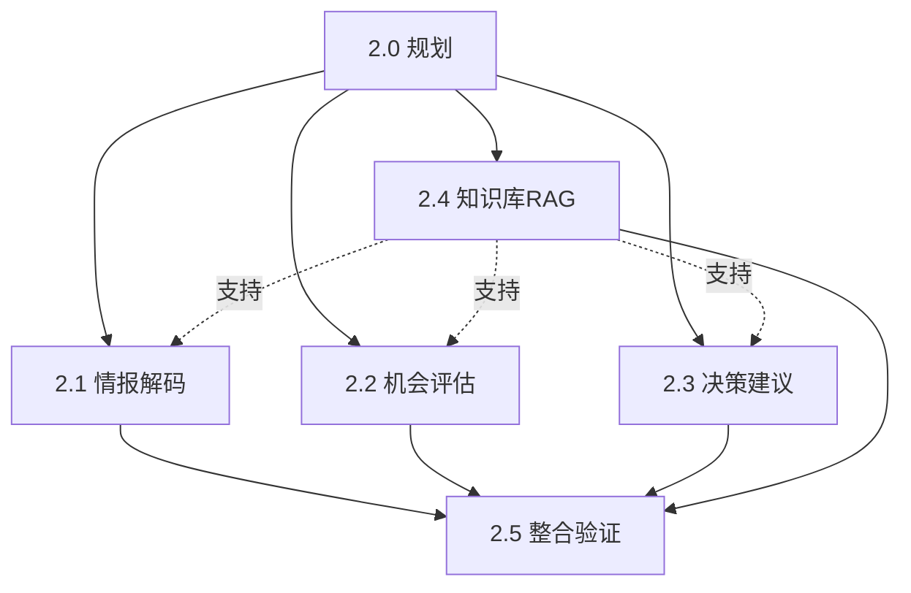

# 阶段2团队构建方案（递归分层版）

> **制定者**：EMP-018 阶段1招聘协调官
> **制定时间**：2026-03-12
> **版本**：v2.0（递归分层版）

---

## 1. 方案概述

### 1.1 核心理念

阶段2采用**递归分层**的方式，将大型复杂任务拆解为多个专业化的子阶段，每个子阶段由专门的团队负责。

### 1.2 阶段2整体目标

基于阶段1的系统架构设计，**实现可运行的 AI 工作流原型**，并产出真实评估案例，证明以下能力：
- AI Native 思维（多 Agent 协作）
- 第一性原理分析（范式转移判断）
- 系统化设计（完整的工作流）
- 可复用方法论（模板化输出）

### 1.3 递归分层结构

```
阶段2（6-8周）
├── 阶段2.0：规划与协调（Week 1）
├── 阶段2.1：情报解码模块（Week 2-3）
├── 阶段2.2：机会评估模块（Week 3-4）
├── 阶段2.3：决策建议模块（Week 4-5）
├── 阶段2.4：知识库&RAG系统（Week 2-5，并行）
└── 阶段2.5：整合验证与复盘（Week 6-8）
```

---

## 2. 子阶段详细规划

### 2.0 阶段2规划与协调团队

#### 目标
将阶段2拆解为可执行的子阶段，定义依赖关系和并行策略。

#### 团队角色（1-2人）
- **阶段2规划师**：拆解阶段2任务，定义子阶段目标和依赖
- **协调官**：协调各子阶段团队，管理进度和资源

#### 核心产出
- 阶段2.1~2.5的目标说明文档
- 子阶段依赖关系图
- 资源分配计划
- 风险识别与应对方案

#### 验收标准
- ✅ 每个子阶段目标清晰可执行
- ✅ 依赖关系明确，无循环依赖
- ✅ 并行策略合理，资源不冲突

#### 交付给招聘团队
- 阶段2.1~2.4的团队构建需求（可并行构建）
- 阶段2.5的团队构建需求（依赖前4个子阶段完成）

---

### 2.1 情报解码模块团队

#### 目标
实现情报解码模块，将非结构化信息转化为结构化的"范式信号"。

#### 团队角色（3-4人）
1. **情报解码工程师**
   - 职责：实现信号提取逻辑，设计信号分类体系
   - 输出：信号提取代码、信号分类标准

2. **Prompt工程师**
   - 职责：优化信号识别Prompt，提高准确率
   - 输出：Prompt模板库、Few-shot示例集

3. **测试工程师**
   - 职责：验证信号质量，测试边界情况
   - 输出：测试用例、质量报告

#### 核心产出
- 可运行的情报解码模块（Python/LangChain）
- 信号提取Prompt模板
- 测试报告（准确率、召回率）
- 使用文档

#### 技术栈
- LLM：Claude Opus 4.6
- 框架：LangChain / LlamaIndex
- 输出格式：JSON Schema

#### 验收标准
- ✅ 能处理至少3种信息源（新闻、报告、公告）
- ✅ 信号提取准确率 ≥ 80%
- ✅ 输出格式符合系统架构定义
- ✅ 有完整的使用文档和示例

---

### 2.2 机会评估模块团队

#### 目标
实现机会评估模块，基于第一性原理分析机会，采用多Agent辩论模式。

#### 团队角色（4-5人）
1. **评估逻辑工程师**
   - 职责：实现第一性原理分析逻辑，构建评分模型
   - 输出：评估算法、评分公式

2. **多Agent协调工程师**
   - 职责：实现辩论模式（乐观派、悲观派、中立派）
   - 输出：Agent协作框架、辩论流程

3. **评分模型设计师**
   - 职责：设计4维度评分模型（市场、技术、团队、时间窗口）
   - 输出：评分标准、权重配置

4. **案例工程师**
   - 职责：准备测试案例，验证评估效果
   - 输出：测试案例库、评估报告示例

#### 核心产出
- 可运行的机会评估模块
- 多Agent辩论实现
- 评分模型配置文件
- 评估案例（至少2个）

#### 技术栈
- LLM：Claude Opus 4.6（主评估）+ Sonnet 4.6（辅助）
- 框架：LangGraph（Agent编排）
- 协作模式：Debate Pattern

#### 验收标准
- ✅ 实现3个Agent辩论模式
- ✅ 评分模型可配置权重
- ✅ 输出符合评估报告模板
- ✅ 至少完成2个真实案例评估

---

### 2.3 决策建议模块团队

#### 目标
实现决策建议模块，将评估结果转化为可执行的行动方案。

#### 团队角色（3-4人）
1. **决策逻辑工程师**
   - 职责：实现决策生成逻辑，设计行动路径
   - 输出：决策算法、路径规划代码

2. **资源规划工程师**
   - 职责：实现资源配置算法（人力、资金、时间）
   - 输出：资源分配模型、预算估算工具

3. **风险分析工程师**
   - 职责：实现风险识别和应对方案生成
   - 输出：风险矩阵、应对策略库

#### 核心产出
- 可运行的决策建议模块
- 资源配置算法
- 风险分析工具
- 决策案例（至少2个）

#### 技术栈
- LLM：Claude Opus 4.6
- 框架：LangChain
- 输出格式：结构化Markdown

#### 验收标准
- ✅ 能生成短/中/长期行动路径
- ✅ 资源配置合理可行
- ✅ 输出符合决策建议模板
- ✅ 至少完成2个决策建议案例

---

### 2.4 知识库&RAG系统团队

#### 目标
构建行业知识库并实现RAG检索引擎，支持其他模块的知识查询。

#### 团队角色（4-5人）
1. **知识库架构师**
   - 职责：设计知识库结构，定义元数据标准
   - 输出：知识库Schema、目录结构

2. **数据工程师**
   - 职责：采集和清洗行业数据，构建知识条目
   - 输出：知识库内容（至少100条）

3. **RAG工程师**
   - 职责：实现混合检索（向量+关键词），优化检索效果
   - 输出：RAG检索引擎、Reranker

4. **向量化工程师**
   - 职责：实现文档向量化，构建向量索引
   - 输出：Embedding Pipeline、向量数据库

#### 核心产出
- 可用的知识库（至少100条知识）
- RAG检索引擎
- 向量数据库
- 检索效果测试报告

#### 技术栈
- Embedding：text-embedding-3-large
- 向量数据库：Qdrant / Pinecone
- 检索策略：混合检索（向量0.7 + 关键词0.3）
- 知识格式：Markdown + YAML元数据

#### 验收标准
- ✅ 知识库包含至少100条高质量知识
- ✅ 检索准确率 ≥ 75%（Top-5）
- ✅ 检索速度 < 2秒
- ✅ 支持元数据过滤（时间、类别、来源）

---

### 2.5 整合验证与复盘团队

#### 目标
整合所有模块，进行端到端验证，产出真实评估案例和复盘报告。

#### 团队角色（4-5人）
1. **系统集成工程师**
   - 职责：整合2.1~2.4的模块，实现端到端流程
   - 输出：完整工作流代码、集成文档

2. **测试工程师**
   - 职责：端到端测试，验证流程完整性
   - 输出：测试用例、测试报告

3. **案例执行工程师**
   - 职责：运行真实案例，产出评估报告和决策建议
   - 输出：至少2个完整案例（评估报告+决策建议）

4. **复盘分析师**
   - 职责：分析流程有效性，记录工作日志，提出优化建议
   - 输出：复盘报告、优化建议、阶段3目标说明

#### 核心产出
- 完整的AI工作流原型
- 真实评估案例（至少2个）
- 工作日志（记录每个模块运行情况）
- 复盘报告
- 阶段3目标说明

#### 验收标准
- ✅ 端到端流程可运行
- ✅ 至少完成2个真实案例
- ✅ 案例输出符合模板要求
- ✅ 复盘报告完整，提出明确的优化建议
- ✅ 阶段3目标清晰可执行

---

## 3. 并行与依赖关系

### 3.1 时间线

```
Week 1: 阶段2.0（规划）
Week 2-3: 阶段2.1（情报解码）并行 阶段2.4（知识库&RAG）
Week 3-4: 阶段2.2（机会评估）并行 阶段2.4（知识库&RAG）
Week 4-5: 阶段2.3（决策建议）并行 阶段2.4（知识库&RAG）
Week 6-8: 阶段2.5（整合验证）
```

### 3.2 依赖关系



### 3.3 并行策略

**可并行**：
- 2.1、2.2、2.3、2.4 可以并行开发（Week 2-5）
- 2.4（知识库）优先启动，为其他模块提供支持

**必须串行**：
- 2.0 必须先完成（Week 1）
- 2.5 必须等待 2.1~2.4 完成（Week 6开始）

---

## 4. 资源需求

### 4.1 人力需求

| 子阶段 | 人数 | 周期 | 人·周 |
|--------|------|------|-------|
| 2.0 规划 | 2人 | 1周 | 2 |
| 2.1 情报解码 | 3人 | 2周 | 6 |
| 2.2 机会评估 | 4人 | 2周 | 8 |
| 2.3 决策建议 | 3人 | 2周 | 6 |
| 2.4 知识库RAG | 4人 | 4周 | 16 |
| 2.5 整合验证 | 4人 | 3周 | 12 |
| **总计** | **峰值8人** | **8周** | **50人·周** |

### 4.2 技术资源

- LLM API：Claude Opus 4.6 + Sonnet 4.6
- 向量数据库：Qdrant / Pinecone
- 开发环境：Python 3.10+, LangChain, LangGraph
- 版本控制：Git

### 4.3 预算估算

- LLM API成本：约 $500-1000（取决于测试量）
- 向量数据库：约 $100-200/月
- 其他工具订阅：约 $100/月
- **总预算**：约 $1000-1500

---

## 5. 风险与应对

### 5.1 关键风险

| 风险 | 概率 | 影响 | 应对措施 |
|------|------|------|---------|
| 模块间接口不兼容 | 中 | 高 | 2.0阶段明确定义接口规范 |
| 知识库构建耗时超预期 | 高 | 中 | 先构建MVP（50条），后续迭代 |
| RAG检索效果不达标 | 中 | 中 | 准备降级方案（纯LLM） |
| 真实案例难以获取 | 中 | 高 | 提前准备3-5个候选案例 |

### 5.2 质量保证

- 每个子阶段完成后进行验收
- 2.5阶段进行端到端测试
- 使用阶段1定义的质量评估矩阵

---

## 6. 交付给招聘团队

### 6.1 立即可构建（Week 1）

**阶段2.0团队**：
- 2人（规划师 + 协调官）
- 详细角色定义见：[阶段2.0团队角色定义.md](phase2_roles/phase2.0_roles.md)

### 6.2 Week 2开始构建（并行）

**阶段2.1团队**：3人（情报解码工程师、Prompt工程师、测试工程师）
**阶段2.4团队**：4人（知识库架构师、数据工程师、RAG工程师、向量化工程师）

详细角色定义见：
- [阶段2.1团队角色定义.md](phase2_roles/phase2.1_roles.md)
- [阶段2.4团队角色定义.md](phase2_roles/phase2.4_roles.md)

### 6.3 Week 3-4构建

**阶段2.2团队**：4人（评估逻辑工程师、多Agent协调工程师、评分模型设计师、案例工程师）
**阶段2.3团队**：3人（决策逻辑工程师、资源规划工程师、风险分析工程师）

详细角色定义见：
- [阶段2.2团队角色定义.md](phase2_roles/phase2.2_roles.md)
- [阶段2.3团队角色定义.md](phase2_roles/phase2.3_roles.md)

### 6.4 Week 6构建

**阶段2.5团队**：4人（系统集成工程师、测试工程师、案例执行工程师、复盘分析师）

详细角色定义见：
- [阶段2.5团队角色定义.md](phase2_roles/phase2.5_roles.md)

---

## 7. 成功标准

### 7.1 阶段2整体成功标准

- ✅ 所有子阶段按时完成
- ✅ 端到端工作流可运行
- ✅ 至少完成2个真实评估案例
- ✅ 案例质量符合阶段0定义的成功标准
- ✅ 复盘报告完整，阶段3目标清晰

### 7.2 可写入简历的成果

完成阶段2后，可以写入简历的成果：
1. "设计并实现了多Agent协作的AI决策工作流，包含情报解码、机会评估、决策建议三大模块"
2. "构建了基于RAG的行业知识库系统，检索准确率达75%以上"
3. "运用第一性原理和多Agent辩论模式，完成了X个游戏项目的机会评估"
4. "产出了可复用的评估报告和决策建议模板，支持快速复制到其他项目"

---

📌 **本方案采用递归分层方式，将阶段2拆解为6个专业化子阶段，确保每个模块由专门团队负责，提高质量和效率。**
