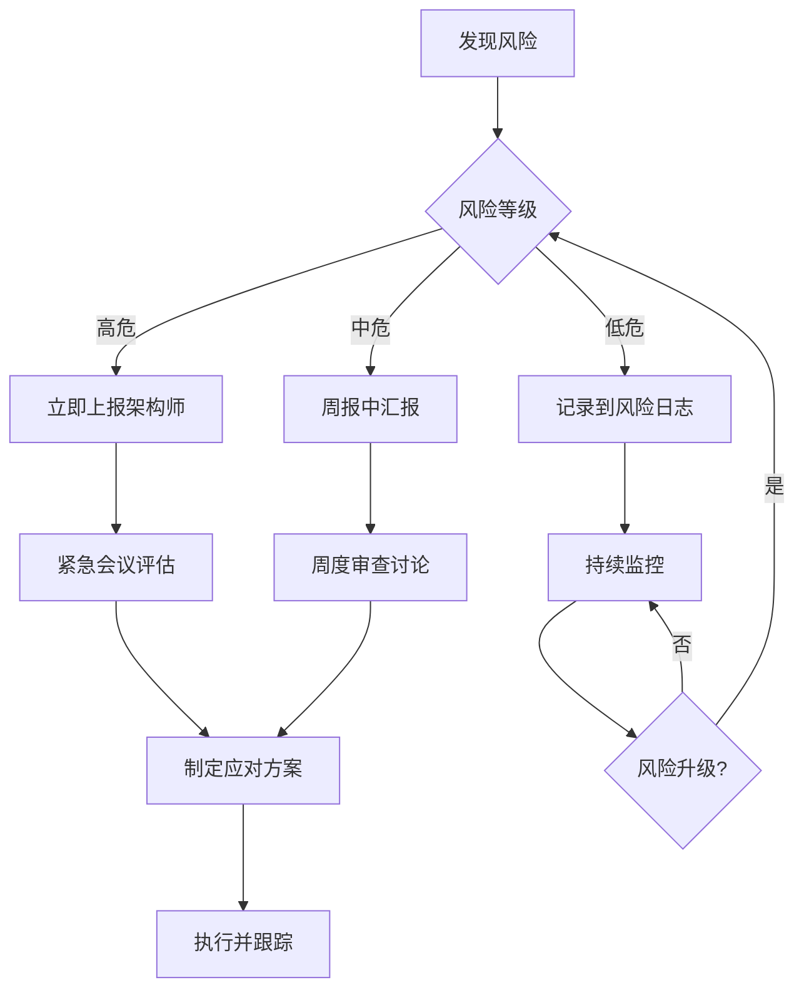

# 风险识别与应对方案

**文档编号**: PROJ-004-PHASE2-RISK-001
**创建日期**: 2026-03-13
**负责人**: EMP-020 (资源与风险管理专员)
**版本**: v1.0

---

## 1. 风险识别框架

### 1.1 风险分类体系

```yaml
风险维度:
  - 技术风险: 技术选型、实现难度、性能瓶颈
  - 资源风险: 人力不足、预算超支、时间延误
  - 协作风险: 沟通障碍、依赖阻塞、接口不匹配
  - 质量风险: 输出不达标、测试覆盖不足、文档缺失
  - 外部风险: 需求变更、环境变化、依赖服务故障
```

### 1.2 风险评估矩阵

| 风险等级 | 发生概率 | 影响程度 | 响应优先级 |
|---------|---------|---------|-----------|
| 高危 (H) | >50% | 严重影响交付 | 立即处理 |
| 中危 (M) | 20-50% | 部分影响质量 | 优先处理 |
| 低危 (L) | <20% | 轻微影响 | 监控观察 |

---

## 2. 阶段2核心风险清单

### 2.1 技术风险

#### R-T-001: RAG系统性能不达标 [高危]
- **描述**: 检索延迟超过500ms，影响实时分析能力
- **发生概率**: 40%
- **影响**: 用户体验下降，决策效率降低
- **应对策略**:
  - **预防**: 提前进行性能基准测试，选择高性能向量数据库
  - **缓解**: 实施多级缓存策略（Redis + 本地缓存）
  - **应急**: 降级到关键词检索，牺牲精度换取速度
- **责任人**: EMP-024 (RAG引擎工程师)
- **监控指标**: P95延迟、缓存命中率

#### R-T-002: 知识库数据质量问题 [中危]
- **描述**: 历史数据噪声大，影响检索准确性
- **发生概率**: 60%
- **影响**: 检索结果不相关，分析结论偏差
- **应对策略**:
  - **预防**: 建立数据清洗流程，设置质量门槛
  - **缓解**: 实施人工审核机制，标注高质量样本
  - **应急**: 缩小知识库范围，仅使用高置信度数据
- **责任人**: EMP-022 (知识库架构师)
- **监控指标**: 数据完整性评分、检索准确率

#### R-T-003: 多Agent协作复杂度过高 [中危]
- **描述**: 4种协作模式实现难度大，调试困难
- **发生概率**: 50%
- **影响**: 开发周期延长，系统稳定性下降
- **应对策略**:
  - **预防**: 先实现顺序模式，逐步增加复杂模式
  - **缓解**: 使用LangGraph可视化调试工具
  - **应急**: 简化为单一协作模式，后续迭代优化
- **责任人**: EMP-019 (系统架构师)
- **监控指标**: 协作成功率、平均协作时长

### 2.2 资源风险

#### R-R-001: 关键人员时间冲突 [高危]
- **描述**: 核心角色（如系统架构师）被多个子阶段依赖
- **发生概率**: 70%
- **影响**: 阻塞并行子阶段，延长整体工期
- **应对策略**:
  - **预防**: 提前规划时间分配，设置专属工作时段
  - **缓解**: 培养备份人员，建立知识传递机制
  - **应急**: 调整并行策略，串行化部分任务
- **责任人**: EMP-020 (资源与风险管理专员)
- **监控指标**: 人员利用率、任务等待时间

#### R-R-002: 预算超支 [中危]
- **描述**: API调用成本超出预算（$1000-1500）
- **发生概率**: 40%
- **影响**: 需要追加预算或削减功能
- **应对策略**:
  - **预防**: 设置每日/每周预算上限，实时监控
  - **缓解**: 优化Prompt减少Token消耗，使用缓存
  - **应急**: 切换到更便宜的模型（Sonnet替代Opus）
- **责任人**: EMP-020 (资源与风险管理专员)
- **监控指标**: 累计成本、Token消耗速率

#### R-R-003: 开发时间不足 [中危]
- **描述**: 8周时间无法完成所有子阶段
- **发生概率**: 50%
- **影响**: 交付延期或功能缩水
- **应对策略**:
  - **预防**: 采用敏捷迭代，优先交付核心功能
  - **缓解**: 增加并行度，压缩非关键路径任务
  - **应急**: 砍掉非核心功能（如复盘分析器）
- **责任人**: EMP-019 (系统架构师)
- **监控指标**: 燃尽图、里程碑达成率

### 2.3 协作风险

#### R-C-001: 子阶段接口不匹配 [高危]
- **描述**: 2.1-2.4输出格式不一致，2.5集成困难
- **发生概率**: 60%
- **影响**: 集成阶段返工，延长工期
- **应对策略**:
  - **预防**: 2.0阶段制定统一接口规范
  - **缓解**: 每周接口对齐会议，提前发现问题
  - **应急**: 开发适配层，转换不兼容格式
- **责任人**: EMP-019 (系统架构师)
- **监控指标**: 接口变更次数、集成测试通过率

#### R-C-002: 跨团队沟通成本高 [中危]
- **描述**: 20+角色协作，信息传递效率低
- **发生概率**: 70%
- **影响**: 决策延迟，重复劳动
- **应对策略**:
  - **预防**: 建立标准化沟通渠道（Slack/飞书）
  - **缓解**: 每日站会 + 周报制度，同步进展
  - **应急**: 减少会议频率，异步沟通为主
- **责任人**: EMP-019 (系统架构师)
- **监控指标**: 会议时长占比、问题响应时间

### 2.4 质量风险

#### R-Q-001: 测试覆盖不足 [中危]
- **描述**: 集成测试用例不全面，遗漏边界场景
- **发生概率**: 50%
- **影响**: 生产环境出现未预期错误
- **应对策略**:
  - **预防**: 制定测试计划，明确覆盖率目标（>80%）
  - **缓解**: 引入自动化测试框架（pytest）
  - **应急**: 灰度发布，逐步扩大用户范围
- **责任人**: EMP-027 (集成测试工程师)
- **监控指标**: 代码覆盖率、缺陷密度

#### R-Q-002: 文档质量低 [低危]
- **描述**: 技术文档不完整，影响后续维护
- **发生概率**: 40%
- **影响**: 知识传递困难，维护成本高
- **应对策略**:
  - **预防**: 文档与代码同步更新，Code Review检查
  - **缓解**: 使用文档生成工具（Sphinx/MkDocs）
  - **应急**: 补充关键模块文档，非核心部分延后
- **责任人**: EMP-028 (文档工程师)
- **监控指标**: 文档完整性评分、更新频率

### 2.5 外部风险

#### R-E-001: 需求变更 [中危]
- **描述**: 用户提出新需求或修改现有需求
- **发生概率**: 30%
- **影响**: 返工，延长工期
- **应对策略**:
  - **预防**: 阶段0充分需求调研，锁定核心需求
  - **缓解**: 建立变更管理流程，评估影响后决策
  - **应急**: 推迟到下一迭代，保证当前版本交付
- **责任人**: EMP-019 (系统架构师)
- **监控指标**: 需求变更次数、变更影响范围

#### R-E-002: 依赖服务故障 [低危]
- **描述**: Claude API、向量数据库等外部服务不可用
- **发生概率**: 10%
- **影响**: 开发/测试中断
- **应对策略**:
  - **预防**: 选择高可用性服务商（99.9% SLA）
  - **缓解**: 实施重试机制 + 熔断降级
  - **应急**: 切换到备用服务（OpenAI API）
- **责任人**: EMP-024 (RAG引擎工程师)
- **监控指标**: 服务可用率、故障恢复时间

---

## 3. 风险监控机制

### 3.1 监控仪表板

```yaml
实时监控指标:
  技术指标:
    - RAG检索延迟 (P50/P95/P99)
    - 知识库数据质量评分
    - Agent协作成功率

  资源指标:
    - 人员利用率 (按角色)
    - 累计成本 vs 预算
    - 里程碑达成率

  质量指标:
    - 代码覆盖率
    - 集成测试通过率
    - 缺陷密度

  协作指标:
    - 接口变更次数
    - 问题响应时间
    - 会议时长占比
```

### 3.2 风险审查节奏

| 审查类型 | 频率 | 参与人 | 输出 |
|---------|------|--------|------|
| 日常监控 | 每日 | EMP-020 | 风险状态更新 |
| 周度审查 | 每周 | 子阶段负责人 | 风险趋势报告 |
| 里程碑审查 | 每个里程碑 | 全体成员 | 风险应对决策 |

### 3.3 风险上报机制



---

## 4. 应急预案

### 4.1 关键路径阻塞

**触发条件**: 2.0或2.5阶段延期超过1周

**应急措施**:
1. 召集全体会议，重新评估优先级
2. 调配其他子阶段人员支援
3. 砍掉非核心功能，确保主流程可用
4. 延长整体工期，调整交付预期

### 4.2 预算耗尽

**触发条件**: 成本达到预算上限80%但进度<60%

**应急措施**:
1. 暂停非关键API调用
2. 切换到更便宜的模型（Sonnet/Haiku）
3. 增加缓存使用，减少重复调用
4. 申请追加预算或削减功能范围

### 4.3 质量不达标

**触发条件**: 集成测试通过率<70%

**应急措施**:
1. 暂停新功能开发，全员修复Bug
2. 增加测试资源，扩大测试覆盖
3. 引入外部测试团队（如有预算）
4. 延长测试阶段，推迟上线时间

---

## 5. 经验教训库

### 5.1 风险案例记录

```yaml
案例模板:
  - 风险ID: R-T-001
  - 实际发生: 是/否
  - 应对效果: 有效/部分有效/无效
  - 经验教训: [具体描述]
  - 改进建议: [具体建议]
```

### 5.2 持续改进

- 每个子阶段结束后，更新风险案例库
- 季度风险复盘会议，总结共性问题
- 将有效应对策略固化为标准流程

---

## 6. 附录

### 6.1 风险词汇表

| 术语 | 定义 |
|-----|------|
| 发生概率 | 风险在项目周期内发生的可能性 |
| 影响程度 | 风险发生后对项目目标的影响大小 |
| 预防措施 | 降低风险发生概率的行动 |
| 缓解措施 | 降低风险影响程度的行动 |
| 应急措施 | 风险发生后的补救行动 |

### 6.2 相关文档

- [资源分配计划](./资源分配计划.md)
- [时间表与里程碑](./时间表与里程碑.md)
- [子阶段依赖关系与并行策略](./子阶段依赖关系与并行策略.md)

---

**文档状态**: ✅ 已完成
**最后更新**: 2026-03-13
**下次审查**: 2026-03-20
