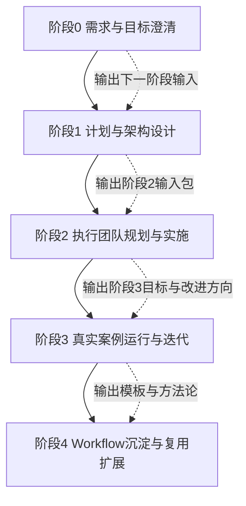

## 项目定位

`proj_004` 是一个围绕“预研孵化战略研究和投资（游戏向）”岗位能力证明而构建的 AI 工作流项目。它不是单一报告或一次性作业，而是一个**可展示、可运行、可复用、可继续扩展**的工程化作品，目标是同时满足以下两类需求：

- 以项目成果证明候选人具备目标岗位要求的核心特质，尤其是 **AI Native 思维、第一性原理分析、系统化协作、可复用方法论**。
- 搭建一套能够进行真实评估的工作流系统，使其不仅能写进简历/面试材料，还能实际接收输入、输出判断与建议，作为能力展示与验证工具。

从当前资料看，本项目已经完成阶段0与阶段1，并已形成完整的阶段2规划包；因此本手册的目的，是作为后续继续推进 `proj_004` 的统一背景底稿与接续说明。

### 本文档的职责边界

本手册只负责记录 **长期稳定的项目背景、方法论、搭建标准与接手规范**，不负责记录以下内容：

- 每日/每周的执行进展
- 当前子阶段的临时阻塞与待办
- 需要用户当下拍板的决策项
- 双端异步协作中的同步步骤

这些内容应分别维护在独立文档中：

- `PROJECT_CONTEXT.md`：当前状态与阅读入口
- `双端协作与用户拍板规范.md`：双端协作规则、同步纪律、用户拍板节点
- `phase2.4_进展与待拍板事项.md`：`2.4` 最新进展、实现现状、差距与待决策清单
---

## 一、背景来源与资料范围

本项目背景由三个目录共同构成，后续继续推进时应始终以这三部分材料交叉校验：

### 1. 原始背景与需求来源

位于 `background/` 目录，主要回答“为什么要做这个项目、项目要证明什么能力、最终应交付什么”。关键材料包括：

- [预研孵化战略研究和投资（游戏向）全职.txt](./../../background/预研孵化战略研究和投资（游戏向）全职.txt)
- [项目需求澄清.txt](./../../background/thoughts/项目需求澄清.txt)
- [2-1-交付标准.txt](./../../background/thoughts/2-1-交付标准.txt)
- `background/thoughts/` 下关于阶段0、阶段1、团队搭建与需求流程的系列草案

这些材料共同定义了项目的原始动机：

- 不是只产出“像样的报告”，而是要做出**一套可验证、可复盘、可复用的 AI Workflow**。
- 输出既要证明技术能力，也要证明**思考方式、问题拆解方式、系统设计能力与协作能力**。
- 项目结构应采用**分阶段 + 数字团队递归构建**的方式，而不是一次性堆砌结果。

### 2. 团队知识库与工作包来源

位于 `data-layer/knowledge/team/` 目录，主要回答“项目应该如何分阶段组织、如何定义角色、如何形成团队工作流”。关键材料包括：

- [岗位能力与流程规划.md](./../../knowledge/team/岗位能力与流程规划.md)
- [招聘团队工作流程.md](./../../knowledge/team/招聘团队工作流程.md)
- [阶段1_团队执行工作流.md](./../../knowledge/team/阶段1_团队执行工作流.md)
- [阶段1_团队构建包.md](./../../knowledge/team/阶段1_团队构建包.md)
- [阶段1_角色构建与验证包.md](./../../knowledge/team/阶段1_角色构建与验证包.md)
- [阶段1_计划设计.md](./../../knowledge/team/阶段1_计划设计.md)
- [阶段2_招聘团队启动包.md](./../../knowledge/team/阶段2_招聘团队启动包.md)

这部分材料定义了本项目的组织方法：

- 采用**招聘团队 → 阶段团队 → 下一阶段团队**的递归式组织模式。
- 每一阶段都必须同时输出两类结果：
  - 当前阶段的业务成果
  - 下一阶段的目标、工作结构、角色需求与输入包
- 角色构建、Prompt 设计、评估与迭代本身被当作工程对象，而不是临时辅助动作。

### 3. 项目级交付与计划来源

位于 `data-layer/projects/proj_004/` 目录，主要回答“当前项目已经走到哪一步、有哪些正式产物、后面准备怎么推进”。关键材料包括：

- 阶段1输出目录：`phase1_outputs/`
- 阶段2计划目录：`phase2_plan/`

本手册即在该目录下生成，作为 `proj_004` 的工程背景总入口。

---

## 二、项目目标与成功定义

结合岗位说明、需求澄清和交付标准，本项目的目标可概括为四层：

### 1. 能力证明目标

项目必须能够直接证明以下核心能力：

- **AI Native 思维**：能把复杂问题拆成 AI 可处理的子问题，并组织 Prompt / Agent / 数据流协同完成任务。
- **第一性原理分析**：能从杂乱信息中抽象出底层变量、信号、假设与判断逻辑。
- **系统化设计能力**：能把“情报 → 判断 → 决策 → 执行 → 复盘”做成完整系统，而不是孤立文档。
- **多角色协作能力**：能让多个数字员工以明确职责、接口和验收方式协同工作。
- **可复用方法论**：能把一次性项目沉淀为模板、机制和可复制流程。

### 2. 成果展示目标

项目需要形成**可在简历/面试中直接展示**的成果包，至少应包含：

- 岗位能力映射与能力证明材料
- AI 工作流系统架构设计
- 可运行的真实评估案例输出
- 可复用的 workflow 模板/角色模板/日志与复盘机制

### 3. 真实评估目标

项目不能只用于展示，还必须具备实际使用价值：

- 接收一个“新机会/新项目/新场景”的输入
- 输出结构化的机会判断、风险假设、执行建议、优先级与后续行动
- 让外部观察者能够通过输入输出结果，判断这套系统是否真的具备 AI Native 能力

### 4. 工程沉淀目标

项目要沉淀为一个能继续扩展的工程，而不是阶段性文本堆积：

- 有清晰的阶段划分
- 有明确的输入/输出规范
- 有角色与协作定义
- 有验收与质量标准
- 有继续接手时可直接沿用的路径

---

## 三、项目方法论：递归式数字团队构建

本项目采用的不是传统“一个人完成所有任务”的线性方式，而是**递归式团队构建模型**。

### 核心原则

- 当前阶段团队负责完成当前阶段目标。
- 招聘/组织团队负责根据当前阶段输出来构建下一阶段团队。
- 每一阶段的正式产出必须包含：
  - 当前阶段交付物
  - 下一阶段目标说明
  - 下一阶段的角色/能力需求
  - 风险、约束与关键依赖

### 递归逻辑

### 这种方法的价值

- 把“团队搭建”本身产品化、模板化。
- 让复杂问题的处理过程更接近真实组织协作。
- 便于后续在其他岗位、其他项目中迁移复用。
- 能在阶段之间形成清晰的接力关系，降低项目中断后的恢复成本。

---

## 四、当前项目进度判断

基于 `proj_004` 现有文件，当前项目状态可判断为：

### 1. 阶段0：已完成

阶段0的核心成果已经在背景文档与团队知识库中明确：

- 岗位能力清单
- 成功标准
- 交付清单
- 阶段1目标与工作方向

阶段0完成的意义在于：项目已经明确“要证明什么”“为什么这些成果有价值”“后续所有工作用什么标准验收”。

### 2. 阶段1：已完成并通过验收

`phase1_outputs/` 已形成完整交付链路，包括：

- [系统架构设计.md](./phase1_outputs/系统架构设计.md)
- [阶段1工作计划.md](./phase1_outputs/阶段1工作计划.md)
- [阶段1最终验收报告.md](./phase1_outputs/阶段1最终验收报告.md)
- `templates/` 下的评估报告、决策建议、工作日志、复盘报告模板
- `acceptance_criteria/` 下的验收标准体系与质量评估矩阵

从现有验收记录看：

- 阶段1关键输出均已完成验收
- 质量评估矩阵中的整体结果为 **5.0/5.0，评级为优秀**
- 阶段1状态已明确标记为**可进入阶段2**

### 3. 阶段2：规划完成，已进入执行落地阶段

`phase2_plan/` 目录中已经完成阶段2的整体规划，包含：

- `phase2.1_目标说明.md`：情报解码模块
- `phase2.2_目标说明.md`：机会评估模块
- `phase2.3_目标说明.md`：决策建议模块
- `phase2.4_目标说明.md`：知识库与 RAG 系统
- `phase2.5_目标说明.md`：整合验证与复盘
- [子阶段依赖关系与并行策略.md](./phase2_plan/子阶段依赖关系与并行策略.md)
- [资源分配计划.md](./phase2_plan/资源分配计划.md)
- [阶段2团队构建方案.md](./phase2_plan/阶段2团队构建方案.md)
- [阶段2时间表.md](./phase2_plan/阶段2时间表.md)
- [风险识别与应对方案.md](./phase2_plan/风险识别与应对方案.md)
- `phase2_roles/` 下的子阶段角色定义文档

除规划文档外，仓库中还已经出现了 `2.4` 的实际执行产物，包括：

- `EMP-021 ~ EMP-026` 的员工档案与 `roster.json` 更新
- [phase2.4_mvp_plan.md](./phase2.4_mvp_plan.md)
- `phase2.4_implementation/rag_system/` 下的 `api`、`core`、`build_index.py`、`config` 等实现骨架
- `data/documents/` 下的样本文档

综合这些材料，可以判断：

- 阶段2的**目标拆解、依赖关系、团队结构、资源预算、时间安排、风险应对**已基本具备。
- 阶段2已经不是“仅停留在准备阶段”，而是**以 `2.4` 为先行模块进入了 MVP 骨架落地与样例验证阶段**。
- 当前更准确的状态应视为：
  - **阶段2规划已完成**
  - **`2.4` 已开始执行，并已形成初版团队、计划和代码骨架**
  - **`2.1` / `2.2` / `2.3` / `2.5` 仍主要停留在规划与待启动状态**

---

## 五、阶段1已沉淀的工程标准

阶段1最大的价值，不只是产出了一批文档，而是已经把后续执行需要遵守的工程标准沉淀下来。

### 1. 计划标准

通过 [阶段1工作计划.md](./phase1_outputs/阶段1工作计划.md)，项目已经明确：

- 目标如何拆分为里程碑
- 每个里程碑的核心输出是什么
- 交付物应该如何对应岗位能力与项目目标

### 2. 架构标准

通过 [系统架构设计.md](./phase1_outputs/系统架构设计.md)，项目已经明确：

- 系统的核心模块划分
- AI 工作流的主要链路与职责边界
- 阶段2的模块化落地方向

### 3. 模板标准

通过 `phase1_outputs/templates/` 下的模板文档，项目已经明确了后续执行中的标准输出形式，包括：

- 评估报告模板
- 决策建议模板
- 工作日志模板
- 复盘报告模板

这些模板意味着后续阶段不能“想到什么写什么”，而要遵循统一格式，保证：

- 输出可横向比较
- 过程可追踪
- 结果可复盘
- 成果可直接展示或复用

### 4. 验收标准

通过 `phase1_outputs/acceptance_criteria/`，项目已经明确分层验收机制：

- 单项输出物验收
- 整体质量评估
- 阶段间输入包验收

其中质量评估矩阵定义了五个核心质量维度：

- 完整性
- 准确性
- 一致性
- 可用性
- 可复用性

后续阶段如果要新增文档、模块、角色或案例，应继续使用这五个维度进行统一评价，而不是临时自定标准。

---

## 六、阶段2规划要点

结合现有阶段2文档，阶段2的核心目标是：**实现可运行的 AI 工作流原型**，而不再停留在抽象设计层。

### 1. 阶段2总体结构

阶段2被拆为多个专业化子阶段，体现出“先统一规划，再并行实施，最后整合验证”的思路：

- **2.0**：规划与协调（定义接口、节奏、统一规范）
- **2.1**：情报解码模块
- **2.2**：机会评估模块
- **2.3**：决策建议模块
- **2.4**：知识库与 RAG 系统
- **2.5**：整合验证与复盘

### 2. 并行策略

从依赖关系设计看：

- `2.0` 必须先行，用于统一接口、约束、节奏与协作方式。
- `2.1`~`2.4` 可在统一规划后并行推进。
- `2.5` 负责整合、验收、复盘与下一轮改进，不应提前开始。

### 3. 技术路线

现有规划显示阶段2偏向以下技术方向：

- 多 Agent 协作
- LangChain / LangGraph 一类的流程编排思路
- 知识库构建与 RAG 检索
- 结构化日志、评估与复盘机制
- 面向原型验证的快速工程实现

### 4. 资源与周期

阶段2现有规划中，已提供：

- 时间表与里程碑安排
- 资源分配计划
- 团队角色定义
- 风险识别与应对机制

根据现有材料，阶段2整体是一个**6-8周左右、支持并行执行、需要跨角色协作**的中等复杂度实施阶段。

---

## 七、继续推进时必须遵守的搭建规范

为了保证后续接手的人不会破坏项目结构，建议将以下规范视为 `proj_004` 的默认工程纪律。

### 1. 始终保持“来源可追踪”

任何新增计划、模块或结论，都应能追溯到三类来源之一：

- 背景目标来源
- 团队组织与流程来源
- 项目级现有产出来源

如果某个新增内容无法说明“为什么这样设计”，则应补充其依据后再纳入正式文档。

### 2. 阶段输出必须包含“下一阶段输入”

本项目不是普通串行任务，而是递归式团队工程。因此每个阶段的正式产出至少要包含：

- 当前阶段成果
- 下一阶段目标
- 下一阶段关键任务
- 下一阶段依赖与风险
- 对下一阶段团队的角色/能力要求

### 3. 使用统一模板，不重新发明格式

优先复用以下既有模板与标准：

- `phase1_outputs/templates/` 下的输出模板
- `phase1_outputs/acceptance_criteria/` 下的验收标准
- `data-layer/knowledge/team/` 下的角色/团队组织方法

### 4. 所有新增内容都要可验收

任何新模块、新角色、新案例都至少要回答以下问题：

- 输入是什么？
- 输出是什么？
- 验收标准是什么？
- 与现有架构的边界是什么？
- 如何复盘并进入下一轮改进？

### 5. 不把阶段2做成“只剩文档的计划”

阶段2的目标不是再写更多规划文件，而是把阶段1已经定义的架构、模板、标准真正转成**可运行原型**。因此继续推进时必须优先关注：

- 模块接口
- 数据结构
- 知识来源
- 运行链路
- 案例验证
- 结果记录

### 6. 训练轨与执行轨必须分离

从当前阶段开始，凡是与模块启动、问题拷问、用户拍板相关的材料，都必须区分为两类：

- **训练轨**：服务于用户本人，用于理解问题、打磨回答、练习面试表达、比较方案优劣
- **执行轨**：服务于项目团队，用于沉淀正式范围、正式契约、正式拍板结果和执行边界

默认对应文档为：

- [模块思维训练模板.md](./phase2_plan/模块思维训练模板.md)
- [模块启动与拍板模板.md](./phase2_plan/模块启动与拍板模板.md)
- [双端协作与用户拍板规范.md](./phase2_plan/双端协作与用户拍板规范.md)

必须明确：

- 训练轨中的讨论、追问、参考答案和草案，**不直接构成正式要求**
- 只有写入执行轨文档并经用户确认的结论，才视为正式生效
- 对话中的临时意见，不得替代项目文档中的正式结论

### 7. 多端协作必须遵循单一事实源

为避免多端异步协作时出现上下文漂移，后续推进时必须明确以下事实源分工：

- `PROJECT_CONTEXT.md`：当前状态、阅读入口、近期优先级
- `工程背景手册.md`：长期背景、方法论、稳定规范
- 各模块执行轨文档：模块范围、契约、拍板结果、执行边界
- 各模块进展文档：实现现状、差距、增量待拍板事项

若某项关键共识尚未写回上述正式文档，则不得默认其他端已经同步知晓。

---

## 八、统一规范（阶段2.0 启动前必须明确）

为了让阶段2从“规划完成”真正进入“稳定执行”，建议在正式启动前把以下统一规范写成团队共识，并作为后续所有模块与角色的默认约束。

### 1. 目录与产物规范

建议在 `proj_004` 下统一使用以下目录语义：

- `phase1_outputs/`：阶段1正式交付物，只读归档，不随意覆盖
- `phase2_plan/`：阶段2计划、角色设计、依赖与时间安排
- `phase2_outputs/`：阶段2执行产物，按模块或子阶段拆分
- `phase2_logs/`：运行日志、问题记录、调试记录、失败案例
- `phase2_reviews/`：阶段复盘、验收意见、质量评估与修订结论
- `background/`：原始背景资料与历史会话记录
- `background/thoughts/`：从历史讨论中提炼出的结论、阶段草稿与结构化摘要

目录职责一旦定义，不应混放：

- 原始记录放原始目录
- 正式交付放输出目录
- 过程性问题放日志目录
- 评价与结论放 review 目录

### 2. 文件命名规范

建议统一采用“阶段 + 模块 + 内容类型”的命名方式，避免出现无法判断用途的散文件。

推荐命名模式：

- `phase2.x_目标说明.md`
- `phase2.x_执行记录_YYYYMMDD.md`
- `phase2.x_验收报告.md`
- `phase2.x_复盘结论.md`
- `module_<name>_interface.md`
- `case_<id>_input.json`
- `case_<id>_output.md`

命名要求：

- 文件名优先表达用途，而不是表达情绪或临时状态
- 同类文档使用同一命名前缀
- 不使用“最新版”“最终版”“先这样”等模糊命名

### 3. 输入输出规范

每个模块、角色、子阶段都必须显式定义输入与输出，禁止依赖隐式上下文。

建议统一写清：

- **输入来源**：来自哪个目录、哪个模块、哪个阶段
- **输入格式**：文本、结构化字段、知识检索结果、案例数据
- **处理目标**：本模块要完成什么判断或转换
- **输出结构**：固定字段、固定章节或固定模板
- **输出去向**：供谁消费、进入哪个目录、作为哪个阶段输入

如果一个模块无法用一段话清楚说明以上五项，则说明接口仍未定义清楚，不应直接进入执行。

### 4. 角色说明规范

每个数字员工或角色文档至少应包含以下字段：

- 角色名称
- 所属阶段 / 所属模块
- 核心职责
- 输入物
- 输出物
- 不负责的边界
- 协作对象
- 验收方式
- 常见失败模式

这样做的目的，是避免“角色看起来很多，但职责重叠、边界模糊、无法验收”的问题。

### 5. 文档模板规范

后续新增文档应尽量继承 `phase1_outputs/templates/` 已经沉淀的格式，不重新发明结构。建议统一要求：

- 目标说明文档：背景、目标、输入、输出、依赖、风险、验收
- 执行记录文档：日期、负责人、输入、动作、结果、问题、下一步
- 验收报告文档：验收对象、标准、评分、问题、结论
- 复盘文档：预期、实际、偏差、原因、修正建议、下一阶段影响

### 6. 日志与追踪规范

阶段2一旦进入执行，必须同步记录日志，而不是等结束后回忆补写。

建议日志最少包含：

- 时间
- 执行对象（模块 / 角色 / 案例）
- 输入摘要
- 采取动作
- 输出结果
- 异常与失败点
- 是否需要升级处理
- 后续行动

若后续涉及实际代码或脚本运行，还应额外记录：

- 运行环境
- 依赖版本
- 执行命令
- 输入文件版本
- 输出文件位置

### 7. 验收与质量规范

继续沿用阶段1已经确立的五个质量维度作为通用标准：

- 完整性
- 准确性
- 一致性
- 可用性
- 可复用性

同时建议每个阶段新增一个“可运行性”检查：

- 是否能真实接收输入
- 是否能稳定产出结果
- 是否能被下游模块消费
- 是否能留下可复盘记录

### 8. 历史会话与背景材料使用规范

`background/` 目录中的材料应区分为两类：

- **原始会话记录**：如根目录下的 `.jsonl` 文件，保留完整上下文、用户提问、模型回复、运行环境等信息
- **提炼后的背景材料**：如 `background/thoughts/` 下的 `.txt` 文件，用于快速理解阶段性结论

使用顺序建议为：

- 先读 `thoughts/` 快速建立认知
- 再按需回查 `background/*.jsonl` 获取完整上下文、原始措辞、遗漏细节

### 9. 变更管理规范

后续任何较大调整，都建议同时更新三类内容：

- 正式产物
- 日志 / 复盘记录
- 本工程背景手册中的当前状态说明

否则项目会再次出现“文件很多，但不知道哪份是最新结论”的问题。

---

## 九、当前最合理的后续执行顺序

如果从当前状态继续推进，建议按照以下顺序执行：

### 第一步：明确阶段2.0统一规范

优先补齐或确认以下内容：

- 子阶段之间的接口规范
- 数据输入/输出结构
- 统一日志格式
- 验收节点与负责角色
- 共同使用的术语与命名规则

这是阶段2真正启动前最关键的“总线层”。

### 第二步：并行推进 2.1 ~ 2.4

在接口与规范统一后，并行启动：

- 情报解码模块
- 机会评估模块
- 决策建议模块
- 知识库 / RAG 模块

并行推进时要保持：

- 各模块输出结构一致
- 各模块都保留日志与问题记录
- 每个模块都能被 `2.5` 统一接入整合验证

### 第三步：执行 2.5 整合验证与复盘

将前述模块接入后，至少完成：

- 一轮端到端案例跑通
- 输出评估结果与决策建议
- 记录日志与失败点
- 产出复盘结论与下一轮迭代建议

### 第四步：形成阶段3输入包

阶段2结束时，必须显式沉淀：

- 哪些模块已可复用
- 哪些角色定义仍需修正
- 哪些 Prompt / 模板需要稳定化
- 哪些地方可以进入案例扩展、产品化或展示包装

---

## 十、继续接手本项目时的最小阅读路径

如果后续有人需要快速接手 `proj_004`，建议按以下顺序阅读，而不是从全部文件开始：

### 必读 1：理解项目为什么存在

- [预研孵化战略研究和投资（游戏向）全职.txt](./../../background/预研孵化战略研究和投资（游戏向）全职.txt)
- [项目需求澄清.txt](./../../background/thoughts/项目需求澄清.txt)
- [2-1-交付标准.txt](./../../background/thoughts/2-1-交付标准.txt)

### 必读 2：理解项目按什么方式组织

- [岗位能力与流程规划.md](./../../knowledge/team/岗位能力与流程规划.md)
- [阶段2_招聘团队启动包.md](./../../knowledge/team/阶段2_招聘团队启动包.md)

### 必读 3：理解阶段1已经沉淀了什么

- [阶段1工作计划.md](./phase1_outputs/阶段1工作计划.md)
- [系统架构设计.md](./phase1_outputs/系统架构设计.md)
- [阶段1最终验收报告.md](./phase1_outputs/阶段1最终验收报告.md)
- [质量评估矩阵.md](./phase1_outputs/acceptance_criteria/质量评估矩阵.md)
- [阶段2输入包验收标准.md](./phase1_outputs/acceptance_criteria/阶段2输入包验收标准.md)

### 必读 4：理解阶段2将如何落地

- [阶段2团队构建方案.md](./phase2_plan/阶段2团队构建方案.md)
- [阶段2时间表.md](./phase2_plan/阶段2时间表.md)
- [资源分配计划.md](./phase2_plan/资源分配计划.md)
- [子阶段依赖关系与并行策略.md](./phase2_plan/子阶段依赖关系与并行策略.md)
- [风险识别与应对方案.md](./phase2_plan/风险识别与应对方案.md)
- [双端协作与用户拍板规范.md](./phase2_plan/双端协作与用户拍板规范.md)
- [模块启动与拍板模板.md](./phase2_plan/模块启动与拍板模板.md)
- `phase2.1 ~ phase2.5` 各子阶段目标说明
- 当前推进模块对应的角色文档、执行轨文档与进展文档

---

## 十一、当前结论

截至本手册编写时，可以对 `proj_004` 做出如下总结：

- **项目背景明确**：岗位目标、能力要求、成功标准、交付方向均已清晰。
- **组织方法明确**：已确定采用递归式数字团队构建与阶段接力的方式推进。
- **阶段1已完成**：计划、架构、模板、验收体系均已形成，并已通过高质量验收。
- **阶段2已具备启动条件**：目标、子阶段、角色、时间、资源、风险与并行策略均已完成规划。
- **当前关键任务不是再补背景，而是把阶段2计划转为执行原型**。

换言之，`proj_004` 已经完成“为什么做、做什么、按什么标准做”的定义工作，接下来最重要的是完成“真正运行起来并产出案例结果”的工程实现。

---

## 十二、建议的后续维护方式

为避免后续再次出现上下文断裂，建议从现在开始在 `proj_004` 内保持以下习惯：

1. 新增任何阶段性成果时，同步更新本手册中的“当前进度判断”。
2. 新增执行产物时，优先放入新的结构化目录，并附上对应验收或复盘记录。
3. 如果阶段2开始正式执行，建议新增：
   - `phase2_outputs/`
   - `phase2_logs/`
   - `phase2_reviews/`
4. 阶段2每完成一个子阶段，就补充“对子阶段下一步的输入说明”，保持递归链不断裂。
5. 若未来进入阶段3，建议在本手册基础上复制出新的“阶段接续手册”，而不是重新从零整理背景。

---

## 十三、Claude 历史会话与摘要索引

为了让后续 AI 或人工接手者能够恢复更完整的背景，而不是只依赖本手册中的结论，现将 `background/` 目录中的历史材料按用途整理如下。

### 1. 原始会话记录（完整上下文层）

`background/` 根目录下当前可见 3 份 `.jsonl` 文件：

- `3f36dc20-708d-4d2c-85c8-97d28ebe909a.jsonl`
- `abe6c61a-31e3-4ea1-9bda-83250dfe2565.jsonl`
- `d54f3dfa-0860-4a0a-a2e3-7975376f6e5e.jsonl`

这些文件更接近 Claude 的**原始工作记录**，通常包含：

- 用户原始问题
- Claude 的分步回答
- 文件读写与修改痕迹
- 某些阶段的中断点、恢复点和临时判断
- 项目目录、团队文件、`proj_004` 相关产物的形成过程

根据当前抽样检索，可确认这些原始会话至少覆盖了以下主题：

- `proj_004` 项目创建与成员分配
- 阶段1输出物的生成过程
- 阶段2团队构建方案的形成过程
- 递归式招聘团队方法的讨论与修订
- 团队知识库文档与项目交付文档之间的衔接

### 2. 提炼摘要材料（快速理解层）

`background/thoughts/` 当前可见的提炼材料包括：

- `项目需求澄清.txt`
- `2-1-交付标准.txt`
- `2-2-1 计划&加入招聘团队但注意具体执行部分还需要细化.txt`
- `2-2-需求与团队搭建的计划.txt`
- `3 - 阶段 0：核心计划（最核心的“能力清单 + 成功标准 + 交付标准.txt`
- `3-2- 阶段 0 输出：能力映射 + 成功标准 + 交付清单.txt`
- `4- 阶段 1：计划设计（按阶段步骤角色交付形成可执行计划）.txt`
- `4- 阶段1 后续团队安排确定：.txt`
- `团队搭建需求流程（但好像和workflow的交付有些混淆或者省略？）.txt`
- `基础需求流程（但缺乏团队搭建部分）.txt`
- `岗位分析基础草案.txt`
- `第一步达成 -AI需求确认.txt`
- `第二步 - 交付内容确定.txt`

这些文件更适合快速建立认知，因为它们已经把历史会话中较分散的讨论提炼成了**阶段性结论、草案和结构化判断**。

### 3. 各类历史材料的推荐用途

#### A. 想快速知道“为什么做这个项目”
优先阅读：

- `background/预研孵化战略研究和投资（游戏向）全职.txt`
- `background/thoughts/项目需求澄清.txt`
- `background/thoughts/2-1-交付标准.txt`

#### B. 想快速知道“项目是如何分阶段设计出来的”
优先阅读：

- `background/thoughts/第一步达成 -AI需求确认.txt`
- `background/thoughts/第二步 - 交付内容确定.txt`
- `background/thoughts/3 - 阶段 0：核心计划（最核心的“能力清单 + 成功标准 + 交付标准.txt`
- `background/thoughts/4- 阶段 1：计划设计（按阶段步骤角色交付形成可执行计划）.txt`

#### C. 想知道“招聘团队/递归式团队构建”是怎么形成的
优先阅读：

- `background/thoughts/2-2-1 计划&加入招聘团队但注意具体执行部分还需要细化.txt`
- `background/thoughts/2-2-需求与团队搭建的计划.txt`
- `background/thoughts/团队搭建需求流程（但好像和workflow的交付有些混淆或者省略？）.txt`
- `data-layer/knowledge/team/招聘团队工作流程.md`
- `data-layer/knowledge/team/岗位能力与流程规划.md`

#### D. 想追溯某份正式产物是如何形成的
优先阅读：

- 本手册与 `PROJECT_CONTEXT.md` 中对应章节
- `phase1_outputs/` 或 `phase2_plan/` 中对应正式文档
- 再回查 `background/*.jsonl` 中与该产物名、阶段名、目录名相关的原始会话

### 4. 对三份 `.jsonl` 的使用建议

由于三份原始会话文件都较大，后续接手时不建议从头逐行阅读，建议按以下方式使用：

- **第一份命中检索**：先按关键词检索 `proj_004`、`阶段2`、`招聘团队`、具体文件名
- **第二份定位上下文**：找到相关命中后，再读取附近上下文
- **第三份确认最终结论**：确认该段会话是在“草稿阶段”还是“正式落地阶段”

当前可确认：

- `3f36dc20-708d-4d2c-85c8-97d28ebe909a.jsonl` 中包含大量 `proj_004`、阶段1输出物、阶段2方案形成过程的记录，应视为**最关键的主会话源**
- `d54f3dfa-0860-4a0a-a2e3-7975376f6e5e.jsonl` 中可见对招聘团队、团队知识库和阶段划分逻辑的讨论，可作为**方法论补充源**
- `abe6c61a-31e3-4ea1-9bda-83250dfe2565.jsonl` 当前命中较少，更像是**中间补充或局部讨论源**

### 5. 新AI接手时的历史材料阅读顺序（推荐）

若希望以最小成本恢复完整背景，建议按下列顺序：

1. 本手册当前内容
2. `PROJECT_CONTEXT.md`
3. `background/thoughts/项目需求澄清.txt`
4. `background/thoughts/2-1-交付标准.txt`
5. `background/thoughts/4- 阶段 1：计划设计（按阶段步骤角色交付形成可执行计划）.txt`
6. `data-layer/knowledge/team/招聘团队工作流程.md`
7. `phase1_outputs/` 中的关键正式产物
8. `phase2_plan/` 中的关键正式产物
9. 最后按需检索 `background/*.jsonl`

### 6. 历史材料使用时的注意事项

- 原始会话记录中可能存在**中途方案、被推翻的提议、尚未正式落地的临时表达**，不能直接替代正式文档。
- `background/thoughts/` 中的文件虽更适合阅读，但也可能带有阶段性偏差，因此应与 `phase1_outputs/`、`phase2_plan/` 和团队知识库交叉验证。
- 当历史材料与当前正式文档冲突时，应优先遵循：
  - `PROJECT_CONTEXT.md` 中的当前状态判断
  - 本手册中的背景与规范说明
  - `phase1_outputs/` 与 `phase2_plan/` 中的正式产物
  - 最后才是历史原始会话中的旧判断

### 7. 历史索引对后续工作的意义

补齐这部分索引后，后续 AI 接手 `proj_004` 时可以更清楚地区分：

- 哪些是**当前有效结论**
- 哪些是**历史讨论过程**
- 哪些是**原始需求来源**
- 哪些是**后续执行必须遵守的工程规范**

这能显著降低“只看到局部文件就误判项目状态”或“只看到阶段结论却不知道其来源”的风险。

---

## 附：一句话定义本项目

`proj_004` 是一个以目标岗位能力证明为牵引、以多数字员工递归协作为组织方式、以可运行 AI Workflow 为核心产物、以可复用工程沉淀为最终价值的项目。
